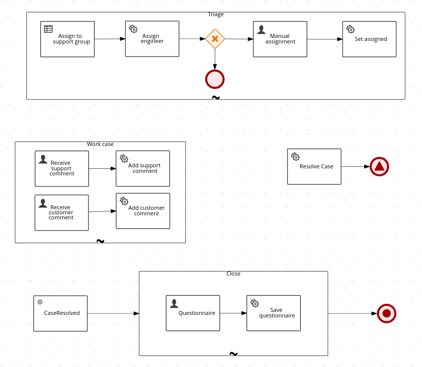
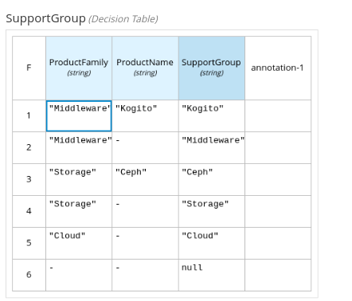

# Flexible process

## Description

A quickstart project that shows the use of flexible processes.

This example shows how to

* make use of ad-hoc subprocesses
* make use of milestones
* make use of DMN business rule integration

### Help Desk process



### Triage decision table



The example shows a help desk process to allow customers creating support cases
that will be assigned to engineers based on the product family and name using
a DMN decision table. If an automatic assignment is not possible, a manual
assignment task will be created.

Once assigned the support case will be set to `WAITING_FOR_OWNER` state meaning
that the engineer has to work on the case and provide a solution or add a
comment asking for more information.

At any moment customers or engineers can add comments until the case is
`CLOSED`.

The case can be set as `RESOLVED` by either an engineer or a customer. Once
this happens a Questionnaire task will be made available where the customer
can provide feedback about the case resolution.

After the Questionnaire submission the case will be `CLOSED` and the process
will terminate.

## Build and run

### Prerequisites

You will need:

* Java 11+ installed
* Environment variable JAVA_HOME set accordingly
* Maven 3.6.2+ installed

### Compile and Run in Local Dev Mode

```sh
mvn clean compile spring-boot:run
```

### Package and Run in JVM mode

```sh
mvn clean package
java -jar target/flexible-process-springboot.jar
```

or on windows

```sh
mvn clean package
java -jar target\flexible-process-springboot.jar
```

## OpenAPI (Swagger) documentation

[Specification at swagger.io](https://swagger.io/docs/specification/about/)

You can take a look at the [OpenAPI definition](http://localhost:8080/openapi?format=json) - automatically generated and included in this service - to determine all available operations exposed by this service. For easy readability you can visualize the OpenAPI definition file using a UI tool like for example available [Swagger UI](https://editor.swagger.io).

In addition, various clients to interact with this service can be easily generated using this OpenAPI definition.

When running in either Quarkus Development or Native mode, we also leverage the [Quarkus OpenAPI extension](https://quarkus.io/guides/openapi-swaggerui#use-swagger-ui-for-development) that exposes [Swagger UI](http://localhost:8080/swagger-ui/) that you can use to look at available REST endpoints and send test requests.

## Deploying with the Kogito Operator

In the [operator](operator) directory you'll find the custom resources needed to deploy this example on OpenShift with the [Kogito Operator](https://docs.jboss.org/kogito/release/latest/html_single/#chap_kogito-deploying-on-openshift).

## Usage example

### Create a support case

Given the following support case:

```{json}
{
  "supportCase": {
    "customer": "Paco the customer",
    "description": "Kogito is not working for some reason.",
    "product": {
      "family": "Middleware",
      "name": "Kogito"
    }
  }
}
```

Create a POST request to the service desk endpoint.

```{bash}
curl -D -H 'Content-Type:application/json' -H 'Accept:application/json' -d @docs/requests/newTicket.json http://localhost:8080/serviceDesk
```

Expect a response containing the ticket id and the current status of the process data where the engineer is assigned and the state is `WAITING_FOR_OWNER`. Note that also a Location HTTP Header
is present:

```{bash}
HTTP/1.1 201 Created
Content-Length: 303
Content-Type: application/json
Location: http://localhost:8080/serviceDesk/de42a39a-2711-4d23-a890-aad24fb8e924

{
  "id": "de42a39a-2711-4d23-a890-aad24fb8e924",
  "supportCase": {
    "product": {
      "name": "Kogito",
      "family": "Middleware"
    },
    "description": "Kogito is not working for some reason.",
    "engineer": "kelly",
    "customer": "Paco the customer",
    "state": "WAITING_FOR_OWNER",
    "comments": null,
    "questionnaire": null
  },
  "supportGroup": "Kogito"
}
```

### Add a support comment

As this is a flexible process, it is up to the customer or the engineer to decide when the case is `RESOLVED`. Both ends can add comments
and each time a comment is added the state will be updated as waiting for the other party.

There are no pre-existing tasks for adding comments but an endpoint is available to instantiate these ad-hoc tasks.

For that an empty post should be sent to `/serviceDesk/ReceiveSupportComment`. Note the extra flag to retreive the response headers.

```{bash}
$ curl -D - -XPOST -H 'Content-Type:application/json' -H 'Accept:application/json' http://localhost:8080/serviceDesk/b3c75b24-2691-4a76-902c-c9bc29ea076c/ReceiveSupportComment

HTTP/1.1 201 Created
Content-Length: 303
Content-Type: application/json
Location: http://localhost:8080/serviceDesk/de42a39a-2711-4d23-a890-aad24fb8e924/ReceiveSupportComment/36e69fa2-2e5a-4ac5-9115-b326499ff877

{"id":"de42a39a-2711-4d23-a890-aad24fb8e924","supportCase":{"product":{"name":"Kogito","family":"Middleware"},"description":"Kogito is not working for some reason.","engineer":"kelly","customer":"Paco the customer","state":"WAITING_FOR_OWNER","comments":null,"questionnaire":null},"supportGroup":"Kogito"}
```

The response returns an HTTP Location header with the endpoint of the generated task.

Use this path to create the comment. It is important to have in mind the user and group query parameters that provide information about the user performing the task and the group he/she belongs to because
this task is restricted to the _support_ group

```{bash}
curl -H 'Content-Type:application/json' -H 'Accept:application/json' -d @docs/requests/supportComment.json http://localhost:8080/serviceDesk/de42a39a-2711-4d23-a890-aad24fb8e924/ReceiveSupportComment/36e69fa2-2e5a-4ac5-9115-b326499ff877?user=kelly&group=support
```

And the data containing the comment and the updated state will be returned:

```{json}
{
  "id": "de42a39a-2711-4d23-a890-aad24fb8e924",
  "supportCase": {
    "product": {
      "name": "Kogito",
      "family": "Middleware"
    },
    "description": "Kogito is not working for some reason.",
    "engineer": "kelly",
    "customer": "Paco the customer",
    "state": "WAITING_FOR_CUSTOMER",
    "comments": [
      {
        "author": "kelly",
        "date": 1594034179.628926,
        "text": "Have you tried to switch it off and on again?"
      }
    ],
    "questionnaire": null
  },
  "supportGroup": "Kogito"
}
```

### Add a customer comment

Now it's time for the customer to reply to the engineer's comment. For that an empty post should be sent to
`/serviceDesk/ReceiveCustomerComment`. Note the extra flag to retreive the response headers.

```{bash}
$ curl -D - -XPOST -H 'Content-Type:application/json' -H 'Accept:application/json' http://localhost:8080/serviceDesk/b3c75b24-2691-4a76-902c-c9bc29ea076c/ReceiveCustomerComment

HTTP/1.1 201 Created
Content-Length: 305
Content-Type: application/json
Location: http://localhost:8080/serviceDesk/b3c75b24-2691-4a76-902c-c9bc29ea076c/ReceiveSupportComment/1ac85d3c-c02c-11ea-b3de-0242ac130004

{"id":"b3c75b24-2691-4a76-902c-c9bc29ea076c","supportCase":{"product":{"name":"Kogito","family":"Middleware"},"description":"Kogito is not working for some reason.","engineer":"kelly","customer":"Paco the customer","state":"WAITING_FOR_CUSTOMER","comments":null,"questionnaire":null},"supportGroup":"Kogito"}
```

Similar to the previous operation, the Location HTTP header contains the reference to the task.

Use this path to create the comment. It is important to have in mind the user and group query parameters that provide information about the user performing the task and the group he/she belongs to because
this task is restricted to the _customer_ group

```{bash}
curl -H 'Content-Type:application/json' -H 'Accept:application/json' -d @docs/requests/customerComment.json http://localhost:8080/serviceDesk/b3c75b24-2691-4a76-902c-c9bc29ea076c/ReceiveCustomerComment/1ac85d3c-c02c-11ea-b3de-0242ac130004?user=Paco&group=customer
```

And the data containing the comment and the updated state will be returned:

```{json}
{
  "id": "b3c75b24-2691-4a76-902c-c9bc29ea076c",
  "supportCase": {
    "product": {
      "name": "Kogito",
      "family": "Middleware"
    },
    "description": "Kogito is not working for some reason.",
    "engineer": "kelly",
    "customer": "Paco the customer",
    "state": "WAITING_FOR_OWNER",
    "comments": [
      {
        "author": "kelly",
        "date": 1594034179.628926,
        "text": "Have you tried to switch it off and on again?"
      },
      {
        "author": "Paco",
        "date": 1594034179.628926,
        "text": "Great idea!"
      }
    ],
    "questionnaire": null
  },
  "supportGroup": "Kogito"
}
```

### Resolving the case

In this case, the customer is happy with the provided resolution and will proceed to set the case as `RESOLVED`.

```{bash}
curl -XPOST -H 'Content-Type:application/json' -H 'Accept:application/json' http://localhost:8080/serviceDesk/b3c75b24-2691-4a76-902c-c9bc29ea076c/Resolve_Case
```

Check the response where the state is now set as `RESOLVED`.

```{json}
{
  "id": "b3c75b24-2691-4a76-902c-c9bc29ea076c",
  "supportCase": {
    "product": {
      "name": "Kogito",
      "family": "Middleware"
    },
    "description": "Kogito is not working for some reason.",
    "engineer": "kelly",
    "customer": "Paco the customer",
    "state": "RESOLVED",
    "comments": [
      {
        "author": "kelly",
        "date": 1594034179.628926,
        "text": "Support: Have you tried to switch it off and on again?"
      },
      {
        "author": "Paco",
        "date": 1594034179.628926,
        "text": "Great idea!"
      }
    ],
    "questionnaire": null
  },
  "supportGroup": "Kogito"
}
```

### Questionnaire

There is a milestone waiting for a CaseResolved event. When received a Questionnaire task is
created and assigned to the `customer` group.

In order to know the task instance id, the `tasks` endpoint must be queried.

```{bash}
$ curl -H 'Content-Type:application/json' -H 'Accept:application/json' http://localhost:8080/serviceDesk/b3c75b24-2691-4a76-902c-c9bc29ea076c/tasks
[
  {"id:"2cd185b6-d6db-4984-a0ae-9dc4fa15cb6d", "name": "Questionnaire"}
]
```

Use this id in the path:

```{bash}
curl -XPOST -H 'Content-Type:application/json' -H 'Accept:application/json' -d @docs/requests/questionnaire.json http://localhost:8080/serviceDesk/b3c75b24-2691-4a76-902c-c9bc29ea076c/Questionnaire/2cd185b6-d6db-4984-a0ae-9dc4fa15cb6d?user=Paco&group=customer
```
