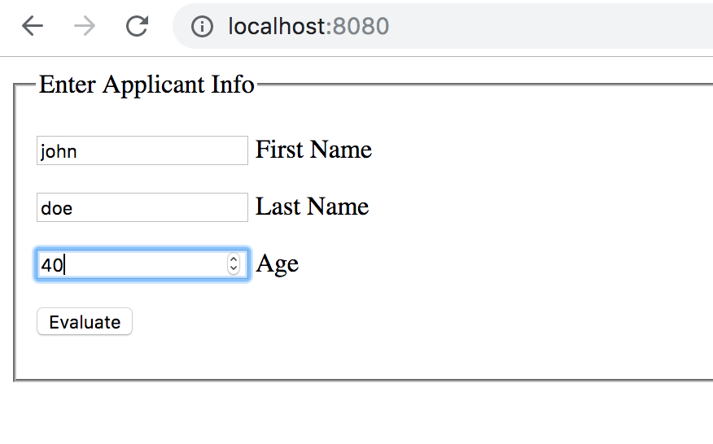
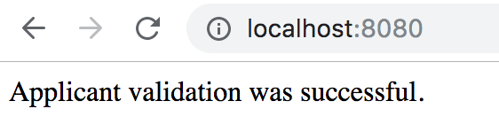
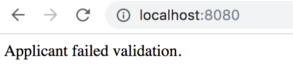

# jBPM Polyglot

A simple experiment with GraalVM and Node.js.

-   JS sources are under `src/main/node`. Support files and data models
    are under `src/main/java`

## Running the Examples

### Plain Java

This example defines a jBPM process which evaluates an Applicant (by age).
The process calls a Rule Task which executes Drools rules that evaluate the
Applicant given age.

To compile and run the tests execute

```
 mvn clean install
```

### Node.js app

This example defines the same jBPM process and rules and also starts a Node.js
server running on port 8080 which showcasts how easy we can use our Kodito
application inside a Node.js app with GraalVM.

Ensure that you have GraalVM in your `$PATH`, then:

```
 mvn clean install -Prunnode
```

If you have Node.js installed and it clashes with the GraalVm node executable, then
in pom.xml for the exec-maven-plugin, change

```
<executable>node</executable>
```

to

```
 <executable>/Library/Java/JavaVirtualMachines/graalvm-ce-19.1.1/Contents/Home/bin/node</executable>
```

for example (full path on your machine.

The example will run Graal's `node` implementation with JVM interop enabled,
and Kogito (jBPM and Drools) on the classpath.

Once maven has finished you will see a console message:

```
 jBPM Applicant Test server running at http://127.0.0.1:8080/
```

Now you can access the app in your browser with that URL.
First you will be presented with a very simple Applicant form:



Here enter in some random first and last name. For age, the business rules are simple:
if the applicant is over 18 the application is accepted, otherwise the applicant is not accepted.

Here you can see some outcomes given valid and invalid ages for an applicant:




