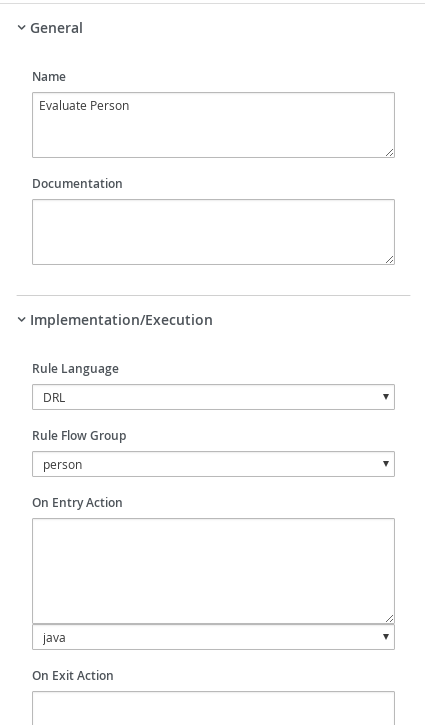

# Kogito with business rules

## Description

A quickstart project that shows the use of business rules and processes

This example shows

* make use of DRL to define rules
* make use of business rules task in the process to evaluate rules
	
	
<p align="center"></p>


* DRL File
<p align="center"></p>

* Diagram Properties
<p align="center"></p>

* Diagram Properties
<p align="center"></p>

* Diagram Properties
<p align="center"></p>

* Evaluate Person Business Rule
<p align="center"></p>

* Evaluate Person Business Rule
<p align="center"></p>

* Evaluate Person Business Rule
<p align="center"></p>

* Special Handling for Children
<p align="center"></p>

* Special Handling for Children
<p align="center"></p>

* Special Handling for Children
<p align="center"></p>

* Special Handling for Children
<p align="center"></p>


## Build and run

### Prerequisites
 
You will need:
  - Java 1.8.0+ installed 
  - Environment variable JAVA_HOME set accordingly
  - Maven 3.5.4+ installed

### Compile and Run in Local Dev Mode

```
mvn clean package spring-boot:run    
```


### Compile and Run using uberjar

```
mvn clean package 
```
  
To run the generated native executable, generated in `target/`, execute

```
java -jar target/kogito-business-rules-sprintboot-{version}.jar
```

### Use the application


### Submit a request

To make use of this application it is as simple as putting a sending request to `http://localhost:8080/persons`  with following content 

```
{
  "person" : {
    "name" "john",
    "age" : 20
  }
}

```

Complete curl command can be found below for adults:

```
curl -X POST -H 'Content-Type:application/json' -H 'Accept:application/json' -d '{"person" : {"name" : "john", "age" : 20}}' http://localhost:8080/persons
```

After the Curl command you should see a similar console log

<p align="center"></p>


Complete curl command can be found below for children:

```
curl -X POST -H 'Content-Type:application/json' -H 'Accept:application/json' -d '{"person" : {"name" : "john", "age" : 5}}' http://localhost:8080/persons
```

After the Curl command you should see a similar console log

<p align="center"></p>


