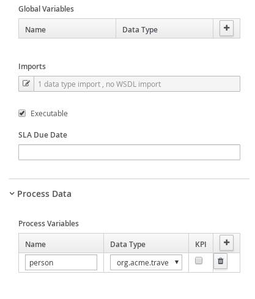

# Kogito with business rules

## Description

A quickstart project that shows the use of business rules and processes

This example shows

* make use of DRL to define rules
* make use of business rules task in the process to evaluate rules
	
	
<p align="center"></p>

* Diagram Properties (top)
<p align="center"></p>

* Diagram Properties (bottom)
<p align="center"></p>

* Evaluate Person Business Rule (top)
<p align="center"></p>

* Evaluate Person Business Rule (bottom)
<p align="center"></p>

* Evaluate Person Business Rule (Assignments)
<p align="center"></p>

* Exclusive Gateway
<p align="center"></p>

* Exclusive Gateway For Adult Connector
<p align="center"></p>

* Exclusive Gateway For Children Connector
<p align="center"></p>

* Special Handling for Children (top)
<p align="center"></p>

* Special Handling for Children (middle)
<p align="center"></p>

* Special Handling for Children (bottom)
<p align="center"></p>

* Special Handling for Children (Assignments)
<p align="center"></p>


## Build and run

### Prerequisites
 
You will need:
  - Java 11+ installed 
  - Environment variable JAVA_HOME set accordingly
  - Maven 3.6.2+ installed

### Compile and Run in Local Dev Mode

```
mvn clean package spring-boot:run    
```


### Compile and Run using uberjar

```
mvn clean package 
```
  
To run the generated native executable, generated in `target/`, execute

```
java -jar target/kogito-business-rules-sprintboot-{version}.jar
```

### OpenAPI (Swagger) documentation
[Specification at swagger.io](https://swagger.io/docs/specification/about/)

You can take a look at the [OpenAPI definition](http://localhost:8080/docs/swagger.json) - automatically generated and included in this service - to determine all available operations exposed by this service. For easy readability you can visualize the OpenAPI definition file using a UI tool like for example available [Swagger UI](https://editor.swagger.io).

In addition, various clients to interact with this service can be easily generated using this OpenAPI definition.


### Submit a request

To make use of this application it is as simple as putting a sending request to `http://localhost:8080/persons`  with following content 

```
{
  "person" : {
    "name" :"john",
    "age" : 20
  }
}

```

Complete curl command can be found below for adults:

```
curl -X POST -H 'Content-Type:application/json' -H 'Accept:application/json' -d '{"person" : {"name" : "john", "age" : 20}}' http://localhost:8080/persons
```

After the Curl command you should see a similar console log
```
{"id":"fd4f629d-6822-4ca2-a8a6-a74f5f81e83d","person":{"name":"john","age":20,"adult":true}} 
```

To verify there is no task running for Children
```
curl http://localhost:8080/persons/{uuid}/tasks
```

where uuid is the id of the task

Complete curl command can be found below for children:

```
curl -X POST -H 'Content-Type:application/json' -H 'Accept:application/json' -d '{"person" : {"name" : "john", "age" : 5}}' http://localhost:8080/persons
```

After the Curl command you should see a similar console log

```
{"id":"c59054b9-aa1d-4771-bc5e-40f8b32d3ff5","person":{"name":"john","age":5,"adult":false}} 
```


To verify there is a running task for Children

```
curl http://localhost:8080/persons/{uuid}/tasks
```
where uuid is the id of the task

Should return something like

```
{"c59054b9-aa1d-4771-bc5e-40f8b32d3ff5":"ChildrenHandling"}
```

Then performing the following command

```
curl http://localhost:8080/persons/{uuid}/ChildrenHandling/{tuuid}
```

Where uuid is  persons id and tuuid is task id
      
Should return something similar to

```
{"person":{"name":"john","age":5,"adult":false},"id":"c59054b9-aa1d-4771-bc5e-40f8b32d3ff5","name":"ChildrenHandling"}
```

Then we can validate child with

```
curl -X POST -H 'Content-Type:application/json' -H 'Accept:application/json' -d '{}' http://localhost:8080/persons/{uuid}/ChildrenHandling/{tuuid}
```

Where uuid is  persons id and tuuid is task id

Should return something similar to

```
{"id":"09f98756-b273-4ceb-9308-fae7cc423904","person":{"name":"john","age":5,"adult":false}}
```
