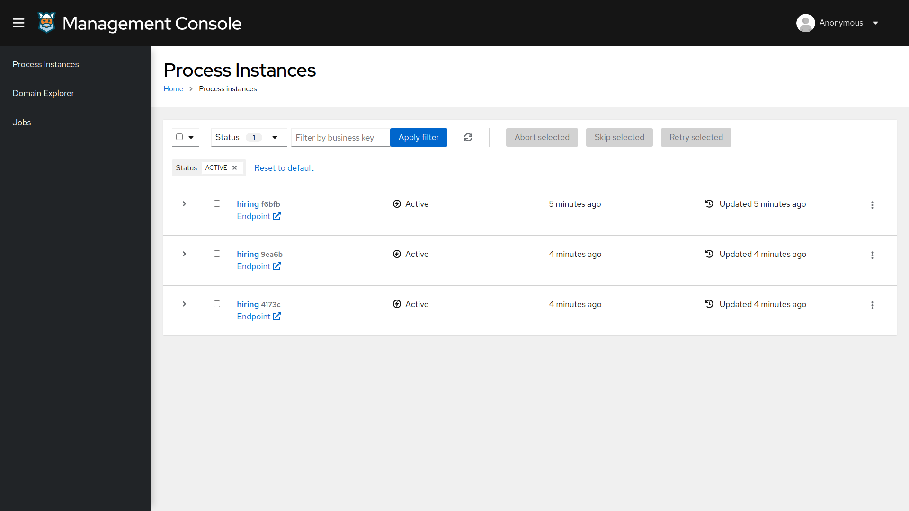
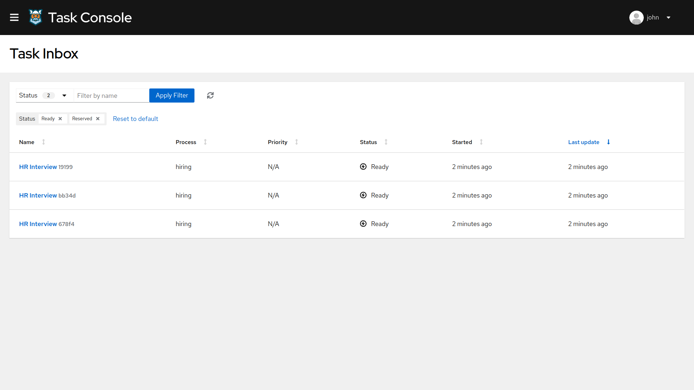

# 01.- Kogito Basic Example

## Description

This Quickstart showcases a basic implementation of the **Hiring** process. 

For simplicity, this example doesn't include any authentication mechanism, so all tasks in will be assigned to a default user `john`.

The required *Kogito and Infrastructure Services* for this example is:

- Infinispan
- Kafka
- Kogito Data Index
- Kogito Management Console
- Kogito Task Console

## Running the Quickstart

### Prerequisites

* Java 11+ installed
* Environment variable JAVA_HOME set accordingly
* Maven 3.5.2+ installed
* Docker and Docker Compose to run the required example infrastructure.

### Starting the Kogito and Infrastructure Services

This quickstart provides a docker compose template that starts all the required services. This setup ensures that all services are connected with a default configuration.

You should start all the services before you execute any of the **Hiring** example, to do that please execute:

For Linux and MacOS:

1. Open a Terminal
2. Go to the Quickstart folder

```bash
cd <path_to_kogito_quickstart>/docker-compose
```

3. Run the ```startServices.sh``` script

```bash
sh ./startServices.sh
```

Once all services bootstrap, the following ports will be assigned on your local machine:

- Infinispan: 11222
- Kafka: 9092
- Data Index: 8180
- Management Console: 8280
- Task Console: 8380

> **_NOTE:_**  This step requires the project to be compiled, please consider runing a ```mvn clean compile``` command on the project root before running the ```startServices.sh``` script for the first time or any time you modify the project.

Once started you can simply stop all services by executing the ```docker-compose stop```.

### Starting the Hiring example

Once all the infrastructure services are ready, you can start the Hiring example by doing:

1. Open a Terminal
2. Go to the Quickstart folder
```bash
cd <path_to_kogito_quickstart>/
```
3.- Start the example with the command
```bash
mvn clean package quarkus:dev
```

Once the service is up and running you can POST to `http://localhost:8080/hiring` to start creating instances of the 
**Hiring**.

For example on a Terminal by executing:

```bash
curl -H "Content-Type: application/json" -H "Accept: application/json" -X POST http://localhost:8080/hiring -d @- << EOF
{   
    "candidate": {
        "name": "John Doe",
        "email": "jdoe@example.com",
        "salary": 30000,
        "skills": "Java, Kogito", 
    }
}
EOF
```

### Kogito Management Console

To access the Kogito Management Console just open your browser and navigate to ``http://localhost:8280``.

<p align="center">
    
</p>

> **_NOTE:_**  For more information about how to work with Kogito Management Console, please refer to the [Kogito Documentation](https://docs.jboss.org/kogito/release/latest/html_single/#con-management-console_kogito-developing-process-services) page.

### Kogito Task Console

To access the Kogito Task Console just open your browser and navigate to ``http://localhost:8380`` and you should be
redirected to the Task Inbox.

<p align="center">
    
</p>

> **_NOTE:_**  For more information about how to work with Kogito Task Console, please refer to the [Kogito Documentation](https://docs.jboss.org/kogito/release/latest/html_single/#con-task-console_kogito-developing-process-services) page.
