# Kogito with persistence powered by Infinispan

## Description

A quickstart project that processes deals for travellers. It utilizes process composition to split the work of

* submitting a deal
* reviewing a deal

At the same time shows simplified version of a approval process that waits for human actor to provide review.

This example shows

* exposing Submit Deal as public service
* each process instance is going to be evaluated and asks for review
* at any point in time service can be shutdown and when brought back it will keep the state of the instances

Note: The use of this example shows that the data sent to infinispan is saved, you can shut down the application and restart it
and as long as infinispan is running after you restart you should still see the data

It utilizes Infinispan server as the backend store. 
	
* Process (submitDeal.bpmn)	
<p align="center">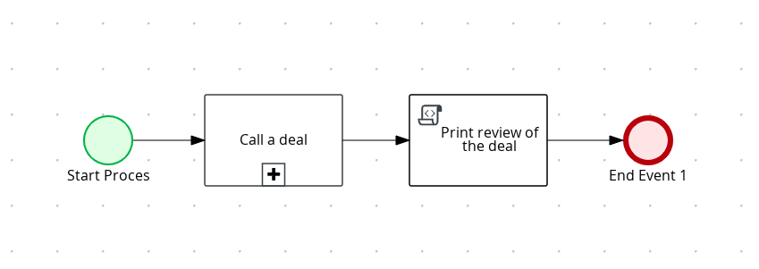</p>

* Process Properties (top)
<p align="center">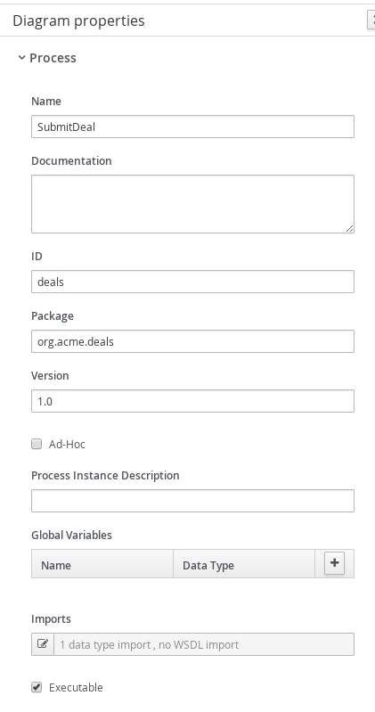</p>

* Process Properties (bottom)
<p align="center">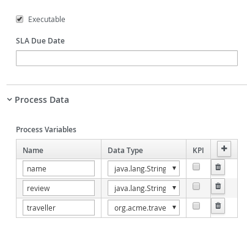</p>

* Call a deal	
<p align="center"></p>

* Call a deal (Assignments)	
<p align="center">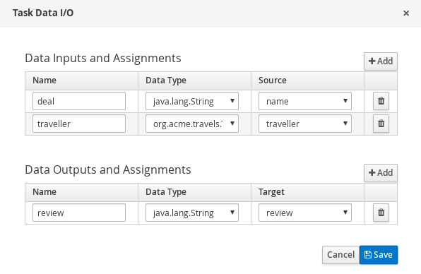</p>

* Print review the Deal	
<p align="center">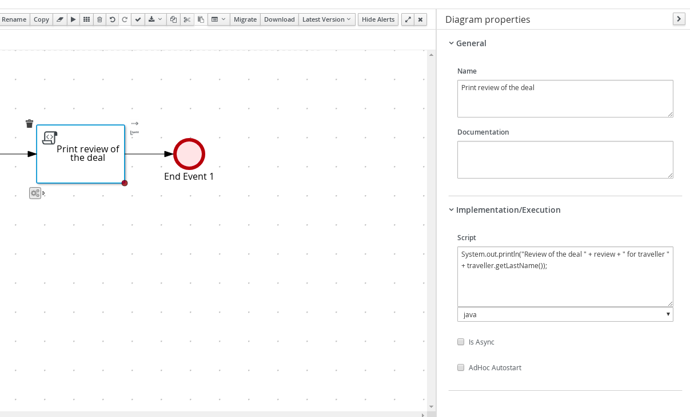</p>

* Subprocess (reviewDeal.bpmn)
<p align="center">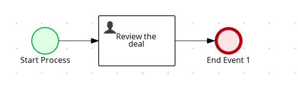</p>

* Deal Review (top)	
<p align="center">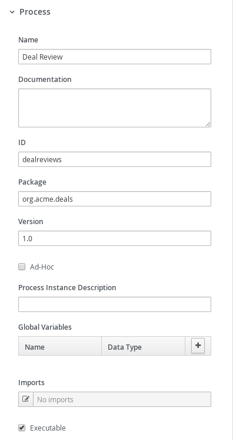</p>

* Deal Review (bottom)
<p align="center">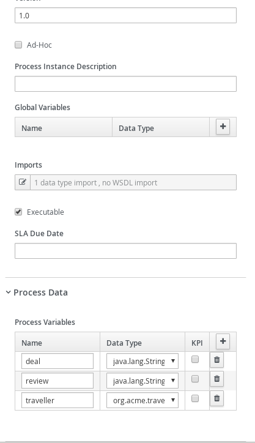</p>

* Review deal user task	(top)
<p align="center"></p>

* Review deal user task	(botom)
<p align="center">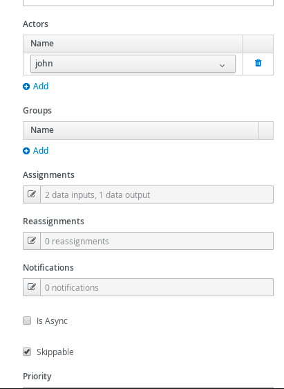</p>

* Review deal user task	(Assignments)
<p align="center">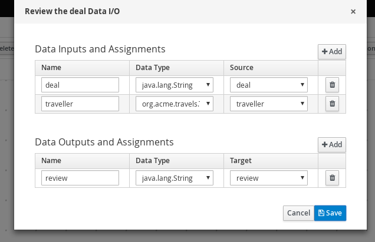</p>

## Infrastructure requirements

This quickstart requires an Inifinispan server to be available and by default expects it to be on default port and localhost.

You can install Inifinispan server by downloading it from [official website](https://infinispan.org/download/) version to be used is at least 10.0.0.Final

* Infinispan installed and running	
<p align="center">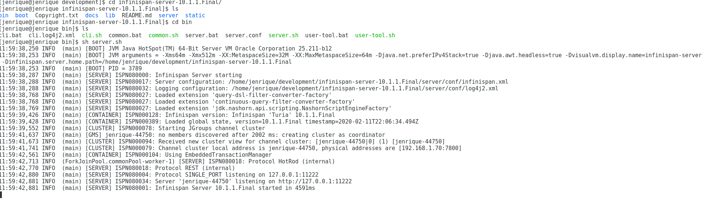</p>

## Build and run

### Prerequisites
 
You will need:
  - Java 1.8.0+ installed 
  - Environment variable JAVA_HOME set accordingly
  - Maven 3.5.4+ installed

When using native image compilation, you will also need: 
  - GraalVM 19.3+ installed
  - Environment variable GRAALVM_HOME set accordingly
  - GraalVM native image needs as well native-image extension: https://www.graalvm.org/docs/reference-manual/native-image/
  - Note that GraalVM native image compilation typically requires other packages (glibc-devel, zlib-devel and gcc) to be installed too, please refer to GraalVM installation documentation for more details.

### Compile and Run in Local Dev Mode

```
mvn clean package quarkus:dev    
```

NOTE: With dev mode of Quarkus you can take advantage of hot reload for business assets like processes, rules, decision tables and java code. No need to redeploy or restart your running application.


### Compile and Run using Local Native Image
Note that this requires GRAALVM_HOME to point to a valid GraalVM installation

```
mvn clean package -Pnative
```
  
To run the generated native executable, generated in `target/`, execute

```
./target/kogito-infinispan-persistence-quarkus-{version}-runner
```

### Use the application

Examine OpenAPI via swagger UI at [http://localhost:8080/swagger-ui](http://localhost:8080/swagger-ui)
[Dev Mode Only] https://quarkus.io/guides/openapi-swaggerui#use-swagger-ui-for-development

### Submit a deal

To make use of this application it is as simple as putting a sending request to `http://localhost:8080/deals`  with following content 

```
{
"name" : "my fancy deal",
"traveller" : { 
  "firstName" : "John", 
  "lastName" : "Doe", 
  "email" : "jon.doe@example.com", 
  "nationality" : "American",
  "address" : { 
  	"street" : "main street", 
  	"city" : "Boston", 
  	"zipCode" : "10005", 
  	"country" : "US" }
  }
}

```

Complete curl command can be found below:

```
curl -X POST -H 'Content-Type:application/json' -H 'Accept:application/json' -d '{"name" : "my fancy deal", "traveller" : { "firstName" : "John", "lastName" : "Doe", "email" : "jon.doe@example.com", "nationality" : "American","address" : { "street" : "main street", "city" : "Boston", "zipCode" : "10005", "country" : "US" }}}' http://localhost:8080/deals
```

this will then trigger the review user task that you can work.

### Get review task for given deal

First you can display all active reviews of deals

```
curl -H 'Content-Type:application/json' -H 'Accept:application/json' http://localhost:8080/dealreviews
```

based on the response you can select one of the reviews to see more details

```
curl -H 'Content-Type:application/json' -H 'Accept:application/json' http://localhost:8080/dealreviews/{uuid}/tasks?user=john
```

where uuid is the id of the deal review you want to work with.

Next you can get the details assigned to review user task by

```
curl -H 'Content-Type:application/json' -H 'Accept:application/json' http://localhost:8080/dealreviews/{uuid}/review/{tuuid}?user=john
```

where uuid is the id of the deal review and tuuid is the id of the user task you want to get


### Complete review task for given deal

Last but not least you can complete review user task by

```
curl -X POST -H 'Content-Type:application/json' -H 'Accept:application/json' -d '{"review" : "very good work"}' http://localhost:8080/dealreviews/uuid/review/{tuuid}?user=john
```

where uuid is the id of the deal review and tuuid is the id of the user task you want to get

* Review Log should look similar to 	

```
Review of the deal very good work for traveller Doe
```