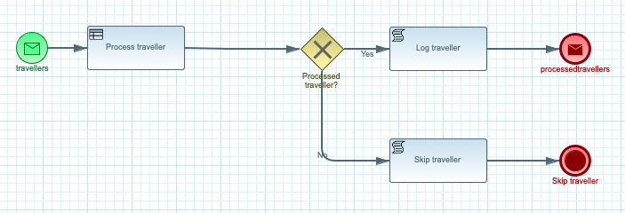

# Kogito with Kafka

## Description

A quickstart project that deals with traveller processing carried by rules. It illustrates
how easy it is to make the Kogito processes and rules to work with Apache Kafka

This example shows

* consuming events from a Kafka topic and for each event start new process instance
* each process instance is expecting a traveller information in JSON format
* traveller is then processed by rules and based on the outcome of the processing (processed or not) traveller is
	* if successfully processed traveller information is logged and then updated information is send to another Kafka topic
	* if not processed traveller info is logged and then process instance finishes without sending reply to Kafka topic
	
	
<p align="center"></p>

## Infrastructure requirements

This quickstart requires an Apache Kafka to be available and by default expects it to be on default port and localhost.

In addition to that two topics are needed

* travellers
* processedtravellers

These topics are expected to be without key

## Build and run

### Prerequisites
 
You will need:
  - Java 1.8.0+ installed 
  - Environment variable JAVA_HOME set accordingly
  - Maven 3.5.4+ installed

When using native image compilation, you will also need: 
  - GraalVM 19.2+ installed
  - Environment variable GRAALVM_HOME set accordingly
  - Note that GraalVM native image compilation typically requires other packages (glibc-devel, zlib-devel and gcc) to be installed too, please refer to GraalVM installation documentation for more details.

### Compile and Run in Local Dev Mode

```
mvn clean package quarkus:dev    
```

NOTE: With dev mode of Quarkus you can take advantage of hot reload for business assets like processes, rules, decision tables and java code. No need to redeploy or restart your running application.


### Compile and Run using Local Native Image
Note that this requires GRAALVM_HOME to point to a valid GraalVM installation

```
mvn clean package -Pnative
```
  
To run the generated native executable, generated in `target/`, execute

```
./target/kogito-kafka-quickstart-{version}-runner
```

### Use the application

To make use of this application it is as simple as putting a message on `travellers` topic with following content 

```
{ 
"firstName" : "Jan", 
"lastName" : "Kowalski", 
"email" : "jan.kowalski@example.com", 
"nationality" : "Polish"
}

```

this will then trigger the successful processing of the traveller and put another message on `processedtravellers` topic.

To take the other path of the process put following message on `travellers` topic

```
{ 
"firstName" : "John", 
"lastName" : "Doe", 
"email" : "john.doe@example.com", 
"nationality" : "American"
}

```

this will not result in message being send to `processedtravelers` topic.
