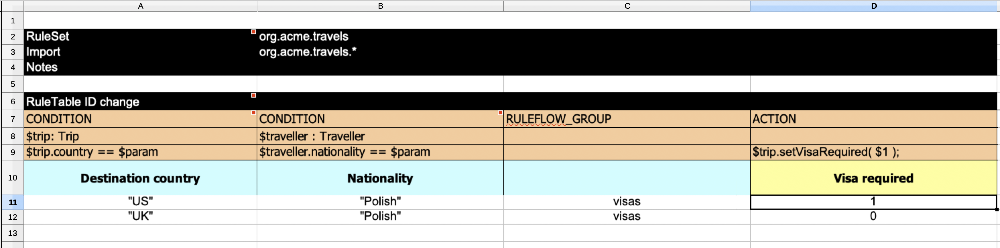
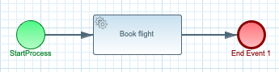

# Kogito Travel Agency


## Description

**Kogito Travel Agency** and **Kogito Visas** communicate completely via events. First **Kogito Travel Agency** sends visa applications 
for those travellers that require visas to visit given country, next based on visa application evaluation *(by user alice)*, **Kogito Visas**  sends back 
the response with the visa processing outcome - approved or rejected.


## Activities to perform

* Create project using Quarkus Maven plugin with following extensions
	* Kogito
	* OpenApi
* Create data model
	* Traveller
	* Hotel
	* Flight
	* Address
	* Trip
	* VisaApplication
* Create service classes
	* HotelBookingService
	* FlightBookingService
* Create decision logic
	* Visa check
* Create business logic
	* Public business process to deal with complete travel request
	* Private business process to deal with hotel booking
	* Private business process to deal with flight booking
* Create a test case that makes use of processes and decisions
* Configure messaging and events
* Create or import UI components using **Kogito Data Index Service**
* Add metrics support for processes and decisions
* Create dashboard based on metrics

## Data model

Kogito Travel Agency booking system will be based on following data model

**Traveller**

A person who requests a new travel

**Trip**

Place/Location where the traveller wants to go and dates

**Flight**

Flight that has been booked for the traveller to take him/her to the destination

**Hotel**

Place/Location where the traveller will stay during his/her travel

**Address**

Location that is associated with either traveller or hotel

**Visa Application**

Details requires to apply for visa to travel to particular country

**Visa Resolution**

Final decision regarding visa application status

<p align="center"></p>


## Decision logic

The decision logic will be implemented as a decision table. The logic will be responsible for verifying whether a given traveller requires a visa to enter a given country or not. The decision logic reason over the following data/facts

* Destination that the traveller wants to go - country
* Nationality of the traveller
* Length of the stay

The result will be “yes” or “no”.

<p align="center"></p>


## Business logic

Business logic will be based on business processes

Public process that will be responsible for orchestrating complete travel request

<p align="center"></p>

Private process that will be responsible for booking a hotel.

<p align="center"></p>

Private process that will be responsible for booking a flight.

<p align="center"></p>

## Services

There will be services implemented to carry on the hotel and flight booking. Implementation will be a CDI beans that will have hard coded logic to return a booked flight or hotel.

* org.acme.travels.service.HotelBookingService
* org.acme.travels.service.FlightBookingService

# Try out the complete service

## Installing and Running

### Prerequisites

You will need:
  - Java 17+ installed
  - Environment variable JAVA_HOME set accordingly
  - Maven 3.9.9+ installed

When using native image compilation, you will also need:
  - GraalVM 19.3.1+ installed
  - Environment variable GRAALVM_HOME set accordingly
  - Note that GraalVM native image compilation typically requires other packages (glibc-devel, zlib-devel and gcc) to be installed too, please refer to GraalVM installation documentation for more details.

### Starting the Kogito and Infrastructure Services

This quickstart provides a docker compose template that starts all the required services. This setup ensures that all services are connected with a default configuration.

You should start all the services before you execute any of the **Hiring** example, to do that please execute:

For Linux and MacOS:

1. Open a Terminal
2. Go to the kogito-travel-agency folder at kogito-examples

```bash
cd <path_to_kogito-travel-agency>/docker-compose
```

3. Run the ```startServices.sh``` script

```bash
./startServices.sh
```

Once all services bootstrap, the following ports will be assigned on your local machine:

- PostgreSQL: 5432
- Kafka: 9092
- Data Index: 8180
- Keycloak server: 8480

> **_NOTE:_**  This step requires the project to be compiled, please consider running a ```mvn clean install``` command on the project root before running the ```startServices.sh``` script for the first time or any time you modify the project.

Once started you can simply stop all services by executing the ```docker compose stop```.

All created containers can be removed by executing the ```docker compose rm```.

### Using Keycloak as Authentication Server

In this Quickstart we'll be using [Keycloak](https://www.keycloak.org/) as *Authentication Server*. It will be started as a part of the project *Infrastructure Services*, you can check the configuration on the project [docker-compose.yml](docker-compose/docker-compose.yml) in [docker-compose](docker-compose) folder.

It will install the *Kogito Realm* that comes with a predefined set of users:
| Login         | Password   | Roles               |
| ------------- | ---------- | ------------------- |
|    admin      |   admin    | *admin*, *managers* |
|    alice      |   alice    | *user*              |
|    jdoe       |   jdoe     | *managers*          |

Once Keycloak is started, you should be able to access your *Keycloak Server* at [localhost:8480/auth](http://localhost:8480/auth) with *admin* user.

### Compile and Start the process

```
mvn clean package
java -jar target/quarkus-app/quarkus-run.jar
```

### Compile and Run in Local Dev Mode

```
mvn clean package quarkus:dev    
```

NOTE: With dev mode of Quarkus you can take advantage of hot reload for business assets like processes, rules and decision
tables and java code. No need to redeploy or restart your running application.During this workshop we will create a software system for a startup travel agency called Kogito Travel Agency. The first iteration of the system will consist of a set of services that are able to deal with travel requests and the booking of hotels and flights.

### Compile and Run using Local Native Image
Note that this requires GRAALVM_HOME to point to a valid GraalVM installation

```
mvn clean package -Pnative
```

To run the generated native executable, generated in `target/`, execute

```
./target/travels-{version}-runner
```


### Start the Kogito Jobs Service


## Known issues


## User interface

Kogito Travel Agency comes with basic UI that allows to

### plan new trips

<p align="center"></p>

### list currently opened travel requests

<p align="center"></p>

### show details of selected travel request

<p align="center"></p>

### show active tasks of selected travel request

<p align="center"></p>

### perform Human task: visa application

<p align="center"></p>

### cancel selected travel request

To start Kogito Travel Agency UI just point your browser to [http://localhost:8080](http://localhost:8080)

## REST API

Once the service is up and running, you can use the following examples to interact with the service.

### POST /travels

Send travel that requires does not require visa

```sh
curl -H "Content-Type: application/json" -H "Accept: application/json" -X POST http://localhost:8080/travels -d @- << EOF
{
	"traveller" : {
		"firstName" : "John",
		"lastName" : "Doe",
		"email" : "john.doe@example.com",
		"nationality" : "American",
		"passportNumber" : "N4379478",
		"address" : {
			"street" : "main street",
			"city" : "Boston",
			"zipCode" : "10005",
			"country" : "US"
		}
	},
	"trip" : {
		"city" : "New York",
		"country" : "US",
		"begin" : "2019-12-10T00:00:00.000+02:00",
		"end" : "2019-12-15T00:00:00.000+02:00"
	}
}
EOF

```

This will directly go to 'ConfirmTravel' user task.

Send travel request that requires does require visa

```sh
curl -H "Content-Type: application/json" -H "Accept: application/json" -X POST http://localhost:8080/travels -d @- << EOF
{
	"traveller" : {
		"firstName" : "Jan",
		"lastName" : "Kowalski",
		"email" : "jan.kowalski@example.com",
		"nationality" : "Polish",
		"passportNumber" : "N4379478",
		"address" : {
			"street" : "polna",
			"city" : "Krakow",
			"zipCode" : "32000",
			"country" : "Poland"
		}
	},
	"trip" : {
		"city" : "New York",
		"country" : "US",
		"begin" : "2019-12-05T00:00:00.000+02:00",
		"end" : "2019-12-30T00:00:00.000+02:00"
	}
}
EOF
```

This will stop at 'VisaApplication' user task.

### GET /travels

Returns list of travel requests currently active:

```sh
curl -X GET http://localhost:8080/travels
```

As response an array of travels is returned.

### GET /travels/{id}

Returns travel request with given id (if active):

```sh
curl -X GET http://localhost:8080/travels/{uuid}
```

As response a single travel request is returned if found, otherwise 404 Not Found is returned.

### DELETE /travels/{id}

Cancels travel request with given id

```sh
curl -X DELETE http://localhost:8080/travels/{uuid}
```

### GET /travels/{id}/tasks

Returns currently assigned user tasks for give travel request:

```sh
curl -X GET http://localhost:8080/travels/{uuid}/tasks?user=jdoe
```

### GET /travels/{id}/VisaApplication/{taskId}

Returns visa application task information:

```sh
curl -X GET http://localhost:8080/travels/{uuid}/VisaApplication/{task-uuid}?user=jdoe
```

### POST /travels/{id}/VisaApplication/{taskId}

Completes visa application task

```sh
curl -H "Content-Type: application/json" -H "Accept: application/json" -X POST http://localhost:8080/travels/{uuid}/VisaApplication/{task-uuid}?user=jdoe -d '{}'
```

### GET /travels/{id}/ConfirmTravel/{taskId}

Returns travel (hotel, flight) task information required for confirmation:

```sh
curl -X GET http://localhost:8080/travels/{uuid}/ConfirmTravel/{task-uuid}?user=jdoe
```

### POST /travels/{id}/ConfirmTravel/{taskId}

Completes confirms travel task - meaning confirms (and completes) the travel request

```sh
curl -H "Content-Type: application/json" -H "Accept: application/json" -X POST http://localhost:8080/travels/{uuid}/ConfirmTravel/{task-uuid}?user=jdoe -d '{}'
```

### Querying the technical cache

When running **Kogito Data Index Service** on dev mode, the GraphiQL UI is available at [http://localhost:8180](http://localhost:8180/) and allow to
perform different queries on the model as is explained at [wiki/Data-Index-service](https://github.com/apache/incubator-kie-kogito-runtimes/wiki/Data-Index-Service)
