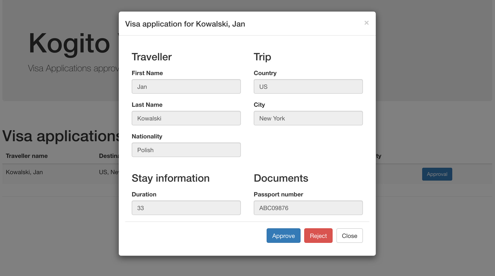

# Kogito Visas

## Description

This is another service of the Kogito Travel Agency application. It's responsible for processing visa applications
that are sent during travel requests.

In its current state it simply accepts incoming visa applications from Kafka topic and process them

* automatically if the rules match the visa application details
* manually otherwise

Response is logged into the visa application and the processing ends. Further evolutions of the service
will add additional handling to the approved or rejected visa applications _(by user alice)_.

## Activities to perform

* Create project using Quarkus Maven plugin with following extensions
    * Kogito
    * OpenApi
* Import project into Eclipse IDE - requires BPMN modeller plugin installed
* Create data model
    * VisaApplication
* Create decision logic
    * Visa approvals
* Create business logic
    * Public business process to deal with visa applications
* Configure messaging and events
* Create or import UI components
* Add custom metrics based on the approved and rejected visa applications
* Create dashboard based on metrics

## Data model

Kogito Travel Agency booking system will be based on following data model

**Visa Application**

A basic visa application information required to process

## Decision logic

The decision logic will be implemented as a set of rules in DRL format. These rules will be responsible for automatic
visa application approval

## Business logic

Business logic will be based on business processes

Public process that will be responsible for processing visa application

<p align="center"></p>

# Try out the complete service

## Installing and Running

### Prerequisites

You will need:

- Java 11+ installed
- Environment variable JAVA_HOME set accordingly
- Maven 3.8.6+ installed

When using native image compilation, you will also need:

- GraalVM 19.3.1+ installed
- Environment variable GRAALVM_HOME set accordingly
- Note that GraalVM native image compilation typically requires other packages (glibc-devel, zlib-devel and gcc) to be
  installed too, please refer to GraalVM installation documentation for more details.

### Starting the Kogito and Infrastructure Services

This quickstart provides a docker compose template that starts all the required services. This setup ensures that all
services are connected with a default configuration.

You should start all the services before you execute any of the **Hiring** example, to do that please execute:

For Linux and MacOS:

1. Open a Terminal
2. Go to the process-usertasks-quarkus-with-console folder at kogito-examples

```bash
cd <path_to_process-usertasks-quarkus-with-console>/docker-compose
```

3. Run the ```startServices.sh``` script

```bash
sh ./startServices.sh
```

Once all services bootstrap, the following ports will be assigned on your local machine:

- Infinispan: 11222
- Kafka: 9092
- Data Index: 8180
- Keycloak server: 8480
- Management Console: 8280

> **_NOTE:_**  This step requires the project to be compiled, please consider running a ```mvn clean install``` command
> on the project root before running the ```startServices.sh``` script for the first time or any time you modify the
> project.

Once started you can simply stop all services by executing the ```docker-compose stop```.

All created containers can be removed by executing the ```docker-compose rm```.

### Using Keycloak as Authentication Server

In this Quickstart we'll be using [Keycloak](https://www.keycloak.org/) as *Authentication Server*. It will be started
as a part of the project *Infrastructure Services*, you can check the configuration on the
project [docker-compose.yml](docker-compose/docker-compose.yml) in [docker-compose](docker-compose) folder.

It will install the *Kogito Realm* that comes with a predefined set of users:
| Login | Password | Roles |
| ------------- | ---------- | ------------------- |
| admin | admin | *admin*, *managers* |
| alice | alice | *user*              |
| jdoe | jdoe | *managers*          |

Once Keycloak is started, you should be able to access your *Keycloak Server*
at [localhost:8480/auth](http://localhost:8480/auth) with *admin* user.

### Compile and Run in Local Dev Mode

```
mvn clean package quarkus:dev    
```

NOTE: With dev mode of Quarkus you can take advantage of hot reload for business assets like processes, rules and
decision
tables and java code. No need to redeploy or restart your running application.During this workshop we will create a
software system for a startup travel agency called Kogito Travel Agency. The first iteration of the system will consist
of a set of services that are able to deal with travel requests and the booking of hotels and flights.

### Compile and Run using Local Native Image

Note that this requires GRAALVM_HOME to point to a valid GraalVM installation

```
mvn clean package -Pnative
```

To run the generated native executable, generated in `target/`, execute

```
./target/visas-{version}-runner
```

## Known issues

## User interface

Kogito Visas comes with basic UI that allows to

### list currently opened visa applications

<p align="center"></p>

### approve/reject selected visa application

<p align="center"></p>

To start Kogito Travel Agency UI just point your browser to [http://localhost:8090](http://localhost:8090)

## REST API

Once the service is up and running, you can use the following examples to interact with the service.

### GET /visaApplications

Returns list of visa application requests currently active:

```sh
curl -X GET http://localhost:8090/visaApplications
```

As response an array of visa applications is returned.

### GET /visaApplications/{id}

Returns the visa application request with given id (if active):

```sh
curl -X GET http://localhost:8090/visaApplications/{uuid}
```

As response a single visa application request is returned if found, otherwise 404 Not Found is returned.

### DELETE /visaApplications/{id}

Cancels visa application request with given id

```sh
curl -X DELETE http://localhost:8090/visaApplications/{uuid}
```

### GET /visaApplications/{id}/tasks

Returns currently assigned user tasks for given visa application request:

```sh
curl -X GET http://localhost:8090/visaApplications/{uuid}/tasks?user=alice
```

### GET /visaApplications/{id}/ApplicationApproval/{taskId}

Returns visa application task information:

```sh
curl -X GET http://localhost:8090/visaApplications/{uuid}/ApplicationApproval/{task-uuid}?user=alice
```

### POST /visaApplications/{id}/ApplicationApproval/{taskId}

Completes visa application task

```sh
curl -H "Content-Type: application/json" -H "Accept: application/json" -X POST http://localhost:8090/visaApplications/{uuid}/ApplicationApproval/{task-uuid}?user=alice -d @- << EOF
{
	"resolution":{
		"approved":true,
		"reason":"Manual approval"
	}
}
EOF
```

### Querying the technical cache

When running **Kogito Data Index Service** on dev mode, the GraphiQL UI is available
at [http://localhost:8180](http://localhost:8180/) and allow to
perform different queries on the model as is explained
at [wiki/Data-Index-service](https://github.com/kiegroup/kogito-runtimes/wiki/Data-Index-Service)
