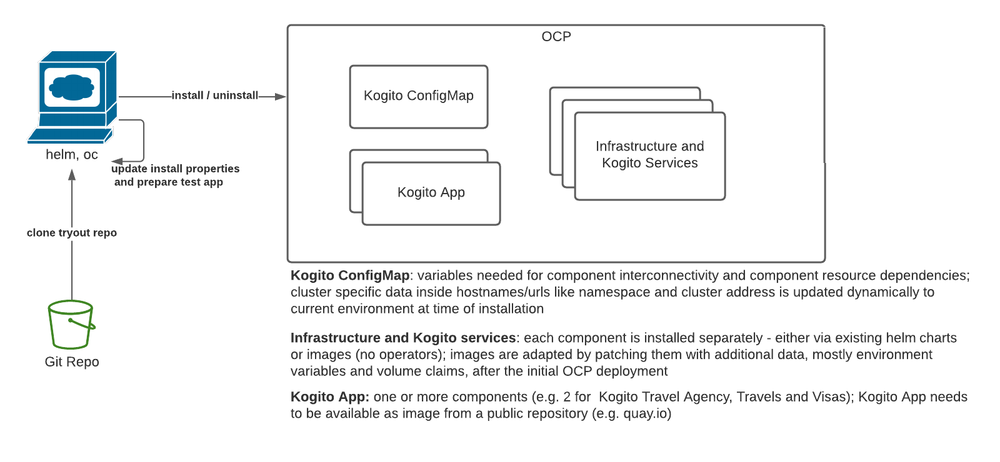

# Kogito Try-out installation

The goal of this procedure is to simplify the deployment of a Kogito application on the Openshift platform.
This deployment includes both the required infrastructure and the Kogito application.

The deployment is targeting examples based on the BPM model which may require additional resources like protobuf and svg files.

Make sure you meet the [prerequisites](#prerequisites) and then start [here](#installation).

## Prerequisites
- [Developer sandbox ](https://developers.redhat.com/developer-sandbox/get-started)  or other Openshift cluster
- oc cli installed
- helm 3 cli installed
- a Kogito application image - find [here](applicationImage.md) example how to create an application image and upload to an image repository

### Available Infrastructure
- Persistence:
  - infinispan/server:14.0.4.Final via helm chart
- Messaging:
  - bitnami/kafka:2.8.1-debian-10-r31 via helm chart
- Authorization/Authentication:
  - jboss/keycloak:15.0.2 image preconfigured using realm import - ephemeral installation
  
### Available Kogito services
Installation from pre-build images
- [Data Index](https://docs.jboss.org/kogito/release/1.15.0/html_single/#con-data-index-service_kogito-configuring)
- [Management console](https://docs.jboss.org/kogito/release/1.15.0/html_single/#con-management-console_kogito-developing-process-services) 
- [Jobs service](https://docs.jboss.org/kogito/release/latest/html_single/#con-jobs-service_kogito-configuring)

## Architecture 


## Installation
- login to OCP cluster: `oc login ...`
- update `./installer.properties`  
  **mandatory** properties are:
  - `KOGITO_VERSION`: the version of Kogito your application is based upon - **default**: latest
  - `OCP_PROJECT`: the project/namespace for the deployment which must exist
- update folders
  - **Note**: you can use the example files from `./testapp/example`
     which allow you to run the Kogito Travel Agency extended example. Just copy the folders to under `./testapp`
     The KOGITO_VERSION in `installer.properties` should be 1.16.0.
  - **When not using the example files, do:**
    - `./testapp/apps`: For each Kogito application to be installed define a `<values>.yaml` file under the `apps` folder. 
    The file name will be used as the chart release name. Only use lowercase alphanumeric characters.
    
    The minimum configuration for each `<values>.yaml` is:  
      ```
      # example
      image:
        repository: quay.io/kiegroup/examples-travels
        tag: 1.16.0.final
      applicationPort: 8080
      ```
    - `./testapp/protobuf`: For each Kogito application to be installed add its protobuf files under the `protobuf` folder. Protobuf files for the Kogito examples can be found under folder `target/classes/META-INF/resources/persistence/protobuf`. 
    - `./testapp/svg`: For each Kogito application to be installed add its svg files under the `svg` folder. svg files for the Kogito examples can be found under `target/classes/META-INF/processSVG`.
- run `./installer.sh`

Installation logs are written to the console and `./ocp-tryout/installLogs.txt`

## Removal of installation
- login to OCP cluster: `oc login ...`
- use the same `./installer.properties` you installed with to remove the installation completely or cherry-pick the parts to uninstall
- run `./uninstaller.sh`

## Component Interconnection/Initialization

Not just the Kogito application but also Kogito services need to interface with other Kogito services or infrastructures.
All configuration required to make those connections as well as initializations are defined in one config map called `kogito-configs`. 

### Keycloak Configurations
- `keycloak.admin.user` - the username used to connect to Keycloak administration console
- `keycloak.admin.password` - the administration consoles' users' password
- `keycloak.realm.json` - Keycloak initialization file for the Kogito realm creating clients, users, etc. used in Kogito examples
- `keycloak.db.vendor` - Keycloak persistence
### Infinispan Configurations
- `quarkus.infinispan.client.hosts` - the infinispan url used by the Kogito application; can be internal service url
- `quarkus.infinispan.client.username` - the user used by the Kogito application to access the infinispan service
### Kafka Configurations
- `kafka.bootstrap.servers` - the kafka url used by the Kogito application; can be internal service url
### Kogito Dataindex Configurations
- `kogito.dataindex.props` - command line properties for the data index
- `kogito.dataindex.httpurl` - the dataindex url, protocol: http
- `kogito.dataindex.httpurl.with.graphql` - the dataindex graphql url
- `kogito.dataindex.wsurl` - the dataindex url, protocol: ws
### Kogito Management Console Configurations
- `kogito.managementconsole.props` - command line properties for the management console
### Kogito Job Service Configurations
- `kogito.jobsservice.props` - command line properties for the job service

## Constraints
- Developer Sandbox sets [resource quotas](https://github.com/codeready-toolchain/host-operator/blob/master/deploy/templates/nstemplatetiers/base/cluster.yaml) per user name

### Memory and cpu requests and limits
if marked `-` then namespace defaults are applied

|deployment|request cpu|request mem|limit cpu|limit mem|
|---|---|---|---|---|
|**namespace default per deployment/statefulSet**|10m|64Mi|1|750Mi|
|keycloak|-|-|-|-|
|kogito-data-index-infinispan|-|-|-|500Mi|
|kogito-management-console|-|-|-|500Mi|
|kogito-jobs-service|-|-|-|500Mi|
|kogito-travel-agency-travels-jvm|-|-|-|500Mi|
|kogito-travel-agency-visas-jvm|-|-|-|500Mi|
|infinispan|500m|512Mi|500m|512Mi|
|kafka|-|-|-|-|
|kafka-zookeeper|250m|256Mi|-|-|
|**sum**|-|-|-|6512Mi|
|**sandbox max. aggregate values per user name (both namespaces)**|1750m|7Gi|20000m|7Gi|

