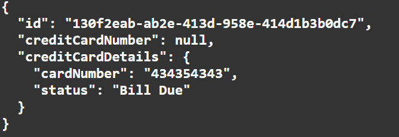
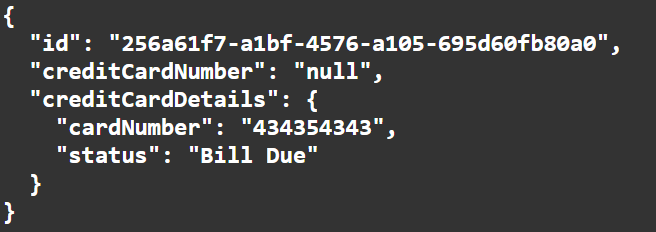
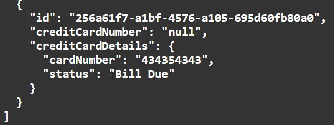
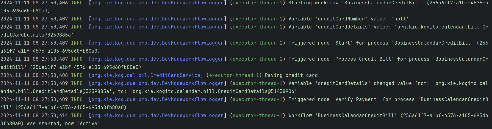
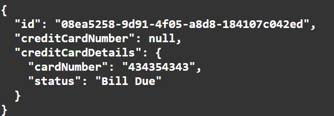
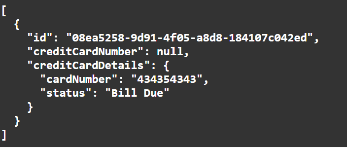

# Process Business Calendar Example

This example demonstrates the impact of a business calendar on process execution within a Quarkus application. It showcases a business process involving credit card bill processing, which adapts to a business calendar defined in calendar.properties. This configuration modifies timer behaviors to respect working hours, holidays, and other schedule-based constraints.

### Main Components

**BPMN2-BusinessCalendarBankTransaction.bpmn2**:
Defines the workflow for processing credit card transactions. 
Includes tasks such as processing the credit bill, verifying payment, handling timers, cancelling and bill settlement.

**CreditCardService.java**:
Implements the logic for handling credit card payment processes.

**calendar.properties**:
Configures business hours, holidays, and other calendar properties that affect scheduling and timer behavior.

### BPMN Process Details

The BPMN model (`BPMN2-BusinessCalendarBankTransaction.bpmn2`) defines a workflow that includes the following main elements:
<p align="center"></p>

### Start Event

The initial trigger that starts the credit card bill processing workflow.

### Process Credit Bill
* Process Credit Bill Properties (Top)
  <p align="center"></p>

* Process Credit Card Bill Assignments
  <p align="center"></p>

### Verify Payment
A service task where the credit card details are validated, ensuring the payment is processed under valid terms.

* Verify Payment
  <p align="center"></p>

### Timer

Attached to a human task to simulate waiting for manual confirmation or user action. This timer can be configured to react differently based on the presence of the business calendar.
<p align="center"></p>

### Cancel Payment
Executed if the timer expires without human action, leading to the cancellation of the payment process.

* Cancel Payment (Top)
  <p align="center"></p>

* Cancel Payment Assignments
  <p align="center"></p>

### Settle Payment

The final step where the payment is settled successfully on manual verification.

* Settle Payment (Top)
 <p align="center"></p>

* Settle Payment Assignments
<p align="center"></p>

## Build and run

### Prerequisites

You will need:
- Java 17+ installed
- Environment variable JAVA_HOME set accordingly
- Maven 3.9.6+ installed

When using native image compilation, you will also need:
- GraalVM 19.3+ installed
- Environment variable GRAALVM_HOME set accordingly
- GraalVM native image needs as well native-image extension: https://www.graalvm.org/reference-manual/native-image/
- Note that GraalVM native image compilation typically requires other packages (glibc-devel, zlib-devel and gcc) to be installed too, please refer to GraalVM installation documentation for more details.

### Compile and Run in Local Dev Mode

```sh
mvn clean compile quarkus:dev
```

NOTE: With dev mode of Quarkus you can take advantage of hot reload for business assets like processes, rules, decision tables and java code. No need to redeploy or restart your running application.

### Package and Run in JVM mode

```sh
mvn clean package
java -jar target/quarkus-app/quarkus-run.jar
```

or on windows

```sh
mvn clean package
java -jar target\quarkus-app\quarkus-run.jar
```

### Package and Run using Local Native Image
Note that the following configuration property needs to be added to `application.properties` in order to enable automatic registration of `META-INF/services` entries required by the workflow engine:
```
quarkus.native.auto-service-loader-registration=true
```

Note that this requires GRAALVM_HOME to point to a valid GraalVM installation

```sh
mvn clean package -Pnative
```

To run the generated native executable, generated in `target/`, execute

```sh
./target/process-usertasks-quarkus-runner
```

### OpenAPI (Swagger) documentation
[Specification at swagger.io](https://swagger.io/docs/specification/about/)

You can take a look at the [OpenAPI definition](http://localhost:8080/openapi?format=json) - automatically generated and included in this service - to determine all available operations exposed by this service. For easy readability you can visualize the OpenAPI definition file using a UI tool like for example available [Swagger UI](https://editor.swagger.io).

In addition, various clients to interact with this service can be easily generated using this OpenAPI definition.

When running in either Quarkus Development or Native mode, we also leverage the [Quarkus OpenAPI extension](https://quarkus.io/guides/openapi-swaggerui#use-swagger-ui-for-development) that exposes [Swagger UI](http://localhost:8080/q/swagger-ui/) that you can use to look at available REST endpoints and send test requests.

## curl command can be found below:

### To start the process

```sh
curl -X POST http://localhost:8080/BusinessCalendarCreditBill \
-H "Content-Type: application/json" \
-d '{"creditCardNumber": null, "creditCardDetails": {"cardNumber": "434353433", "status": "Bill Due"}}'

```

### To retrieve instances

```sh
curl -X GET http://localhost:8080/BusinessCalendarCreditBill \
-H "Content-Type: application/json" \
-H "Accept: application/json"

```
### To retrieve status of particular instance using id

```sh
curl -X GET http://localhost:8080/BusinessCalendarCreditBill/{id} \
-H "Content-Type: application/json" \
-H "Accept: application/json"

```

## Understanding timer behaviour with respect to working and non-working days without calendar.properties

### 1. What is a working hour/working day and what happens when event occurs in a working hour ?

**Default Values**:
When the calendar.properties file is not present in the src/main/resources directory or not explicitly provided, a set of default properties will be used. This ensures Business Calendar feature still functions without a calendar.properties file.
* **business.days.per.week** defaults to 5, meaning only Monday to Friday are considered working days.
* **business.hours.per.day** defaults to 8, representing an 8-hour workday.
* **business.start.hour** defaults to 9, and business.end.hour defaults to 17 (i.e.,9 AM to 5 PM workday).
* **business.weekend.days** defaults to Saturday and Sunday i.e., 7,1
* **business.holidays** will be considered empty, meaning no predefined holidays unless specified.
* The absence of a calendar.properties file means the system will treat all configurations based on the default settings whose output corresponds to the systems time and day.
* Timer will be triggered only during the default working hours (9 AM to 5 PM) and on the default working days (Monday to Friday).

### 2. What is a non-working hour/non-working day and what happens when event occurs in a non-working hour ?

* Considering the default properties as mentioned above, if a task is executed after working hours i.e., non-working hours (e.g., at 7 PM), the system will delay its execution until the start of the next working hour/working day (9 AM). For example, if a task timer is set to trigger at 7 PM on a Friday, it will not execute until 9 AM on Monday (assuming a standard 5-day workweek).
* If a task becomes due or is scheduled to start outside business hours, it will remain in a pending state until business hours resume.
* If the business calendar is configured with a 5-day workweek (business.days.per.week=5), any tasks scheduled over the weekend will not resume until the following Monday at the start of business hours.

### Testing without calendar.properties (working hours)
**Note**: The test was performed at 16:13 on Monday, which falls under default working hours 

* The timer for the Verify Payment task will follow a straightforward countdown based on real time. If the specified time elapses i.e., 1 second, it immediately moves to cancel payment task.

* POST/ BusinessCalendarCreditBill
```sh
curl -X POST http://localhost:8080/BusinessCalendarCreditBill \
-H "Content-Type: application/json" \
-d '{"creditCardNumber": null, "creditCardDetails": {"cardNumber": "434353433", "status": "Bill Due"}}'

```
<p align="center"></p>

* After 1 second when we send request for GET/ BusinessCalendarCreditBill again we get empty array representing the cancellation.
```sh
curl -X GET http://localhost:8080/BusinessCalendarCreditBill \
-H "Content-Type: application/json" \
-H "Accept: application/json"

```
<p align="center"></p>

### Example of logs representing the process from start to completion
<p align="center"></p>

* At 16:13:20,606, job 18e97326-897b-4f1b-8121-b09ea9eb37d7 was started, indicating that the timer was triggered approximately after one second as expected.

### Testing without calendar.properties (non-working hours)
**Note**: The test was performed at 08:27 on Monday, which does not fall in the default working hours range

* During non-working hours, the timer for the Verify Payment task will not trigger and the process remains in active state, does not move to cancel payment task.

* POST/ BusinessCalendarCreditBill
```sh
curl -X POST http://localhost:8080/BusinessCalendarCreditBill \
-H "Content-Type: application/json" \
-d '{"creditCardNumber": null, "creditCardDetails": {"cardNumber": "434353433", "status": "Bill Due"}}'
```
<p align="center"></p>


* GET/ BusinessCalendarCreditBill
```sh
curl -X GET http://localhost:8080/BusinessCalendarCreditBill \
-H "Content-Type: application/json" \
-H "Accept: application/json"

```
* Now, even after 1 second, the process will be in Active State but not completed state.

<p align="center"></p>

### Example of logs representing the active state during non-working hours

<p align="center"></p>

## Adding calendar.properties

### calendar.properties format

**Customized Values**:
You can override the default values by specifying your own configurations.

```Properties
business.start.hour=0                    # specifies starting hour of work day 
business.end.hour=24                     # specifies ending hour of work day (e.g., to cover an 24hrs schedule 0 to 24)
business.hours.per.day=24                # Defines the number of hours per working day (e.g., business.hours.per.day=24 for a 24-hour workday)
business.days.per.week =7                # Defines how many days are considered working days (e.g.,7 means all days are working days)
business.holiday.date.format=yyyy-MM-dd  # specifies holiday date format used
business.holidays=2024-11-07             # Add custom holidays that are non-working days, specified in the format defined by business.holiday.date.format 
business.weekend.days = 8                # Define specific days as weekends (e.g., setting business.weekend.days=1,2 for Sunday and Monday, if weekend has to considered as working days, consider a value out of range 1-7, i.e. 8)
business.timezone=America/Toronto        # Optionally specify the timezone for your business hours, if not configured, it corresponds to systems time/day.
```

## Understanding timer behaviour with calendar.properties 

**Behavior During Working Hours and non-working hours**:
* **Tasks within working hours**: When a task or timer is scheduled within the defined working hours (e.g., between business.start.hour=0 and business.end.hour=24), the task will be completed immediately once it becomes due. For example, if a task is scheduled to trigger at 10 AM on a Tuesday, and your working hours are from 0 to 24, the task will execute as expected at 10 AM.
* **Handling custom working days**: If calendar.properties file specifies business.days.per.week=6, the system will treat these days as working days, tasks scheduled on any of these days will be processed during the defined working hours. For example, if a task is due at 10 AM on Saturday, and you’ve configured Saturday as a working day, the task will execute as completed.
* **Holiday handling during working hours**: Even if a task is scheduled within the defined working hours, it will be delayed if it falls on a configured holiday. For example, if you have business.days.per.week =7 and business.weekend.days=6,7 the task will not execute on the weekend days mentioned. Instead, it will be postponed to the next working day at the defined business.start.hour. This ensures that no tasks are executed on days that are considered holidays, even if they fall within regular business hours.
* **Timezone**: If you specify a timezone using business.cal.timezone, the calendar will adjust all scheduling based on this timezone, regardless of system time.

### Testing with calendar.properties (During non-working hours/Specified Holiday)
**Note**: The test was performed considering 24-hour workday properties with configured holiday i.e., business.holidays=2024-11-07

* After calendar.properties file is added, build the example again "mvn clean compile quarkus:dev" or type 's' in the quarkus terminal and hit enter just to restart.

* POST/ BusinessCalendarCreditBill
```sh
curl -X POST http://localhost:8080/BusinessCalendarCreditBill \
-H "Content-Type: application/json" \
-d '{"creditCardNumber": null, "creditCardDetails": {"cardNumber": "434353433", "status": "Bill Due"}}'
```
<p align="center"></p>


* GET/ BusinessCalendarCreditBill
```sh
curl -X GET http://localhost:8080/BusinessCalendarCreditBill \
-H "Content-Type: application/json" \
-H "Accept: application/json"

```
* Now, even after 1 second, the process will be in Active State.

<p align="center"></p>

### Example of logs representing the active state during non-working hours/specified holiday

<p align="center"></p>

* The node 'Start' for the process 'BusinessCalendarCreditBill', identified by 08ea5258-9d91-4f05-a8d8-184107c042ed, was triggered at 08:54:28,621.

* At 08:54:28,629, the 'Process Credit Bill' node was activated.

* At 08:54:28,653, verification step through the 'Verify Payment' node was started.

* Subsequently, a human task was registered at 08:54:28,773.

* The workflow transitioned to an 'Active' state at 08:54:28,808.

* Due to mentioned "business.holidays property" in calendar.properties, timer does not trigger and the state remains active.

* On next business day, timer will resume at the beginning of the next working hour/day, after the non-working hour/holiday has ended. The timer is set to fire after one second of active business time.

