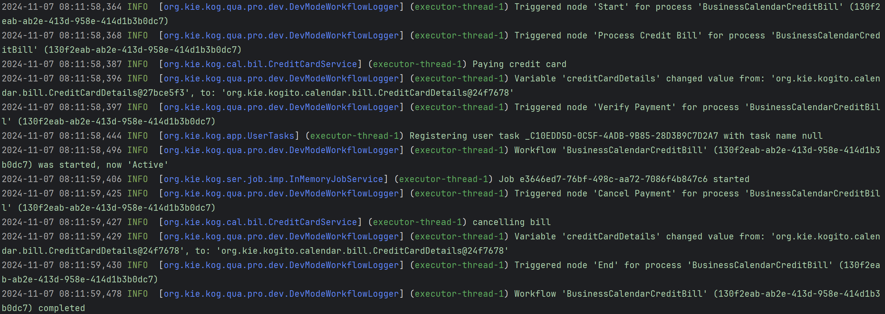

# Process Business Calendar Example

This project is an illustrative example demonstrating the impact of a business calendar on process execution within a Quarkus application . It showcases a business process involving credit card bill processing, which adapts to a business calendar defined in `calendar.properties`. This configuration modifies timer behaviors to respect working hours, holidays, and other schedule-based constraints.

### Main Components

**BPMN2-BusinessCalendarBankTransaction.bpmn2**:
Defines the workflow for processing credit card transactions. 
Includes tasks such as processing the credit bill, verifying payment, handling timers, cancelling and bill settlement.

**CreditCardService.java**:
Implements the logic for handling credit card payment processes.

**calendar.properties**:
Configures business hours, holidays, and other calendar properties that affect scheduling and timer behavior.

### BPMN Process Details

The BPMN model (`BPMN2-BusinessCalendarBankTransaction.bpmn2`) defines a workflow that includes the following main elements:
<p align="center"></p>

### Start Event

The initial trigger that starts the credit card bill processing workflow.

### Process Credit Bill
* Process Credit Bill Properties (Top)
  <p align="center"></p>

* Process Credit Bill Properties (Bottom)
  <p align="center"></p>
* Process Credit Card Bill Assignments
  <p align="center"></p>

### Verify Payment
A service task where the credit card details are validated, ensuring the payment is processed under valid terms.

* Verify Payment
  <p align="center"></p>

### Timer

Attached to a human task to simulate waiting for manual confirmation or user action. This timer can be configured to react differently based on the presence of the business calendar.
<p align="center"></p>

### Cancel Payment
Executed if the timer expires without human action, leading to the cancellation of the payment process.

* Cancel Payment (Top)
  <p align="center"></p>

* Cancel Payment (Bottom)
  <p align="center"></p>

* Cancel Payment Assignments
  <p align="center"></p>

### Settle Payment

The final step where the payment is settled successfully on manual verification.

* Settle Payment (Top)
 <p align="center"></p>

* Settle Payment (Bottom)
<p align="center"></p>

* Settle Payment Assignments
<p align="center"></p>

## Adding `calendar.properties` 

The `calendar.properties` file, when present, activates business calendar functionality that influences timer behavior in the BPMN model. It can delay job execution based on defined working hours, days of the week, and holidays.

### calendar.properties Description
<p align="center"></p>

### Example `calendar.properties`

```properties
business.start.hour=0
business.end.hour=24
business.hours.per.day=24
business.days.per.week=7
business.holiday.date.format=yyyy-MM-dd
#business.cal.timezone= system default timezone
```
## Build and run

### Prerequisites

You will need:
- Java 17+ installed
- Environment variable JAVA_HOME set accordingly
- Maven 3.9.6+ installed

When using native image compilation, you will also need:
- GraalVM 19.3+ installed
- Environment variable GRAALVM_HOME set accordingly
- GraalVM native image needs as well native-image extension: https://www.graalvm.org/reference-manual/native-image/
- Note that GraalVM native image compilation typically requires other packages (glibc-devel, zlib-devel and gcc) to be installed too, please refer to GraalVM installation documentation for more details.

### Compile and Run in Local Dev Mode

```sh
mvn clean compile quarkus:dev
```

NOTE: With dev mode of Quarkus you can take advantage of hot reload for business assets like processes, rules, decision tables and java code. No need to redeploy or restart your running application.

### Package and Run in JVM mode

```sh
mvn clean package
java -jar target/quarkus-app/quarkus-run.jar
```

or on windows

```sh
mvn clean package
java -jar target\quarkus-app\quarkus-run.jar
```

### Package and Run using Local Native Image
Note that the following configuration property needs to be added to `application.properties` in order to enable automatic registration of `META-INF/services` entries required by the workflow engine:
```
quarkus.native.auto-service-loader-registration=true
```

Note that this requires GRAALVM_HOME to point to a valid GraalVM installation

```sh
mvn clean package -Pnative
```

To run the generated native executable, generated in `target/`, execute

```sh
./target/process-usertasks-quarkus-runner
```

### OpenAPI (Swagger) documentation
[Specification at swagger.io](https://swagger.io/docs/specification/about/)

You can take a look at the [OpenAPI definition](http://localhost:8080/openapi?format=json) - automatically generated and included in this service - to determine all available operations exposed by this service. For easy readability you can visualize the OpenAPI definition file using a UI tool like for example available [Swagger UI](https://editor.swagger.io).

In addition, various clients to interact with this service can be easily generated using this OpenAPI definition.

When running in either Quarkus Development or Native mode, we also leverage the [Quarkus OpenAPI extension](https://quarkus.io/guides/openapi-swaggerui#use-swagger-ui-for-development) that exposes [Swagger UI](http://localhost:8080/swagger-ui/) that you can use to look at available REST endpoints and send test requests.

##curl command can be found below:

### To start the process

```sh
curl -X POST http://localhost:8080/BusinessCalendarCreditBill -H "Content-Type: application/json" -d '{
  "creditCardNumber": null,
  "creditCardDetails": {
    "cardNumber": "434353433",
    "status": "Bill Due"
  }
}'
```

### To retrieve instances

```sh
curl -X GET -H 'Content-Type:application/json' -H 'Accept:application/json' http://localhost:8080/BusinessCalendarCreditBill
```

### To retrieve all active usertasks across all process instances

```sh
curl -X GET -H 'Content-Type:application/json' -H 'Accept:application/json' http://localhost:8080/usertasks/instance
```
## Comparision of timer with and without calendar.properties

### Testing without calendar.properties
The timer for the Verify Payment task will follow a straightforward countdown based on real time. If the specified time elapses i.e., 1 minute, it immediately moves to cancel payment task, regardless of the working hours or holidays.

* Example test results without calendar.properties:  


* POST/ BusinessCalendarCreditBill
```json
{
  "id": "0a4105cc-54fb-4d17-a2bd-9b660e98df75",
  "creditCardNumber": null,
  "creditCardDetails": {
    "cardNumber": "434354343",
    "status": "Bill Due"  
    }
}
```

* GET/ BusinessCalendarCreditBill
```json
[
    {
        "id": "9070919b-a836-4193-bb37-d331bdb11df4",
        "name": "Task",
        "state": 1,
        "phase": "activate",
        "phaseStatus": "Activated",
        "parameters": {},
        "results": {}
    }
]
```
* After 1 minute when we send request for GET again we get empty array representing the cancellation.
```json
[]
```
### Example of logs representing the process from start to complete
<p align="center"></p>

* Starting workflow 'BusinessCalendarCreditBill': Indicates the initiation of the workflow.

* Triggered node 'Process Credit Bill': The workflow moves to process the credit bill.

* Paying credit card represents the action to process the bill in the CreditCardService.

* Triggered node 'Verify Payment': The workflow enters the verification phase, awaiting manual approval.

* Job started: After the specified timer duration, the workflow checks for verification. If not verified, it triggers the cancellation path.

* Triggered node 'Cancel Payment': The cancellation process initiates due to the timer expiry.

* cancelling bill: Represents the action taken by the CreditCardService to cancel the bill.

* Hence, without calendar.properties, timer fires immediately after their configured interval, activating tasks without delay.

## Testing with calendar.properties (During non-working hours/Specified Holiday)
### Configuring calendar.properties with a holiday

```properties
business.holiday.date.format=yy-MM-dd
business.holiday.date=2024-11-05
```

* For repeated holidays in a year
```properties
business.holiday.date.format=dd/MM
business.holiday.date=14/11,25/12,01/01
```

* Weekend's
```properties
business.weekend.days=7,1 
```
* Example of calendar.properties for testing during non-working hours
```properties
business.end.hour=17
business.hours.per.day=8
business.start.hour=10
business.holiday.date.format=yyyy-MM-dd
business.days.per.week =7
#business.cal.timezone= system default timezone
```

* POST/ BusinessCalendarCreditBill
```json
{
    "id": "b2b1d0bb-7946-4be6-81eb-0da35ff4a5d0",
    "creditCardNumber": null,
    "creditCardDetails": {
        "cardNumber": "434354343",
        "status": "Bill Due"
    }
}
```

* GET/ BusinessCalendarCreditBill
```json
{
    "id": "b2b1d0bb-7946-4be6-81eb-0da35ff4a5d0",
    "creditCardNumber": null,
    "creditCardDetails": {
        "cardNumber": "434354343",
        "status": "Bill Due"
    }
}
```
* Now, even after 1 minute, the process will be in Active State.

### Example of logs representing the active state during non-working hours/specified holiday

<p align="center"></p>

* Process Start: The BusinessCalendarCreditBill process begins, workflow logs indicate the start of the process and initialization of nodes.

* Process Credit Bill: The Process Credit Bill task is triggered, logging a message to indicate that the credit card bill is being processed.

* Verify Payment: The process moves to the Verify Payment task. Since a timer is associated with this task, it would typically trigger an action if verification is not completed within a specified duration (e.g., one minute). 

* However, due to the non-working hours, the timer will pause and not count down on this day. As a result, the workflow remains active without moving to the next step (i.e., cancellation due to timeout).

* Timer Resumption on Next Business Day: The timer will resume at the beginning of the next working hour/day, after the non-working hour/holiday has ended. The timer is set to fire after one minute of active business time.

