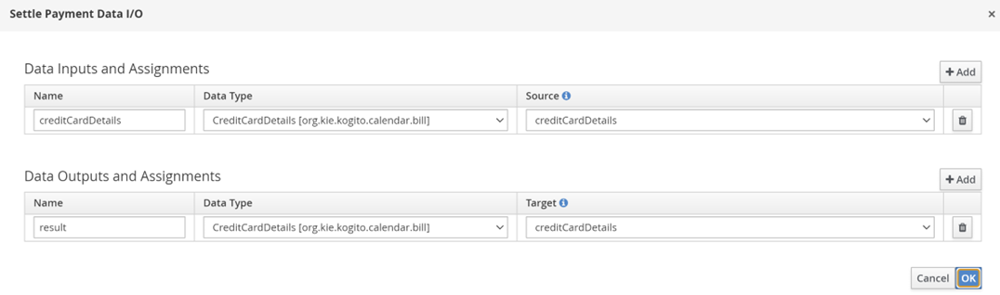
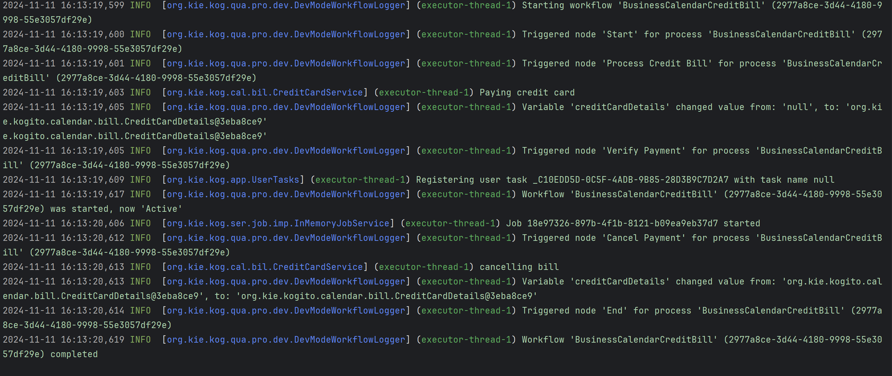
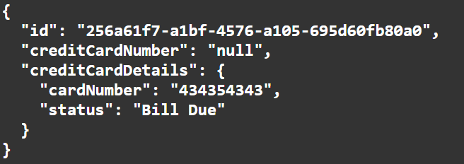
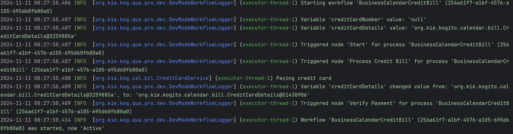
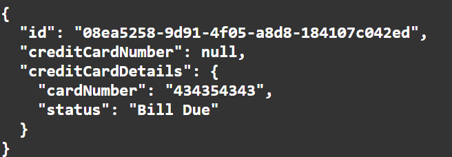
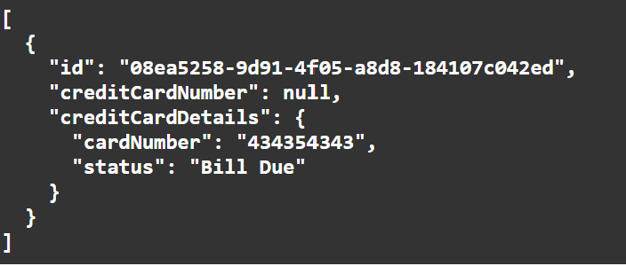

# Process Business Calendar Example

This example demonstrates the impact of a business calendar on process execution within a Quarkus application. It showcases a business process involving credit card bill processing, which adapts to a business calendar defined in calendar.properties. This configuration modifies timer behaviors to respect working hours, holidays, and other schedule-based constraints.

### Main Components

**BPMN2-BusinessCalendarBankTransaction.bpmn2**:
Defines the workflow for processing credit card transactions. 
Includes tasks such as processing the credit bill, verifying payment, handling timers, cancelling and bill settlement.

**CreditCardService.java**:
Implements the logic for handling credit card payment processes.

**calendar.properties**:
Configures business hours, holidays, and other calendar properties that affect scheduling and timer behavior.

### BPMN Process Details

The BPMN model (`BPMN2-BusinessCalendarBankTransaction.bpmn2`) defines a workflow that includes the following main elements:
<p align="center"></p>

### Start Event

The initial trigger that starts the credit card bill processing workflow.

### Process Credit Bill
* Process Credit Bill Properties (Top)
  <p align="center"></p>

* Process Credit Card Bill Assignments
  <p align="center"></p>

### Verify Payment
A user task where the credit card details are validated, ensuring the payment is processed under valid terms.

* Verify Payment
  <p align="center"></p>

### Timer

Attached to a user task to simulate waiting for manual confirmation or user action. This timer can be configured to react differently based on the presence of the business calendar.
<p align="center"></p>

### Cancel Payment
Executed if the timer expires without human action, leading to the cancellation of the payment process.

* Cancel Payment (Top)
  <p align="center"></p>

* Cancel Payment Assignments
  <p align="center"></p>

### Settle Payment

The final step where the payment is settled successfully on manual verification.

* Settle Payment (Top)
 <p align="center"></p>

* Settle Payment Assignments
<p align="center"></p>

## Build and run

### Prerequisites

You will need:
- Java 17+ installed
- Environment variable JAVA_HOME set accordingly
- Maven 3.9.6+ installed

### Compile and Run in Local Dev Mode

```sh
mvn clean compile quarkus:dev
```

NOTE: With dev mode of Quarkus you can take advantage of hot reload for business assets like processes, rules, decision tables and java code. No need to redeploy or restart your running application.

### Package and Run in JVM mode

```sh
mvn clean package
java -jar target/quarkus-app/quarkus-run.jar
```

or on windows

```sh
mvn clean package
java -jar target\quarkus-app\quarkus-run.jar
```

### OpenAPI (Swagger) documentation
[Specification at swagger.io](https://swagger.io/docs/specification/about/)

You can take a look at the [OpenAPI definition](http://localhost:8080/openapi?format=json) - automatically generated and included in this service - to determine all available operations exposed by this service. For easy readability you can visualize the OpenAPI definition file using a UI tool like for example available [Swagger UI](https://editor.swagger.io).

In addition, various clients to interact with this service can be easily generated using this OpenAPI definition.

When running in either Quarkus Development or Native mode, we also leverage the [Quarkus OpenAPI extension](https://quarkus.io/guides/openapi-swaggerui#use-swagger-ui-for-development) that exposes [Swagger UI](http://localhost:8080/q/swagger-ui/) that you can use to look at available REST endpoints and send test requests.

## curl command can be found below:

### To start the process

```sh
curl -X POST http://localhost:8080/BusinessCalendarCreditBill \
-H "Content-Type: application/json" \
-d '{"creditCardNumber": null, "creditCardDetails": {"cardNumber": "434353433", "status": "Bill Due"}}'

```

### To retrieve instances

```sh
curl -X GET http://localhost:8080/BusinessCalendarCreditBill \
-H "Content-Type: application/json" \
-H "Accept: application/json"

```
### To retrieve status of particular instance using id

```sh
curl -X GET http://localhost:8080/BusinessCalendarCreditBill/{id} \
-H "Content-Type: application/json" \
-H "Accept: application/json"

```

## Understanding calendar.properties
**Default Behavior**: If you do not input custom values in a calendar.properties file, the system will use the following default settings:

* **business.days.per.week** defaults to 5, meaning only Monday to Friday are considered working days.

* **business.hours.per.day** defaults to 8, representing an 8-hour workday.

* **business.start.hour** defaults to 9, and business.end.hour defaults to 17 (i.e.,9 AM to 5 PM workday).

* **business.weekend.days** defaults to Saturday and Sunday (Sunday-1, Monday-2, Tuesday-3, Wednesday-4, Thursday-5, Friday-6, Saturday-7).

* **business.holiday.date.format** defaults to yyyy-MM-dd, (input must match format defined format).

* **business.holidays** by default will be considered empty, meaning no predefined holidays unless specified, if specified, it should be in the format defined by business.holiday.date.format, Holidays can be specified as individual dates (e.g., 2024-12-25,2024-12-31) or as a range of dates (e.g., 2024-11-12:2024-11-14).

* **business.cal.timezone** defaults to the system’s default timezone, if configured, valid time-zone as per Valid timezone as per https://docs.oracle.com/javase/7/docs/api/java/util/TimeZone.html should be specfied.

**Behavior**:
* Considering the default properties as mentioned above, if a task is executed after working hours i.e., non-working hours (e.g., at 7 PM), the system will delay its execution until the start of the next working hour/working day (9 AM). For example, if a task timer is set to trigger at 7 PM on a Friday, it will not execute until 9 AM on Monday (assuming a standard 5-day workweek).
* If a task becomes due or is scheduled to start outside business hours, it will remain in a pending state until business hours resume.
* If the business calendar is configured with a 5-day workweek (business.days.per.week=5), any tasks scheduled over the weekend will not resume until the following Monday at the start of business hours.


## Configuring Custom Calendar.Properties
### Note: Important Guidelines for Configuring `calendar.properties`
To override default values, configure calendar.properties file based on requirements. In order to ensure more aligned functionality, please follow the rules outlined below. Adhering to these guidelines will help ensure that tasks are executed as expected. Incorrect configurations may result in unintended behavior, so it's recommended to input accurate values.

| Property                     | Valid Range                                                                                                            | Description                                                                                                                                                                                    |
|------------------------------|------------------------------------------------------------------------------------------------------------------------|------------------------------------------------------------------------------------------------------------------------------------------------------------------------------------------------|
| `business.start.hour`       | 0-23                                                                                                                   | Start hour of the workday                                                                                                                                                                      |
| `business.end.hour`         | 0-23                                                                                                                   | End hour of the workday                                                                                                                                                                        |
| `business.hours.per.day`    | 1-24                                                                                                                   | Total working hours in a day                                                                                                                                                                   |
| `business.days.per.week`    | 1-7                                                                                                                    | Total working days per week                                                                                                                                                                    |
| `business.weekend.days`     | 0-7                                                                                                                    | Days considered as weekends (e.g., 1 = Sunday, 7 = Saturday). In case you want to consider all the days as working days i.e., no weekend days, input 0 as value considering working days as 7. |
| `business.holiday.date.format`       | (yyyy-MM-dd)                                                                                                           | List of holidays                                                                                                                                                                               |
| `business.holidays`   | Dates aligned with business.holiday.date.format                                                                        | Date format for holidays                                                                                                                                                                       |
| `business.cal.timezone`     | Valid timezone as per [Java TimeZone Documentation](https://docs.oracle.com/javase/7/docs/api/java/util/TimeZone.html) | Timezone for calculations                                                                                                                                                                      |

### Example of custom calendar.properties
```Properties
business.end.hour=23
business.hours.per.day=24
business.start.hour=0
business.holiday.date.format=yyyy-MM-dd
business.holidays=2024-10-30
business.days.per.week=5
business.weekend.days=6,7
business.cal.timezone=America/Toronto
```
**Behavior**:
* **Tasks within working hours**: When a task or timer is scheduled within the defined working hours (e.g., between business.start.hour=0 and business.end.hour=24), the task will be completed immediately once it becomes due. For example, if a task is scheduled to trigger at 10 AM on a Tuesday, and your working hours are from 0 to 24, the task will execute as expected at 10 AM.
* **Handling custom working days**: If calendar.properties file specifies business.days.per.week=6, the system will treat these days as working days, tasks scheduled on any of these days will be processed during the defined working hours. For example, if a task is due at 10 AM on Saturday, and you’ve configured Saturday as a working day, the task will execute as completed.
* **Weekend handling**: Even if a task is executed within the defined working hours, it will be delayed if it falls on a configured weekend. For example, if you have business.days.per.week =5 and business.weekend.days=6,7 the task will not execute on the weekend days mentioned. Instead, it will be postponed to the next working day at the defined business.start.hour. This ensures that no tasks are executed on days that are considered holidays, even if they fall within regular business hours.
* **Holiday handling**: if a task is executed within the defined working hours, it will be delayed if it falls on a configured holiday. For example, if you have business.holdays = 2024-10-30 and a task is executed on the same day in a working hour, it will not execute, instead it will be postponed to the next working day at the defined business.start.hour. This ensures that no tasks are executed on days that are considered holidays, even if they fall within regular business hours.
* **Timezone**: If you specify a timezone using business.cal.timezone, the calendar will adjust all scheduling based on this timezone, regardless of system time else systems time will be considered.

## Testing with default calendar.properties (working hours)
**Note**: The test was performed at 16:13 on Monday, which falls under default working hours 

* The timer for the Verify Payment task will follow a straightforward countdown based on real time. If the specified time elapses i.e., 1 second, it immediately moves to cancel payment task.

* POST/ BusinessCalendarCreditBill
```sh
curl -X POST http://localhost:8080/BusinessCalendarCreditBill \
-H "Content-Type: application/json" \
-d '{"creditCardNumber": null, "creditCardDetails": {"cardNumber": "434353433", "status": "Bill Due"}}'

```
<p align="center"></p>

* After 1 second when we send request for GET/ BusinessCalendarCreditBill again we get empty array representing the cancellation.
```sh
curl -X GET http://localhost:8080/BusinessCalendarCreditBill \
-H "Content-Type: application/json" \
-H "Accept: application/json"

```
<p align="center"></p>

### Example of logs representing the process from start to completion
<p align="center"></p>

* At 16:13:20,606, job 18e97326-897b-4f1b-8121-b09ea9eb37d7 was started, indicating that the timer was triggered approximately after one second as expected.

## Testing with default calendar.properties (non-working hours)
**Note**: The test was performed at 08:27 on Monday, which does not fall in the default working hours range

* During non-working hours, the timer for the Verify Payment task will not trigger and the process remains in active state, does not move to cancel payment task.

* POST/ BusinessCalendarCreditBill
```sh
curl -X POST http://localhost:8080/BusinessCalendarCreditBill \
-H "Content-Type: application/json" \
-d '{"creditCardNumber": null, "creditCardDetails": {"cardNumber": "434353433", "status": "Bill Due"}}'
```
<p align="center"></p>


* GET/ BusinessCalendarCreditBill
```sh
curl -X GET http://localhost:8080/BusinessCalendarCreditBill \
-H "Content-Type: application/json" \
-H "Accept: application/json"

```
* Now, even after 1 second, the process will be in Active State but not completed state.

<p align="center"></p>

### Example of logs representing the active state during non-working hours

<p align="center"></p>

## Testing with calendar.properties (During non-working hours/Specified Holiday)
**Note**: The test was performed considering 24-hour workday properties with configured holiday i.e., business.holidays=2024-11-07

* After calendar.properties file is added, build the example again "mvn clean compile quarkus:dev" or type 's' in the quarkus terminal and hit enter just to restart.

* POST/ BusinessCalendarCreditBill
```sh
curl -X POST http://localhost:8080/BusinessCalendarCreditBill \
-H "Content-Type: application/json" \
-d '{"creditCardNumber": null, "creditCardDetails": {"cardNumber": "434353433", "status": "Bill Due"}}'
```
<p align="center"></p>


* GET/ BusinessCalendarCreditBill
```sh
curl -X GET http://localhost:8080/BusinessCalendarCreditBill \
-H "Content-Type: application/json" \
-H "Accept: application/json"

```
* Now, even after 1 second, the process will be in Active State.

<p align="center"></p>

### Example of logs representing the active state during non-working hours/specified holiday

<p align="center"></p>

* The node 'Start' for the process 'BusinessCalendarCreditBill', identified by 08ea5258-9d91-4f05-a8d8-184107c042ed, was triggered at 08:54:28,621.

* At 08:54:28,629, the 'Process Credit Bill' node was activated.

* At 08:54:28,653, verification step through the 'Verify Payment' node was started.

* Subsequently, a human task was registered at 08:54:28,773.

* The workflow transitioned to an 'Active' state at 08:54:28,808.

* Due to mentioned "business.holidays property" in calendar.properties, timer does not trigger and the state remains active.

* On next business day, timer will resume at the beginning of the next working hour/day, after the non-working hour/holiday has ended. The timer is set to fire after one second of active business time.


## Custom Business Calendar Flexibility

**Why Create a Custom Business Calendar?**
- Custom schedules that differ from the default behavior.
- Modify, delay, or override time calculations.
- Implement custom business logic for when tasks should be triggered.

This guide explains how to implement a custom business calendar allowing full flexibility.

---

### Creating a Custom Business Calendar 

- By default, calendar.properties is used to configure default business calendar. 
- If a custom business calendar has to be implemented, calendar.properties should NOT exist. Instead, add the following property to application.properties: ```kogito.processes.businessCalendar=org.kie.kogito.calendar.custom.CustomCalendar```

**Steps**
1. **Navigate to**: *kogito-quarkus-examples/process-business-calendar-quarkus-example/src/main/java/org/kie/kogito/calendar/custom* (create the custom folder if it does not exist).
2. **Create a new custom business calendar class** (e.g., CustomCalendar.java).
3. Ensure it implements the BusinessCalendar interface.The implementation should be a concrete class(not an interface or abstract class).
4. Set the property ```kogito.processes.businessCalendar=org.kie.kogito.calendar.custom.CustomCalendar```  in application.properties to the fully qualified class name of the custom business calendar.
5. Remove the calendar.properties file within src/main/resources to allow the CustomCalendar class to be registered instead of the default BusinessCalendarImpl provided out of the box.


**Implement your custom business logic**
- For demonstration, an example is provided below. However, you are free to define your own logic.

```java
package org.kie.kogito.calendar.custom;

import java.util.*;
import org.kie.kogito.calendar.BusinessCalendar;

/**
 * Custom Business Calendar Example.
 * Modify this class to implement your own scheduling logic.
 */
public class CustomCalendar implements BusinessCalendar {

    @Override
    public long calculateBusinessTimeAsDuration(String timeExpression) {
        // Implement custom logic to calculate business time duration
      // Note:The returned long value is in milliseconds. Duration can be set at least 1000 ms or longer to prevent immediate execution.
        return 1000;
    }

    @Override
    public Date calculateBusinessTimeAsDate(String timeExpression) {
        // Implement custom logic to return the scheduled date
        return new Date();
    }
}
```
---

### Testing custom calendar implementation

To verify that your custom implementation works:
1.	Run:

```mvn clean compile quarkus:dev```

- Verify in generated sources within target folder if it reflects the expected change
<p align="center"></p>


