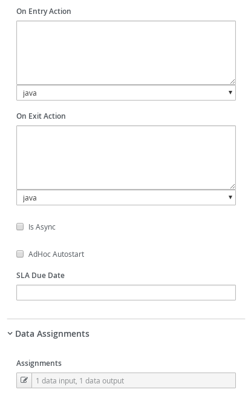
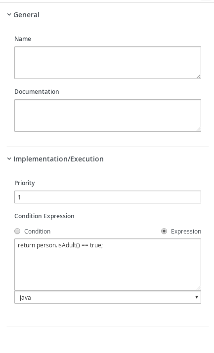
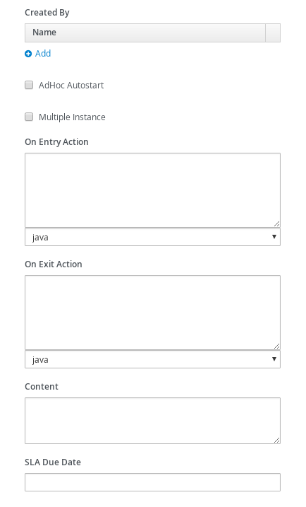

# Process with Business Rules

## Description

A quickstart project that shows the use of business rules and processes

This example shows

* make use of DRL to define rules
* make use of business rules task in the process to evaluate rules


<p align="center"></p>

* Diagram Properties (top)
<p align="center"></p>

* Diagram Properties (bottom)
<p align="center"></p>

* Evaluate Person Business Rule (top)
<p align="center"></p>

* Evaluate Person Business Rule (bottom)
<p align="center"></p>

* Evaluate Person Business Rule (Assignments)
<p align="center"></p>

* Exclusive Gateway
<p align="center"></p>

* Exclusive Gateway For Adult Connector
<p align="center"></p>

* Exclusive Gateway For Children Connector
<p align="center"></p>

* Special Handling for Children (top)
<p align="center"></p>

* Special Handling for Children (middle)
<p align="center"></p>

* Special Handling for Children (bottom)
<p align="center"></p>

* Special Handling for Children (Assignments)
<p align="center"></p>


## Build and run

### Prerequisites

You will need:
  - Java 17+ installed
  - Environment variable JAVA_HOME set accordingly
  - Maven 3.9.6+ installed

When using native image compilation, you will also need:
  - GraalVM 19.3+ installed
  - Environment variable GRAALVM_HOME set accordingly
  - GraalVM native image needs as well native-image extension: https://www.graalvm.org/reference-manual/native-image/
  - Note that GraalVM native image compilation typically requires other packages (glibc-devel, zlib-devel and gcc) to be installed too, please refer to GraalVM installation documentation for more details.

### Compile and Run in Local Dev Mode

```sh
mvn clean compile quarkus:dev
```

NOTE: With dev mode of Quarkus you can take advantage of hot reload for business assets like processes, rules, decision tables and java code. No need to redeploy or restart your running application.

### Package and Run in JVM mode

```sh
mvn clean package
java -jar target/quarkus-app/quarkus-run.jar
```

or on windows

```sh
mvn clean package
java -jar target\quarkus-app\quarkus-run.jar
```

### Package and Run using Local Native Image
Note that the following configuration property needs to be added to `application.properties` in order to enable automatic registration of `META-INF/services` entries required by the workflow engine:
```
quarkus.native.auto-service-loader-registration=true
```

Note that this requires GRAALVM_HOME to point to a valid GraalVM installation

```sh
mvn clean package -Pnative
```

To run the generated native executable, generated in `target/`, execute

```
./target/process-business-rules-quarkus-runner
```

## OpenAPI (Swagger) documentation
[Specification at swagger.io](https://swagger.io/docs/specification/about/)

You can take a look at the [OpenAPI definition](http://localhost:8080/openapi?format=json) - automatically generated and included in this service - to determine all available operations exposed by this service. For easy readability you can visualize the OpenAPI definition file using a UI tool like for example available [Swagger UI](https://editor.swagger.io).

In addition, various clients to interact with this service can be easily generated using this OpenAPI definition.

When running in either Quarkus Development or Native mode, we also leverage the [Quarkus OpenAPI extension](https://quarkus.io/guides/openapi-swaggerui#use-swagger-ui-for-development) that exposes [Swagger UI](http://localhost:8080/swagger-ui/) that you can use to look at available REST endpoints and send test requests.

## Example Usage

Once the service is up and running we can invoke the REST endpoints and examine the logic.

### Submit a request

To make use of this application it is as simple as putting a sending request to `http://localhost:8080/persons`  with appropriate contents. See the following two cases:

#### Adult person

Given data:

```json
{
  "person" : {
    "name" : "john",
    "age" : 20
  }
}

```

Submit the JSON object from above:

```sh
curl -X POST -H 'Content-Type:application/json' -H 'Accept:application/json' -d '{"person" : {"name" : "john", "age" : 20}}' http://localhost:8080/persons
```

After the Curl command you should see a similar console log

```json
{
    "id":"fd4f629d-6822-4ca2-a8a6-a74f5f81e83d",
    "person":{
        "name":"john",
        "age":20,
        "adult":true
    }
}
```

Because the person is evaluated as an adult, no outstanding tasks should be here for given person.

We can verify there is no task running for Children Handling using following command:

```sh
curl http://localhost:8080/persons/{uuid}/tasks
```
where uuid is the id returned in the previous step.

#### A Child

Given data:

```json
{
    "person" : {
        "name" : "john",
        "age" : 5
    }
}
```

Submit the JSON object from above:

```sh
curl -X POST -H 'Content-Type:application/json' -H 'Accept:application/json' -d '{"person" : {"name" : "john", "age" : 5}}' http://localhost:8080/persons
```

After the Curl command you should see a similar console log

```json
{
    "id":"c59054b9-aa1d-4771-bc5e-40f8b32d3ff5",
    "person":{
        "name":"john",
        "age":5,
        "adult":false
    }
}
```

Because the person is not evaluated as an adult, there should be outstanding tasks for given person.

To verify there is a running task for Children

```sh
curl http://localhost:8080/persons/{uuid}/tasks
```
where uuid is the id returned from the preivous step.

Should return something like

```json
[{"id":"c59054b9-aa1d-4771-bc5e-40f8b32d3ff5","name":"ChildrenHandling".....}]
```


Then to see the Task created perform the following command

```
curl http://localhost:8080/persons/{uuid}/ChildrenHandling/{tuuid}
```

where uuid is persons id and tuuid is task id.

It should return something similar to

```json
{
    "person":{
        "name":"john",
        "age":5,
        "adult":false
    },
    "id":"c59054b9-aa1d-4771-bc5e-40f8b32d3ff5",
    "name":"ChildrenHandling"
}
```

Then we can complete the task and validate child with

```sh
curl -X POST -H 'Content-Type:application/json' -H 'Accept:application/json' -d '{}' http://localhost:8080/persons/{uuid}/ChildrenHandling/{tuuid}
```

Where uuid is persons id and tuuid is task id

Should return something similar to

```json
{
    "id":"09f98756-b273-4ceb-9308-fae7cc423904",
    "person":{
        "name":"john",
        "age":5,
        "adult":false
    }
}
```
and there should be no outstanding task for the person anymore.
