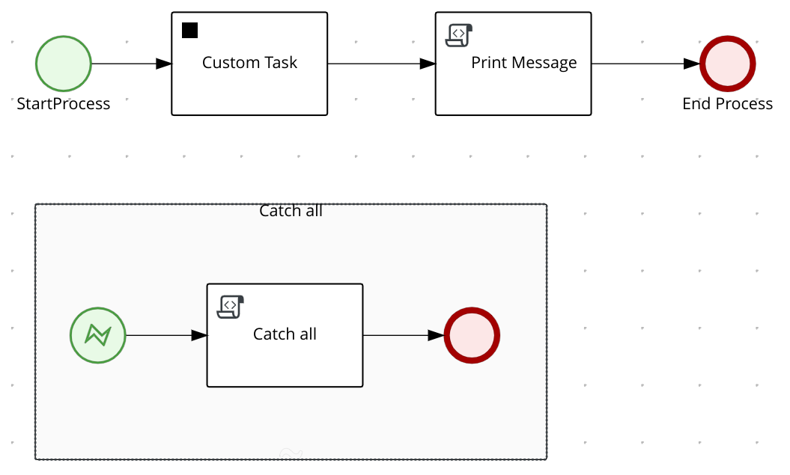
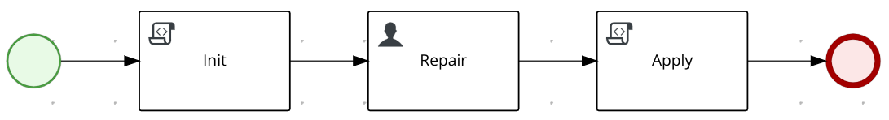

# Process Error Handling

## Description

A simple usage scenario of the Error Handling Strategy

The main process is 



Here the logic:

- `Custom Task` is a custom WorkItemHandler, the simple implementation is

  - Read the `Input` parameter
  - Return the `Result` string with the concatenation of `Hello ` and the value of the `Input`
  - Whether `Input` matches one of the following values `RETRY`, `COMPLETE`, `ABORT` or `RETHROW`; it throws a `ProcessWorkItemHandlerException` initialized with the corresponding strategy

- `Print Message` is script which print out the outcome of the previous Task (stored in `message` variable).

- Finally, an event sub-process is defined to catch all exceptions that reach the main process instance and to print out `Catch all` in the console.

In short, it is a sophisticated version of a **Hello World** process!

In order to probe the _Error Handling_ capabilities, you have to trigger the process with the **name** of the error handling strategy.
Regardless the strategy, the sub-process `error-handling` will be executed, then the main process execution is influenced by the strategy:

- `RETRY`: the `Custom Task` is executed again, the `Input` parameter of the task is refreshed using the outcome of the `error-handling` process.
- `COMPLETE`: the `Custom Task` is skipped, the `Result` parameter of the task is set with the corresponding outcome of the `error-handling` process.
- `ABORT`: the `Custom Task` is aborted and the process instance continues the execution. Pay attention: if the outcome of the task is essential for the following tasks the process is going to fail later).
- `RETHROW`: the `Custom Task` is aborted and the exception is thrown back at the task scope.

The `error-handling` sub-process initiates a user task which goal is to repair the situation.

The process design leaves the user in full control:

- Analyze the error message to understand the root cause of the problem
- Override the default _error handling strategy_
- In case of `RETRY`, they can provide a different **input** parameter for the task
- In case of `COMPLETE`, they can set the output parameter **result** for the task, in other words, the user replaces the implementation of the task by simulating a response

Here the process model:



The `Init` script calls the corresponding method of the class `ErrorHandlingScript` and there it performs the following:

- Logs the process variables
- Store the _error handling strategy_ in the `strategy` process variable 

The `Apply` script calls the corresponding method of the class `ErrorHandlingScript` and there it performs the following:

- Read the `strategy` variable
- Override the `Error` variable with a new `ProcessWorkItemHandlerException` initialized with the new strategy

## Build and run

### Prerequisites

You will need:
  - Java 17+ installed
  - Environment variable JAVA_HOME set accordingly
  - Maven 3.9.6+ installed

When using native image compilation, you will also need:
  - GraalVM 19.3+ installed
  - Environment variable GRAALVM_HOME set accordingly
  - GraalVM native image needs as well native-image extension: https://www.graalvm.org/reference-manual/native-image/
  - Note that GraalVM native image compilation typically requires other packages (glibc-devel, zlib-devel and gcc) to be installed too, please refer to GraalVM installation documentation for more details.

### Compile and Run in Local Dev Mode

```sh
mvn clean compile quarkus:dev
```

NOTE: With dev mode of Quarkus you can take advantage of hot reload for business assets like processes, rules, decision tables and java code. No need to redeploy or restart your running application.

### Package and Run in JVM mode

```sh
mvn clean package
java -jar target/quarkus-app/quarkus-run.jar
```

or on windows

```sh
mvn clean package
java -jar target\quarkus-app\quarkus-run.jar
```

### Package and Run using Local Native Image
Note that the following configuration property needs to be added to `application.properties` in order to enable automatic registration of `META-INF/services` entries required by the workflow engine:
```
quarkus.native.auto-service-loader-registration=true
```

Note that this requires GRAALVM_HOME to point to a valid GraalVM installation

```sh
mvn clean package -Pnative
```

To run the generated native executable, generated in `target/`, execute

```sh
./target/process-error-handling-runner
```
### OpenAPI (Swagger) documentation
[Specification at swagger.io](https://swagger.io/docs/specification/about/)

You can take a look at the [OpenAPI definition](http://localhost:8080/openapi?format=json) - automatically generated and included in this service - to determine all available operations exposed by this service. For easy readability you can visualize the OpenAPI definition file using a UI tool like for example available [Swagger UI](https://editor.swagger.io).

In addition, various clients to interact with this service can be easily generated using this OpenAPI definition.

When running in either Quarkus Development or Native mode, we also leverage the [Quarkus OpenAPI extension](https://quarkus.io/guides/openapi-swaggerui#use-swagger-ui-for-development) that exposes [Swagger UI](http://localhost:8080/swagger-ui/) that you can use to look at available REST endpoints and send test requests.

### Submit a request

To make use of this application it is as simple as putting a sending request to `http://localhost:8080/hello_error`  with following content

```json
{
    "name" : "john"
}
```

Complete curl command can be found below:

```sh
curl --request POST \
  --url http://localhost:8080/hello_error \
  --header 'accept: application/json' \
  --header 'content-type: application/json' \
  --data '{"name" : "john"}'
```

Response should resemble:

```json
{
  "id": "ae4a5fd4-3d49-4ba5-92dd-4b6222492fdd",
  "message": "Hello john"
}
```

### Probe the RETRY strategy

> **TIP:** In the following example, we are going to show the `curl` command line. Although, a more comfortable way is using the following [REST client](https://https://marketplace.visualstudio.com/items?itemName=humao.rest-client), you can find in the project the file with all the requests: `src/test/http/error-handling.http`.

Trigger the process with any error handling strategy:

```sh
curl --request POST \
  --url http://localhost:8080/hello_error \
  --header 'accept: application/json' \
  --header 'content-type: application/json' \
  --data '{"name" : "RETRY"}'
```

An `error-handling` process instance is created, issue the following command to retrieve the process instance id:

```sh
curl --request GET \
  --url http://localhost:8080/error_handling \
  --header 'accept: application/json' \
  --header 'content-type: application/json'
```

Get the tasks from the process instance you got.

**Make sure** to replace the _process instance id_:

```sh
curl --request GET \
  --url http://localhost:8080/error_handling/11b37d40-3c01-4384-92cc-044ac8939dcc/tasks \
  --header 'accept: application/json' \
  --header 'content-type: application/json'
```

Complete the `Repair` task.

**Make sure** to replace the _process instance id_ and _task instance id_:

```sh
curl --request POST \
  --url 'http://localhost:8080/error_handling/11b37d40-3c01-4384-92cc-044ac8939dcc/Repair/5b947a11-67f3-4b77-b0d3-1fd422e6600d?phase=complete' \
  --header 'accept: application/json' \
  --header 'content-type: application/json' \
  --data '{"input" : "Jimmy", "strategy" : "RETRY"}'
```

The WIH logic is executed again using the new input parameter provided by the `error-handling` process.

In the console you should spot an output the resemble the following:

```sh
2021-09-22 19:27:29,688 DEBUG [org.acm.wih.CustomTaskWorkItemHandler] (executor-thread-0) strategy = RETRY
>>> message: Hello Jimmy
2021-09-22 19:27:29,689 DEBUG [org.acm.wih.CustomTaskWorkItemHandler] (executor-thread-0) end
```

### Probe other strategies

Follow all the step in the previous paragraph, but complete the `Repair` task providing a different payload.

- **Complete strategy** The WIH logic is skipped but the task is marked completed, the main process proceeds picking the result provided by the `error-handling` process

  ```sh
  curl --request POST \
    --url 'http://localhost:8080/error_handling/11b37d40-3c01-4384-92cc-044ac8939dcc/Repair/5b947a11-67f3-4b77-b0d3-1fd422e6600d?phase=complete' \
    --header 'accept: application/json' \
    --header 'content-type: application/json' \
    --data '{"result" : "Hello Jimmy","strategy" : "COMPLETE"}'
  ```

  From the console output you should spot this line:

  ```
  >>> message: Hello Jimmy
  ```
- **Abort strategy** The WIH logic is skipped and the task is marked aborted, the main process proceeds but the `Custom Task` result is **null**. 

  ```sh
  curl --request POST \
    --url 'http://localhost:8080/error_handling/11b37d40-3c01-4384-92cc-044ac8939dcc/Repair/5b947a11-67f3-4b77-b0d3-1fd422e6600d?phase=complete' \
    --header 'accept: application/json' \
    --header 'content-type: application/json' \
    --data '{"strategy" : "ABORT"}'
  ```

  From the console output you should spot this line:

  ```
  >>> message: null
  ```

- **Rethrow strategy** The WIH logic is skipped and the main process get an exception 

  ```sh
  curl --request POST \
    --url 'http://localhost:8080/error_handling/11b37d40-3c01-4384-92cc-044ac8939dcc/Repair/5b947a11-67f3-4b77-b0d3-1fd422e6600d?phase=complete' \
    --header 'accept: application/json' \
    --header 'content-type: application/json' \
    --data '{"strategy" : "RETHROW"}'
  ```

  From the console output you should spot this line:

  ```
  Catch all
  ```
