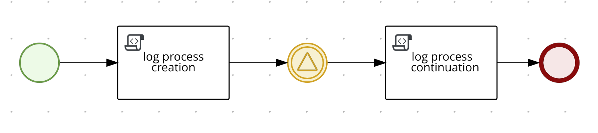
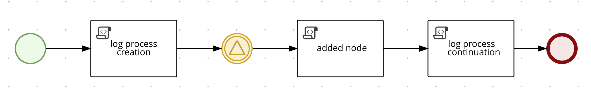
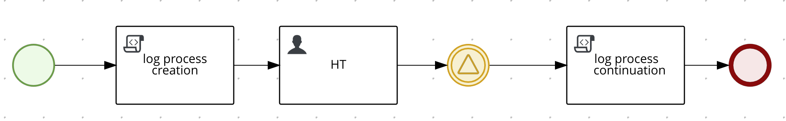

# Process Instance Migration (PIM) example

## Description

This example showcases the Process Instance Migration (PIM) functionality. This feature can be used to migrate
active process instances from one process definition (v1) to another (v2).

This example is using the *Compact Architecture* that is based on simplified communication among the different
*Kogito* services without the need of events (Kafka/HTTP) between them. Note that this design choice is unrelated
to the Process Instance Migration functionality.

## The test processes

### The original BPMN Process

<div style="text-align:center">
   <figure>
      
      <figcaption>Simple Process Diagram</figcaption>
   </figure>
</div>

The process follows a very basic design with two script tasks and a catching signal event in between to act as a wait state.

<div style="text-align:center">
   <figure>
      
      <figcaption>Modified Process Diagram</figcaption>
   </figure>
</div>

The modified version of this simple process has own additional script task **after** the wait state.


## Running the example
### Prerequisites

* Java 17+ installed
* Environment variable JAVA_HOME set accordingly
* Maven 3.9.3+ installed
* Docker and Docker Compose to run the required example infrastructure.

And when using native image compilation, you will also need:
- GraalVM 20.3+ installed
- Environment variable GRAALVM_HOME set accordingly
- GraalVM native image needs as well native-image extension: https://www.graalvm.org/reference-manual/native-image/
- Note that GraalVM native image compilation typically requires other packages (glibc-devel, zlib-devel and gcc) to be installed too, please refer to GraalVM installation documentation for more details.

### Infrastructure Services

This quickstart provides a docker compose template that starts all the required services. This setup ensures that all services are connected with a default configuration.

- PostgreSQL: 5432
- PgAdmin: 8055
- Kogito Process Instance Migration Service: 8080

To help bootstraping the Infrastructure Services, the example provides the `startServices.sh` script inside the *docker-compose* 
folder.

> **_NOTE_**: the docker compose template requires using _extra_hosts_ to allow the services use the host network, this may 
> carry some issues if you are using a **podman** version older than **4.7**.

### Building & Running the example

To build the example, on a Terminal, run the following command:
```shell
mvn clean package -Pcontainer
```
This will build the example quarkus application and create a Docker image that will be started in the `docker-compose` template.

To execute the full example (including consoles), open a Terminal and run the following command inside the `docker-compose` folder:

```shell
sh startServices.sh 
```

Additionally, if you want to start only the example and the minimal Infrastructure Services (PostgreSQL, Data-Index and Jobs Service), 
you can run the same `startServices.sh` script but passing the `example` argument 

```shell
sh startServices.sh example
```

> **_NOTE:_**  starting the Infrastructure Services, please consider running a ```mvn clean package -Pcontainer```
> command on the project root before running the ```startServices.sh``` script for the first time or any time you modify the project.

### Running the example in Development mode

To run the example in Development mode, just run the following command in a Terminal:

```shell
mvn clean package quarkus:dev -Pdevelopment
```

The Development Mode will embed all the needed Infrastructure Services (PostgreSQL, Data-Index & Jobs Service) and won't 
require any extra step.

The `development` profile includes the **Runtime Tools Quarkus Extension** that exposes a new section in the **Quarkus Dev-UI** 
unifying the **Management Console** & **Task Console** functionalities. **Quarkus Dev-UI** is available at http://localhost:8080/q/dev

> **_NOTE:_**  For more information about how to work with Kogito Runtime Tools Quarkus Extension, please refer to the [Kogito Documentation](https://docs.kogito.kie.org/latest/html_single/#con-runtime-tools-dev-ui_kogito-developing-process-services) page.

### Executing an instance of the Simple Process

Once the service is up and running you can start an instance of the **Simple** process by a sending request to `http://localhost:8080/simple`.


In a Terminal you can execute this curl command to start a **Simple** process:
```bash
curl -H "Content-Type: application/json" -H "Accept: application/json" -X POST http://localhost:8080/simple -d '{}'
```

If everything went well you may get a response like:
```json
{
  "id": "b97efe7d-dc9b-4da8-8b3e-6100f8d8b045"
}
```

In the console of the example container you should see the following log message:
```
Started process e4bf4948-1f56-4ee3-9f2c-5010aaf50701 [simple, v1.0]
```

To finish this process instance, execute the following command, using the process instance id previously returned, to send a signal:
```bash
curl -H "Content-Type: application/json" -H "Accept: application/json" -X POST http://localhost:8080/simple/e4bf4948-1f56-4ee3-9f2c-5010aaf50701/continue -d '{}'
```

In the console of the example container you should see the following log message:
```
Ending process e4bf4948-1f56-4ee3-9f2c-5010aaf50701 [simple, v1.0]
```

### Using PIM to migrate a process instance from the Simple Process to the Modified Process

In a Terminal, start another instance of the **Simple** process:
```bash
curl -H "Content-Type: application/json" -H "Accept: application/json" -X POST http://localhost:8080/simple -d '{}'
```

Note the new process instance id that is returned by the engine:
```json
{
  "id": "2a507f63-9db1-4d15-b64c-9e14f922d470"
}
```

Using the Management API, the following two endpoints can be used to migrate active process instances:
* `/management/processes/{processId}/migrate`: Use this endpoint to migrate **all** active process instances of a given `processId` to a new target process definition
* `/management/processes/{processId}/instances/{processInstanceId}/migrate`: Use this endpoint to migrate a specific process instance of a given `processId` to a new target process definition

In a Terminal, invoke the Management API to migrate the newly created process instance:
```bash
curl -H "Content-Type: application/json" -H "Accept: application/json" -X POST http://localhost:8080/management/processes/simple/migrate -d '{
  "targetProcessId": "modified",
  "targetProcessVersion": "1.0"
}'
```

The response will contain information about the migration:
```json
{
   "message":"All intances migrated",
   "numberOfProcessInstanceMigrated":1
}
```

Alternatively, use the following endpoint to migrate just a single process instance:
```bash
curl -H "Content-Type: application/json" -H "Accept: application/json" -X POST http://localhost:8080/management/processes/simple/instances/2a507f63-9db1-4d15-b64c-9e14f922d470/migrate -d '{
  "targetProcessId": "modified",
  "targetProcessVersion": "1.0"
}'
```


Note that the invocation of the `migrate` endpoint is the first step of the PIM functionality. It flags the selected process instance(s) as migrated to the defined target process definition. The second step of the migration will happen the next time the process instance is unmarshalled. This would be the case when the process instance is triggered to continue its execution. If you want to test whether this unmarshalling step is successful after the migration, the following PUT call can be used without triggering the execution of the process instance:
```bash
curl -H "Content-Type: application/json" -H "Accept: application/json" -X PUT http://localhost:8080/modified/2a507f63-9db1-4d15-b64c-9e14f922d470 -d '{}'
```

If successful, this call will just return the processInstanceId of the process instance.


To finish this process instance, execute the following command, using the process instance id previously returned, to send a signal against the endpoint of the **Modified** process:
```bash
curl -H "Content-Type: application/json" -H "Accept: application/json" -X POST http://localhost:8080/modified/2a507f63-9db1-4d15-b64c-9e14f922d470/continue -d '{}'
```

In the console of the example container you should see the following log messages:
```
Executing added node
Ending process 2a507f63-9db1-4d15-b64c-9e14f922d470 [modified, v1.0]
```

### Using PIM to migrate a process instance from the Simple Process to the Addedtask Process with a migration plan

In the first migration example, the **Modified** process contained an added node after the current wait state. The wait state itself was unchanged in both process definitions, using the same internal node id. Therefore, no additional information had to be provided for the migration to be successful.

Consider another modification of the original **Simple** process, this time adding a Human Task node **before** the Catching Signal Event:

<div style="text-align:center">
   <figure>
      
      <figcaption>Addedtask Process Diagram</figcaption>
   </figure>
</div>

With this change, the BPMN representation has changed in a way that the Catching Signal Event now has a different nodeId:

**[src/main/resources/simple.bpmn](src/main/resources/simple.bpmn)**
```xml
    <bpmn2:intermediateCatchEvent id="_8430CA7E-8CC6-4C2C-9664-6B5BBD5E36CB">
```

**[src/main/resources/addedtask.bpmn](src/main/resources/addedtask.bpmn)**
```xml
    <bpmn2:intermediateCatchEvent id="_1D65864A-96AF-44FC-92CE-2073B9FBA7D0">
```

In order to migrate process instances between process definitions with such changes, we need to provide a Migration Plan File (extension *.mpf). This file defines the migration plan with all required node mappings:

**[src/main/resources/META-INF/migration-plan/addedtask_migration.mpf](src/main/resources/META-INF/migration-plan/addedtask_migration.mpf)**
```json
{
    "name" : "simple to addedtask migration",
    "processMigrationPlan" : {
        "sourceProcessDefinition" : {
            "processId" : "simple",
            "processVersion" : "1.0"
        },
        "targetProcessDefinition" : {
            "processId" : "addedtask",
            "processVersion" : "1.0"
        },
        "nodeInstanceMigrationPlan" : [
            {
                "sourceNodeId" : "_8430CA7E-8CC6-4C2C-9664-6B5BBD5E36CB",
                "targetNodeId" : "_1D65864A-96AF-44FC-92CE-2073B9FBA7D0"
            }
        ]
    }
}
```

Now that we have this migration plan deployed with our new process, we can test the Process Instance Migration with the same steps as before.

In a Terminal, start another instance of the **Simple** process:
```bash
curl -H "Content-Type: application/json" -H "Accept: application/json" -X POST http://localhost:8080/simple -d '{}'
```

Note the new process instance id that is returned by the engine:
```json
{
  "id": "29ec3980-9f0f-4b92-8a2d-394ffdb477e3"
}
```

In a Terminal, invoke the Management API to migrate the newly created process instance:
```bash
curl -H "Content-Type: application/json" -H "Accept: application/json" -X POST http://localhost:8080/management/processes/simple/migrate -d '{
  "targetProcessId": "addedtask",
  "targetProcessVersion": "1.0"
}'
```

The response will contain information about the migration:
```json
{
   "message":"All intances migrated",
   "numberOfProcessInstanceMigrated":1
}
```

To finish this process instance, execute the following command, using the process instance id previously returned, to send a signal against the endpoint of the **Addedtask** process:
```bash
curl -H "Content-Type: application/json" -H "Accept: application/json" -X POST http://localhost:8080/addedtask/29ec3980-9f0f-4b92-8a2d-394ffdb477e3/continue -d '{}'
```

In the console of the example container you should see the following log messages:
```
Ending process 29ec3980-9f0f-4b92-8a2d-394ffdb477e3 [addedtask, v1.0]
```

