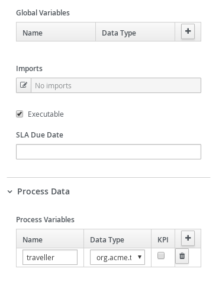
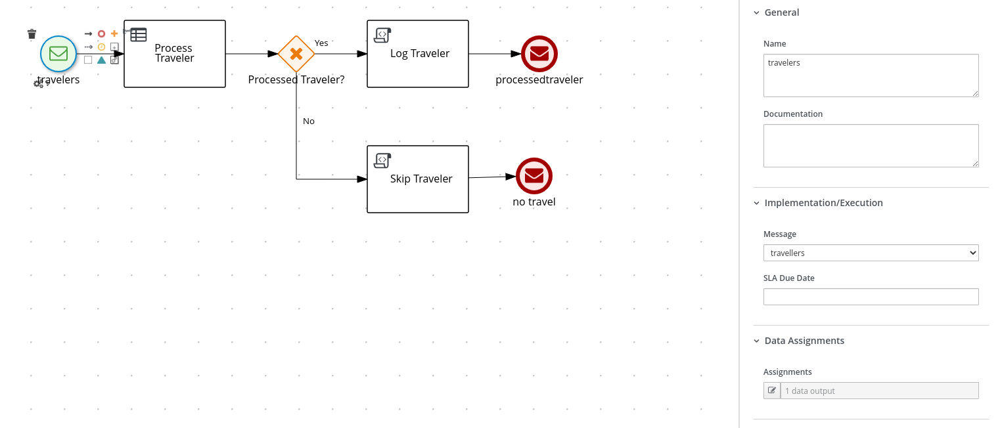
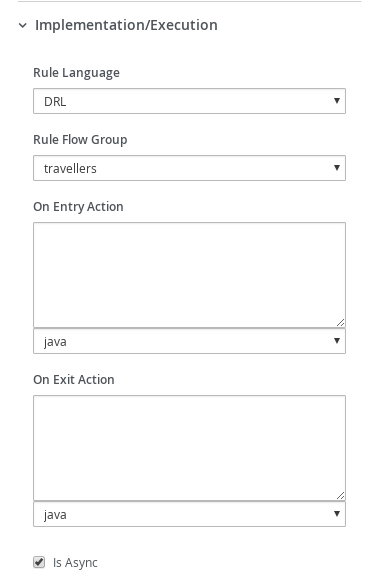

# Process with Kafka

## Description

A modification of quickstart project that deals with traveller processing carried by rules. The original example illustrates how easy it is to make the Kogito processes and rules work with Apache Kafka sending messages to different topics. This one demonstrates the usage of two features: 

* Default event marshaling override uses [Apache Avro](https://avro.apache.org/docs/current/index.html) rather than JSON. See `AvroEventMarshaller` and `AvroEventUnmashaller`
* Disable Cloud event to publish the traveller object directly. By setting `kogito.messaging.as-cloudevents` to false

A quick reminder of what the original example was doing:
* consuming events from a Kafka topic and for each event start a new process instance
* traveller is then processed by rules and based on the outcome of traveller processing:
    * if successfully processed, traveller information is logged, and then updated information is sent to another Kafka topic
    * if not processed traveller, info is logged and then process instance finishes sending a reply to a different Kafka topic

The functionality is still the same, but the format of the event, rather than being a cloudevent JSON format, it is a representation of the traveller object using Avro format. To help us deal with the serialization details,
`kie-addons-quarkus-marshallers-avro` dependency is added to `pom.xml`

```
    <dependency>
      <groupId>org.kie</groupId>
      <artifactId>kie-addons-quarkus-marshallers-avro</artifactId>
    </dependency>
```


<p align="center"></p>

* Diagram Properties (top)
<p align="center"></p>

* Diagram Properties (bottom)
<p align="center"></p>

* Diagram Properties (process variables)
<p align="center"></p>

* Start Message
<p align="center"></p>

* Start Message (Assignments)
<p align="center"></p>

* Process Traveler Business Rule (top)
<p align="center"></p>

* Process Traveler Business Rule (bottom)
<p align="center"></p>

* Process Traveler Business Rule (Assignments)
<p align="center"></p>

* Process Traveler Gateway
<p align="center"></p>

* Process Traveler Gateway Yes Connector
<p align="center"></p>

* Process Traveler Gateway No Connector
<p align="center"></p>

* Log Traveler Script Task
<p align="center"></p>

* Skip Traveler Script Task
<p align="center"></p>

* Processed Traveler End Message
<p align="center"></p>

* Processed Traveler End Message (Assignments)
<p align="center"></p>

* Skip Traveler End
<p align="center"></p>


## Infrastructure requirements

This quickstart requires an Apache Kafka to be available and by default expects it to be on default port and localhost.

* Install and Startup Kafka Server / Zookeeper

https://kafka.apache.org/quickstart

## Build and run

### Prerequisites

You will need:
  - Java 17+ installed
  - Environment variable JAVA_HOME set accordingly
  - Maven 3.9.6+ installed

When using native image compilation, you will also need:
  - GraalVM 19.3+ installed
  - Environment variable GRAALVM_HOME set accordingly
  - GraalVM native image needs as well native-image extension: https://www.graalvm.org/reference-manual/native-image/
  - Note that GraalVM native image compilation typically requires other packages (glibc-devel, zlib-devel and gcc) to be installed too, please refer to GraalVM installation documentation for more details.

### Compile and Run in Local Dev Mode

```sh
mvn clean compile quarkus:dev
```

NOTE: With dev mode of Quarkus you can take advantage of hot reload for business assets like processes, rules, decision tables and java code. No need to redeploy or restart your running application.

### Package and Run in JVM mode

```sh
mvn clean package
java -jar target/quarkus-app/quarkus-run.jar
```

or on windows

```sh
mvn clean package
java -jar target\quarkus-app\quarkus-run.jar
```

### Package and Run using Local Native Image
Note that the following configuration property needs to be added to `application.properties` in order to enable automatic registration of `META-INF/services` entries required by the workflow engine:
```
quarkus.native.auto-service-loader-registration=true
```

Note that this requires GRAALVM_HOME to point to a valid GraalVM installation

```
mvn clean package -Pnative
```
  
To run the generated native executable, generated in `target/`, execute

```
./target/process-kafka-quickstart-quarkus-runner
```

### OpenAPI (Swagger) documentation
[Specification at swagger.io](https://swagger.io/docs/specification/about/)

You can take a look at the [OpenAPI definition](http://localhost:8080/openapi?format=json) - automatically generated and included in this service - to determine all available operations exposed by this service. For easy readability you can visualize the OpenAPI definition file using a UI tool like for example available [Swagger UI](https://editor.swagger.io).

In addition, various clients to interact with this service can be easily generated using this OpenAPI definition.

When running in either Quarkus Development or Native mode, we also leverage the [Quarkus OpenAPI extension](https://quarkus.io/guides/openapi-swaggerui#use-swagger-ui-for-development) that exposes [Swagger UI](http://localhost:8080/swagger-ui/) that you can use to look at available REST endpoints and send test requests.

### Use the application

To make use of this application, you need to publish to `travellers` topic a kafka record containing an instance of `org.acme.travel.traveller` serialized using [Apache Avro](https://avro.apache.org/docs/current/gettingstartedjava.html) format. The best option is to do that programmatically. Take a look at the provided unit test class (named `MultiMessagingIt`) to understand how to achieve that. 


