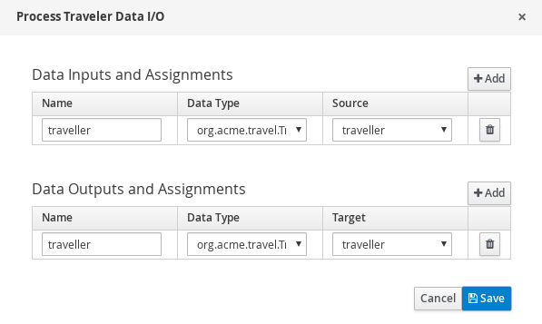

# Process with Kafka

## Description

A quickstart project that deals with traveller processing carried by rules. It illustrates
how easy it is to make the Kogito processes and rules to work with Apache Kafka sending messages to different topics. 

This example shows

* consuming events from a Kafka topic and for each event start new process instance
* each process instance is expecting a traveller information in JSON format
* traveller is then processed by rules and based on the outcome of the processing (processed or not) traveller is
	* if successfully processed traveller information is logged and then updated information is send to another Kafka topic
	* if not processed traveller info is logged and then process instance finishes  sending reply to a different Kafka topic


<p align="center"></p>

* Diagram Properties (top)
<p align="center"></p>

* Diagram Properties (bottom)
<p align="center"></p>

* Diagram Properties (process variables)
<p align="center"></p>

* Start Message
<p align="center"></p>

* Start Message (Assignments)
<p align="center"></p>

* Process Traveler Business Rule (top)
<p align="center"></p>

* Process Traveler Business Rule (bottom)
<p align="center"></p>

* Process Traveler Business Rule (Assignments)
<p align="center"></p>

* Process Traveler Gateway
<p align="center"></p>

* Process Traveler Gateway Yes Connector
<p align="center"></p>

* Process Traveler Gateway No Connector
<p align="center"></p>

* Log Traveler Script Task
<p align="center"></p>

* Skip Traveler Script Task
<p align="center"></p>

* Processed Traveler End Message
<p align="center"></p>

* Processed Traveler End Message (Assignments)
<p align="center"></p>

* Skip Traveler End
<p align="center"></p>


## Infrastructure requirements

This quickstart requires an Apache Kafka to be available and by default expects it to be on default port and localhost.

* Install and Startup Kafka Server / Zookeeper

https://kafka.apache.org/quickstart

## Build and run

### Prerequisites

You will need:
  - Java 17+ installed
  - Environment variable JAVA_HOME set accordingly
  - Maven 3.9.6+ installed

When using native image compilation, you will also need:
  - GraalVM 19.3+ installed
  - Environment variable GRAALVM_HOME set accordingly
  - GraalVM native image needs as well native-image extension: https://www.graalvm.org/reference-manual/native-image/
  - Note that GraalVM native image compilation typically requires other packages (glibc-devel, zlib-devel and gcc) to be installed too, please refer to GraalVM installation documentation for more details.

### Compile and Run in Local Dev Mode

```sh
mvn clean compile quarkus:dev
```

NOTE: With dev mode of Quarkus you can take advantage of hot reload for business assets like processes, rules, decision tables and java code. No need to redeploy or restart your running application.

### Package and Run in JVM mode

```sh
mvn clean package
java -jar target/quarkus-app/quarkus-run.jar
```

or on windows

```sh
mvn clean package
java -jar target\quarkus-app\quarkus-run.jar
```

### Package and Run using Local Native Image
Note that the following configuration property needs to be added to `application.properties` in order to enable automatic registration of `META-INF/services` entries required by the workflow engine:
```
quarkus.native.auto-service-loader-registration=true
```

Note that this requires GRAALVM_HOME to point to a valid GraalVM installation

```
mvn clean package -Pnative
```
  
To run the generated native executable, generated in `target/`, execute

```
./target/process-kafka-quickstart-quarkus-runner
```

### OpenAPI (Swagger) documentation
[Specification at swagger.io](https://swagger.io/docs/specification/about/)

You can take a look at the [OpenAPI definition](http://localhost:8080/openapi?format=json) - automatically generated and included in this service - to determine all available operations exposed by this service. For easy readability you can visualize the OpenAPI definition file using a UI tool like for example available [Swagger UI](https://editor.swagger.io).

In addition, various clients to interact with this service can be easily generated using this OpenAPI definition.

When running in either Quarkus Development or Native mode, we also leverage the [Quarkus OpenAPI extension](https://quarkus.io/guides/openapi-swaggerui#use-swagger-ui-for-development) that exposes [Swagger UI](http://localhost:8080/swagger-ui/) that you can use to look at available REST endpoints and send test requests.

### Use the application

To make use of this application it is as simple as putting a message on `travellers` topic with following content  (cloud event format)

* To examine ProcessedTravellers topic and verify upcoming messages will be processed

Execute in a separate terminal session

```sh
bin/kafka-console-consumer.sh --bootstrap-server localhost:9092 --topic processedtravellers
```

Execute in a separate terminal session

```sh
bin/kafka-console-consumer.sh --bootstrap-server localhost:9092 --topic cancelledtravellers
```


* Send message that should be processed to Topic

```sh
bin/kafka-console-producer.sh --broker-list localhost:9092 --topic travellers
```

Content (cloud event format)

```json
{
  "specversion": "1.0",
  "id": "21627e26-31eb-43e7-8343-92a696fd96b1",
  "source": "",
  "type": "travellers",
  "time": "2022-02-24T13:25:16Z",
  "data": {
	"firstName" : "Jan",
	"lastName" : "Kowalski",
	"email" : "jan.kowalski@example.com",
	"nationality" : "Polish"
	}
}
```
One liner

```json
{"specversion": "1.0","id": "21627e26-31eb-43e7-8343-92a696fd96b1","source": "","type": "travellers", "time": "2022-02-24T13:25:16Z","data": { "firstName" : "Jan", "lastName" : "Kowalski", "email" : "jan.kowalski@example.com", "nationality" : "Polish"}}
```


this will then trigger the successful processing of the traveller and put another message on `processedtravellers` topic with following content (cloud event format)

```json
{
  "specversion": "0.3",
  "id": "86f69dd6-7145-4188-aeaa-e44622eeec86",
  "source": "",
  "type": "TravellersMessageDataEvent_3",
  "time": "2022-02-24T15:25:16Z",
  "data": {
    "firstName": "Jan",
    "lastName": "Kowalski",
    "email": "jan.kowalski@example.com",
    "nationality": "Polish",
    "processed": true
  },
  "kogitoProcessinstanceId": "4fb091c2-82f7-4655-8687-245a4ab07483",
  "kogitoParentProcessinstanceId": null,
  "kogitoRootProcessinstanceId": null,
  "kogitoProcessId": "Travellers",
  "kogitoRootProcessId": null,
  "kogitoProcessinstanceState": "1",
  "kogitoReferenceId": null
}
```

there is a bunch of extension attributes that starts with `kogito` to provide some context of the execution and the event producer.

To take the other path of the process put following message on `travellers` topic

* Send Message to Topic

```sh
bin/kafka-console-producer.sh --broker-list localhost:9092 --topic travellers
```

With the following content (Cloud Event Format)

```json
{
  "specversion": "1.0",
  "id": "31627e26-31eb-43e7-8343-92a696fd96b1",
  "source": "",
  "type": "travellers",
  "time": "2022-02-24T13:25:16Z",
  "data": {
	"firstName" : "John",
	"lastName" : "Doe",
    "email" : "john.doe@example.com",
    "nationality" : "American"
	}
}
```

One Liner

```json
{"specversion": "1.0","id": "31627e26-31eb-43e7-8343-92a696fd96b1","source": "","type": "travellers", "time": "2022-02-24T13:25:16Z","data": { "firstName" : "John", "lastName" : "Doe", "email" : "john.doe@example.com", "nationality" : "American"}}
```

this will result in message being send to `cancelledtravelers` topic, according to this configuration

```
mp.messaging.outgoing.no\u0020travel.connector=smallrye-kafka
mp.messaging.outgoing.no\u0020travel.topic=cancelledtravellers
mp.messaging.outgoing.no\u0020travel.value.serializer=org.apache.kafka.common.serialization.StringSerializer
```
