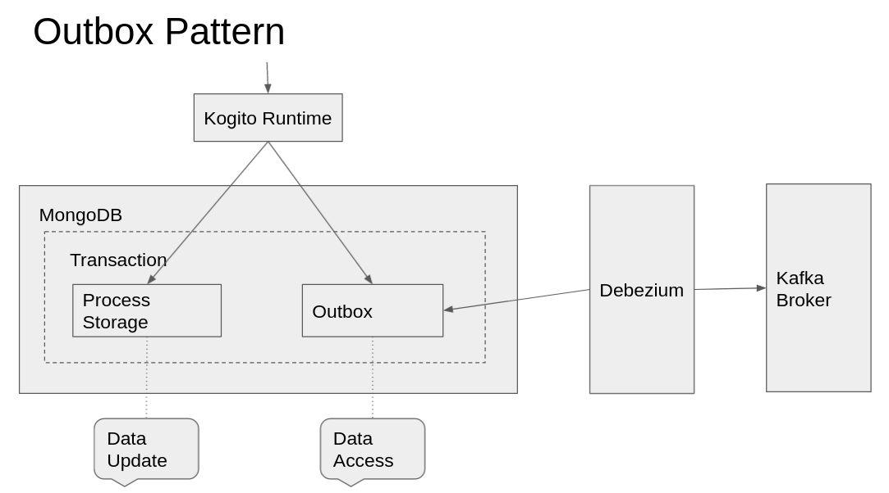
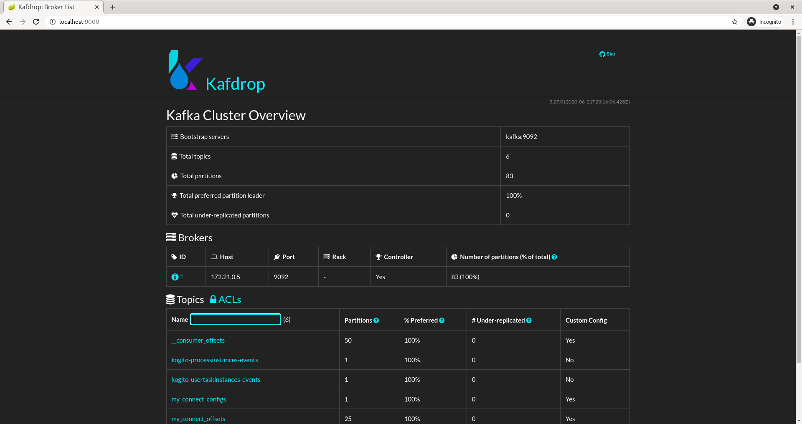
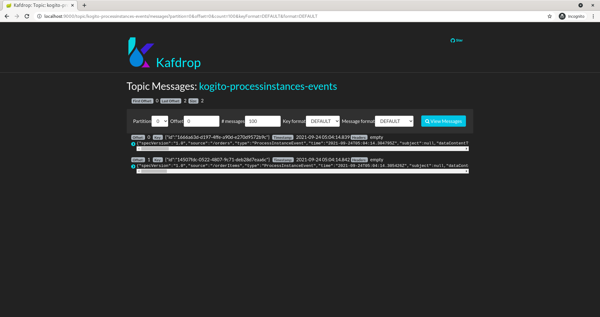

# Kogito with persistence and events strong consistency powered by Quarkus, MongoDB, Debezium and Kafka

## Description

This example shows how to enable storing Kogito process data and events to MongoDB.

By doing so, it allows demonstrating how to use the transactional outbox pattern with Debezium, which then reads these events and publishes to Kafka.

<p align="center"></p>

## Run the Example End-to-End

1. Build the Kogito App
```shell
mvn clean package
```

2. Deploy Kogito App, MongoDB, Debezium and Kafka
```shell
docker compose up
```

3. Check if Debezium is in `RUNNING` state
```shell
curl http://localhost:8083/connectors/kogito-connector/status
```

4. [Interact with the Kogito App](#kogito-app-example-usage) (e.g. create an order) and generate some Kogito events
```shell
curl -d '{"approver" : "john", "order" : {"orderNumber" : "12345", "shipped" : false}}' -H "Content-Type: application/json" -X POST http://localhost:8080/orders
```

5. Browse the Kafka messages with Kafdrop web UI at `http://localhost:9000/`

<p align="center"></p>

<p align="center"></p>

6. With the Kafka broker info from step 8, run the Kogito Data Index Service with MongoDB to consume Kafka messages: https://github.com/apache/incubator-kie-kogito-runtimes/wiki/Data-Index-Service

7. Shut down the cluster
```shell
docker compose down
```

## Kogito App Example Usage

Once the service is up and running, you can use the following examples to interact with the service. Note that rather than using the curl commands below, you can also use the [Swagger UI](http://localhost:8080/swagger-ui/) to send requests.

### POST /orders

Allows to create a new order with the given data:

Given data:

```json
{
    "approver" : "john",
    "order" : {
        "orderNumber" : "12345",
        "shipped" : false
    }
}
```

Curl command (using the JSON object above):

```sh
curl -d '{"approver" : "john", "order" : {"orderNumber" : "12345", "shipped" : false}}' -H "Content-Type: application/json" -X POST http://localhost:8080/orders
```
or on windows

```sh
curl -d "{\"approver\" : \"john\", \"order\" : {\"orderNumber\" : \"12345\", \"shipped\" : false}}" -H "Content-Type: application/json" -X POST http://localhost:8080/orders
```

As response the updated order is returned.

Example response:

```json
    {
      "approver": "john",
      "id": "b5225020-4cf4-4e91-8f86-dc840589cc22",
      "order": {
        "orderNumber": "12345",
        "shipped": false,
        "total": 0.529655982561999
      }
    }
```

### GET /orders

Returns list of orders currently active:

```sh
curl -X GET http://localhost:8080/orders
```
Example response:

```json
    [{
      "approver": "john",
      "id": "b5225020-4cf4-4e91-8f86-dc840589cc22",
      "order": {
        "orderNumber": "12345",
        "shipped": false,
        "total": 0.529655982561999
      }
    }]
```

As response an array of orders is returned.

### GET /orders/{id}

Returns order with given id (if active):

```sh
curl -X GET http://localhost:8080/orders/b5225020-4cf4-4e91-8f86-dc840589cc22
```
Example response:

```json
    {
      "approver": "john",
      "id": "b5225020-4cf4-4e91-8f86-dc840589cc22",
      "order": {
        "orderNumber": "12345",
        "shipped": false,
        "total": 0.529655982561999
      }
    }
```

As response a single order is returned if found, otherwise 404 Not Found is returned.

### DELETE /orders/{id}

Cancels order with given id

```sh
curl -X DELETE http://localhost:8080/orders/b5225020-4cf4-4e91-8f86-dc840589cc22
```
Example response:

```json
    {
      "approver": "john",
      "id": "b5225020-4cf4-4e91-8f86-dc840589cc22",
      "order": {
        "orderNumber": "12345",
        "shipped": false,
        "total": 0.529655982561999
      }
    }
```

### GET /orderItems

Getting order items sub processes

```sh
curl -X GET http://localhost:8080/orderItems
```
Example response:

```json
[
  {
    "id":"66c11e3e-c211-4cee-9a07-848b5e861bc5",
    "order":
    {
      "orderNumber":"12345",
      "shipped":false,
      "total":0.537941914075738
    }
  }
]
```

### GET /orderItems/{id}/tasks

Getting user tasks awaiting user action

```sh
curl -X GET http://localhost:8080/orderItems/66c11e3e-c211-4cee-9a07-848b5e861bc5/tasks?user=john
```
Example response:

```json
[
  {"id":"62f1c985-d31c-4ead-9906-2fe8d05937f0","name":"Verify order"}
]
```

### GET /orderItems/{id}/Verify_order/{tid}

Getting user task details

```sh
curl -X GET http://localhost:8080/orderItems/66c11e3e-c211-4cee-9a07-848b5e861bc5/Verify_order/62f1c985-d31c-4ead-9906-2fe8d05937f0?user=john
```
Example response:

```json
{
  "id":"62f1c985-d31c-4ead-9906-2fe8d05937f0",
  "input1":
  {
    "orderNumber":"12345",
    "shipped":false,
    "total":0.537941914075738
  },
  "name":"Verify order"
}
```

### POST /orderItems/{id}/Verify_order/{tid}

Complete user task

```sh
curl -d '{}' -H "Content-Type: application/json" -X POST http://localhost:8080/orderItems/66c11e3e-c211-4cee-9a07-848b5e861bc5/Verify_order/62f1c985-d31c-4ead-9906-2fe8d05937f0?user=john
```


As response the updated order is returned.

Example response:

```json
{
  "id":"66c11e3e-c211-4cee-9a07-848b5e861bc5",
  "order":
  {
    "orderNumber":"12345",
    "shipped":false,
    "total":0.537941914075738
  }
}
```

## References

**Outbox pattern**: https://microservices.io/patterns/data/transactional-outbox.html

**Debezium Connector**: https://debezium.io/blog/2019/02/19/reliable-microservices-data-exchange-with-the-outbox-pattern/

**debezium-examples:** https://github.com/debezium/debezium-examples/blob/main/tutorial/README.md#using-mongodb

**debezium-images:** https://github.com/debezium/docker-images/tree/main/examples/mongodb/
