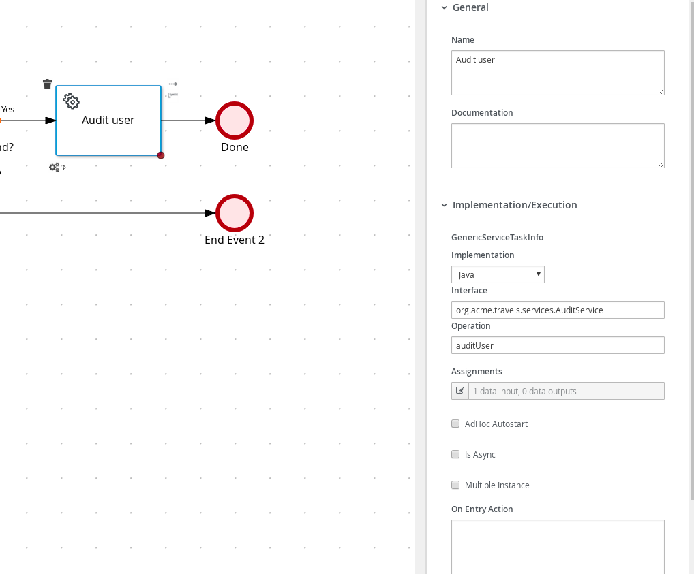

# Process Service invocation with REST call

## Description

A quickstart project that processes users in the system. It's main purpose is to to call external REST service
to load a given user by its username.

There are two ways to invoke a rest web service in Kogito: programmatically, as shown in this other [example](https://github.com/apache/incubator-kie-kogito-examples/tree/stable/kogito-quarkus-examples/process-service-calls-quarkus) or using RestWorkItemHandler, as in this example.

Note that in order to user a WorkItem in Kogito Editor, corresponding .wid file needs to located together with the bpmn file under the same directory

This example shows

* invoking remote REST service
* control flow based on service calls

* Diagram
<p align="center"></p>

* Diagram Properties
<p align="center"></p>

* Diagram Properties
<p align="center"></p>

* Diagram Properties
<p align="center"></p>

* Find User Service Call
<p align="center"></p>

* Find User Service Call
<p align="center"></p>

* Find User Gateway Yes
<p align="center"></p>

* Find User Gateway No
<p align="center"></p>

* Audit User Service Rest Call
<p align="center"></p>

* Audit User Service Rest Call
<p align="center"></p>

In addition, it takes advantage of MicroProfile fault tolerance support to fallback if there are any errors
during REST service invocation.

## Build and run

### Prerequisites

You will need:
  - Java 17+ installed
  - Environment variable JAVA_HOME set accordingly
  - Maven 3.9.6+ installed

When using native image compilation, you will also need:
  - GraalVM 19.1+ installed
  - Environment variable GRAALVM_HOME set accordingly
  - Note that GraalVM native image compilation typically requires other packages (glibc-devel, zlib-devel and gcc) to be installed too, please refer to GraalVM installation documentation for more details.

### Compile and Run in Local Dev Mode

```sh
mvn clean compile quarkus:dev
```

NOTE: With dev mode of Quarkus you can take advantage of hot reload for business assets like processes, rules, decision tables and java code. No need to redeploy or restart your running application.

### Package and Run in JVM mode

```sh
mvn clean package
java -jar target/quarkus-app/quarkus-run.jar
```

or on windows

```sh
mvn clean package
java -jar target\quarkus-app\quarkus-run.jar
```

### Package and Run using Local Native Image
Note that the following configuration property needs to be added to `application.properties` in order to enable automatic registration of `META-INF/services` entries required by the workflow engine:
```
quarkus.native.auto-service-loader-registration=true
```

Note that this requires GRAALVM_HOME to point to a valid GraalVM installation

```sh
mvn clean package -Pnative
```

To run the generated native executable, generated in `target/`, execute

```sh
./target/process-service-rest-call-quarkus-runner
```

### OpenAPI (Swagger) documentation
[Specification at swagger.io](https://swagger.io/docs/specification/about/)

You can take a look at the [OpenAPI definition](http://localhost:8080/openapi?format=json) - automatically generated and included in this service - to determine all available operations exposed by this service. For easy readability you can visualize the OpenAPI definition file using a UI tool like for example available [Swagger UI](https://editor.swagger.io).

In addition, various clients to interact with this service can be easily generated using this OpenAPI definition.

When running in either Quarkus Development or Native mode, we also leverage the [Quarkus OpenAPI extension](https://quarkus.io/guides/openapi-swaggerui#use-swagger-ui-for-development) that exposes [Swagger UI](http://localhost:8080/swagger-ui/) that you can use to look at available REST endpoints and send test requests.


### Submit a user name

To make use of this application it is as simple as putting a sending request to `http://localhost:8080/users`  with following content

```json
{
    "username" : "test"
}

```

Complete curl command can be found below:

```sh
curl -X POST -H 'Content-Type:application/json' -H 'Accept:application/json' -d '{"username" : "test"}' http://localhost:8080/users
```

After the above command you should see some log on Quarkus such as following

* Quarkus Log
<p align="center"></p>

To test the other route possible for unknown user send request to `http://localhost:8080/users`  with following content

```json
{
    "username" : "nonexisting"
}

```


Complete curl command can be found below:

```sh
curl -X POST -H 'Content-Type:application/json' -H 'Accept:application/json' -d '{"username" : "nonexisting"}' http://localhost:8080/users
```

After the above command nothing will show on Quarkus log as the user is skipped but you should see the following on terminal after curl

* Curl Log
<p align="center"></p>
