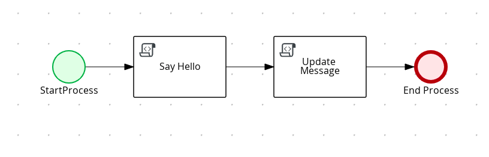
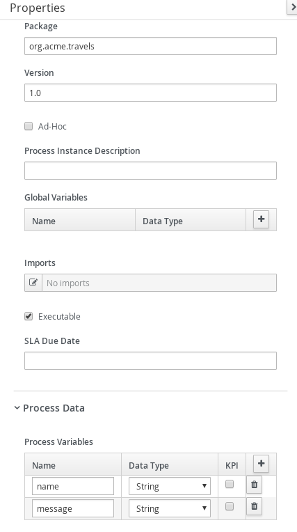

# Process script invocation

## Description

A quickstart project is the simplest hello world kind of example, it accepts input and replies with hello message.

This example shows

* invoking scripts from within process

<p align="center"></p>

* Diagram Properties (top)
<p align="center"></p>

* Diagram Properties (bottom)
<p align="center"></p>

* Hello Script Task
<p align="center"></p>

* Update Message Script Task
<p align="center"></p>


## Build and run

### Prerequisites

You will need:
  - Java 17+ installed
  - Environment variable JAVA_HOME set accordingly
  - Maven 3.9.6+ installed

When using native image compilation, you will also need:
  - GraalVM 19.3+ installed
  - Environment variable GRAALVM_HOME set accordingly
  - GraalVM native image needs as well native-image extension: https://www.graalvm.org/reference-manual/native-image/
  - Note that GraalVM native image compilation typically requires other packages (glibc-devel, zlib-devel and gcc) to be installed too, please refer to GraalVM installation documentation for more details.

### Compile and Run in Local Dev Mode

```sh
mvn clean compile quarkus:dev
```

NOTE: With dev mode of Quarkus you can take advantage of hot reload for business assets like processes, rules, decision tables and java code. No need to redeploy or restart your running application.

### Package and Run in JVM mode

```sh
mvn clean package
java -jar target/quarkus-app/quarkus-run.jar
```

or on windows

```sh
mvn clean package
java -jar target\quarkus-app\quarkus-run.jar
```

### Package and Run using Local Native Image
Note that the following configuration property needs to be added to `application.properties` in order to enable automatic registration of `META-INF/services` entries required by the workflow engine:
```
quarkus.native.auto-service-loader-registration=true
```

Note that this requires GRAALVM_HOME to point to a valid GraalVM installation

```sh
mvn clean package -Pnative
```

To run the generated native executable, generated in `target/`, execute

```sh
./target/process-scripts-quarkus-runner
```
### OpenAPI (Swagger) documentation
[Specification at swagger.io](https://swagger.io/docs/specification/about/)

You can take a look at the [OpenAPI definition](http://localhost:8080/openapi?format=json) - automatically generated and included in this service - to determine all available operations exposed by this service. For easy readability you can visualize the OpenAPI definition file using a UI tool like for example available [Swagger UI](https://editor.swagger.io).

In addition, various clients to interact with this service can be easily generated using this OpenAPI definition.

When running in either Quarkus Development or Native mode, we also leverage the [Quarkus OpenAPI extension](https://quarkus.io/guides/openapi-swaggerui#use-swagger-ui-for-development) that exposes [Swagger UI](http://localhost:8080/swagger-ui/) that you can use to look at available REST endpoints and send test requests.

### Submit a request

To make use of this application it is as simple as putting a sending request to `http://localhost:8080/scripts`  with following content

```json
{
    "name" : "john"
}

```

Complete curl command can be found below:

```sh
curl -X POST -H 'Content-Type:application/json' -H 'Accept:application/json' -d '{"name" : "john"}' http://localhost:8080/scripts
```

Response should be similar to:

```json
{
    "id":"ab5239e2-f497-4684-b337-5a44440b38dd",
    "name":"john",
    "message":"Hello john"
}
```

And also in Quarkus log you should see a log entry:

```
Hello john"
```
