# Process timers

## Description

A quickstart project shows use of timer based activities within the process to
allow a flexible delays before continuing process execution. There are two types
of timers used in this quick start

* intermediate timer event - used as part of the regular process flow to introduce delays
* boundary timer event - used as an option to move process flow through alternative path after expiration time

This example shows

* working with timers (both intermediate and boundary)
* optionally use Job Service that allows to externalize time tracking to separate service and by that offload the runtime service


* Intermediate timer event (timers.bpmn)
<p align="center">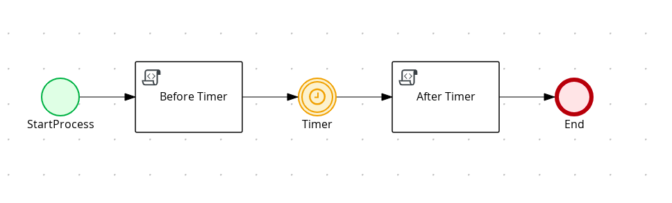</p>

* Intermediate timer Diagram Properties (top)
<p align="center">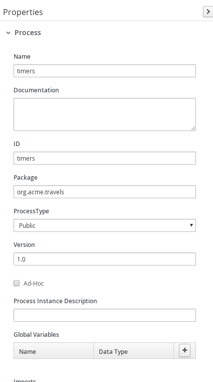</p>

* Intermediate timer Diagram Properties (bottom)
<p align="center">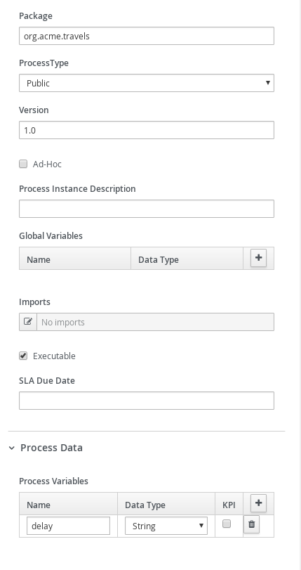</p>

* Intermediate timer Before Timer
<p align="center">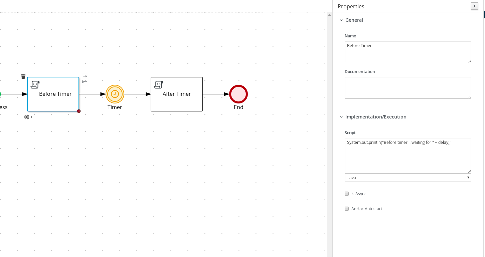</p>

* Intermediate timer Timer
<p align="center">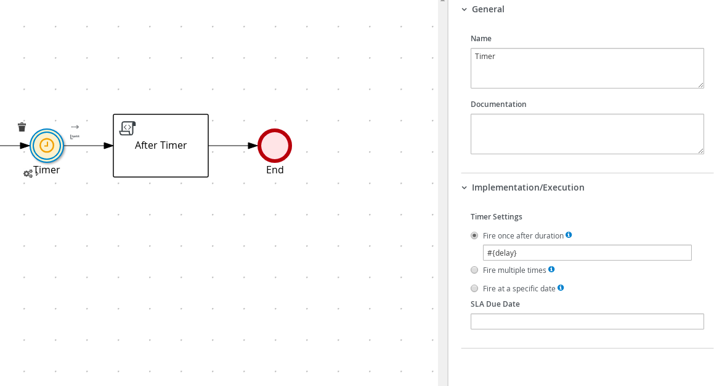</p>

* Intermediate timer After Timer
<p align="center">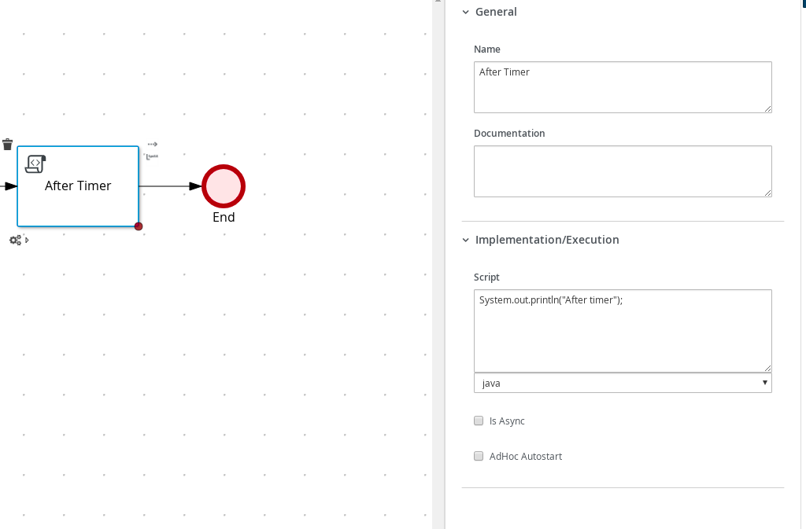</p>

* Boundary timer event (timer-on-task.bpmn)
<p align="center">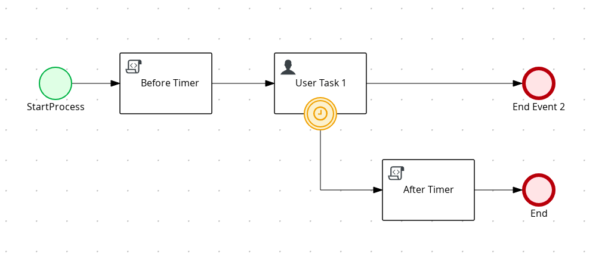</p>

* Boundary timer Diagram Properties  (top)
<p align="center">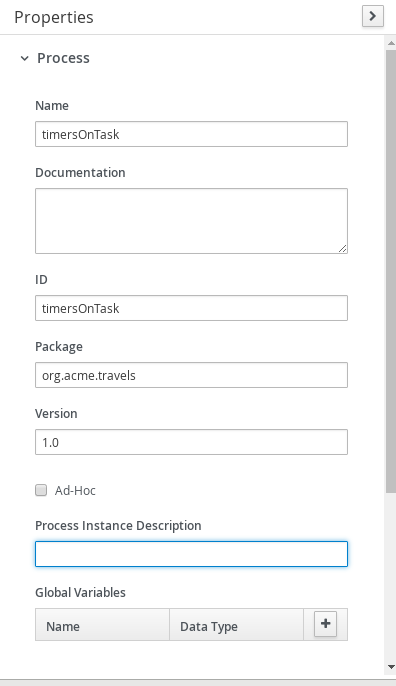</p>

* Boundary timer Diagram Properties (bottom)
<p align="center">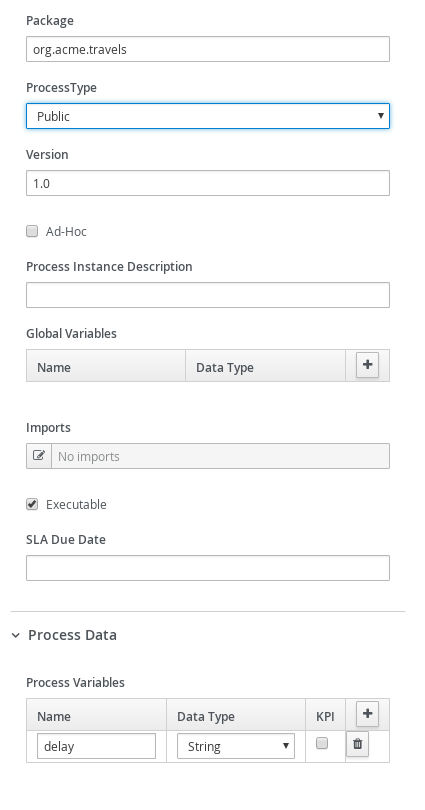</p>

* Boundary timer Before Timer
<p align="center">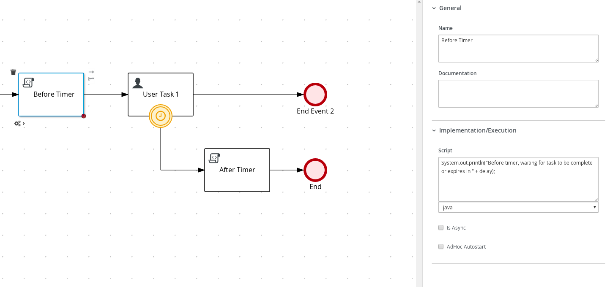</p>

* Boundary timer User Task (top)
<p align="center">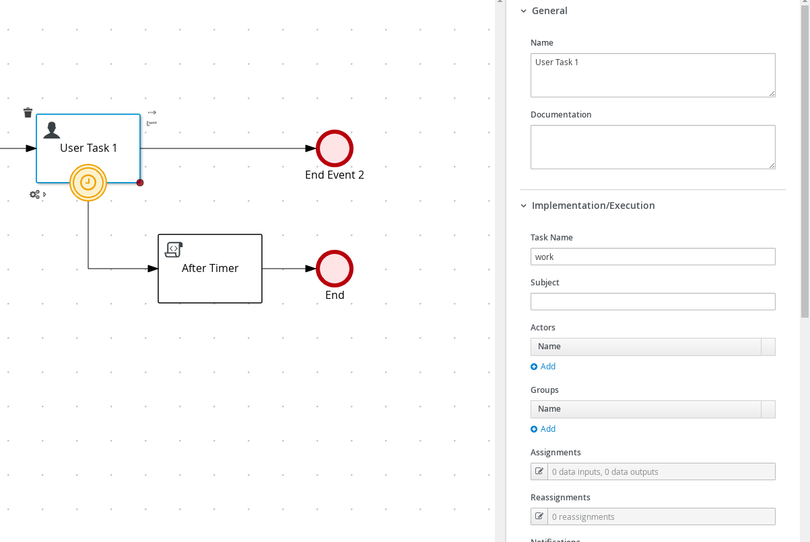</p>

* Boundary timer User Task (bottom)
<p align="center">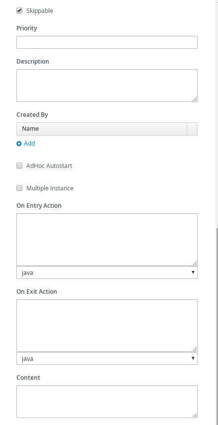</p>

* Boundary timer Timer
<p align="center">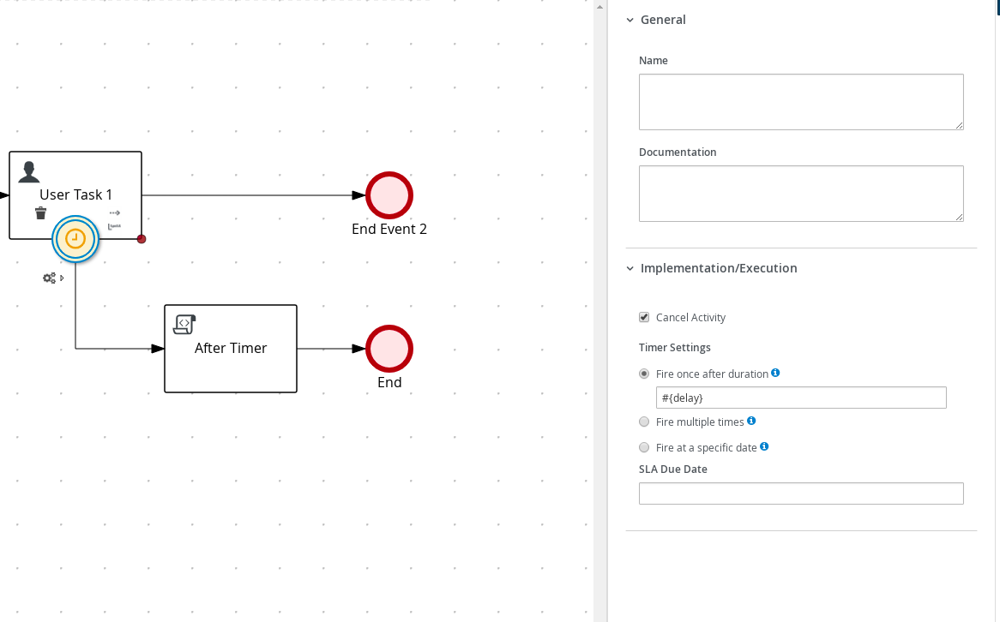</p>

* Boundary timer After Timer
<p align="center">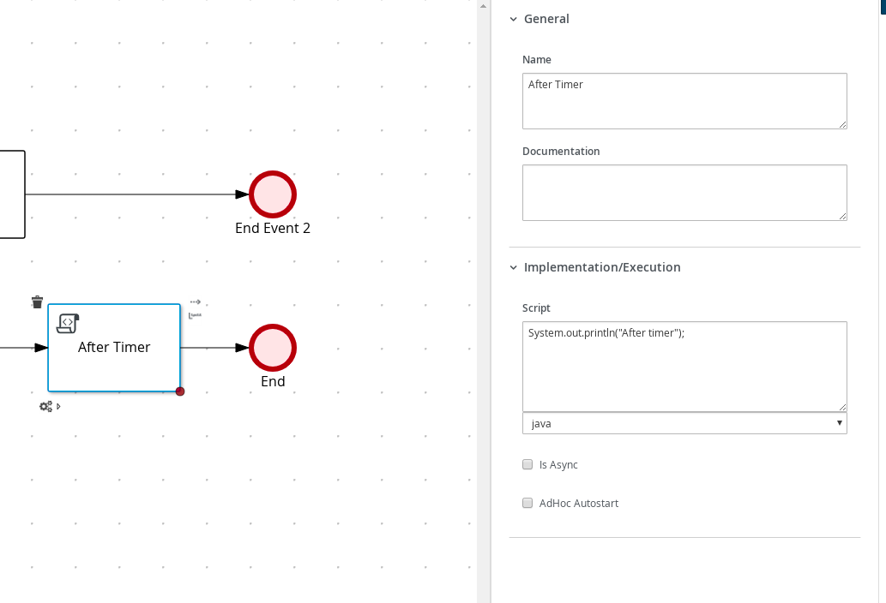</p>

* Cycle timer event (timerCycle.bpmn)
<p align="center">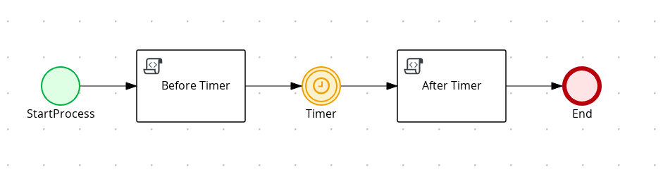</p>

* Cycle timer Diagram Properties (top)
<p align="center">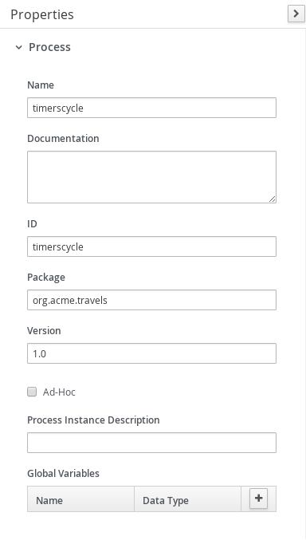</p>

* Cycle timer Diagram Properties (bottom)
<p align="center"></p>

* Cycle timer Before Timer
<p align="center">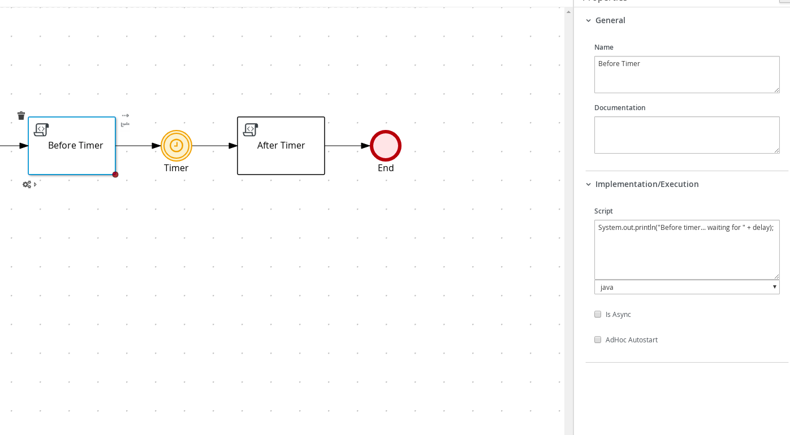</p>

* Cycle timer Timer
<p align="center">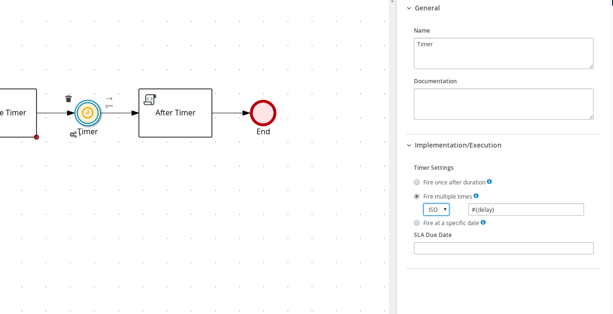</p>

* Cycle timer AfterTimer
<p align="center">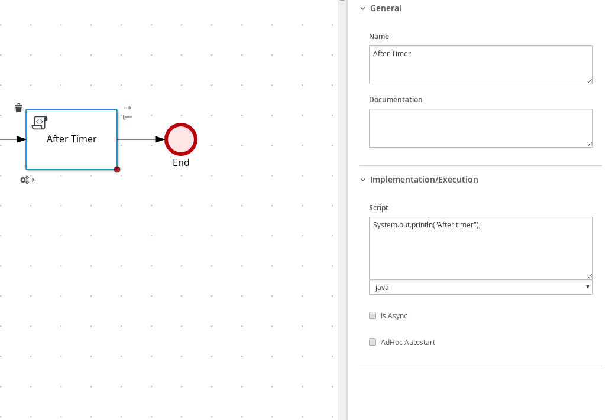</p>


Timer expression is expected to be given in ISO-8601 format e.g. PT30S - wait 30 seconds before expiring.
This needs to be given when starting process instance as delay attribute of type string.

## Build and run

### Prerequisites

You will need:
  - Java 11+ installed
  - Environment variable JAVA_HOME set accordingly
  - Maven 3.8.6+ installed

When using native image compilation, you will also need:
  - GraalVM 19.3+ installed
  - Environment variable GRAALVM_HOME set accordingly
  - GraalVM native image needs as well native-image extension: https://www.graalvm.org/reference-manual/native-image/
  - Note that GraalVM native image compilation typically requires other packages (glibc-devel, zlib-devel and gcc) to be installed too, please refer to GraalVM installation documentation for more details.

### Start Kogito Job Service

You need to download the job service and start it locally

You can download it from [Select Latest Version]
https://repo.maven.apache.org/maven2/org/kie/kogito/jobs-service/

```sh
java -Dquarkus.http.port=8085 -jar jobs-service-common/target/jobs-service-common-{version}-runner.jar
```

* After Starting Kogito Web Service you should see a similar Log as follows

<p align="center">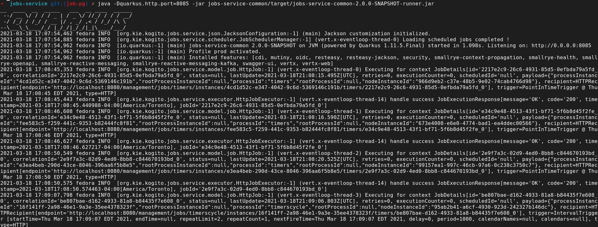</p>

In case you'd like to run the job service with enabled persistence then start
Infinispan server before and then run the job service with following command

Download Infinispan Server from
https://infinispan.org/download/

Start Infinispan Server
[Infinispan Directory]/bin/sh server.sh

```sh
java -Dquarkus.http.port=8085 -jar jobs-service-infinispan/target/jobs-service-infinispan-{version}-runner.jar
```

* After Starting Infinispan you should see a similar Log as follows

<p align="center">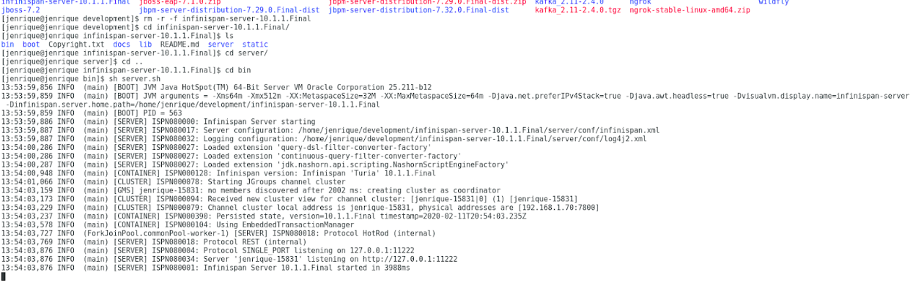</p>

If you'd like to use PostgresSQL or MongoDB as persistence, start the PostgreSQL or MongoDB server, then start job service with following command

For PostgreSQL:
```sh
java -Dquarkus.http.port=8085 -Dquarkus.datasource.username={username} -Dquarkus.datasource.password={password} -Dquarkus.datasource.reactive.url=postgresql://{host}:{port}/{db} -Dquarkus.datasource.jdbc.url=jdbc:postgresql://{host}:{port}/{db}  -jar jobs-service-postgresql/target/jobs-service-postgresql-{version}-runner.jar
```

For MongoDB:
```sh
java -Dquarkus.http.port=8085 -Dquarkus.mongodb.connection-string=mongodb://{username}:{password}@{host}:{port} -Dquarkus.mongodb.database={db} -jar jobs-service-mongodb/target/jobs-service-mongodb-{version}-runner.jar
```

In all cases replace `{version}` with actual Kogito version to be used (Job Service is available from 0.6.0)

After that you can redo the timer queries described above.

### Kogito Jobs Service configuration into the application

To be able to use Kogito Job Service as timer service , an additional dependency is needed into the `pom.xml` file:

```xml
<dependency>
  <groupId>org.kie</groupId>
  <artifactId>kogito-addons-quarkus-jobs-management</artifactId>
</dependency>
```

Then, to allow to use Job Service as timer service there is a need to specify some properties in the `src/main/application.properties` file:

```properties
kogito.jobs-service.url=http://localhost:8085
kogito.service.url=http://localhost:8080
```

First one is used to direct the Kogito runtime to let it know where is the Kogito Job Service - it needs to match the location of the Kogito Job Service when starting it - see below.  
Second one is used by Kogito Job Service to callback when the timer expires and needs to be pointing to the service host and port

### Compile and Run in Local Dev Mode

```sh
mvn clean compile quarkus:dev
```

NOTE: With dev mode of Quarkus you can take advantage of hot reload for business assets like processes, rules, decision tables and java code. No need to redeploy or restart your running application.

### Package and Run in JVM mode

```sh
mvn clean package
java -jar target/quarkus-app/quarkus-run.jar
```

or on windows

```sh
mvn clean package 
java -jar target\quarkus-app\quarkus-run.jar 
```

### Package and Run using Local Native Image
Note that this requires GRAALVM_HOME to point to a valid GraalVM installation

```sh
mvn clean package -Pnative
```

To run the generated native executable, generated in `target/`, execute

```
./target/process-timer-quarkus-runner
```

### OpenAPI (Swagger) documentation
[Specification at swagger.io](https://swagger.io/docs/specification/about/)

You can take a look at the [OpenAPI definition](http://localhost:8080/openapi?format=json) - automatically generated and included in this service - to determine all available operations exposed by this service. For easy readability you can visualize the OpenAPI definition file using a UI tool like for example available [Swagger UI](https://editor.swagger.io).

In addition, various clients to interact with this service can be easily generated using this OpenAPI definition.

When running in either Quarkus Development or Native mode, we also leverage the [Quarkus OpenAPI extension](https://quarkus.io/guides/openapi-swaggerui#use-swagger-ui-for-development) that exposes [Swagger UI](http://localhost:8080/swagger-ui/) that you can use to look at available REST endpoints and send test requests.


### Submit a request to start new timers process

To make use of this application it is as simple as putting a sending request to `http://localhost:8080/timers`  with following content

```json
{
    "delay" : "PT30S"
}

```

Complete curl command can be found below:

```sh
curl -X POST -H 'Content-Type:application/json' -H 'Accept:application/json' -d '{"delay" : "PT30S"}' http://localhost:8080/timers
```

### Show active timer instances

```sh
curl -H 'Content-Type:application/json' -H 'Accept:application/json' http://localhost:8080/timers
```

### Cancel timer instance

```sh
curl -X DELETE 'http://localhost:8080/timers/{uuid}'
```

where `{uuid}` is the id of the given timer instance


### Submit a request to start new timers cycle process

To make use of this application it is as simple as putting a sending request to `http://localhost:8080/timerscycle`  with following content

```sh
{
    "delay" : "R2/PT1S"
}

```

Complete curl command can be found below:

```sh
curl -X POST -H 'Content-Type:application/json' -H 'Accept:application/json' -d '{"delay" : "R2/PT1S"}' http://localhost:8080/timerscycle
```

### Show active timer instances

```sh
curl -H 'Content-Type:application/json' -H 'Accept:application/json' http://localhost:8080/timerscycle
```

### Cancel timer cycle instance

```sh
curl -X DELETE 'http://localhost:8080/timerscycle/{uuid}'
```

where `{uuid}` is the id of the given timer cycle instance


### Submit a request to start new boundary timers process

To make use of this application it is as simple as putting a sending request to `http://localhost:8080/timersOnTask`  with following content

```json
{
    "delay" : "PT30S"
}

```

Complete curl command can be found below:

```sh
curl -X POST -H 'Content-Type:application/json' -H 'Accept:application/json' -d '{"delay" : "PT30S"}' http://localhost:8080/timersOnTask
```

### Show active boundary timer instances

```sh
curl -H 'Content-Type:application/json' -H 'Accept:application/json' http://localhost:8080/timersOnTask
```

### Cancel boundary timer instance

```sh
curl -X DELETE 'http://localhost:8080/timersOnTask/{uuid}'
```

where `{uuid}` is the id of the given timer instance

After executing the above commands you should see a log similar to

* Quarkus Log

```
Before timer... waiting for  PT30S
After Timer
Before timer, waiting for task to be complete or expires in PT30S
After Timer
Before timer... waiting for  R2/PT1S
After Timer
After Timer
```
