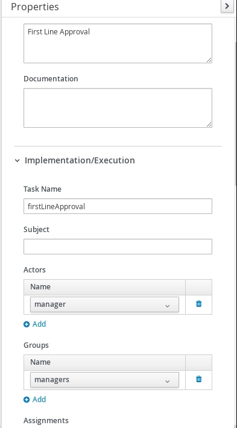
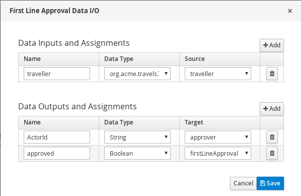
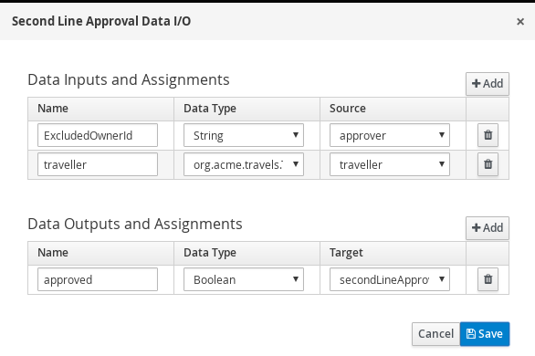

# Process user task orchestration with custom life cycle

## Description

A quickstart project shows very typical user task orchestration. It comes with two tasks assigned
to human actors via groups assignments - `managers`. So essentially anyone who is a member of that
group can act on the tasks. Though this example applies four eye principle which essentially means
that user who approved first task cannot approve second one. So there must be always at least two
distinct manager involved.

This example shows

* working with user tasks
* four eye principle with user tasks

* In addition this quickstart also shows how to use custom life cycle for user tasks that uses custom life cycle phases compared to those supported by default.

- Start
- Complete - extended the default one that allows only to complete started tasks

<p align="center"></p>

Diagram Properties (top)
<p align="center"></p>

* Diagram Properties (bottom)
<p align="center"></p>

* First Line Approval (top)
<p align="center"></p>

* First Line Approval (bottom)
<p align="center"></p>

* First Line Approval (Assignments)
<p align="center"></p>

* Second Line Approval
<p align="center"></p>

* Second Line Approval (Assignments)
<p align="center"></p>

To learn more about custom lifecycle, look at the following classes:

- `org.acme.travels.config.CustomWorkItemHandlerConfig` - responsible for registering work item handler to deal with user tasks
- `org.acme.travels.usertasks.CustomHumanTaskLifeCycle` - defines actual the life cycle for user tasks
- `org.acme.travels.usertasks.Start` - new life cycle phase
- `org.acme.travels.usertasks.CompleteStartedOnly` - extended Complete life cycle phase to allow only started tasks and reuse all other logic


## Build and run

### Prerequisites

You will need:
  - Java 17+ installed
  - Environment variable JAVA_HOME set accordingly
  - Maven 3.9.6+ installed

When using native image compilation, you will also need:
  - GraalVM 19.3+ installed
  - Environment variable GRAALVM_HOME set accordingly
  - GraalVM native image needs as well native-image extension: https://www.graalvm.org/reference-manual/native-image/
  - Note that GraalVM native image compilation typically requires other packages (glibc-devel, zlib-devel and gcc) to be installed too, please refer to GraalVM installation documentation for more details.
    https://www.graalvm.org/reference-manual/native-image/

### Compile and Run in Local Dev Mode

```sh
mvn clean compile quarkus:dev
```

NOTE: With dev mode of Quarkus you can take advantage of hot reload for business assets like processes, rules, decision tables and java code. No need to redeploy or restart your running application.

### Package and Run in JVM mode

```sh
mvn clean package
java -jar target/quarkus-app/quarkus-run.jar
```

or on windows

```sh
mvn clean package
java -jar target\quarkus-app\quarkus-run.jar
```

### Package and Run using Local Native Image
Note that the following configuration property needs to be added to `application.properties` in order to enable automatic registration of `META-INF/services` entries required by the workflow engine:
```
quarkus.native.auto-service-loader-registration=true
```

Note that this requires GRAALVM_HOME to point to a valid GraalVM installation

```sh
mvn clean package -Pnative
```

To run the generated native executable, generated in `target/`, execute

```sh
./target/process-usertasks-quarkus-runner
```
### Running with deadlines enabled

Kogito supports sending notifications when a task has been idle for a while, according to the information included in the process, in "NotStartedNotify" and "NotCompletedNotify" task input parameters

In this example we are going to use Kafka to publish these deadlines notifications to a certain topic and Kogito mail addon to subscribe a listener to that topic, so an e-mail will be sent if 30 seconds has passed after
the task was created (but not transition was performed) or every minute till the task  is not completed.  
 
You  need to link incoming (`kogito-deadline-events`) and outgoing (`kogito-deadline-consumer`) channels to a kafka topic and also define certain required propeties for using kafka and proper deserialization. 

This is done in application.properties, below we are telling Kogito to use topic `kogito-deadline-events`

```
mp.messaging.outgoing.kogito-deadline-events.connector=smallrye-kafka
mp.messaging.outgoing.kogito-deadline-events.topic=kogito-deadline-events
mp.messaging.outgoing.kogito-deadline-events.value.serializer=io.quarkus.kafka.client.serialization.ObjectMapperSerializer


mp.messaging.incoming.kogito-deadline-consumer.connector=smallrye-kafka
mp.messaging.incoming.kogito-deadline-consumer.topic=kogito-deadline-events
mp.messaging.incoming.kogito-deadline-consumer.value.deserializer=org.kie.kogito.mail.DeadlineEventDeserializer
```

Finally, to send the mail you need to set up these properties with proper values. Refer to [Quakus mailer configuration](https://quarkus.io/guides/mailer#configuring-the-mailer)
 
 ```
quarkus.mailer.host=smtp.gmail.com
quarkus.mailer.port=587
quarkus.mailer.username=
quarkus.mailer.password=
quarkus.mailer.ssl=true
```
You need to have Kafka cluster installed and available over the network. Refer to [Kafka Apache site](https://kafka.apache.org/quickstart) to more information about how to install.

Once Kafka is up and running you can build this project with `-Pnotification` to enable additional required dependencies during the build. 

### OpenAPI (Swagger) documentation
[Specification at swagger.io](https://swagger.io/docs/specification/about/)

You can take a look at the [OpenAPI definition](http://localhost:8080/openapi?format=json) - automatically generated and included in this service - to determine all available operations exposed by this service. For easy readability you can visualize the OpenAPI definition file using a UI tool like for example available [Swagger UI](https://editor.swagger.io).

In addition, various clients to interact with this service can be easily generated using this OpenAPI definition.

When running in either Quarkus Development or Native mode, we also leverage the [Quarkus OpenAPI extension](https://quarkus.io/guides/openapi-swaggerui#use-swagger-ui-for-development) that exposes [Swagger UI](http://localhost:8080/swagger-ui/) that you can use to look at available REST endpoints and send test requests.

### Submit a request to start new approval

To make use of this application it is as simple as putting a sending request to `http://localhost:8080/approvals`  with following content

```json
{
    "traveller" : {
        "firstName" : "John",
        "lastName" : "Doe",
        "email" : "jon.doe@example.com",
        "nationality" : "American",
        "address" : {
          	"street" : "main street",
          	"city" : "Boston",
          	"zipCode" : "10005",
          	"country" : "US"
      	}
    }
}

```

Complete curl command can be found below:

```sh
curl -X POST -H 'Content-Type:application/json' -H 'Accept:application/json' -d '{"traveller" : { "firstName" : "John", "lastName" : "Doe", "email" : "jon.doe@example.com", "nationality" : "American","address" : { "street" : "main street", "city" : "Boston", "zipCode" : "10005", "country" : "US" }}}' http://localhost:8080/approvals
```

### Show active approvals

```sh
curl -H 'Content-Type:application/json' -H 'Accept:application/json' http://localhost:8080/approvals
```

### Show tasks

```sh
curl -H 'Content-Type:application/json' -H 'Accept:application/json' 'http://localhost:8080/approvals/{uuid}/tasks?user=admin&group=managers'
```

where `{uuid}` is the id of the given approval instance


### Start first line approval task

```sh
curl -X POST -d '{"approved" : true}' -H 'Content-Type:application/json' -H 'Accept:application/json' 'http://localhost:8080/approvals/{uuid}/Task/{tuuid}?phase=start&user=admin&group=managers'
```

where `{uuid}` is the id of the given approval instance and `{tuuid}` is the id of the task instance


### Complete first line approval task

```sh
curl -X POST -d '{"approved" : true}' -H 'Content-Type:application/json' -H 'Accept:application/json' 'http://localhost:8080/approvals/{uuid}/Task/{tuuid}?user=admin&group=managers'
```

where `{uuid}` is the id of the given approval instance and `{tuuid}` is the id of the task instance

### Show tasks

```sh
curl -H 'Content-Type:application/json' -H 'Accept:application/json' 'http://localhost:8080/approvals/{uuid}/tasks?user=admin&group=managers'
```

where `{uuid}` is the id of the given approval instance

This should return empty response as the admin user was the first approver and by that can't be assigned to another one.

Repeating the request with another user will return task

```sh
curl -H 'Content-Type:application/json' -H 'Accept:application/json' 'http://localhost:8080/approvals/{uuid}/tasks?user=john&group=managers'
```

### Start second line approval task

```sh
curl -X POST -d '{"approved" : true}' -H 'Content-Type:application/json' -H 'Accept:application/json' 'http://localhost:8080/approvals/{uuid}/Task/{tuuid}?phase=start&user=john&group=managers'

```

where `{uuid}` is the id of the given approval instance and `{tuuid}` is the id of the task instance (careful - it is different one for different user)


### Complete second line approval task

```sh
curl -X POST -d '{"approved" : true}' -H 'Content-Type:application/json' -H 'Accept:application/json' 'http://localhost:8080/approvals/{uuid}/Task/{tuuid}?user=john&group=managers'
```

where `{uuid}` is the id of the given approval instance and `{tuuid}` is the id of the task instance

This completes the approval and returns approvals model where both approvals of first and second line can be found,
plus the approver who made the first one.

```json
{
	"approver":"admin",
	"firstLineApproval":true,
	"id":"2eeafa82-d631-4554-8d8e-46614cbe3bdf",
	"secondLineApproval":true,
	"traveller":{
		"address":{
			"city":"Boston",
			"country":"US",
			"street":"main street",
			"zipCode":"10005"},
		"email":"jon.doe@example.com",
		"firstName":"John",
		"lastName":"Doe",
		"nationality":"American"
	}
}
```

You should see a similar message after performing the second line approval after the curl command

```json
{"id":"f498de73-e02d-4829-905e-2f768479a4f1", "approver":"admin","firstLineApproval":true, "secondLineApproval":true,"traveller":{"firstName":"John","lastName":"Doe","email":"jon.doe@example.com","nationality":"American","address":{"street":"main street","city":"Boston","zipCode":"10005","country":"US"}}}
```
