# Process user task orchestration: Hiring

## Description

This Quickstart showcases a basic implementation of the **Hiring** process. 

This quickstart project shows very typical user task orchestration, is based on a simple Hiring process 
that drives a *Candidate* through different interviews until it gets hired.

> **_NOTE:_** This example uses keycloak authentication to enable security only in the consoles and not in runtime.
### The Candidate data model

The *Hiring* example uses a *Candidate* POJO to represent the person that wants to get the job. You can find it in the *org.kie.kogito.hr* package.

```java
public class Candidate {

    private String name; // Name of the candidate
    private String email; // Email of the candidate
    private Integer salary; // Expected salary
    private String skills; // List of technical skills

    public Candidate(String name, String email, Integer salary, String skills) {
        this.name = name;
        this.email = email;
        this.salary = salary;
        this.skills = skills;
    }
    
    // Setters & getters...
}
```

### The Business Logic

The example process consists in two human tasks that will drive the candidate trough two interview with *HR* and *IT* departments represented by the *HR Interview* & *IT interview* User Tasks.

<p align="center">
    
</p>

#### Process data

<p align="center"></p>

The process handles three _Process Variables_:

* *candidate*: represents the candidate person that wants to get the job. It is an instance of *org.kie.kogito.hiring.Candidate*.
* *hr_approval*: a boolean that determines that HR department approves the hiring.
* *it_approval*: a boolean that determines that IT department approves the hiring.

### The Hiring process

Once it starts, the process will move into the *HR Interview task*, this task represents an interview with someone from the company HR department.

The task will get the *candidate* as an input assignment and as an output it will generate an *approval* boolean that represents assesment of hiring or not hiring the *candidate*. It will be stored on the *hr_approval* process variable

<p align="center">
    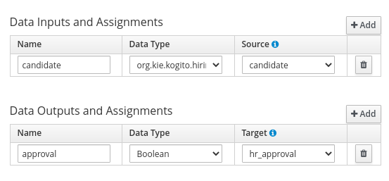
    <br/><i>HR Interview assignments</i>
</p>

After completing the *HR Interview* the candidate moves to the *IT Interview* task with the company IT department. Ashe task will get the *candidate* as an input assignment and as an output it will generate an *approval* boolean that represents assesment of hiring or not hiring the *candidate*.

<p align="center">
    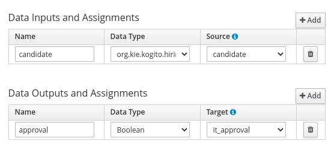
    <br/><i>IT Interview assignments</i>
</p>


The required *Kogito and Infrastructure Services* for this example are:

- Infinispan / Postgresql
- Kafka
- Kogito Data Index
- Kogito Management Console
- Kogito Task Console
- Keycloak server

## Running the Quickstart

### Prerequisites

* Java 11+ installed
* Environment variable JAVA_HOME set accordingly
* Maven 3.8.1+ installed
* Docker and Docker Compose to run the required example infrastructure.

And when using native image compilation, you will also need: 
  - GraalVM 20.3+ installed
  - Environment variable GRAALVM_HOME set accordingly
  - GraalVM native image needs as well native-image extension: https://www.graalvm.org/reference-manual/native-image/
  - Note that GraalVM native image compilation typically requires other packages (glibc-devel, zlib-devel and gcc) to be installed too, please refer to GraalVM installation documentation for more details.

### Starting the Kogito and Infrastructure Services

This quickstart provides a docker compose template that starts all the required services. This setup ensures that all services are connected with a default configuration.

<p align="center">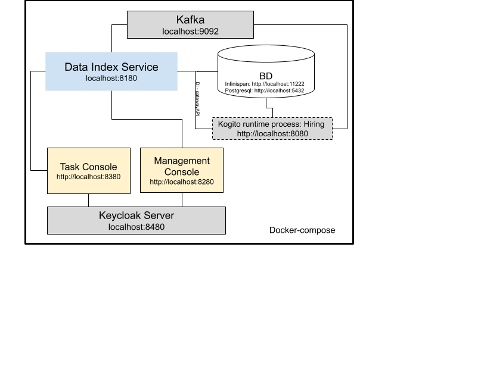</p>

### Run Example with PostgreSQL

#### Compile Hiring example with profile postgresql

First thing is to compile the example with the postgresql profile executing:

For Linux and MacOS:

- Open a Terminal
- Go to the example folder and run
```sh
mvn clean install -Ppostgresql
```

#### Start infrastructure services

You should start all the services before you execute any of the **Hiring** example, to do that please execute:

For Linux and MacOS:

1. Open a Terminal
2. Go to docker-compose folder
3. Run the ```startServices.sh``` script

```bash
sh ./startServices.sh
```

or

```bash
sh ./startServices.sh postgresql
```

Once all services bootstrap, the following ports will be assigned on your local machine:

- PostgreSQL: 5432
- Kafka: 9092
- Data Index: 8180
- Management Console: 8280
- Task Console: 8380
- Keycloak: 8480
- PgAdmin: 8055

> **_NOTE:_**  This step requires the project to be compiled, please consider running a ```mvn clean install``` command on the project root before running the ```startServices.sh``` script for the first time or any time you modify the project.

Once started you can simply stop all services by executing the ```docker-compose -f docker-compose-postgresql.yml stop```.

All created containers can be removed by executing the ```docker-compose -f docker-compose-postgresql.yml rm```.

#### Run the Hiring example with PostgreSQL

##### Compile and Run Hiring example process in Local Dev Mode

Once all the infrastructure services are ready, you can start the Hiring example by doing:

- Open a Terminal
- Go to the hiring example folder
- Start the example with the command

```bash
mvn clean package quarkus:dev -Ppostgresql
```

NOTE: With dev mode of Quarkus you can take advantage of hot reload for business assets like processes, rules, decision tables and java code. No need to redeploy or restart your running application.

##### Package and Run in JVM mode

```sh
mvn clean package -Ppostgresql
java -jar target/quarkus-app/quarkus-run.jar
```

or on windows

```sh
mvn clean package -Ppostgresql
java -jar target\quarkus-app\quarkus-run.jar
```

##### Package and Run using Local Native Image
Note that this requires GRAALVM_HOME to point to a valid GraalVM installation

```sh
mvn clean package -Pnative -Ppostgresql
```

To run the generated native executable, generated in `target/`, execute

```sh
./target/./target/process-usertasks-quarkus-with-console-runner
```

### Run Example with Infinispan

#### Compile Hiring example with profile infinispan

First thing is to compile the example with the infinispan profile executing:

For Linux and MacOS:

1. Open a Terminal
2. Go to the example folder and run
```sh
mvn clean install -Pinfinispan
```
#### Start infrastructure services

You should start all the services before you execute any of the **Hiring** example, to do that please execute:

For Linux and MacOS:

1. Open a Terminal
2. Go to docker-compose folder
3. Run the ```startServices.sh``` script with infinispan argument

```bash
sh ./startServices.sh infinispan
```

Once all services bootstrap, the following ports will be assigned on your local machine:

- Infinispan: 11222
- Kafka: 9092
- Data Index: 8180
- Management Console: 8280
- Task Console: 8380
- Keycloak: 8480

> **_NOTE:_**  This step requires the project to be compiled, please consider running a ```mvn clean install -Pinfinispan``` command on the project root before running the ```startServices.sh infinispan``` script for the first time or any time you modify the project.

Once started you can simply stop all services by executing the ```docker-compose -f docker-compose-infinispan.yml stop```.

All created containers can be removed by executing the ```docker-compose -f docker-compose-infinispan.yml rm```.

#### Run the Hiring example with Infinispan

##### Compile and Run Hiring example process in Local Dev Mode

Once all the infrastructure services are ready, you can start the Hiring example by doing:

- Open a Terminal
- Go to the hiring example folder
- Start the example with the command

```bash
mvn clean package quarkus:dev -Pinfinispan
```

NOTE: With dev mode of Quarkus you can take advantage of hot reload for business assets like processes, rules, decision tables and java code. No need to redeploy or restart your running application.

##### Package and Run in JVM mode

```sh
mvn clean package -Pinfinispan
java -jar target/quarkus-app/quarkus-run.jar
```

or on windows

```sh
mvn clean package -Pinfinispan
java -jar target\quarkus-app\quarkus-run.jar
```

##### Package and Run using Local Native Image
Note that this requires GRAALVM_HOME to point to a valid GraalVM installation

```sh
mvn clean package -Pnative -Pinfinispan
```

To run the generated native executable, generated in `target/`, execute

```sh
./target/./target/process-usertasks-quarkus-with-console-runner
```

### Using Keycloak as Authentication Server

In this Quickstart we'll be using [Keycloak](https://www.keycloak.org/) as *Authentication Server*. It will be started as a part of the project *Infrastructure Services*, you can check the configuration on the project [docker-compose.yml](docker-compose/docker-compose.yml) in [docker-compose](docker-compose) folder.

It will install the *Kogito Realm* that comes with a predefined set of users:
| Login         | Password   | Roles               |
| ------------- | ---------- | ------------------- |
|    admin      |   admin    | *admin*, *managers* |
|    alice      |   alice    | *user*              |
|    jdoe       |   jdoe     | *managers*          |

Once Keycloak is started, you should be able to access your *Keycloak Server* at [localhost:8480/auth](http://localhost:8480/auth) with *admin* user.

### Submit a request to start new hiring

Once the service is up and running you can make use of the **Hiring** application by a sending request to `http://localhost:8080/hiring`  with following content:
```json
{   
    "candidate": {
        "name": "Jon Snow",
        "email": "jsnow@example.com",
        "salary": 30000,
        "skills": "Java, Kogito"
    }
}
```

In a Terminal you can execute this command to start a **Hiring** process for the "Jon Snow" candidate:
```bash
curl -H "Content-Type: application/json" -H "Accept: application/json" -X POST http://localhost:8080/hiring -d @- << EOF
{   
    "candidate": {
        "name": "Jon Snow",
        "email": "jsnow@example.com",
        "salary": 30000,
        "skills": "Java, Kogito"
    }
}
EOF
```

### Show active Hiring process instance at Kogito Management Console

To access the Kogito Management Console just open your browser and navigate to ``http://localhost:8280``. You'll be redirected to the *Keycloak* log in page.

<p align="center">
    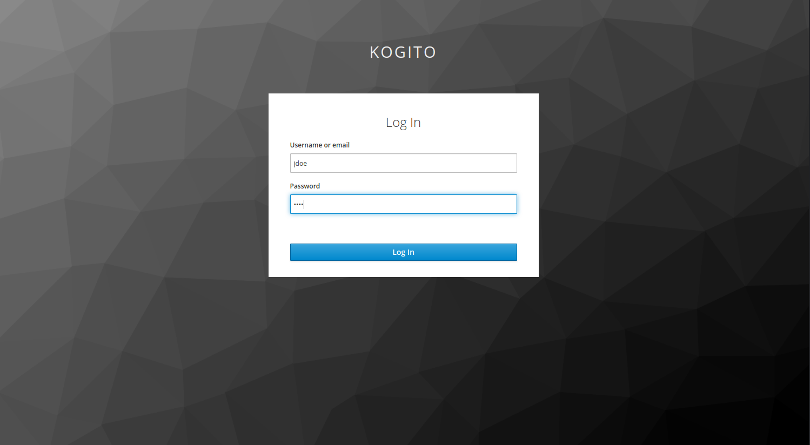
</p>

Once there, log in using any of the users specified in the [Using Keycloak as Authentication Server](#using-keycloak-as-authentication-server)

<p align="center">
    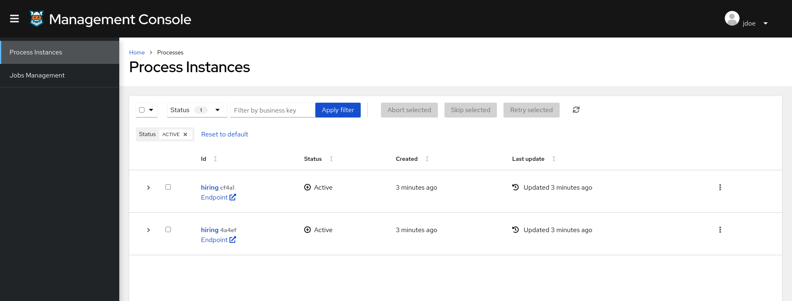
</p>

> **_NOTE:_**  For more information about how to work with Kogito Management Console, please refer to the [Kogito Documentation](https://docs.jboss.org/kogito/release/latest/html_single/#con-management-console_kogito-developing-process-services) page.

Check the process instance details to see where is the execution path 

<p align="center">
    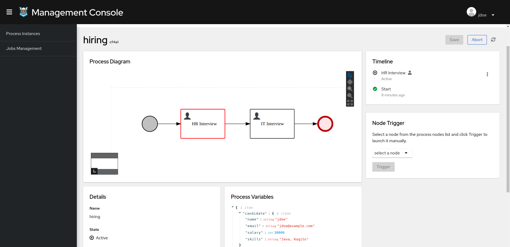
</p>

### Execute HR Interview task at Kogito Task Console

To access the Kogito Task Console just open your browser and navigate to ``http://localhost:8380``. You'll be redirected to the *Keycloak* log in page.

<p align="center">
    
</p>

Once there, log in with an *managers* user (for example *jdoe*) and you should be redirected to the user **Task Inbox**:

<p align="center">
    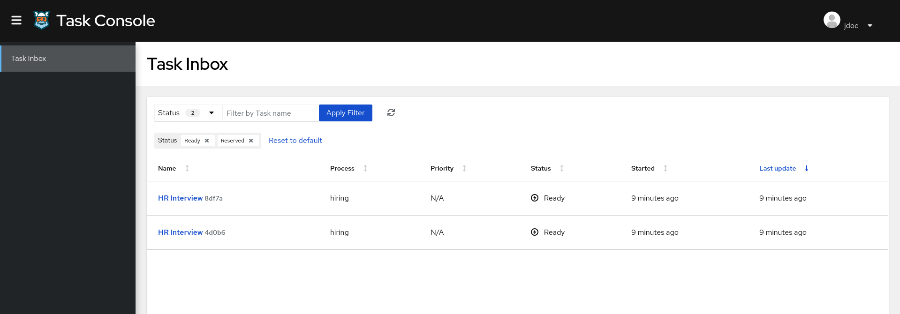
</p>

> **_NOTE:_**  For more information about how to work with Kogito Task Console, please refer to the [Kogito Documentation](https://docs.jboss.org/kogito/release/latest/html_single/#con-task-console_kogito-developing-process-services) page.

Access to HR Interview task and complete
  
<p align="center">
    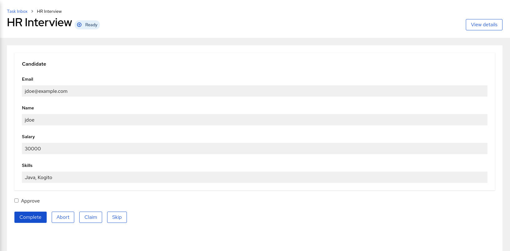
</p>

Check the process instance details at Kogito Management Console to see the execution path reflects the completed task

<p align="center">
    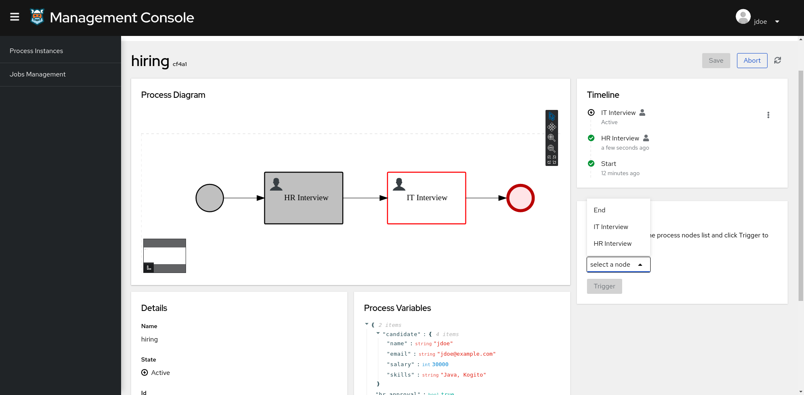
</p>


### Execute IT Interview task

Access to Task Console again and verify IT Interview is available  
<p align="center">
    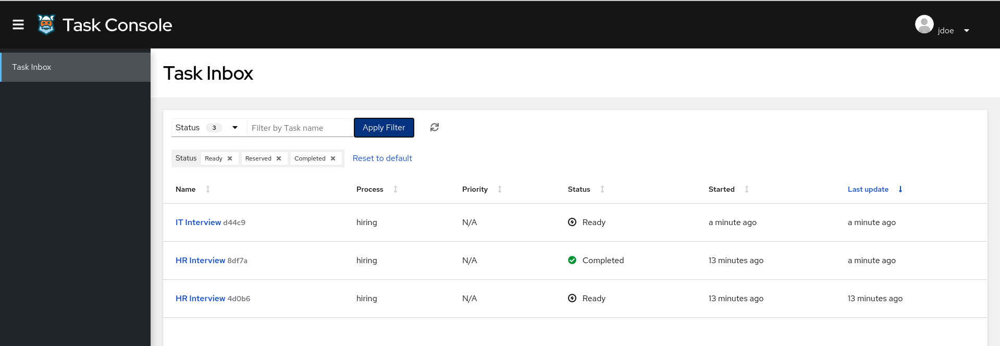
</p>

Access to IT Interview task  
<p align="center">
    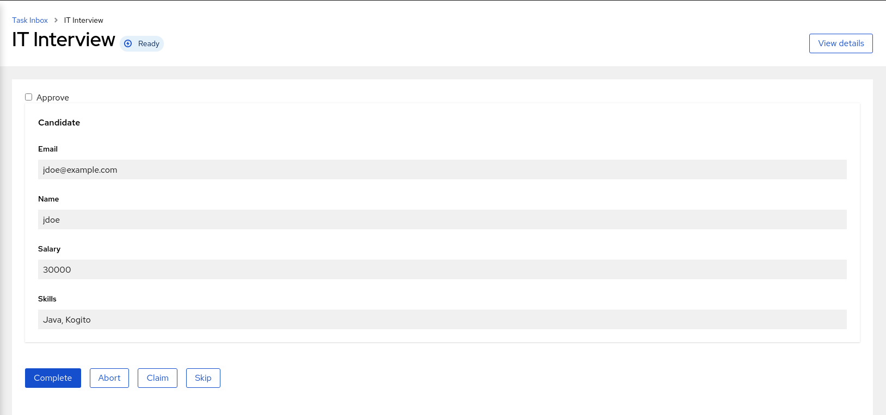
</p>

And after complete the task, check the list of tasks show both completed tasks  
<p align="center">
    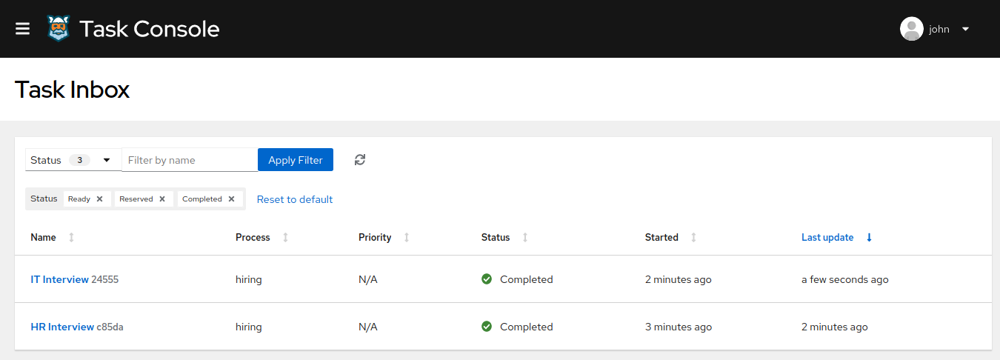
</p>

Check the process instance details to verify the instance have been completed 

<p align="center">
    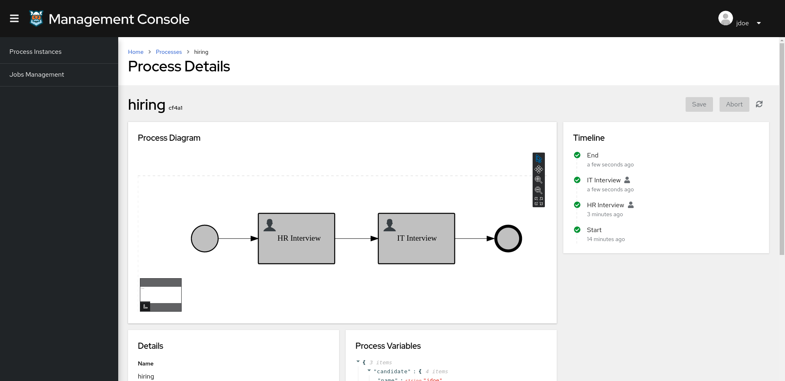
</p>
