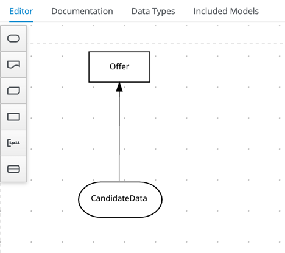
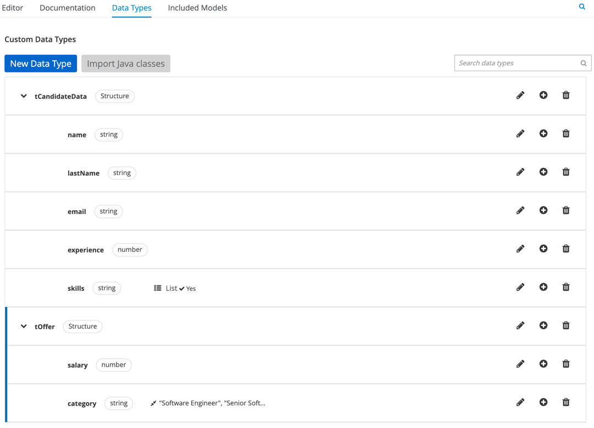
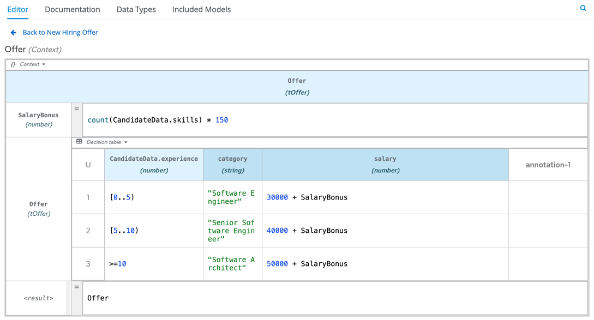
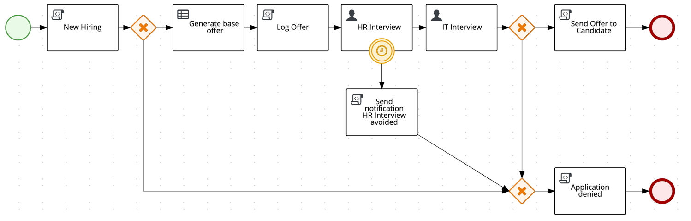
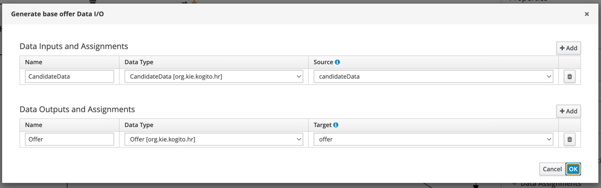
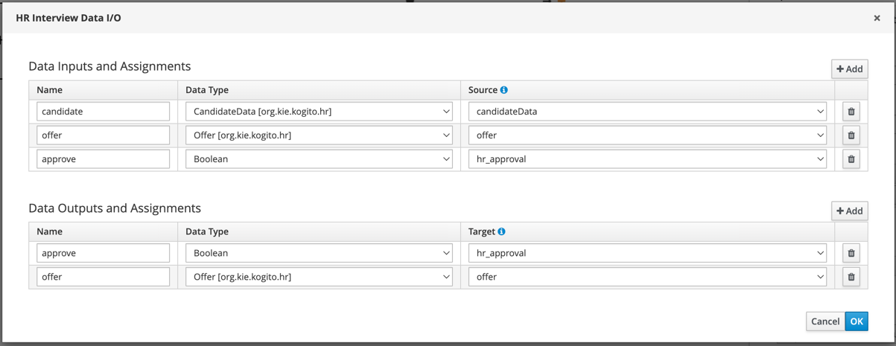
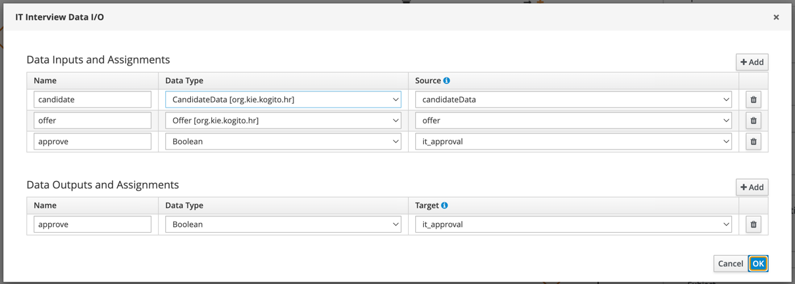
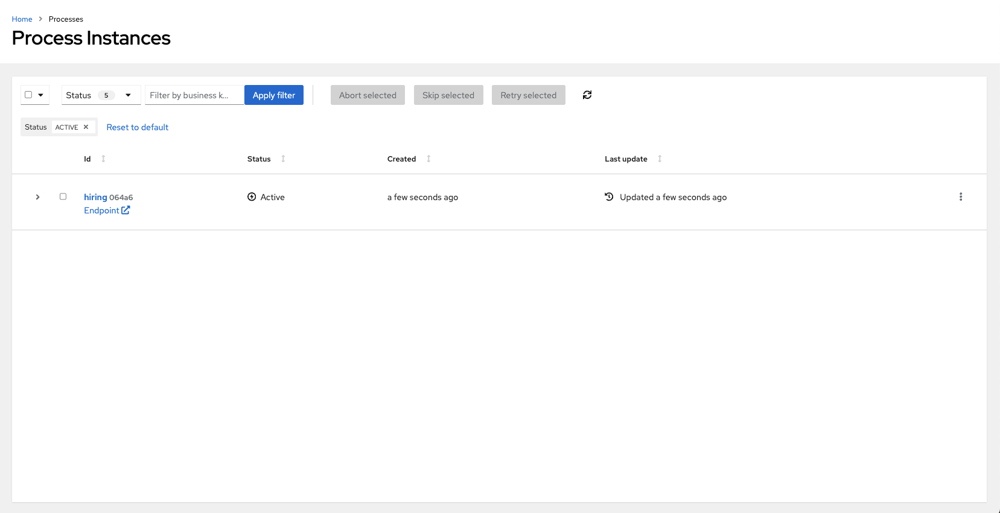
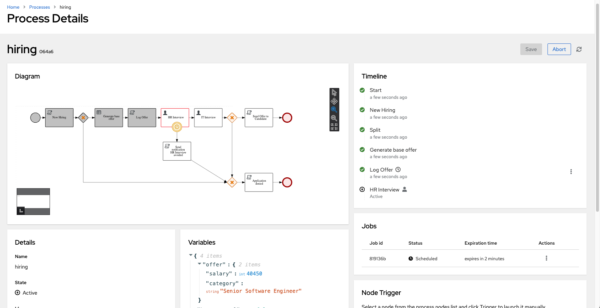
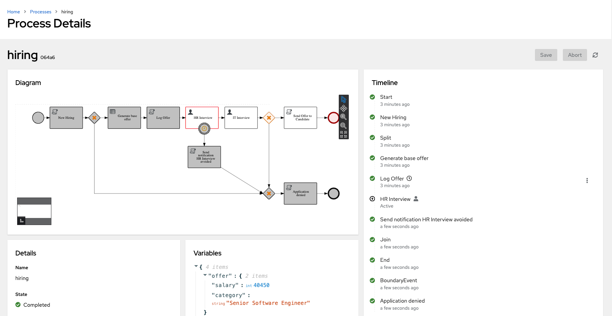

# Process user tasks with timer with persistence addon : Hiring

## Description

This example showcases a basic implementation of the **Hiring** process that drives a *Candidate* through different 
interviews until he gets hired.

This quickstart project shows a simple example user task orchestration including the use of DMN decisions to
generate the candidate offer and timers to skip Human tasks.

This example also demonstrates how to configure the whole *Kogito* environment using the new *Simplified Architecture* that
enable simplifying the communication among *Kogito* services removing the need of events (Kafka/HTTP) between them. This can 
be achieved using the following *Quarkus* addons:
- `kogito-addons-quarkus-data-index-persistence-postgresql`: enables the *Kogito Runtime* persisting directly into the 
*Data-Index* database.
- `kogito-addons-quarkus-jobs`: enables collocating the *Jobs Service* inside the *Kogito Runtime*.

## The Java models

The **Hiring** process uses two POJOs to handle the process data, both of them can be found in the *org.kie.kogito.hr* package.

The `CandidateData` POJO is the input of the process. It represents the person that wants to get the job.

```java
public class CandidateData {

    private String name; // Name of the candidate
    private String lastName; // Last name of the candidate
    private String email; // Email of the candidate 
    private Integer experience; // Years of experience
    private List<String> skills; // List of technical skills

    // Constructors, setters, getters...
}
```

The `Offer` POJO is the output of the process and represents the job offer that will be sent to the candidate. 
It will be automatically calculated during the process execution depending on the candidate years of experience & skills.
```java
public class Offer {

    private String category; // Job category based on the candidate experience
    private Integer salary; // Salary based on the candidate experience and skills

    // Constructors, setters, getters...
}
```
## The *New Hiring Offer* DMN
This example makes use of the *New Hiring Offer* DMN to generate a base offer for the `Candidate`. The DMN looks like this:

In this simple DMN we have an `Offer` *Decision*, that will generate the candidate offer, which
has a requirement of a `CandidateData` *Input Data*.

<p style="text-align:center">
    
</p>

The DMN defines the following data types (`tCandidateData` & `tOffer` ) matching the POJOs defined in the project 
(`CandidateData.java` & `Offer.java`):
<p style="text-align:center">
    
</p>

As expected, `CandidateData` *Input Data* & `Offer` *Decision* have a `tCandidateData` data

The `Offer` decision uses the following *Boxed Expression* to generate the `tOffer`:
<p style="text-align:center">
    
</p>

## The Hiring Process
### Process variables

The process handles the following _Variables_:

| Variable           | Type                              | Tags         | Description                                       |
|--------------------|-----------------------------------|--------------|---------------------------------------------------|
| **candidateData**  | `org.kie.kogito.hr.CandidateData` | **input**    | The candidate data                                |
| **offer**          | `org.kie.kogito.hr.Offer`         | **output**   | The generated candidate offer                     |
| **hr_approval**    | `Boolean`                         | **internal** | Determines that HR department approves the hiring |
| **it_approval**    | `Boolean`                         | **internal** | Determines that IT department approves the hiring |

### The BPMN Process

<p style="text-align:center">
    
</p>

The process starts receiving the `CandidateData` as an input and storing it into the `candidateData` variable, and if the 
candidate meets two minimal requirements, the process will continue and reach the **Generate base offer**, otherwise the 
candidate application will be denied and the process will complete without sending the `offer` to the candidate.

The **Generate base offer** is a *Business Rule Task* that will use the *New Hiring Offer* decision defined in the 
`NewHiringOffer.dmn` to generate the an `Offer` based on the candidate experience and skills. The task takes the `candidateData`
as an input and will produce an instance of `org.kie.kogito.hr.Offer` that will be stored in the `offer` variable.

<p style="text-align:center">
    
</p>

After the `offer` has been generated, the process will jump into the **HR Interview** *Human Task*, where the candidate we'll 
be interviewed by the *HR* department. The task takes the `candidateData` and `offer` as inputs and as an output will produce
the `hr_approve` boolean and an updated `offer`.

<p style="text-align:center">
    
</p>

The **HR Interview** *Human Task* also has a *Boundary Timer Event* that will prevent the task to delay and will cancel the
task after certain time (for example purpose just 3 minutes). This *Boundary Timer Event* will schedule a Job in the Jobs Service 
that when trigger will notify the *Kogito Runtime* to cancel the task and  deny the application.

If **HR Interview** successfully completed, the process will jump into the **IT Interview** *Human Task*. Again the candidate 
we'll have a second interview with the *IT* department. Again, this task will take the `candidateData` and `offer` as inputs 
but as an output will produce the `it_approve` boolean.

<p style="text-align:center">
    
</p>

Once both tasks are completed, if the candidate got the approvals from *HR* & *IT*  (both `hr_interview` & `hr_interview` being true)
the process will jump into the **Send Offer to Candidate** *Script Task* that will notify the candidate about the offer 
and the process will end.

> **NOTE:** for simplicity, all the *Human Tasks* in this example are assigned to the *jdoe* user present in the keycloak configuration

## Running the example
### Prerequisites

* Java 17+ installed
* Environment variable JAVA_HOME set accordingly
* Maven 3.9.3+ installed
* Docker and Docker Compose to run the required example infrastructure.

And when using native image compilation, you will also need:
- GraalVM 20.3+ installed
- Environment variable GRAALVM_HOME set accordingly
- GraalVM native image needs as well native-image extension: https://www.graalvm.org/reference-manual/native-image/
- Note that GraalVM native image compilation typically requires other packages (glibc-devel, zlib-devel and gcc) to be installed too, please refer to GraalVM installation documentation for more details.

### Infrastructure Services

This quickstart provides a docker compose template that starts all the required services. This setup ensures that all services are connected with a default configuration.

- PostgreSQL: 5432
- Kafka: 9092
- Data Index: 8180
- Management Console: 8280
- Task Console: 8380
- Keycloak: 8480
- PgAdmin: 8055
- Kogito Example Service: 8080

To help bootstraping the Infrastructure Services, the example provides the `startServices.sh` script inside the *docker-compose* 
folder.

> **_NOTE_**: the docker compose template requires using _extra_hosts_ to allow the services use the host network, this may 
> carry some issues if you are using a **podman** version older than **4.7**.

### Building & Running the example

To build the example, on a Terminal, run the following command:
```shell
mvn clean package -Pcontainer
```
This will build the example quarkus application and create a Docker image that will be started in the 

To execute the full example (including consoles), open a Terminal and run the following command inside the `docker-compose` folder:

```shell
sh startServices.sh 
```

If you want to start only the example and the minimal Infrastructure Services (PostgreSQL, Data-Index and Jobs Service), 
you can run the same `startServices.sh` script but passing the `example` argument 

```shell
sh startServices.sh example
```

> **_NOTE:_**  starting the Infrastructure Services, please consider running a ```mvn clean package -Pcontainer```
> command on the project root before running the ```startServices.sh``` script for the first time or any time you modify the project.
> 
### Running the example in Development mode

To run the example in Development mode, just run the following command in a Terminal:

```shell
mvn clean package quarkus:dev -Pdevelopment
```

The Development Mode will embed all the needed Infrastructure Services (PostgreSQL, Data-Index & Jobs Service) and won't 
require any extra step.

The `development` profile includes the **Runtime Tools Quarkus Extension** that exposes a new section in the **Quarkus Dev-UI** 
unifying the **Management Console** & **Task Console** functionalities. **Quarkus Dev-UI** is available at http://localhost:8080/q/dev

> **_NOTE:_**  For more information about how to work with Kogito Runtime Tools Quarkus Extension, please refer to the [Kogito Documentation](https://docs.kogito.kie.org/latest/html_single/#con-runtime-tools-dev-ui_kogito-developing-process-services) page.

### Starting an instance of the Hiring Process

Once the service is up and running you can make use of the **Hiring** application by a sending request to `http://localhost:8080/hiring`.

Sending the following valid `CandidateData` will start a process instance that will land into the *HR Interview* task:

```json
{
  "candidateData": {
    "name": "Jon",
    "lastName": "Snow",
    "email": "jon@snow.org",
    "experience": 5,
    "skills": [
      "Java", "Kogito", "Fencing"
    ]
  }
}
```

In a Terminal you can execute this curl command to start a **Hiring** process:
```bash
curl -H "Content-Type: application/json" -H "Accept: application/json" -X POST http://localhost:8080/hiring -d '{"candidateData": { "name": "Jon", "lastName": "Snow", "email": "jon@snow.org", "experience": 5, "skills": ["Java", "Kogito", "Fencing"]}}'
```

If everything went well you may get a response like:
```json
{
  "id": "628e679f-4deb-4abc-9f28-668914c64ef9",
  "offer": {
    "category": "Senior Software Engineer",
    "salary": 40450
  }
}
```

In the server log You may find a trace like:
```
New Hiring has been created for candidate: Jon Snow
###################################
Generated offer for candidate: Jon Snow
Job Category: Senior Software Engineer
Base salary: 40450
###################################
```

Use the following `CandidateData` that don't match the minimal candidate requirements, to start a process that will automatically end:
```json
{
  "candidateData": {
    "name": "Jon",
    "lastName": "Snow",
    "email": "jon@snow.org",
    "experience": 0,
    "skills": []
  }
}
```

In a Terminal you can execute this curl command to start a **Hiring** process:
```bash
curl -H "Content-Type: application/json" -H "Accept: application/json" -X POST http://localhost:8080/hiring -d '{"candidateData": { "name": "Jon", "lastName": "Snow", "email": "jon@snow.org", "experience": 0, "skills": []}}'
```

If everything went well you may get a response like:
```json
{
  "id": "3659601a-bb59-458d-859e-7892621ad5b7",
  "offer": null
}
```

In the server log You may find a trace like:
```
New Hiring has been created for candidate: Jon Snow
###################################
Candidate Jon Snow don't meet the requirements for the position but we'll keep it on records for the future!
###################################
```

### Using Keycloak as Authentication Server

In this Quickstart we'll be using [Keycloak](https://www.keycloak.org/) as *Authentication Server*. It will be started as a part of the project *Infrastructure Services*, you can check the configuration on the project [docker-compose.yml](docker-compose/docker-compose.yml) in [docker-compose](docker-compose) folder.

It will install the *Kogito Realm* that comes with a predefined set of users:

| Login         | Password   | Roles               |
| ------------- | ---------- | ------------------- |
|    admin      |   admin    | *admin*, *managers* |
|    alice      |   alice    | *user*              |
|    jdoe       |   jdoe     | *managers*          |

Once Keycloak is started, you should be able to access your *Keycloak Server* at [localhost:8480/auth](http://localhost:8480/auth) with *admin* user.

> **_NOTE:_** This example uses keycloak authentication to enable security only in the consoles not in runtime.

### Using the Kogito Runtime Consoles to interact with the Hiring Process

The following *step-by-step* guides will show how to take advantage of both *Kogito Management Console* and *Kogito Task Console* 
to operate with the instances of *Hiring* process.

To be able to follow the guides, please make sure that the example has been built using the `container` and all the *Infractructure Services* 
are started as explained in the [Building & Running the example](#building--running-the-example) section.

> **_NOTE_**: For more information about how to operate with the *Kogito Runtime Consoles*, please refer to the 
> [Management Console](https://docs.kogito.kie.org/latest/html_single/#con-management-console_kogito-developing-process-services) & [Task Console](https://docs.kogito.kie.org/latest/html_single/#con-task-console_kogito-developing-process-services) documentation.

#### Show active Hiring process instance at Kogito Management Console

In this first guide we'll see how to user the *Management Console* to view the state of an active process instance.

1. With the example built and all the *Infrastructure Services* running, let's start an instance of the *Hiring* process. To do so, in a Terminal just run:

    ```bash
    curl -H "Content-Type: application/json" -H "Accept: application/json" -X POST http://localhost:8080/hiring -d '{"candidateData": { "name": "Jon", "lastName": "Snow", "email": "jon@snow.org", "experience": 5, "skills": ["Java", "Kogito", "Fencing"]}}'
    ```
   
   If everything went well, you should get a response like:
   ```json
    {"id":"064a6372-b5bb-4eff-a059-d7b24d4ac64a","offer":{"category":"Senior Software Engineer","salary":40450}}
   ```
   Which indicates that a new process instance with id **064a6372-b5bb-4eff-a059-d7b24d4ac64a** has been started.


2. Now let's check the process instance state with the *Kogito Management Console*. To do so, in your browser navigate 
   to http://localhost:8280 and log in using any of the users specified in the [Using Keycloak as Authentication Server](#using-keycloak-as-authentication-server).
   
   Once you are logged in, you should be redirected to the **Process Instances** page where you should be able to see
   the started process instance in active state.
   

   <p style="text-align:center">
       
   </p>


3. Click on the instance **id** to navigate into the *Process Details* page. In there you'll be able to see different panels displaying relevant information about the instance state, such as the *Diagram*, *Timeline*, *Details*, *Variables*, *Jobs*...


   <p style="text-align:center">
       
   </p>

   Now check the **Diagram** panel, in there you'll se the instance execution path. Notice that it's stopped *HR Interview* Human Task node.
   The task has *Timer* that will skip the task if it's not completed in a given time (3 minutes in this example). You should be able to see the 
   associated *Job* in the **Jobs** panel. Now, let's wait 3 minutes to see the timer in action.

4. After 3 minutes, the scheduled *Job* should have been executed, making the process instance skip the *HR Interview* task.
   In the **Process Details** page, click the *Refresh* button to see the process instance state.

   <p style="text-align:center">
       
   </p>

   Again, check the *Diagram* panel to see the process instance execution path and the *HR Interview* task 
   should have been skipped and the process instance continued its execution by following the *Application denied* path
   reaching the *Completed* state.

   Notice in the *Jobs* panel that the associated *Job* has the **Executed** status.