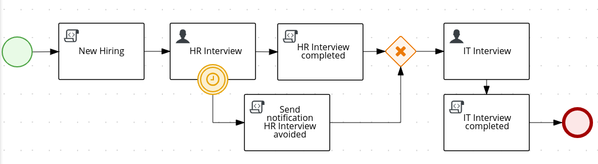
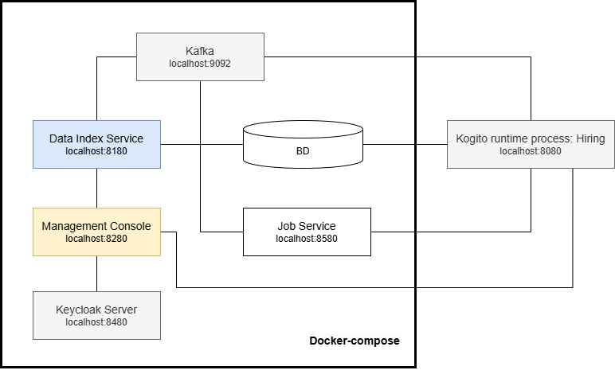

# Process user tasks with timer: Hiring

## Description

This Quickstart showcases a basic implementation of the **Hiring** process. 

This quickstart project shows very typical user task orchestration with a timer that avoids to execute the HR Interview task 
after some reasonable time.(configured for test purposes to 40 seconds)

<p align="center"></p>

The required *Kogito and Infrastructure Services* for this example are:

- Postgresql
- Kafka
- Kogito Data Index
- Kogito Jobs Service 

## Running the Quickstart

### Prerequisites

* Java 17+ installed
* Environment variable JAVA_HOME set accordingly
* Maven 3.9.6+ installed
* Docker and Docker Compose to run the required example infrastructure.

And when using native image compilation, you will also need: 
  - GraalVM 20.3+ installed
  - Environment variable GRAALVM_HOME set accordingly
  - GraalVM native image needs as well native-image extension: https://www.graalvm.org/reference-manual/native-image/
  - Note that GraalVM native image compilation typically requires other packages (glibc-devel, zlib-devel and gcc) to be installed too, please refer to GraalVM installation documentation for more details.

### Starting the Kogito and Infrastructure Services

This quickstart provides a docker compose template that starts all the required services. This setup ensures that all services are connected with a default configuration.

<p align="center"></p>

### Run Example with PostgreSQL

#### Compile Hiring example with profile postgresql

First thing is to compile the example with the postgresql profile executing:

- Open a Terminal
- Go to the example folder and run
```sh
mvn clean install -Ppostgresql
```

#### Start infrastructure services

You should start all the services before you execute any of the **Hiring** example, to do that please execute:

1. Open a Terminal
2. Go to docker-compose folder
3. Run the ```startServices.sh``` script

```bash
./startServices.sh
```

or

```bash
./startServices.sh postgresql
```

Once all services bootstrap, the following ports will be assigned on your local machine:

- PostgreSQL: 5432
- Kafka: 9092
- Data Index: 8180
- Jobs Service: 8580
- PgAdmin: 8055

> **_NOTE:_**  This step requires the project to be compiled, please consider running a ```mvn clean install``` command on the project root before running the ```startServices.sh``` script for the first time or any time you modify the project.

Once started you can simply stop all services by executing the ```docker-compose -f docker-compose-postgresql.yml stop```.

All created containers can be removed by executing the ```docker-compose -f docker-compose-postgresql.yml rm```.

#### Run the Hiring example with PostgreSQL

##### Compile and Run Hiring example process in Local Dev Mode

Once all the infrastructure services are ready, you can start the Hiring example by doing:

- Open a Terminal
- Go to the hiring example folder
- Start the example with the command

```bash
mvn clean package quarkus:dev -Ppostgresql
```

NOTE: With dev mode of Quarkus you can take advantage of hot reload for business assets like processes, rules, decision tables and java code. No need to redeploy or restart your running application.

##### Package and Run in JVM mode

```sh
mvn clean package -Ppostgresql
java -jar target/quarkus-app/quarkus-run.jar
```

or on windows

```sh
mvn clean package -Ppostgresql
java -jar target\quarkus-app\quarkus-run.jar
```

##### Package and Run using Local Native Image
Note that the following configuration property needs to be added to `application.properties` in order to enable automatic registration of `META-INF/services` entries required by the workflow engine:
```
quarkus.native.auto-service-loader-registration=true
```

Note that this requires GRAALVM_HOME to point to a valid GraalVM installation

```sh
mvn clean package -Pnative -Ppostgresql
```

To run the generated native executable, generated in `target/`, execute

```sh
./target/./target/process-usertasks-timer-quarkus
```

### Run Example with Infinispan

#### Compile Hiring example with profile infinispan

First thing is to compile the example with the infinispan profile executing:

1. Open a Terminal
2. Go to the example folder and run
```sh
mvn clean install -Pinfinispan
```
#### Start infrastructure services

You should start all the services before you execute any of the **Hiring** example, to do that please execute:

1. Open a Terminal
2. Go to docker-compose folder
3. Run the ```startServices.sh``` script with infinispan argument

```bash
./startServices.sh infinispan
```

Once all services bootstrap, the following ports will be assigned on your local machine:

- Infinispan: 11222
- Kafka: 9092
- Data Index: 8180
- Jobs Service: 8580

> **_NOTE:_**  This step requires the project to be compiled, please consider running a ```mvn clean install -Pinfinispan``` command on the project root before running the ```startServices.sh infinispan``` script for the first time or any time you modify the project.

Once started you can simply stop all services by executing the ```docker-compose -f docker-compose-infinispan.yml stop```.

All created containers can be removed by executing the ```docker-compose -f docker-compose-infinispan.yml rm```.

#### Run the Hiring example with Infinispan

##### Compile and Run Hiring example process in Local Dev Mode

Once all the infrastructure services are ready, you can start the Hiring example by doing:

- Open a Terminal
- Go to the hiring example folder
- Start the example with the command

```bash
mvn clean package quarkus:dev -Pinfinispan
```

NOTE: With dev mode of Quarkus you can take advantage of hot reload for business assets like processes, rules, decision tables and java code. No need to redeploy or restart your running application.

##### Package and Run in JVM mode

```sh
mvn clean package -Pinfinispan
java -jar target/quarkus-app/quarkus-run.jar
```

or on windows

```sh
mvn clean package -Pinfinispan
java -jar target\quarkus-app\quarkus-run.jar
```

##### Package and Run using Local Native Image
Note that this requires GRAALVM_HOME to point to a valid GraalVM installation

```sh
mvn clean package -Pnative -Pinfinispan
```

To run the generated native executable, generated in `target/`, execute

```sh
./target/process-usertasks-timer-quarkus
```

### Submit a request to start new hiring

Once the service is up and running you can make use of the **Hiring** application by a sending request to `http://localhost:8080/hiring`  with following content:
```json
{   
    "candidate": {
        "name": "Harry Potter",
        "email": "harrypotter@example.com",
        "salary": 30000,
        "skills": "Java, Kogito"
    }
}
```
In a Terminal, you can execute the following command to start a **Hiring** process for the "Harry Potter" candidate:
```bash
curl -H "Content-Type: application/json" -H "Accept: application/json" -X POST http://localhost:8080/hiring -d @- << EOF
{   
    "candidate": {
        "name": "Harry Potter",
        "email": "harrypotter@example.com",
        "salary": 30000,
        "skills": "Java, Kogito"
    }
}
EOF
```

### Submit a new request to start new hiring

In a Terminal you can execute this command to start a **Hiring** process for the "Jon Snow" candidate:
```bash
curl -H "Content-Type: application/json" -H "Accept: application/json" -X POST http://localhost:8080/hiring -d @- << EOF
{   
    "candidate": {
        "name": "Jon Snow",
        "email": "jdoe@example.com",
        "salary": 30000,
        "skills": "Java, Kogito"
    }
}
EOF
```
