# Process user task orchestration

## Description

A quickstart project shows very typical user task orchestration. It comes with two tasks assigned 
to human actors via group assignments - `managers`. So essentially anyone who is a member of that 
group can act on the tasks. Though this example applies four eye principles which essentially means 
that the user who approved the first task cannot approve the second one. So there must always be at 
least two distinct managers involved.

This example shows

* working with user tasks
* four eye principle with user tasks
* Task console to execute human task
* Management console tracking process execution


<p align="center"></p>


## Build and run

### Prerequisites

You will need:
  - Java 17+ installed
  - Environment variable JAVA_HOME set accordingly
  - Maven 3.9.6+ installed
  - [jq](https://stedolan.github.io/jq) tool installed. You can download it from [here](https://stedolan.github.io/jq/download)
  - Docker and Docker Compose to run the required example infrastructure.

When using native image compilation, you will also need:
  - GraalVM 20.3+ installed
  - Environment variable GRAALVM_HOME set accordingly
  - Note that GraalVM native image compilation typically requires other packages (glibc-devel, zlib-devel and gcc) to be installed too, please refer to GraalVM installation documentation for more details.

### Starting the Kogito and Infrastructure Services

This quickstart provides a docker compose template that starts all the required services. This setup ensures that all services are connected with a default configuration.

<p align="center">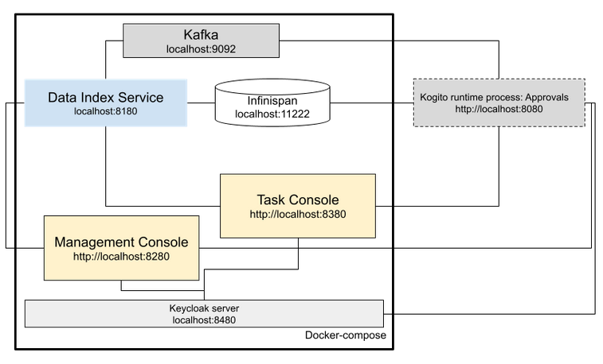</p>

You should start all the services before you execute any of the **Approvals** example, to do that please execute:

For Linux and MacOS:

1. Open a Terminal
2. Go to the process-usertasks-with-security-oidc-quarkus-with-console folder at kogito-examples
3. Run the ```startServices.sh``` script

```bash
sh ./startServices.sh
```

Once all services bootstrap, the following ports will be assigned on your local machine:

- Infinispan: 11222
- Kafka: 9092
- Data Index: 8180
- Management Console: 8280
- Task Console: 8380
- Keycloak server: 8480
- example-runtime-service: 8080

> **_NOTE:_**  This step requires the project to be compiled, please consider running a ```mvn clean install -Pcontainer``` command on the project root before running the ```startServices.sh``` script for the first time or any time you modify the project.

Once started you can simply stop all services by executing the ```docker-compose stop```.

All the created containers can be removed by executing the ```docker-compose rm```.

### Using Keycloak as Authentication Server

In this Quickstart we'll be using [Keycloak](https://www.keycloak.org/) as *Authentication Server*. It will be started as a part of the project *Infrastructure Services*, you can check the configuration on the project [docker-compose.yml](docker-compose/docker-compose.yml) in [docker-compose](docker-compose) folder.

It will install the *Kogito Realm* that comes with a predefined set of users:
| Login         | Password   | Roles               |
| ------------- | ---------- | ------------------- |
|    admin      |   admin    | *admin*, *managers* |
|    alice      |   alice    | *user*              |
|    jdoe       |   jdoe     | *managers*          |

Once Keycloak is started, you should be able to access your *Keycloak Server* at [localhost:8480/auth](http://localhost:8480/auth) with *admin* user.

### Security using OpenID Connect

This Quickstart is taking advantage of the Quarkus OIDC extension that allows an easy integration between the *Kogito* runtime & *Kogito* consoles and *Keycloak*.

Enabling it in the project can be done by adding the following *maven* dependency:
```xml
    <dependency>
      <groupId>io.quarkus</groupId>
      <artifactId>quarkus-oidc</artifactId>
    </dependency>
```

And adding the right configuration on the *application.properties* file:
```properties
quarkus.oidc.auth-server-url=http://localhost:8480/auth/realms/kogito

quarkus.oidc.client-id=kogito-app
quarkus.oidc.credentials.secret=secret

quarkus.http.auth.permission.authenticated.paths=/*
quarkus.http.auth.permission.authenticated.policy=authenticated
```

> **_NOTE:_**  For more information about securing Quarkus applications with OpenID Connect, please refer to [Quarkus Documentation](https://quarkus.io/guides/security-openid-connect)

It is also possible to enable authentication *Kogito Management Console* & *Kogito Task Console* using OpenID Connect, to do that you must start the consoles using the *keycloak* quarkus profile as a parameter (`-Dquarkus.profile=keycloak`). You can check the configuration on the project [docker-compose.yml](docker-compose/docker-compose.yml) in [docker-compose](docker-compose) folder.

> **_NOTE:_** For more information about how to secure Kogito Management Console with OpenID Connect, please refer to [Kogito Documentation](https://docs.jboss.org/kogito/release/latest/html_single/#proc-management-console-security_kogito-developing-process-services).
> 
> For more information about how to secure Kogito Task Console with OpenID Connect, please refer to [Kogito Documentation](https://docs.jboss.org/kogito/release/latest/html_single/#proc-task-console-security_kogito-developing-process-services)
> 
> For more information about authorization on Quarkus applications with OpenID Connect, please refer to [Quarkus Documentation](https://quarkus.io/guides/security-openid-connect-web-authentication)


### Compile and Run in Local Dev Mode

```
mvn clean compile quarkus:dev
```

NOTE: With dev mode of Quarkus you can take advantage of hot reload for business assets like processes, rules, decision tables and java code. No need to redeploy or restart your running application.

### Package and Run in JVM mode

```sh
mvn clean package
java -jar target/quarkus-app/quarkus-run.jar
```

or on Windows

```sh
mvn clean package
java -jar target\quarkus-app\quarkus-run.jar
```

### Package and Run using Local Native Image
Note that this requires GRAALVM_HOME to point to a valid GraalVM installation

```sh
mvn clean package -Pnative
```

To run the generated native executable, generated in `target/`, execute

```sh
./target/process-usertasks-with-security-oidc-quarkus-with-console 
```

### Kogito Management Console

To access the Kogito Management Console just open your browser and navigate to ``http://localhost:8280``. You'll be redirected to the *Keycloak* log in page.

<p align="center">
    
</p>

Once there, log in using any of the users specified in the [Using Keycloak as Authentication Server](#using-keycloak-as-authentication-server)

<p align="center">
    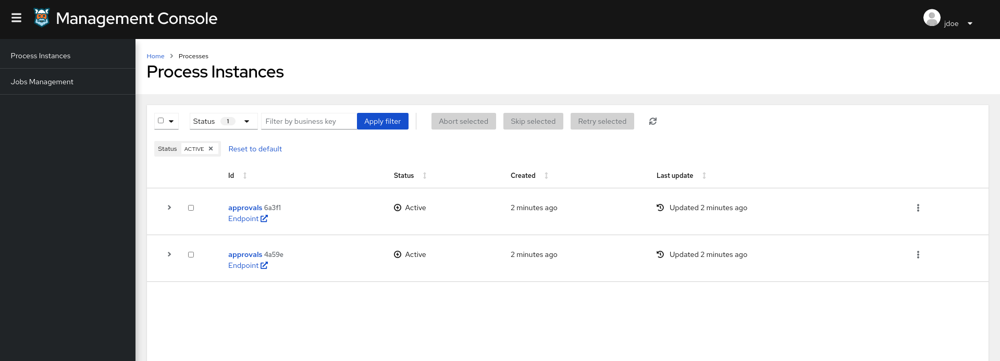
</p>

> **_NOTE:_**  For more information about how to work with Kogito Management Console, please refer to the [Kogito Documentation](https://docs.jboss.org/kogito/release/latest/html_single/#con-management-console_kogito-developing-process-services) page.

### Kogito Task Console

To access the Kogito Task Console just open your browser and navigate to ``http://localhost:8380``. You'll be redirected to the *Keycloak* log in page.

<p align="center">
    
</p>

Once there, log in with an *managers* user (for example *jdoe*) and you should be redirected to the user **Task Inbox**:

<p align="center">
    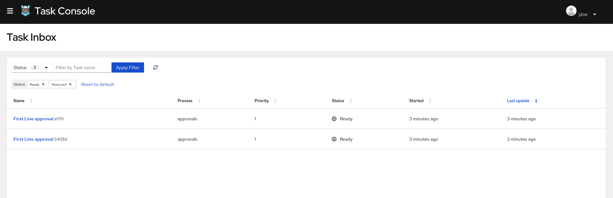
</p>

There you'll see all the tasks assigned to the user or to any of the group he belongs to.


### Submit a request to start new approval

The application is using bearer token authorization, the first thing to do is obtain an access token from the Keycloak
Server in order to access the application resources. Obtain an access token for user jdoe executing in a terminal:

```sh
export access_token=$(\
    curl -X POST http://localhost:8480/auth/realms/kogito/protocol/openid-connect/token \
    --user kogito-app:secret \
    -H 'content-type: application/x-www-form-urlencoded' \
    -d 'username=jdoe&password=jdoe&grant_type=password' | jq --raw-output '.access_token' \
 )
```

To make use of this application it is as simple as putting a sending request to `http://localhost:8080/approvals`  with following content

```json
{
"traveller" : {
  "firstName" : "John",
  "lastName" : "Doe",
  "email" : "jon.doe@example.com",
  "nationality" : "American",
  "address" : {
  	"street" : "main street",
  	"city" : "Boston",
  	"zipCode" : "10005",
  	"country" : "US" }
  }
}
```

Complete curl command can be found below:

```sh
curl -X POST -H 'Content-Type:application/json' -H 'Accept:application/json' -H "Authorization: Bearer "$access_token -d '{"traveller" : { "firstName" : "John", "lastName" : "Doe", "email" : "jon.doe@example.com", "nationality" : "American","address" : { "street" : "main street", "city" : "Boston", "zipCode" : "10005", "country" : "US" }}}' http://localhost:8080/approvals
```

### Show active process instances at Kogito Management Console

To access the Kogito Management Console just open your browser and navigate to ``http://localhost:8280``. 

<p align="center">
    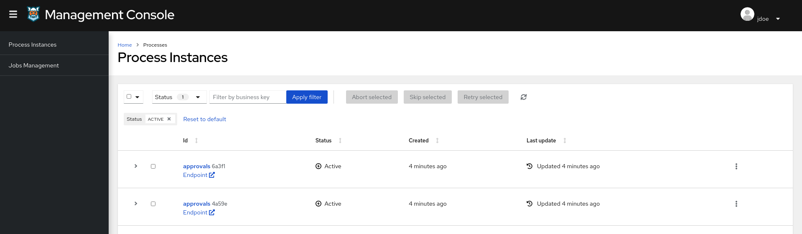
</p>

> **_NOTE:_**  For more information about how to work with Kogito Management Console, please refer to the [Kogito Documentation](https://docs.jboss.org/kogito/release/latest/html_single/#con-management-console_kogito-developing-process-services) page.

Check the process instance details to see where is the execution path 

<p align="center">
    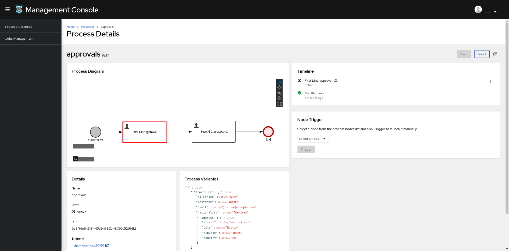
</p>

### Execute 'First Line approval' task at Kogito Task Console

To access the Kogito Task Console just open your browser and navigate to ``http://localhost:8380`` and you should be redirected to the **Task Inbox**.
Ensure you are logged as a user with role manager to be able to see the First Line approval (i.e: jdoe / jdoe)

<p align="center">
    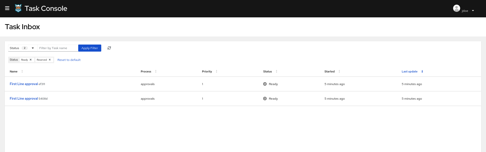
</p>

> **_NOTE:_**  For more information about how to work with Kogito Task Console, please refer to the [Kogito Documentation](https://docs.jboss.org/kogito/release/latest/html_single/#con-task-console_kogito-developing-process-services) page.

Access to 'First Line approval' task and complete
  
<p align="center">
    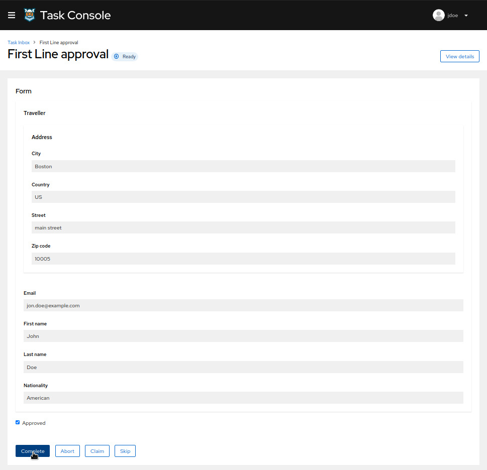
</p>

Check the process instance details at Kogito Management Console to see the execution path reflects the completed task

<p align="center">
    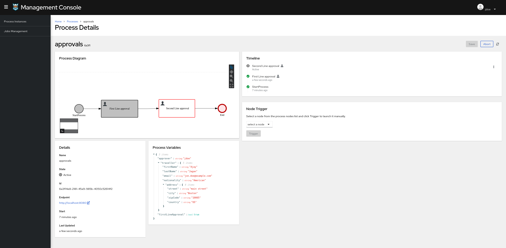
</p>

### Execute 'Second Line approval' task at Kogito Task Console

Access the Kogito Task Console and ensure you are logged as a user with role manager to be able to see the Second Line approval 
following the second eye principle (i.e: admin / admin)

<p align="center">
    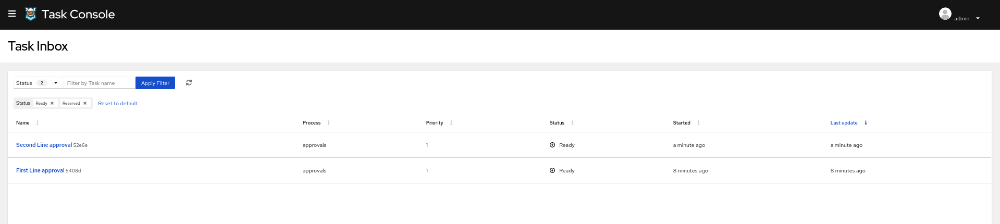
</p>

Access to 'Second Line approval' task and complete
  
<p align="center">
    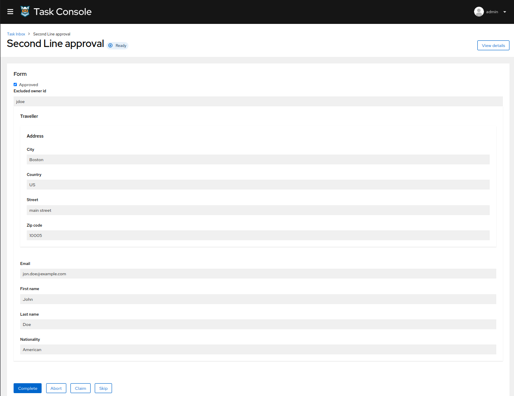
</p>

Check the process instance details at Kogito Management Console, and verify the execution path is reflected in the diagram.

<p align="center">
    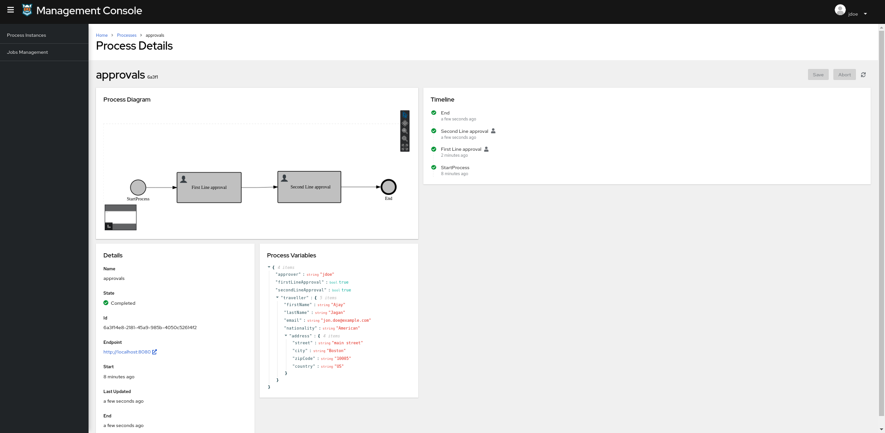
</p>
