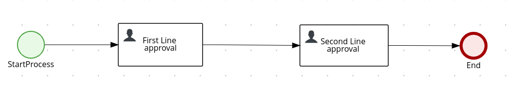

# Process user task orchestration

## Description

A quickstart project shows very typical user task orchestration. It comes with two tasks assigned
to human actors via groups assignments - `managers`. So essentially anyone who is a member of that
group can act on the tasks. Though this example applies four eye principle which essentially means
that user who approved first task cannot approve second one. So there must be always at least two
distinct manager involved.

This example shows

* working with user tasks
* four eye principle with user tasks


<p align="center"></p>


## Build and run

### Prerequisites

You will need:
  - Java 17+ installed
  - Environment variable JAVA_HOME set accordingly
  - Maven 3.9.6+ installed
  - [jq](https://stedolan.github.io/jq) tool installed. You can download it from [here](https://stedolan.github.io/jq/download)
  - Docker


When using native image compilation, you will also need:
  - GraalVM 19.1+ installed
  - Environment variable GRAALVM_HOME set accordingly
  - Note that GraalVM native image compilation typically requires other packages (glibc-devel, zlib-devel and gcc) to be installed too, please refer to GraalVM installation documentation for more details.

#### Starting and Configuring the Keycloak Server

To start a Keycloak Server you can use Docker and just run the following command:

```
docker run -e KEYCLOAK_USER=admin -e KEYCLOAK_PASSWORD=admin  -e KEYCLOAK_IMPORT=/tmp/kogito-realm.json -v <kie_kogito_examples_absolute_path>/process-usertasks-with-security-oidc-quarkus/config/kogito-realm.json:/tmp/kogito-realm.json -p 8281:8080  quay.io/keycloak/keycloak:legacy
```

You should be able to access your Keycloak Server at [localhost:8281/auth](http://localhost:8281).
and verify keycloak server is running properly: log in as the admin user to access the Keycloak Administration Console.
Username should be admin and password admin.
With the keycloak kogito realm  imported we have defined users to be able to try the different endpoints
user:
    john with role 'employees'
    mary with role 'managers'
    poul with roles 'interns and managers'

### Compile and Run in Local Dev Mode

```
mvn clean compile quarkus:dev
```

NOTE: With dev mode of Quarkus you can take advantage of hot reload for business assets like processes, rules, decision tables and java code. No need to redeploy or restart your running application.

### Package and Run in JVM mode

```sh
mvn clean package
java -jar target/quarkus-app/quarkus-run.jar
```

or on windows

```sh
mvn clean package
java -jar target\quarkus-app\quarkus-run.jar
```

### Package and Run using Local Native Image
Note that the following configuration property needs to be added to `application.properties` in order to enable automatic registration of `META-INF/services` entries required by the workflow engine:
```
quarkus.native.auto-service-loader-registration=true
```

Note that this requires GRAALVM_HOME to point to a valid GraalVM installation

```sh
mvn clean package -Pnative
```

To run the generated native executable, generated in `target/`, execute

```sh
./target/process-usertasks-with-security-oidc-quarkus-runner
```

### OpenAPI (Swagger) documentation
[Specification at swagger.io](https://swagger.io/docs/specification/about/)

You can take a look at the [OpenAPI definition](http://localhost:8080/openapi?format=json) - automatically generated and included in this service - to determine all available operations exposed by this service. For easy readability you can visualize the OpenAPI definition file using a UI tool like for example available [Swagger UI](https://editor.swagger.io).

In addition, various clients to interact with this service can be easily generated using this OpenAPI definition.

When running in either Quarkus Development or Native mode, we also leverage the [Quarkus OpenAPI extension](https://quarkus.io/guides/openapi-swaggerui#use-swagger-ui-for-development) that exposes [Swagger UI](http://localhost:8080/swagger-ui/) that you can use to look at available REST endpoints and send test requests.

### Submit a request to start new approval

To make use of this application it is as simple as putting a sending request to `http://localhost:8080/approvals`  with following content

```json
{
"traveller" : {
  "firstName" : "John",
  "lastName" : "Doe",
  "email" : "jon.doe@example.com",
  "nationality" : "American",
  "address" : {
  	"street" : "main street",
  	"city" : "Boston",
  	"zipCode" : "10005",
  	"country" : "US" }
  }
}

```

Complete curl command can be found below:

The application is using bearer token authorization and the first thing to do is obtain an access token from the Keycloak
Server in order to access the application resources. Obtain an access token for user john.

```sh
export access_token=$(\
    curl -X POST http://localhost:8281/auth/realms/kogito/protocol/openid-connect/token \
    --user kogito-app:secret \
    -H 'content-type: application/x-www-form-urlencoded' \
    -d 'username=john&password=john&grant_type=password' | jq --raw-output '.access_token' \
 )
```

```sh
curl -X POST -H 'Content-Type:application/json' -H 'Accept:application/json' -H "Authorization: Bearer "$access_token -d '{"traveller" : { "firstName" : "John", "lastName" : "Doe", "email" : "jon.doe@example.com", "nationality" : "American","address" : { "street" : "main street", "city" : "Boston", "zipCode" : "10005", "country" : "US" }}}' http://localhost:8080/approvals
```

### Show active approvals

```sh
curl -H 'Content-Type:application/json' -H 'Accept:application/json' -H "Authorization: Bearer "$access_token http://localhost:8080/approvals
```

### Show tasks

```sh
curl -H 'Content-Type:application/json' -H 'Accept:application/json' -H "Authorization: Bearer "$access_token 'http://localhost:8080/approvals/{uuid}/tasks?user=john&group=employees'
```

Try with the manager Mary

```sh
export access_token=$(\
    curl -X POST http://localhost:8281/auth/realms/kogito/protocol/openid-connect/token \
    --user kogito-app:secret \
    -H 'content-type: application/x-www-form-urlencoded' \
    -d 'username=mary&password=mary&grant_type=password' | jq --raw-output '.access_token' \
 )
```

```sh
curl -H 'Content-Type:application/json' -H 'Accept:application/json' -H "Authorization: Bearer "$access_token 'http://localhost:8080/approvals/{uuid}/tasks?user=mary&group=managers'
```

where `{uuid}` is the id of the given approval instance


### Complete first line approval task

```sh
curl -H "Authorization: Bearer "$access_token -X POST -d '{"approved" : true}' -H 'Content-Type:application/json' -H 'Accept:application/json' 'http://localhost:8080/approvals/{uuid}/firstLineApproval/{tuuid}?user=mary&group=managers'
```

where `{uuid}` is the id of the given approval instance and `{tuuid}` is the id of the task

### Show tasks

```sh
curl -H 'Content-Type:application/json' -H 'Accept:application/json' -H "Authorization: Bearer "$access_token 'http://localhost:8080/approvals/{uuid}/tasks?user=mary&group=managers'
```

where `{uuid}` is the id of the given approval instance. This should return empty response as Mary was the first approver and by that can't be assigned to another one.

Repeating the request with another user

```sh
export access_token=$(\
    curl -X POST http://localhost:8281/auth/realms/kogito/protocol/openid-connect/token \
    --user kogito-app:secret \
    -H 'content-type: application/x-www-form-urlencoded' \
    -d 'username=poul&password=poul&grant_type=password' | jq --raw-output '.access_token' \
 )
```

```sh
curl -H 'Content-Type:application/json' -H 'Accept:application/json' -H "Authorization: Bearer "$access_token 'http://localhost:8080/approvals/{uuid}/tasks?user=poul&group=managers'
```

Now we have the id for the second approval task

### Complete second line approval task

```sh
curl -H "Authorization: Bearer "$access_token -X POST -d '{"approved" : true}' -H 'Content-Type:application/json' -H 'Accept:application/json' 'http://localhost:8080/approvals/{uuid}/secondLineApproval/{tuuid}?user=poul&group=managers'
```

where `{uuid}` is the id of the given approval instance and `{tuuid}` is the id of the task instance

This completes the approval and returns approvals model where both approvals of first and second line can be found,
plus the approver who made the first one.

```json
{
  "approver": "mary",
  "firstLineApproval": true,
  "id": "20fcafed-255e-4e1b-b00f-9943aabb47fd",
  "secondLineApproval": true,
  "traveller": {
    "address": {
      "city": "Boston",
      "country": "US",
      "street": "main street",
      "zipCode": "10005"
    },
    "email": "jon.doe@example.com",
    "firstName": "John",
    "lastName": "Doe",
    "nationality": "American"
  }
}

```
