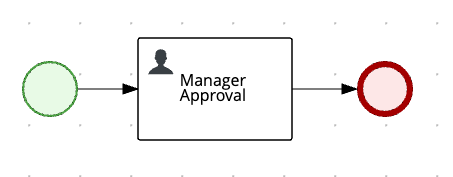
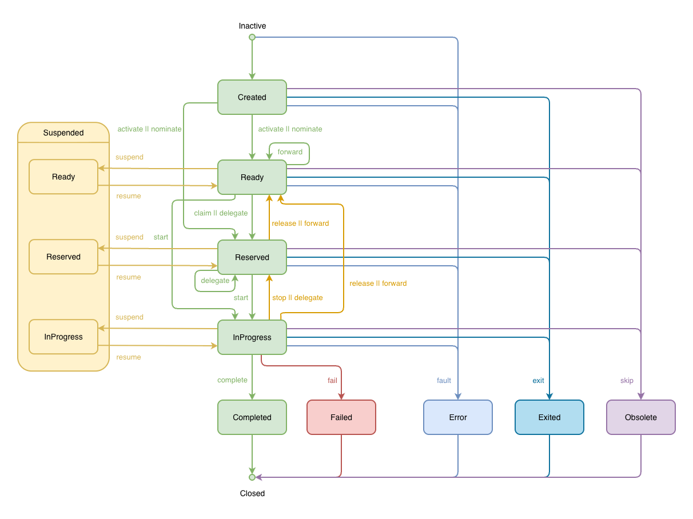

# Process Usertasks orchestration with Web Service-HumanTask Lifecycle

## Description

This example depicts a simple process with a usertask `Manager Approval`. The usertask lifecycle implementation
chosen is Web Service-HumanTask Lifecycle(WS-HumanTask) which is based on the Web Service-HumanTask specification.

This example shows, how to work with WS-HumanTask lifecycle.

<p align="center"></p>

To enable WS-HumanTask Lifecycle as the default Usertask Lifecycle implementation, please add below property to the
application.properties file.

```properties
kogito.usertasks.lifecycle=ws-human-task
```

Along with `ws-human-task`, we also support the default lifecycle `kogito` and `custom` user provided lifecycles.

## Build and run

### Prerequisites

You will need:
- Java 17+ installed
- Environment variable JAVA_HOME set accordingly
- Maven 3.9.6+ installed

### Running in Dev Mode

```sh
mvn clean package quarkus:dev
```

NOTE: With dev mode of Quarkus you can take advantage of hot reload for business assets like processes, rules, decision tables and java code. No need to redeploy or restart your running application.

### Running as Containers

First, build the example running the following command on a Terminal:

```shell
mvn clean package -Pcontainer
```

This will build this example's Quarkus application and create a Docker image that will be used in the
`docker-compose` template.

Run the below command to start the entire application:

```shell
PROJECT_VERSION=999-SNAPSHOT docker compose up
```

Here we are passing `PROJECT_VERSION` property to identify the image by tag.

### Web Service-HumanTask Lifecycle

The lifecycle diagram of Web Services-HumanTask is given below:

<p style="text-align: center;"></p>

The current Default Usertask Lifecycle (kogito) lacks full WS-HumanTask (WS-HT) lifecycle support. This
implementation supports only a limited subset of WS-HT features. The WS-HT lifecycle is based on the WS-HumanTask
[specification](https://docs.oasis-open.org/bpel4people/ws-humantask-1.1-spec-cs-01.html), section 4.10 Human Task
Behavior and State Transitions. Please refer the link for more information.

### Submit a request to start new Manager Approval

To start the process, send a request to `http://localhost:8080/manager_approval` using below command

Complete curl command can be found below:

```sh
curl -X POST "http://localhost:8080/manager_approval" \
    -H "Accept: application/json" \
    -H "Content-Type: application/json"
```

### Find pending usertasks

The usertask is assigned to `john` or `dave`. Use below command to fetch the usertasks:

```sh
curl -X GET 'http://localhost:8080/usertasks/instance?user=john' 
```

Note the `id` field will be used in the subsequent requests. If we want to reuse the taskId, export it to a 
variable by running below command:

```sh
export taskId=$(curl -X GET 'http://localhost:8080/usertasks/instance?user=john' | jq --raw-output  '.[0].id') 
```
The response also denote that the usertask is currently in `Ready` state. Also under `metadata`, we could also see 
that the lifecyle the usertask is associated with. In our case it is `"Lifecycle":"ws-human-task"`

### Find allowed transitions

Let's try to get a list of allowed transitions at this point. For that, please run below command:

```sh
curl -X GET "http://localhost:8080/usertasks/instance/${taskId}/transition?user=john"
```

### Transitioning usertasks

Let's move the task to `Reserved` state by `claim`ing the task. To do that run:

```sh
curl -X POST "http://localhost:8080/usertasks/instance/${taskId}/transition?user=john" \
    -H "content-type: application/json" \
    -d '{
          "transitionId": "claim"
        }'
```

From the response we can see that the usertask has transition from `Ready` to `Reserved` state. Also, note that the
usertask is now assigned to an actual owner: `john`

We could use the same GET transitions API to list out the possible transitions.

Let's delegate the task to `mark`. To do that, run the below command:

```sh
curl -X POST "http://localhost:8080/usertasks/instance/${taskId}/transition?user=john" \
    -H "content-type: application/json" \
    -d '{
          "transitionId": "delegate",
          "data": {
            "DELEGATED_USER": "mark"
          }
        }'
```

Now the task is stilk kept in `Reserved` state, but the actual owner is changed to `mark`. The user is also added to
the list of potential owners.

Let's `start` the task. To do that, run the below command:

```sh
curl -X POST "http://localhost:8080/usertasks/instance/${taskId}/transition?user=mark" \
    -H "content-type: application/json" \
    -d '{
          "transitionId": "start"
        }'
```

Notice that we have started the task as `mark`. Now the task state changes from `Reserved` to `InProgress`.

If we apply `stop` transition the task moves from `InProgress` to `Reserved` state. To do that run below command:

```sh
curl -X POST "http://localhost:8080/usertasks/instance/${taskId}/transition?user=mark" \
    -H "content-type: application/json" \
    -d '{
          "transitionId": "stop"
        }'
```

We could also use `forward` transition which can be used to forward the usertask to a list of potential users. To do
that run below command:

```sh
curl -X POST "http://localhost:8080/usertasks/instance/${taskId}/transition?user=mark" \
    -H "content-type: application/json" \
    -d '{
          "transitionId": "forward",
          "data": {
            "FORWARDED_USERS": ["adam", "carl"]
          }
        }'
```

From the response we could see that the task is transitioned to `Ready` state. User `mark` is now replaced from the
list of potential owners with `adam` and `carl`. Also, the actual owner is removed.

Let's directly `start` the task from `Ready` state by running below command:

```sh
curl -X POST "http://localhost:8080/usertasks/instance/${taskId}/transition?user=adam" \
    -H "content-type: application/json" \
    -d '{
          "transitionId": "start"
        }'
```

We can apply other terminal transitions also to the usertask. Let's `complete` the usertask by running the below 
command:

```sh
curl -X POST "http://localhost:8080/usertasks/instance/${taskId}/transition?user=adam" \
    -H "content-type: application/json" \
    -d '{
          "transitionId": "complete"
        }'
```

Now the process is completed successfully.
