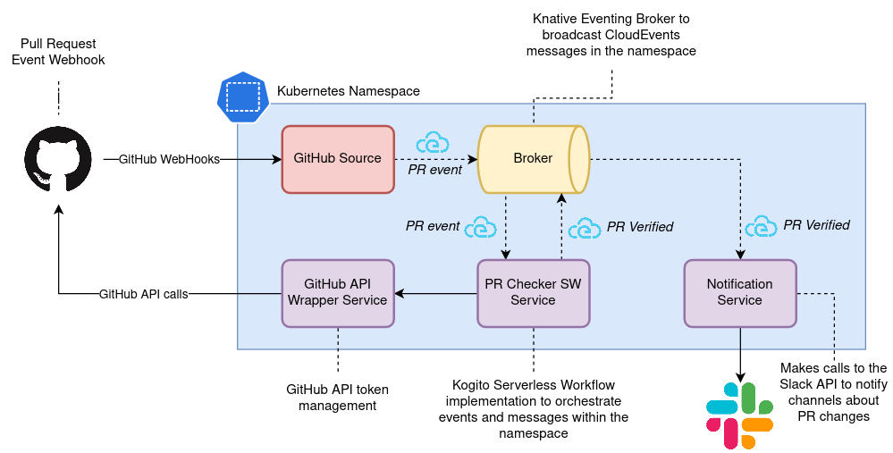

## Serverless Workflow GitHub Showcase

In this example we will deploy a GitHub "bot" application that will
react upon a new PR being opened in a given GitHub project. 
The "bot" is implemented via service and event orchestration approach with Kogito 
implementation of the [Serverless Workflow specification](https://github.com/serverlessworkflow/specification).

The image below illustrates an overview of the architecture:



The implementation relies on three services included in this repository:

1. [**Pull Request Checker Workflow**](pr-checker-workflow): it will coordinate the changes in the PR 
opened in a given GitHub repository. Depending on the files changed in the project,
different labels and reviewers will be automatically added in the PR. In the end of 
the workflow, the service will broadcast a "PR Verified" event to the cluster.
2. [**GitHub API Wrapper Service**](github-service): calling the GitHub API as a GitHub Application
requires a token to be generated on a small timeframe. This service generates a valid
token each 5 minutes to make calls to the API. Besides token management, it wraps 
the API and simplifies its interface just for the sake of this example.
3. [**Notification Service**](notification-service): a simple Camel service to interact with the Slack API to 
notify a given channel. 

### Prerequisites

> **IMPORTANT!** Before proceeding, please make sure you have everything listed in this section ready.

You may use CRC or Minikube if you don't have a cluster available with cluster admin rights.
Or you can ask an administrator to install the prerequisites for you.

To deploy this example in your Kubernetes/OpenShift cluster, you will need:

1. A [Quay.io](https://quay.io/repository/) account
2. A Kubernetes/OpenShift namespace to deploy the example: `kubectl create ns kogito-github` or `oc new-project kogito-github
3. [**Istio**](https://istio.io/docs/setup/install/istioctl/) installed because it's [required by Knative platform](https://knative.dev/docs/install/). 
You can follow the [Knative documentation](https://knative.dev/docs/install/serving/installing-istio/) for a very basic and simple installation.
4. **Knative** Serving and Eventing components installed. 
We recommend [installing the Knative Operator](https://knative.dev/docs/install/knative-with-operators/) and install the rest of the components
through it as described in their documentation.
5. **Kogito Operator** installed in the namespace `kogito-github`. [Download the latest release](https://github.com/kiegroup/kogito-operator/releases), and run: `NAMESPACE=kogito-github ./hack/install.sh`.
Alternatively, you can also install it via [OperatorHub](https://operatorhub.io/operator/kogito-operator).

In your local machine you will need:

1. To clone this repository and go to `serverless-workflow-github-showcase` directory (`git clone https://github.com/kiegroup/kogito-examples.git && cd serverless-workflow-github-showcase`)
2. [Java 11 SDK](https://openjdk.java.net/install/)
3. [Maven 3.8.1+](https://maven.apache.org/install.html)
4. [Podman](https://podman.io/getting-started/installation.html) or Docker to build the images
5. `kubectl` or `oc` client

### Deploying the examples

Follow the instructions for each service to try them locally as standalone services
and deploy them in your Kubernetes or OpenShift cluster:

1. [GitHub Service](github-service/README.md)
2. [Notification Service](notification-service/README.md)
3. [PR Checker SW Service](pr-checker-workflow/README.md)

Knative and Kogito will bind them together. :heart:

In case of any problems, please file an issue or reach out to us at the [Kogito Dev Mailing list](https://groups.google.com/forum/?authuser=0#!aboutgroup/kogito-development).

### Cleaning up 

You can easily clean up the demo by deleting the namespace:

```shell script
kubectl delete ns kogito-github
```

To clean up your `/etc/hosts` file, run the following script:

```shell script
./scripts/cleanup-hosts-file.sh
```

It will remove all the lines added by the `expose-on-minikube.sh` script while deploying the services.