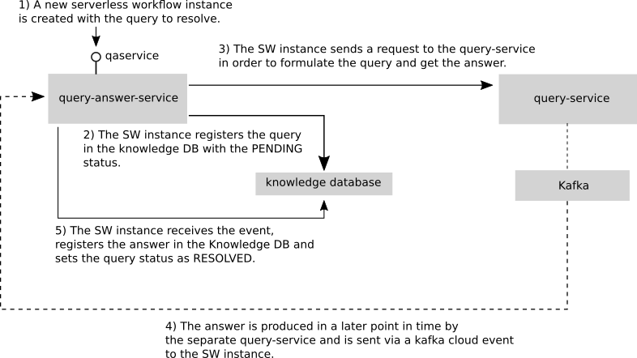
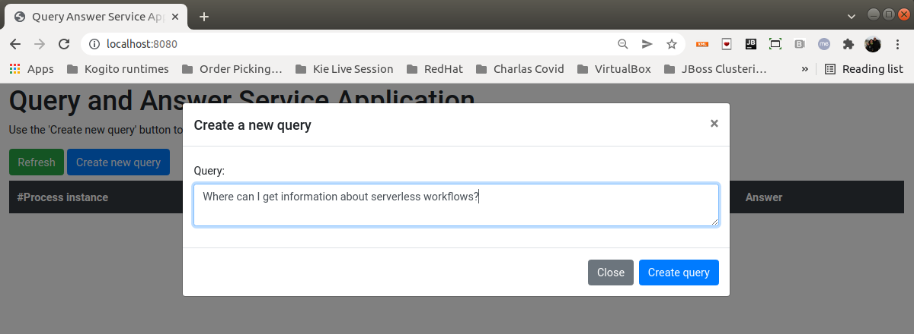
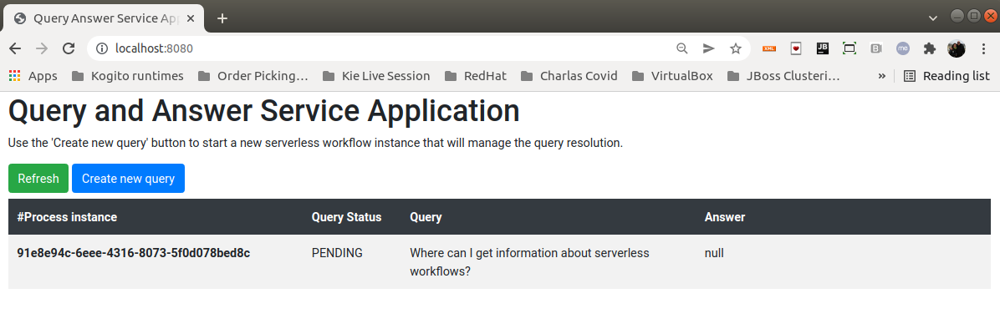
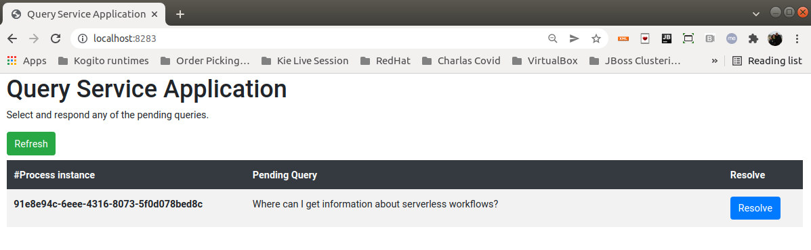
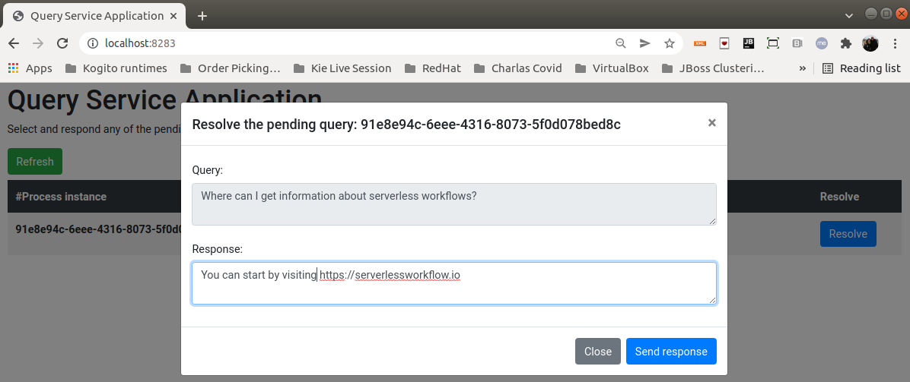
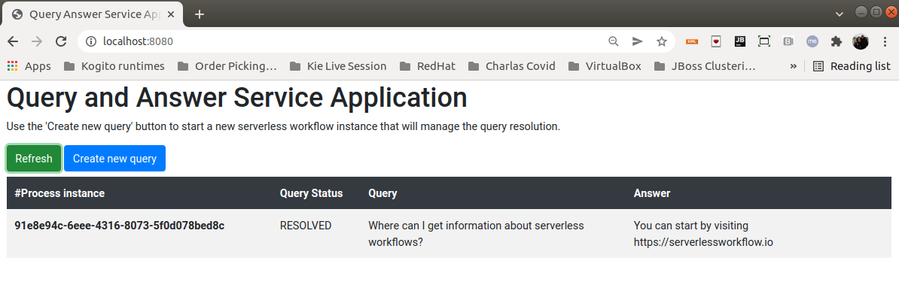

# Kogito Serverless Workflow - Query Answer Service Showcase

The goal of this example is to implement a simple *Query and Answer* service.

The resolution of a formulated query is managed by a [serverless workflow instance](query-answer-service/src/main/resources/qaservice.sw.json), which will interact with an external service to get the answers. Considering that an external service produces the answers, they can arrive at any later point in time. Thus, the serverless workflow must coordinate all these interactions to correctly populate the knowledge database with the queries and the corresponding answers.

The lifespan of the [serverless workflow instance](query-answer-service/src/main/resources/qaservice.sw.json) makes sense only during the query resolution time. However, the queries and answers will remain stored in the knowledge database for later consumption, querying, etc.

The following diagram shows the problem structure and the different interactions that occur to resolve a query.

# Example UI

To run the example, a simple UI is provided and can be used to emulate both the query formulation and resolution.
Note that two different applications are being emulated.

**Please read the following files and follow the required steps to start all the required components.**

1) [query-answer-service/README.md](query-answer-service/README.md)
2) [query-service/README.md](query-service/README.md) 

When all the components and services are started, follow these steps to formulate and resolve queries using the UI.

> **NOTE:** All the query formulation and resolution cycle can also be invoked by using the services respective endpoints.

## Formulate a query

1) Open a browser window with the following url: http://localhost:8080.

    The application that represents the Query and Answer service will be opened.

2) Create your query and send it.

3) After creating the query, you will see all the queries in the knowledge database.

## Resolve a query

1) Open a browser window with the following url: http://localhost:8283

    The application that represents the external service that solves the queries will be opened.

2) Select and resolve a query.

## See the results

1) Go back to the Query Answer Service application http://localhost:8080 and see the results.

