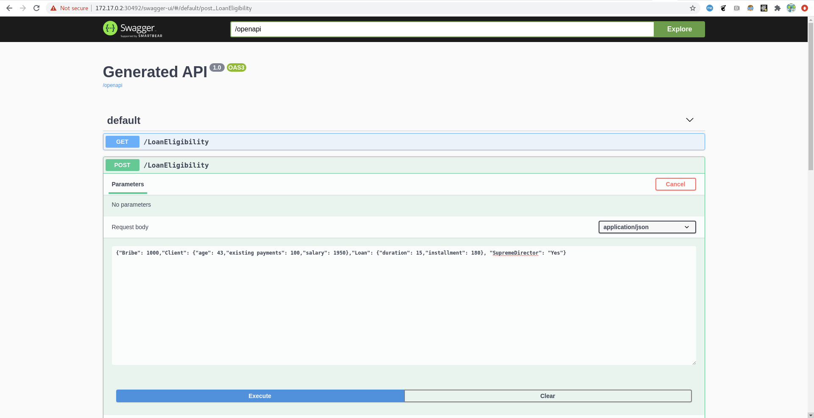
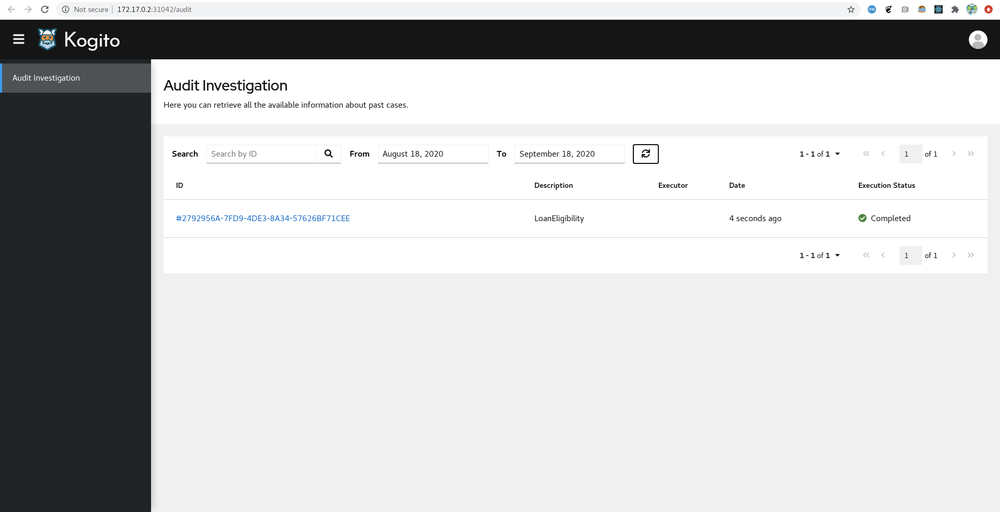

# Trusty demonstation

This is a demonstration of the trusty AI tracing capabilities. 

NOTE: In order to play with the demo, ensure that you are on the stable branch or on the branch of a specific release (for example the branch for the release `0.17` is `0.17.x`).
The `main` branch is aligned to the latest changes in all the repositories. This means that `main` might be using some new operator features not included in the release that we use in this demo: don't use it!

## Requirements

- docker version > 19.03.12
- minikube version  > 1.16.0
- java version > 11
- maven version > 3.8.1
- kubernetes version > 1.20

Note: also previous versions of `docker`, `minikube` and `kubernetes`  might work, but they were not tested. 

## Build your kogito runtime application

In this example, we will use the `dmn-tracing-quarkus` application that you can find in the root of this repository. This kogito application is using the `tracing-addon` so to export the tracing information that will be used by the trusty and explainability services for further analysis.

Navigate under the folder `kogito-examples/kogito-quarkus-examples/dmn-tracing-quarkus` and run 
```bash
mvn clean package -DskipTests
```

Now you need to have an account on a remote hub like `quay` or `dockerhub` for example. Assuming that you have an account on `quay` and you are using `docker`, build the image with 
```bash
docker build --tag quay.io/<your_namespace>/dmn-tracing-quarkus:1.0.0 .
```
replacing the string `<your_namespace>` with your namespace (i.e. your username).

Push the image
```bash
docker push quay.io/<your_namespace>/dmn-tracing-quarkus:1.0.0
```

## Deploy the infrastructure with minishift/kubernetes

Navigate back to the current directory where this `README.md` file is stored. 

The first step is to start your `minikube` cluster: 

```bash
minikube start
minikube addons enable ingress
minikube addons enable olm
```

Create a new project called (for example) `trusty-demo` 

```bash 
PROJECT_NAME=trusty-demo
kubectl create namespace "$PROJECT_NAME"
```

Set the Kogito release version

```bash
KOGITO_VERSION=v1.5.0
```

Deploy the kogito operator in the cluster
```bash
wget https://github.com/kiegroup/kogito-operator/releases/download/${KOGITO_VERSION}/kogito-operator.yaml
kubectl apply -f kogito-operator.yaml
```

You should see that the `kogito-operator` has one pod running within some minutes: the command `kubectl get pods -n kogito-operator-system` should return something like 

```bash
NAME                                                  READY   STATUS    RESTARTS   AGE
kogito-operator-controller-manager-7456474485-hn89d   2/2     Running   0          63s

```

Install the [Infinispan operator](https://operatorhub.io/operator/infinispan/2.0.x/infinispan-operator.v2.0.6) version 2.0.6. 
Pay attention that by default the Infinispan operator is installed on the namespace `my-infinispan`. You have to download the `yaml` file and change the namespace of the custom resources accordingly to your namespace.

```bash
wget https://operatorhub.io/install/2.0.x/infinispan.yaml
sed -i "s/namespace: my-infinispan/namespace: ${PROJECT_NAME}/g" infinispan.yaml
sed -i "s/- my-infinispan/- ${PROJECT_NAME}/g" infinispan.yaml
kubectl apply -f infinispan.yaml -n ${PROJECT_NAME}
```

If the infinispan operator does not show under your namespace, please ensure that all the pods under the namespace `olm` are up and running. If the catalog pod is in Crashloop status, the workaround is to delete the pod and wait until it gets redeployed automatically.

Install `strimzi` operator with 

```bash
TARGET_DIR="."
STRIMZI_VERSION=0.28.0

wget "https://github.com/strimzi/strimzi-kafka-operator/releases/download/${STRIMZI_VERSION}/strimzi-${STRIMZI_VERSION}.tar.gz" -P "$TARGET_DIR/"
tar zxf "${TARGET_DIR}/strimzi-${STRIMZI_VERSION}.tar.gz" -C "$TARGET_DIR"
find strimzi-${STRIMZI_VERSION}/install/cluster-operator -name '*RoleBinding*.yaml' -type f -exec sed -i "s/namespace: .*/namespace: ${PROJECT_NAME}/" {} \;
kubectl apply -f strimzi-${STRIMZI_VERSION}/install/cluster-operator/ -n ${PROJECT_NAME}
```

Deploy kafka and infinispan resources with 
```bash
kubectl apply -f resources/kafka.yaml -n ${PROJECT_NAME}
kubectl apply -f resources/kafka-topics.yaml -n ${PROJECT_NAME}
kubectl apply -f resources/infinispan-minimal.yaml -n ${PROJECT_NAME}
```

Deploy the `KogitoInfra` custom resources, so that the Kogito operator bind the kogito applications with the infinispan and kafka resources.
```bash
kubectl apply -f resources/kogito-infra.yaml -n ${PROJECT_NAME}
```

Deploy the Trusty service and expose it

```bash
kubectl apply -f resources/trusty.yaml -n ${PROJECT_NAME}
kubectl expose deployment trusty -n ${PROJECT_NAME}  --type=NodePort --name=trusty-np
minikube service trusty-np -n ${PROJECT_NAME}
```

Take the exposed address and replace the env variables `KOGITO_TRUSTY_ENDPOINT` and `KOGITO_TRUSTY_WS_URL` in the file `resources/trusty-ui.yaml`. For example, if the address is `http://172.17.0.2:1337`, then the content of the file should be 
```bash
apiVersion: app.kiegroup.org/v1beta1
kind: KogitoSupportingService
metadata:
  name: trusty-ui
spec:
  serviceType: TrustyUI
  replicas: 1
  image: quay.io/kiegroup/kogito-trusty-ui:1.44
  env:
    - name: KOGITO_TRUSTY_ENDPOINT
      value: http://172.17.0.2:1337
    - name: KOGITO_TRUSTY_WS_URL
      value: ws://172.17.0.2:1337
```

Modify the content of the file `resources/dmn-tracing-quarkus.yaml` with the information you used in the first section. The content should look like the following 

```yaml
apiVersion: app.kiegroup.org/v1beta1
kind: KogitoRuntime
metadata:
  name: dmn-tracing-quarkus
  labels:
    app: dmn-tracing-quarkus
spec:
  replicas: 1
  image: quay.io/<YOUR_NAMESPACE>/dmn-tracing-quarkus:2.0.0-snapshot # <---- replace with your image
  infra:
    - kogito-kafka-infra
  env:
    - name: KOGITO_SERVICE_URL
      value: http://dmn-tracing-quarkus:8080
```

It's time to deploy all the resources with the commands
```bash
kubectl apply -f resources/trusty-ui.yaml -n ${PROJECT_NAME}
kubectl apply -f resources/explainability.yaml -n ${PROJECT_NAME}
kubectl apply -f resources/dmn-tracing-quarkus.yaml -n ${PROJECT_NAME}
```

Expose the Kogito runtime service with 

```bash
kubectl expose deployment dmn-tracing-quarkus -n ${PROJECT_NAME}  --type=NodePort --name=dmn-tracing-quarkus-np
minikube service dmn-tracing-quarkus-np -n ${PROJECT_NAME}
```

A new tab in your browser should be opened automatically. Navigate under the path `/q/swagger-ui` and execute a post request on the endpoint `LoanEligibility` with the following payload: 
```json
{"Bribe": 1000,"Client": {"age": 43,"existing payments": 100,"salary": 1950},"Loan": {"duration": 15,"installment": 180}, "SupremeDirector": "Yes"}
```



Expose the audit ui (alias trusty-ui) with 
```bash
kubectl expose deployment trusty-ui -n ${PROJECT_NAME}  --type=NodePort --name=trusty-ui-np
minikube service trusty-ui-np -n ${PROJECT_NAME}
```

And navigate through the decisions that have been taken by the kogito-runtime service. Enjoy!



