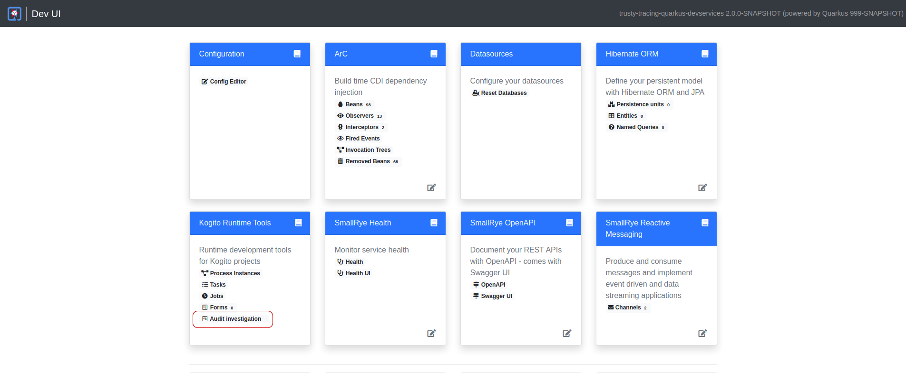

# Trusty Tracing Quarkus DevServices example

## Description

A DMN service to evaluate a loan approval that can be run with within Quarkus DevServices. Executions are stored in a 
PostgreSQL instance and a User Interface can be launched from Quarkus DevMode to inspect the executions. 

## Installing and Running

### Prerequisites

You will need:
  - Java 17+ installed
  - Environment variable JAVA_HOME set accordingly
  - Maven 3.9.6+ installed
  - A Docker environment

### Compile and Run in Local Dev Mode

```
mvn clean compile quarkus:dev
```

The tracing addon emits tracing events to a Kafka broker running within Quarkus DevServices. A [Trusty Service](https://github.com/apache/incubator-kie-kogito-apps/tree/main/trusty)
instance, also running within Quarkus DevServices, consumes the events and stores them in a PostgreSQL instance running 
within Quarkus DevServices too. Within Quarkus DevMode the DevMode UI can be launched by pressing [d]  or navigating to
http://localhost:8080/q/dev/.



The DevUI can be used to launch the Audit Investigation console from the Kogito Runtime Tools card.

## Example Usage

Once the service is up and running, you can use the following example to interact with the service.

Executions of the model will be recorded in the Audit Investigation console.

### POST /LoanEligibility

Returns penalty information from the given inputs -- driver and violation:

Given inputs:

```json
{
  "Bribe": 0,
  "Client": {
    "age": 0,
    "existing payments": 0,
    "salary": 0
  },
  "Loan": {
    "duration": 0,
    "installment": 0
  },
  "SupremeDirector": "yes"
}
```

Curl command (using the JSON object above):

```sh
curl -X POST -H 'Accept: application/json' -H 'Content-Type: application/json' -d '{"Bribe": 0,"Client": {"age": 0,"existing payments": 0,"salary": 0},"Loan": {"duration": 0,"installment": 0},"SupremeDirector": "yes"}' http://localhost:8080/LoanEligibility
```
or on Windows:

```sh
curl -X POST -H "Accept: application/json" -H "Content-Type: application/json" -d "{\"Bribe\": 0,\"Client\": {\"age\": 0,\"existing payments\": 0,\"salary\": 0},\"Loan\": {\"duration\": 0,\"installment\": 0},\"SupremeDirector\": \"yes\"}" http://localhost:8080/LoanEligibility
```

As response, penalty information is returned.

Example response:

```json
{
  "Eligibility": "No",
  "Judgement": null,
  "Loan": {
    "duration": 0,
    "installment": 0
  },
  "SupremeDirector": "yes",
  "Bribe": 0,
  "Client": {
    "existing payments": 0,
    "salary": 0,
    "age": 0
  },
  "Is Enough?": 0,
  "Decide": null
}
```
