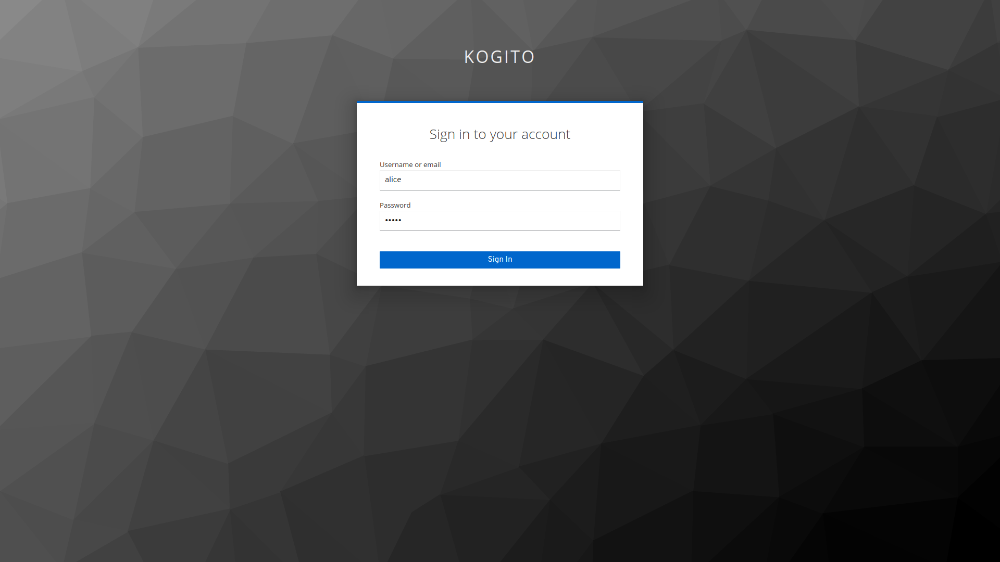
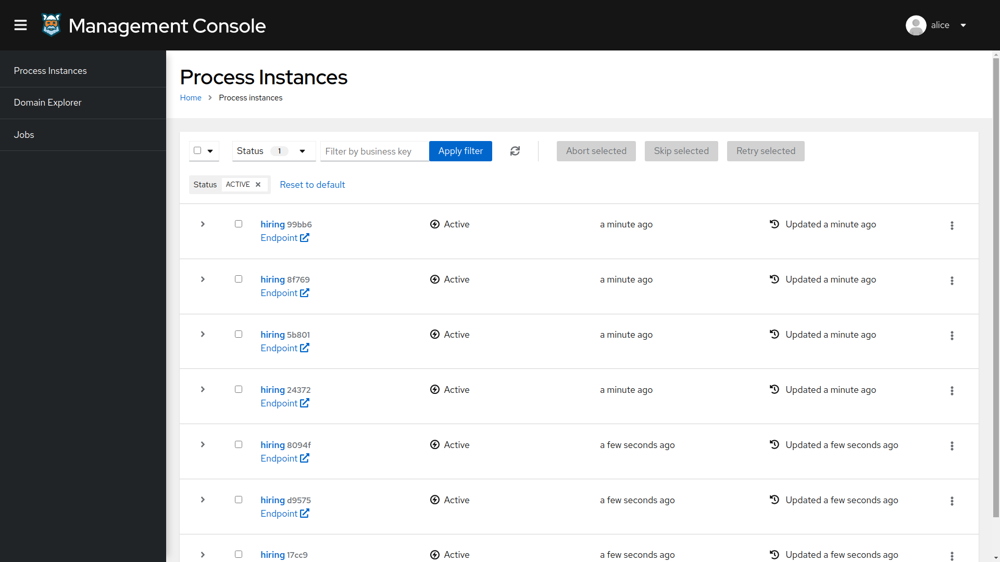
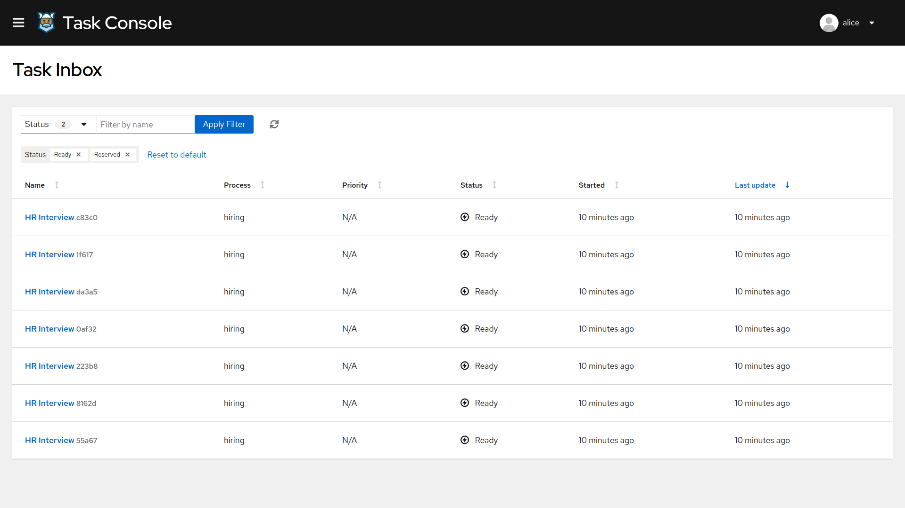
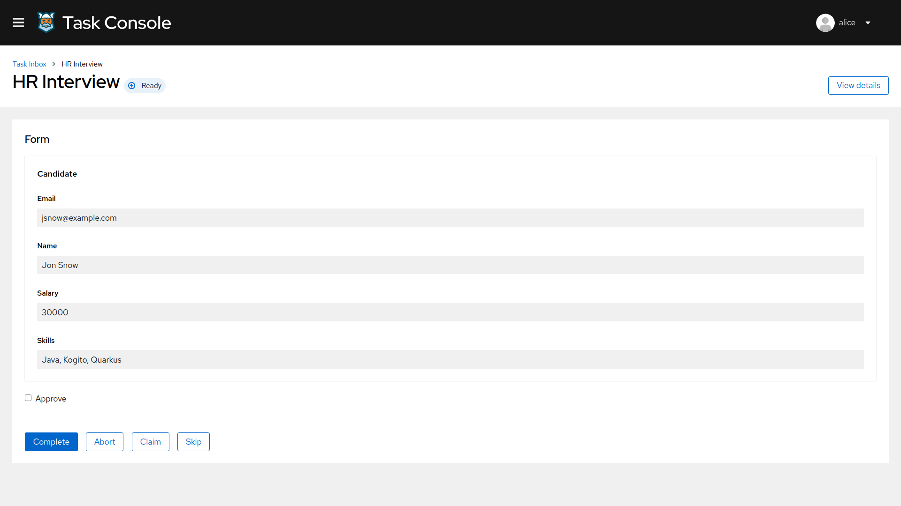
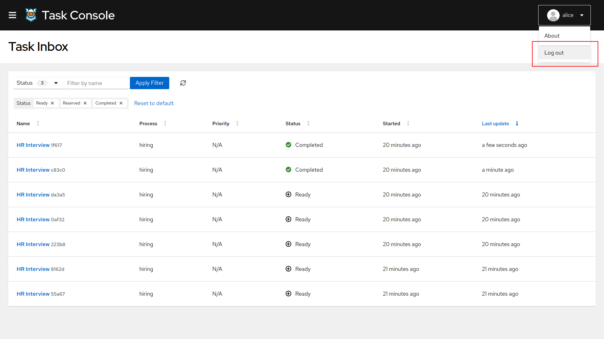
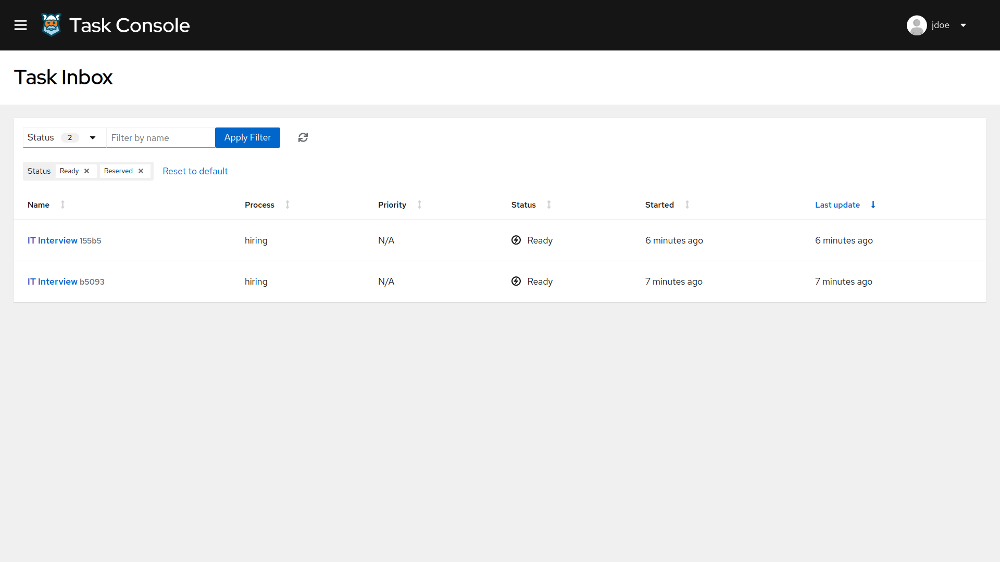

# 02.- Kogito Example with Authentication

## Description

In the [Basic Example](../01-kogito-basic-example) we saw a basic setup for the **Hiring** process using. In this Quickstart we are going to enhance it adding security to our setup using [Keycloak](https://www.keycloak.org/).

The required *Kogito and Infrastructure Services* for this example are:

- Infinispan
- Kafka
- Keycloak
- Kogito Data Index
- Kogito Management Console
- Kogito Task Console

### The process

As in the [Basic Example](../01-kogito-basic-example), the process has the same *HR Interview* & *IT interview* User Tasks, but with group assignments to *HR* and *IT* respectively. So, essentially any user that is a member of the *HR* or *IT* will be able to act on those tasks. 

<p align="center">
    
</p>

### Using Keycloak as Authentication Server

In this Quickstart we'll be using [Keycloak](https://www.keycloak.org/) as *Authentication Server*. It will be started as a part of the project *Infrastructure Services*, you can check the configuration on the project [docker-compose.yml](./docker-compose/docker-compose.yml) in [docker-compose](./docker-compose) folder.

It will install the *Kogito Realm* that comes with a predefined set of users:
| Login         | Password   | Roles               |
| ------------- | ---------- | ------------------- |
|    admin      |   admin    | *admin*, *HR*, *IT* |
|    alice      |   alice    | *HR*                |
|    jdoe       |   jdoe     | *IT*                |

Once started, you should be able to access your *Keycloak Server* at [localhost:8480/auth](http://localhost:8480/auth) with *admin* user.

### Security using OpenID Connect

This Quickstart is taking advantage of the Quarkus OIDC extension that allows an easy integration between the *Kogito* runtime & *Kogito* consoles and *Keycloak*.

Enabling it in the project can be done by adding the following *maven* dependency:
```xml
    <dependency>
      <groupId>io.quarkus</groupId>
      <artifactId>quarkus-oidc</artifactId>
    </dependency>
```

And adding the right configuration on the *application.properties* file:
```properties
quarkus.oidc.auth-server-url=http://localhost:8480/auth/realms/kogito
quarkus.oidc.client-id=kogito-app
quarkus.oidc.credentials.secret=secret

quarkus.http.auth.permission.authenticated.paths=/*
quarkus.http.auth.permission.authenticated.policy=authenticated
```

> **_NOTE:_**  For more information about securing Quarkus applications with OpenID Connect, please refer to [Quarkus Documentation](https://quarkus.io/guides/security-openid-connect)

It is also possible enabling authentication *Kogito Management Console* & *Kogito Task Console* using OpenID Connect, to do that you must start the consoles using the *keycloak* quarkus profile as a parameter (`-Dquarkus.profile=keycloak`). You can check the configuration on the project [docker-compose.yml](./docker-compose/docker-compose.yml) in [docker-compose](./docker-compose) folder.

> **_NOTE:_** For more information about how to secure Kogito Management Console with OpenID Connect, please refer to [Kogito Documentation](https://docs.jboss.org/kogito/release/latest/html_single/#proc-management-console-security_kogito-developing-process-services).
> 
> For more information about how to secure Kogito Task Console with OpenID Connect, please refer to [Kogito Documentation](https://docs.jboss.org/kogito/release/latest/html_single/#proc-task-console-security_kogito-developing-process-services)
> 
> For more information about authorization on Quarkus applications with OpenID Connect, please refer to [Quarkus Documentation](https://quarkus.io/guides/security-openid-connect-web-authentication)

## Running the Quickstart

### Prerequisites

* Java 11+ installed
* Environment variable JAVA_HOME set accordingly
* Maven 3.5.2+ installed
* [jq](https://stedolan.github.io/jq) tool installed. You can download it from [here](https://stedolan.github.io/jq/download)
* Docker and Docker Compose to run the required example infrastructure.

### Starting the Kogito and Infrastructure Services

This quickstart provides a docker compose template that starts all the required services. This setup ensures that all services are connected with a default configuration.

You should start all the services before you execute any of the **Hiring** example, to do that please execute:

For Linux and MacOS:

1. Open a Terminal
2. Go to the Quickstart folder

```bash
cd <path_to_kogito_quickstart>/docker-compose
```

3. Run the ```startServices.sh``` script

```bash
sh ./startServices.sh
```

Once all services bootstrap, the following ports will be assigned on your local machine:

- Infinispan: 11222
- Kafka: 9092
- Keycloak: 8480
- Data Index: 8180
- Management Console: 8280
- Task Console: 8380

> **_NOTE:_**  This step requires the project to be compiled, please consider runing a ```mvn clean compile``` command on the project root before running the ```startServices.sh``` script for the first time or any time you modify the project.

Once started you can simply stop all services by executing the ```docker-compose stop```.

### Starting the Hiring example

Once all the infrastructure services are ready, you can start the Hiring example by doing:

1. Open a Terminal
2. Go to the Quickstart folder
```bash
cd <path_to_kogito_quickstart>/
```
3.- Start the example with the command
```bash
mvn clean package quarkus:dev
```

### Starting a Hiring Process

Once the service is up and running you can making use of the **Hiring** application by a sending request to `http://localhost:8080/hiring`  with following content:
```json
{   
    "candidate": {
        "name": "Jon Snow",
        "email": "jsnow@example.com",
        "salary": 30000,
        "skills": "Java, Kogito, Quarkus"
    }
}
```

Since the application is using bearer token authorization and the first thing to do is obtain an access token from the *Keycloak*
in order to access the application resources. Obtain an access token for user `jdoe`:

```bash
export access_token=$(\                                                                                                                                          
    curl -X POST http://localhost:8480/auth/realms/kogito/protocol/openid-connect/token \
    --user kogito-app:secret \
    -H 'content-type: application/x-www-form-urlencoded' \
    -d 'username=jdoe&password=jdoe&grant_type=password' | jq --raw-output '.access_token' \
 )
```

In a Terminal you can execute this command to start a **Hiring** process for the "Jon Snow" candidate:
```bash
curl -H "Content-Type: application/json" -H "Accept: application/json" -H "Authorization: Bearer "$access_token -X POST http://localhost:8080/hiring -d @- << EOF
{   
    "candidate": {
        "name": "Jon Snow",
        "email": "jsnow@example.com",
        "salary": 30000,
        "skills": "Java, Kogito, Quarkus"
    }
}
EOF
```

### Kogito Management Console

To access the Kogito Management Console just open your browser and navigate to ``http://localhost:8280``. You'll be redirected to the *Keycloak* login page

<p align="center">
    
</p>

Once there, login using any of the users specified in the [Using Keycloak as Authentication Server](#using-keycloak-as-authentication-server)

<p align="center">
    
</p>

> **_NOTE:_**  For more information about how to work with Kogito Management Console, please refer to the [Kogito Documentation](https://docs.jboss.org/kogito/release/latest/html_single/#con-management-console_kogito-developing-process-services) page.

### Kogito Task Console

To access the Kogito Task Console just open your browser and navigate to ``http://localhost:8380``. You'll be redirected to the *Keycloak* login page

<p align="center">
    
</p>

Once there, login with an *HR* user (for example *alice*) and you should be redirected to the user **Task Inbox**:

<p align="center">
    
</p>

There you'll see all the tasks assigned to the user or to any of the group he belongs to (*HR*). Now let's complete a *HR Interview* task. To do so, click on any **Task Name** and you'll be redirected into the **Task Details** page. Once there, you can complete the task by clicking the **Complete** button.

<p align="center">
    
</p>

Now the task should be completed and a new *IT Interview* task has started, let's login as an *IT* user to see it. To do that, first logout by clicking on the top-right username and press **Log out**. 

<p align="center">
    
</p>

Now you'll be redirected again to the login page, login with an *IT* user (for example *jdoe*) and you'll get to it's **Task Inbox**

<p align="center">
    
</p>

> **_NOTE:_**  For more information about how to work with Kogito Task Console, please refer to the [Kogito Documentation](https://docs.jboss.org/kogito/release/latest/html_single/#con-task-console_kogito-developing-process-services) page.
