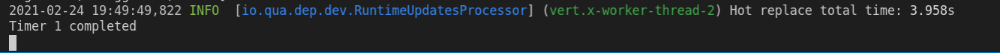
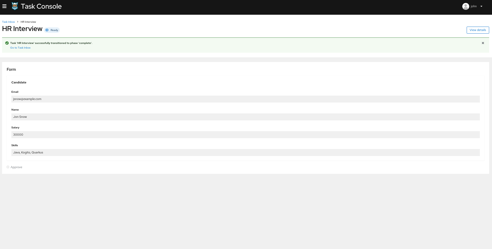

# 03.- Kogito Jobs Services Example

## Description

This quickstart showcases an implementation of the **Hiring** process with **Jobs Services**, to add a timer between nodes of a process and to execute a job. The executed jobs can be rescheduled or canceled by interacting with the Kogito Management Console application.

The required *Kogito and Infrastructure Services* for this example are:

- Infinispan
- Kafka
- Kogito Data Index
- Kogito Jobs Services
- Kogito Management Console
- Kogito Task Console

## Running the Quickstart

### Prerequisites

* Java 11 or later is installed
* Environment variable JAVA_HOME is set accordingly
* Maven 3.6.2 or later is installed
* Docker and Docker Compose to run the required example infrastructure.

### Starting the Kogito and Infrastructure Services

This quickstart provides a docker compose template that starts all the required services. This setup ensures that all services are connected with a default configuration.

You should start all the services before you execute any of the **Hiring** example, to do that please execute:

For Linux and MacOS:

1. Open a Terminal.
2. Go to the Quickstart folder.

```bash
cd <path_to_kogito_quickstart>/docker-compose
```

3. Run the ```startServices.sh``` script.

```bash
sh ./startServices.sh
```

Once all services bootstrap, the following ports are assigned on your local machine:

- Infinispan: 11222
- Kafka: 9092
- Data Index: 8180
- Jobs Services: 8580
- Management Console: 8280
- Task Console: 8380

> **_NOTE:_**  This step requires the project to be compiled, please consider running a ```mvn clean compile``` command on the project root before running the ```startServices.sh``` script for the first time or any time you modify the project.

Once started you can simply stop all services by executing the ```docker-compose stop```.

### Starting the Hiring example

Once all the infrastructure services are ready, you can start the Hiring example as follows:

1. Open a Terminal.
2. Go to the Quickstart folder.
```bash
cd <path_to_kogito_quickstart>/
```
3.- Start the example with the following command.
```bash
mvn clean package quarkus:dev
```

### Job service

Jobs Service is a dedicated lightweight service, which is responsible for scheduling jobs that aim to be fired at a given time.

> **_NOTE:_**  For more information about how to work with Jobs service on Management Console, please refer to the [Kogito Documentation](https://docs.jboss.org/kogito/release/latest/html_single/#con-jobs-service_kogito-configuring).
### Starting a Hiring Process with Job service

In this example, a timer is added between *HR interview* and *IT interview*, which executes a job. This job can be rescheduled or canceled on the Management console application.

<p align="center">
    
</p>


In a Terminal, you can execute the following command to start a **Hiring** process for the "Harry Potter" candidate:
```bash
curl -H "Content-Type: application/json" -H "Accept: application/json" -X POST http://localhost:8080/hiring -d @- << EOF
{   
    "candidate": {
        "name": "Harry Potter",
        "email": "harrypotter@example.com",
        "salary": 30000,
        "skills": "Java, Kogito"
    }
}
EOF
```

You can check the available jobs and its status on *Management Console* application. 

### Kogito Management Console

To access the Kogito Management Console, open your browser and navigate to ``http://localhost:8280``.

<p align="center">
    
</p>

> **_NOTE:_**  For more information about how to work with Kogito Management Console, please refer to the [Kogito Documentation](https://docs.jboss.org/kogito/release/latest/html_single/#con-management-console_kogito-developing-process-services) page.


Jobs can be accessed in two ways on Management console:

You can navigate to the process details page which has dedicated panel showing a list of jobs associated with the process instance.

<p align="center">
    
</p>

* You can also check the list of all the jobs available by navigating to jobs section.

<p align="center">
    
</p>

In this example, timers are added next to each node. The timers are executed in 10 seconds and you can check the logs upon completion.

<p align="center">
    
</p>

When the first timer completes, the process reaches HR Interview which is an human task. You can complete this task by navigating to *Task Console*.

### Kogito Task Console

To access the Kogito Task Console, open your browser and navigate to ``http://localhost:8380``, and you are redirected to the **Task Inbox**.

> **_NOTE:_**  For more information about how to work with Kogito Task Console, please refer to the [Kogito Documentation](https://docs.jboss.org/kogito/release/latest/html_single/#con-task-console_kogito-developing-process-services) page.

<p align="center">
    
</p>

The *HR Interview* human task can be completed on the Task Inbox.

<p align="center">
    
</p>

Then comes the second job that executes within 10 seconds after the HR interview.

The process reaches another human task *IT interview*, which can be completed on Task Console.

Finally, the third timer executes after completion of IT interview human task.