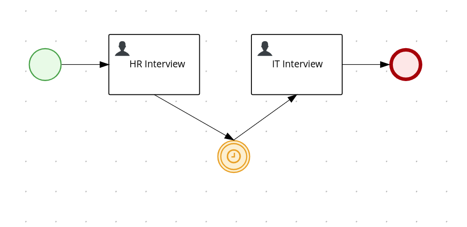
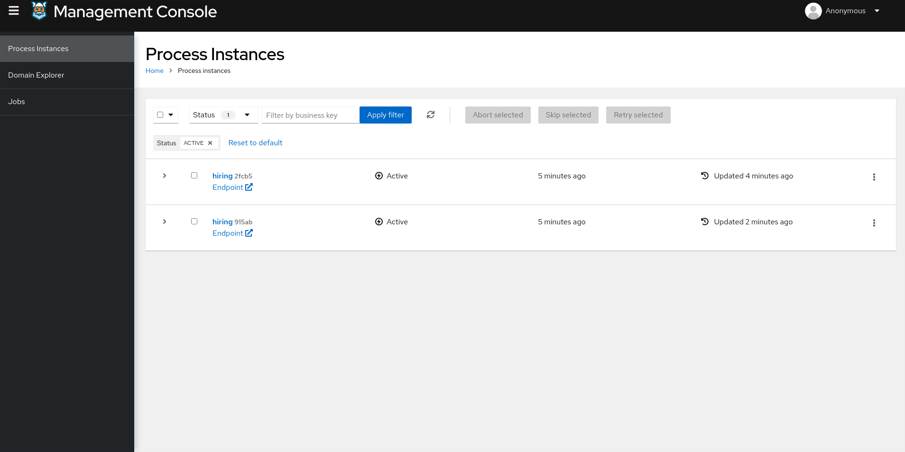
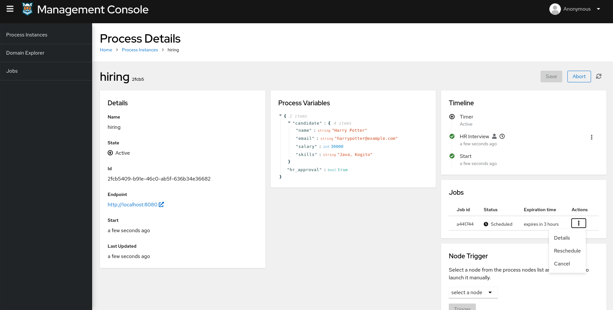
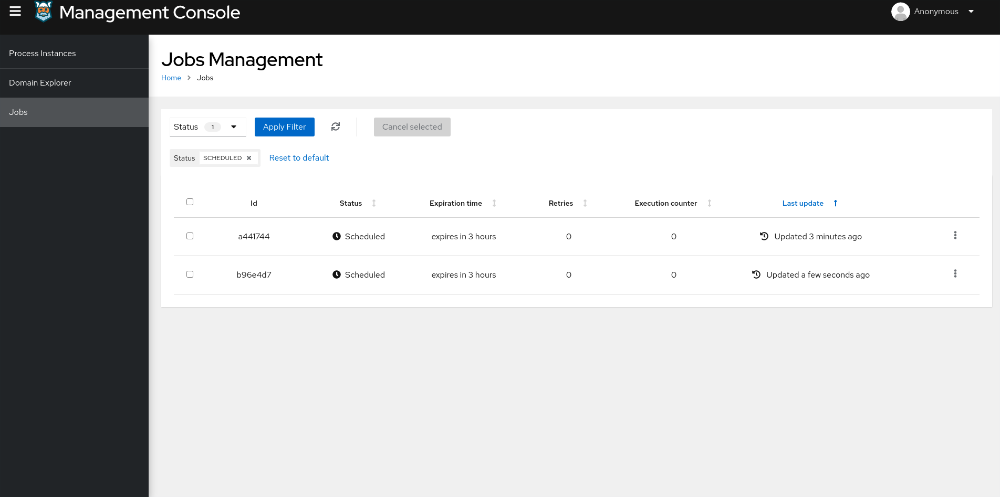
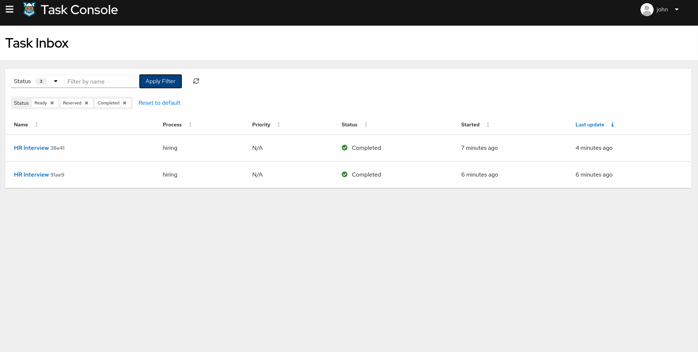

# 03.- Kogito Jobs Services Example

## Description

This Quickstart showcases a implementation of the **Hiring** process with **Jobs Services**, to add timer between nodes of a process and to execute a job. Those jobs can be rescheduled or cancelled by interacting with Management console application.

The required *Kogito and Infrastructure Services* for this example are:

- Infinispan
- Kafka
- Kogito Data Index
- Kogito Jobs Services
- Kogito Management Console
- Kogito Task Console

## Running the Quickstart

### Prerequisites

* Java 11+ installed
* Environment variable JAVA_HOME set accordingly
* Maven 3.6.2+ installed
* Docker and Docker Compose to run the required example infrastructure.

### Starting the Kogito and Infrastructure Services

This quickstart provides a docker compose template that starts all the required services. This setup ensures that all services are connected with a default configuration.

You should start all the services before you execute any of the **Hiring** example, to do that please execute:

For Linux and MacOS:

1. Open a Terminal
2. Go to the Quickstart folder

```bash
cd <path_to_kogito_quickstart>/docker-compose
```

3. Run the ```startServices.sh``` script

```bash
sh ./startServices.sh
```

Once all services bootstrap, the following ports will be assigned on your local machine:

- Infinispan: 11222
- Kafka: 9092
- Data Index: 8180
- Jobs Services: 8580
- Management Console: 8280
- Task Console: 8380

> **_NOTE:_**  This step requires the project to be compiled, please consider runing a ```mvn clean compile``` command on the project root before running the ```startServices.sh``` script for the first time or any time you modify the project.

Once started you can simply stop all services by executing the ```docker-compose stop```.

### Starting the Hiring example

Once all the infrastructure services are ready, you can start the Hiring example by doing:

1. Open a Terminal
2. Go to the Quickstart folder
```bash
cd <path_to_kogito_quickstart>/
```
3.- Start the example with the command
```bash
mvn clean package quarkus:dev
```

### Job service

Jobs Service is a dedicated lightweight service responsible for scheduling jobs that aim to be fired at a given time.

### Starting a Hiring Process with Job service

* Adding job to a process

In this example, a timer is added between *HR interview* and *IT interview* which executes a job. This job can be rescheduled or cancelled on Management console application

<p align="center">
    
</p>


In a Terminal you can execute this command to start a **Hiring** process for the "Harry Potter" candidate:
```bash
curl -H "Content-Type: application/json" -H "Accept: application/json" -X POST http://localhost:8080/hiring -d @- << EOF
{   
    "candidate": {
        "name": "Harry Potter",
        "email": "harrypotter@example.com",
        "salary": 30000,
        "skills": "Java, Kogito"
    }
}
EOF
```

Other way to add a job to the process, create a process first and then link a job to it by executing this command on a Terminal:

```bash
curl -X POST \
  http://localhost:8580/jobs/ \
  -H 'Content-Type: application/json' \
  -d '{
	"id": "5093r837-7ba2-48ee-e7e87fb330f7",
	"priority": "1",
	"expirationTime": "2021-11-29T18:16:00Z",
	"callbackEndpoint": "http://localhost:8080/callback",
	"processInstanceId": <place a process id>
}'
```

### Kogito Management Console

To access the Kogito Management Console just open your browser and navigate to ``http://localhost:8280``.

<p align="center">
    
</p>

> **_NOTE:_**  For more information about how to work with Kogito Management Console, please refer to the [Kogito Documentation](https://docs.jboss.org/kogito/release/latest/html_single/#con-management-console_kogito-developing-process-services) page.

Jobs can be accessed in two ways on Management console:

You can navigate to process details page which has dedicated panel showing a list of jobs assocaited with the process instance.

<p align="center">
    
</p>

You can also check list of all the jobs available by navigating to jobs section.

<p align="center">
    
</p>

### Kogito Task Console

To access the Kogito Task Console just open your browser and navigate to ``http://localhost:8380`` and you should be redirected to the **Task Inbox**.

<p align="center">
    
</p>

> **_NOTE:_**  For more information about how to work with Kogito Task Console, please refer to the [Kogito Documentation](https://docs.jboss.org/kogito/release/latest/html_single/#con-task-console_kogito-developing-process-services) page.
