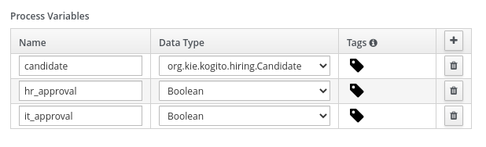
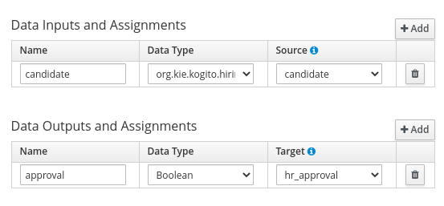
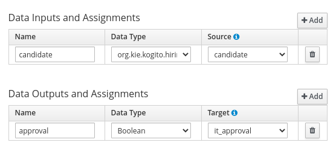

# Kogito Quickstarts

## Description

This module contains a set of examples that will help you to get started with both _Kogito Management Console_ & _Kogito Task Console_.

The quickstarts are based on a simple Hiring Process Kogito project. Starting by a basic example, each new one will be introducing new variants (such as authentication, jobs management...) that will give you a wider view of the Kogito Consoles.

Each example will provide the instructions and scripts to easily setup all the required infrastructure and run the example.

## The example

All the quickstarts are based on a simple Hiring process that drives a *Candidate* through different interviews until it gets hired.

### The Candidate data model

The *Hiring* example uses a *Candidate* POJO to represent the person that wants to get the job. You can find it in the *org.kie.kogito.hr* package.

```java
public class Candidate {

    private String name; // Name of the candidate
    private String email; // Email of the candidate
    private Integer salary; // Expected salary
    private String skills; // List of technical skills

    public Candidate(String name, String email, Integer salary, String skills) {
        this.name = name;
        this.email = email;
        this.salary = salary;
        this.skills = skills;
    }
    
    // Setters & getters...
}
```

### The Business Logic

The example process consists in two human tasks that will drive the candidate trough two interview with *HR* and *IT* departments represented by the *HR Interview* & *IT interview* User Tasks.

<p align="center">
    
</p>

#### Process data

<p align="center"></p>

The process handles three _Process Variables_:

* *candidate*: represents the candidate person that wants to get the job. It is an instance of *org.kie.kogito.hiring.Candidate*.
* *hr_approval*: a boolean that determines that HR department approves the hiring.
* *it_approval*: a boolean that determines that IT department approves the hiring.

### The Hiring process

The example process consists in two human tasks that will drive the candidate trough two interview with *HR* and *IT* departments.

<p align="center">
    
</p>

Once it starts, the process will move into the *HR Interview task*, this task represents an interview with someone from the company HR department.

The task will get the *candidate* as an input assignment and as an output it will generate an *approval* boolean that represents assesment of hiring or not hiring the *candidate*. It will be stored on the *hr_approval* process variable

<p align="center">
    
    <br/><i>HR Interview assignments</i>
</p>

After completing the *HR Interview* the candidate moves to the *IT Interview* task with the company IT department. Ashe task will get the *candidate* as an input assignment and as an output it will generate an *approval* boolean that represents assesment of hiring or not hiring the *candidate*.

<p align="center">
    
    <br/><i>IT Interview assignments</i>
</p>

## Quickstarts Summary

[01.- Kogito Basic Example](01-kogito-basic-example)
