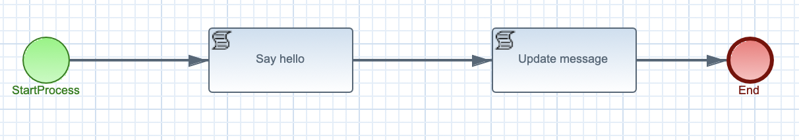
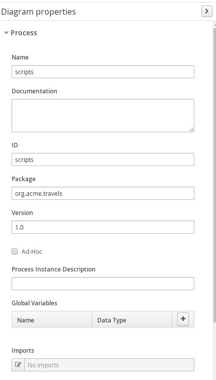
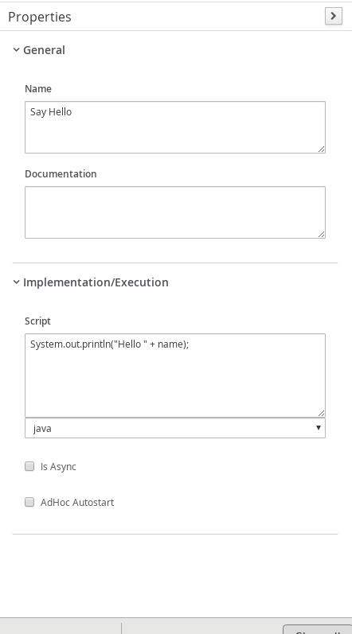

# Kogito script invocation

## Description

A quickstart project is the simplest hello world kind of example, it accepts input and replies with hello message.

This example shows

* invoking scripts from within process
		
<p align="center"></p>

* Diagram Properties (top)
<p align="center"></p>

* Diagram Properties (bottom)
<p align="center"></p>

* Hello Script Task
<p align="center"></p>	

* Update Message Script Task
<p align="center"></p>


## Build and run

### Prerequisites
 
You will need:
  - Java 1.8.0+ installed 
  - Environment variable JAVA_HOME set accordingly
  - Maven 3.5.4+ installed

When using native image compilation, you will also need: 
  - GraalVM 19.3+ installed  
  - Environment variable GRAALVM_HOME set accordingly
  - GraalVM native image needs as well native-image extension: https://www.graalvm.org/docs/reference-manual/native-image/        
  - Note that GraalVM native image compilation typically requires other packages (glibc-devel, zlib-devel and gcc) to be installed too, please refer to GraalVM installation documentation for more details.
    
### Compile and Run in Local Dev Mode

```
mvn clean package quarkus:dev    
```

NOTE: With dev mode of Quarkus you can take advantage of hot reload for business assets like processes, rules, decision tables and java code. No need to redeploy or restart your running application.


### Compile and Run using Local Native Image
Note that this requires GRAALVM_HOME to point to a valid GraalVM installation

```
mvn clean package -Pnative
```
  
To run the generated native executable, generated in `target/`, execute

```
./target/kogito-scripts-quarkus-{version}-runner
```

### Use the application

Examine OpenAPI via swagger UI at [http://localhost:8080/swagger-ui](http://localhost:8080/swagger-ui)
(Dev Mode Only) https://quarkus.io/guides/openapi-swaggerui#use-swagger-ui-for-development

### Submit a request

To make use of this application it is as simple as putting a sending request to `http://localhost:8080/scripts`  with following content 

```
{
"name" : "john"
}

```

Complete curl command can be found below:

```
curl -X POST -H 'Content-Type:application/json' -H 'Accept:application/json' -d '{"name" : "john"}' http://localhost:8080/scripts
```

Log after curl executed
```
{"id":"ab5239e2-f497-4684-b337-5a44440b38dd","name":"john","message":"Hello john"} 
```

Likewise on Quarkus you should see a similar log to
```
Hello john"
```