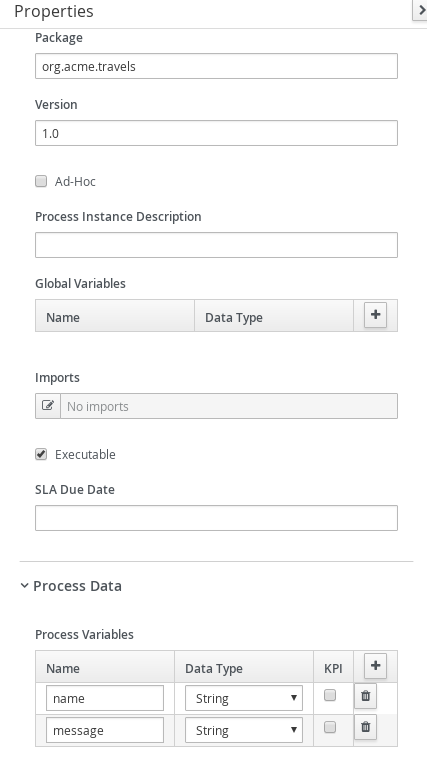
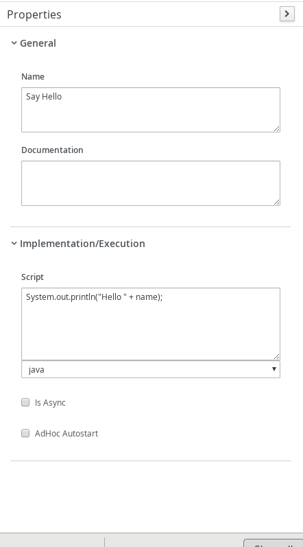

# Kogito script invocation

## Description

A quickstart project is the simplest hello world kind of example, it accepts input and replies with hello message.

This example shows

* invoking scripts from within process
			
<p align="center"></p>

* Diagram Properties
<p align="center"></p>

* Diagram Properties
<p align="center"></p>

* Hello Script Task
<p align="center"></p>	

* Update Message Script Task
<p align="center"></p>


## Build and run

### Prerequisites
 
You will need:
  - Java 1.8.0+ installed 
  - Environment variable JAVA_HOME set accordingly
  - Maven 3.5.4+ installed

### Compile and Run in Local Dev Mode

```
mvn clean package spring-boot:run    
```


### Compile and Run using uberjar

```
mvn clean package 
```
  
To run the generated native executable, generated in `target/`, execute

```
java -jar target/kogito-scripts-sprintboot-{version}.jar
```

### Use the application


### Submit a request

To make use of this application it is as simple as putting a sending request to `http://localhost:8080/scripts`  with following content 

```
{
"name" "john"
}

```

Complete curl command can be found below:

```
curl -X POST -H 'Content-Type:application/json' -H 'Accept:application/json' -d '{"name" : "john"}' http://localhost:8080/scripts
```

After executing the above you should see a log similar to

<p align="center"></p>

And a message after the curl command such as

<p align="center"></p>

