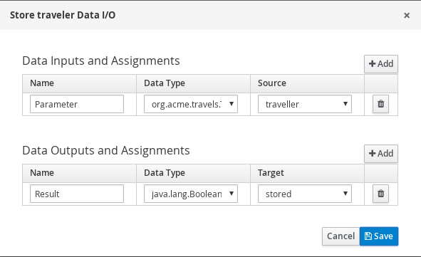
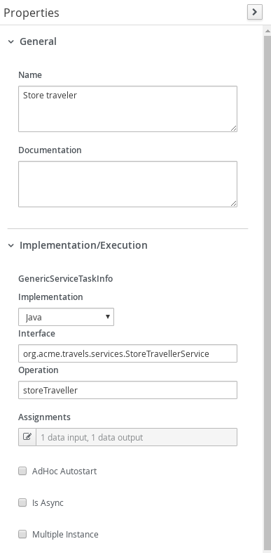
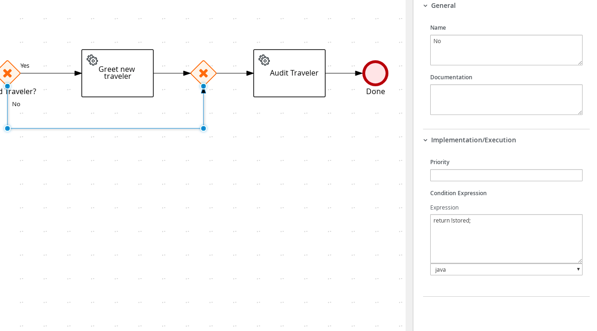
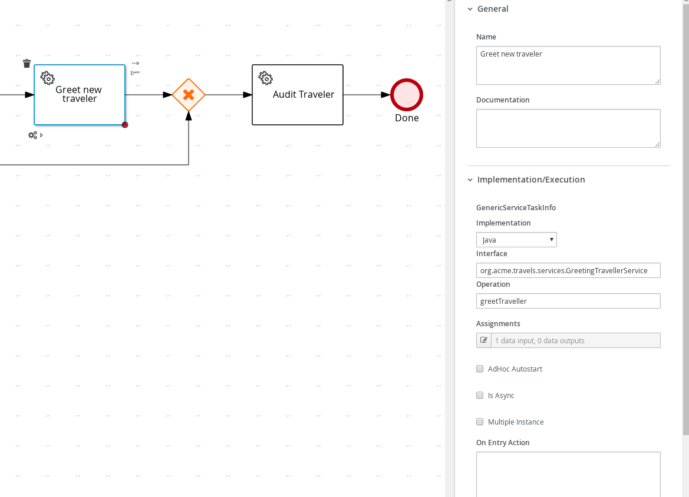
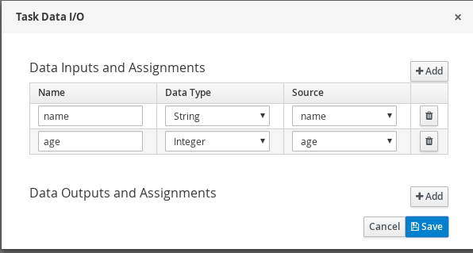

# Kogito Service invocation

## Description

A quickstart project that processes travellers in the system. It's main purpose is to illustrate local service invocation.

This example shows

* invoking local service class that is a injectable bean
* control flow based on service calls
	
* New Travelers Diagram	
<p align="center"></p>

* New Travelers Diagram Properties	
<p align="center"></p>

* New Travelers Diagram	Properties
<p align="center"></p>

* Store Traveler Service Call 
<p align="center"></p>

* Store Traveler Service Call 
<p align="center"></p>

* Store Traveler Service Call 
<p align="center"></p>

* Stored Traveler Gateway Yes Connector 
<p align="center"></p>

* Stored Traveler Gateway No Connector 
<p align="center"></p>

* Greet New  Traveler Service Call 
<p align="center"></p>

* Greet New  Traveler Service Call 
<p align="center"></p>

* Audit Traveler Service Call 
<p align="center"></p>

* Audit Traveler Service Call 
<p align="center"></p>

* Multi Params Process 
<p align="center"></p>

* Multi Params Diagram Properties 
<p align="center"></p>

* Multi Params Diagram Properties 
<p align="center"></p>

* Hello Service Calls 
<p align="center"></p>

* Hello Service Calls 
<p align="center"></p>

## Build and run

### Prerequisites
 
You will need:
  - Java 1.8.0+ installed 
  - Environment variable JAVA_HOME set accordingly
  - Maven 3.5.4+ installed

When using native image compilation, you will also need: 
  - GraalVM 19.1+ installed
  - Environment variable GRAALVM_HOME set accordingly
  - Note that GraalVM native image compilation typically requires other packages (glibc-devel, zlib-devel and gcc) to be installed too, please refer to GraalVM installation documentation for more details.

### Compile and Run in Local Dev Mode

```
mvn clean package quarkus:dev    
```

NOTE: With dev mode of Quarkus you can take advantage of hot reload for business assets like processes, rules, decision tables and java code. No need to redeploy or restart your running application.


### Compile and Run using Local Native Image
Note that this requires GRAALVM_HOME to point to a valid GraalVM installation

```
mvn clean package -Pnative
```
  
To run the generated native executable, generated in `target/`, execute

```
./target/kogito-service-calls-quarkus-{version}-runner
```

### Use the application

Examine OpenAPI via swagger UI at [http://localhost:8080/swagger-ui](http://localhost:8080/swagger-ui)


### Submit a traveller

To make use of this application it is as simple as putting a sending request to `http://localhost:8080/travellers`  with following content 

```
{
"traveller" : { 
  "firstName" : "John", 
  "lastName" : "Doe", 
  "email" : "jon.doe@example.com", 
  "nationality" : "American",
  "address" : { 
  	"street" : "main street", 
  	"city" : "Boston", 
  	"zipCode" : "10005", 
  	"country" : "US" }
  }
}

```

Complete curl command can be found below:

```
curl -X POST -H 'Content-Type:application/json' -H 'Accept:application/json' -d '{"traveller" : { "firstName" : "John", "lastName" : "Doe", "email" : "jon.doe@example.com", "nationality" : "American","address" : { "street" : "main street", "city" : "Boston", "zipCode" : "10005", "country" : "US" }}}' http://localhost:8080/travellers
```

After the above command you should see a log similar to the following

<p align="center"></p>

### Calling a Simple Hello Service

To call Hello Service send a request to `http://localhost:8080/multiparams`  with following content 

```
{
  "name" : "John", 
  "age" : 44, 
}
```

Complete curl command can be found below:
```
curl -X POST -H 'Content-Type:application/json' -H 'Accept:application/json' -d '{"name" : "John", "age" : 44}' http://localhost:8080/multiparams
```

After the above command you should see a log similar to the following

<p align="center"></p>
