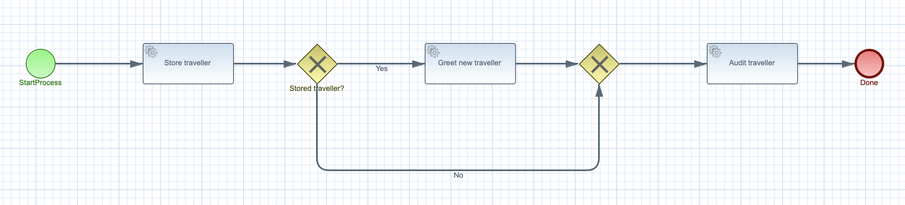

# Kogito Service invocation

## Description

A quickstart project that processes travellers in the system. It's main purpose is to illustrate local service invocation.

This example shows

* invoking local service class that is a injectable bean
* control flow based on service calls
	
	
<p align="center"></p>


## Build and run

### Prerequisites
 
You will need:
  - Java 1.8.0+ installed 
  - Environment variable JAVA_HOME set accordingly
  - Maven 3.5.4+ installed

### Compile and Run in Local Dev Mode

```
mvn clean package spring-boot:run    
```


### Compile and Run using uberjar

```
mvn clean package 
```
  
To run the generated native executable, generated in `target/`, execute

```
java -jar target/kogito-service-calls-sprintboot-{version}.jar
```

### Use the application


### Submit a traveller

To make use of this application it is as simple as putting a sending request to `http://localhost:8080/travellers`  with following content 

```
{
"traveller" : { 
  "firstName" : "John", 
  "lastName" : "Doe", 
  "email" : "jon.doe@example.com", 
  "nationality" : "American",
  "address" : { 
  	"street" : "main street", 
  	"city" : "Boston", 
  	"zipCode" : "10005", 
  	"country" : "US" }
  }
}

```

Complete curl command can be found below:

```
curl -X POST -H 'Content-Type:application/json' -H 'Accept:application/json' -d '{"traveller" : { "firstName" : "John", "lastName" : "Doe", "email" : "jon.doe@example.com", "nationality" : "American","address" : { "street" : "main street", "city" : "Boston", "zipCode" : "10005", "country" : "US" }}}' http://localhost:8080/travellers
```

