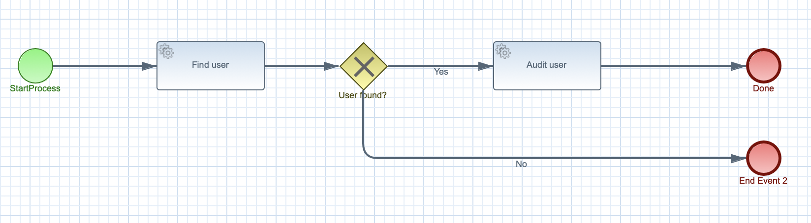

# Kogito Service invocation with REST call

## Description

A quickstart project that processes users in the system. It's main purpose is to to call external REST service
to load a given user by its username.

This example shows

* invoking remote REST service
* control flow based on service calls	
	
<p align="center"></p>

In addition, it takes advantage of MicroProfile fault tolerance support to fallback if there are any errors
during REST service invocation.

## Build and run

### Prerequisites
 
You will need:
  - Java 1.8.0+ installed 
  - Environment variable JAVA_HOME set accordingly
  - Maven 3.5.4+ installed

When using native image compilation, you will also need: 
  - GraalVM 19.1+ installed
  - Environment variable GRAALVM_HOME set accordingly
  - Note that GraalVM native image compilation typically requires other packages (glibc-devel, zlib-devel and gcc) to be installed too, please refer to GraalVM installation documentation for more details.

### Compile and Run in Local Dev Mode

```
mvn clean package quarkus:dev    
```

NOTE: With dev mode of Quarkus you can take advantage of hot reload for business assets like processes, rules, decision tables and java code. No need to redeploy or restart your running application.


### Compile and Run using Local Native Image
Note that this requires GRAALVM_HOME to point to a valid GraalVM installation

```
mvn clean package -Pnative
```
  
To run the generated native executable, generated in `target/`, execute

```
./target/kogito-service-rest-call-quarkus-{version}-runner
```

### Use the application

Examine OpenAPI via swagger UI at [http://localhost:8080/swagger-ui](http://localhost:8080/swagger-ui)


### Submit a user name

To make use of this application it is as simple as putting a sending request to `http://localhost:8080/users`  with following content 

```
{
"username" : "test"
}

```

Complete curl command can be found below:

```
curl -X POST -H 'Content-Type:application/json' -H 'Accept:application/json' -d '{"username" : "test"}' http://localhost:8080/users
```
