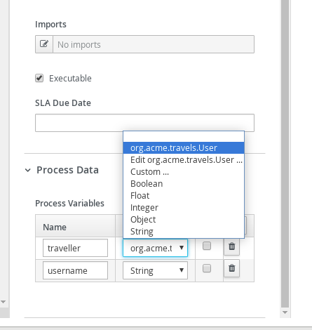

# Kogito Service invocation with REST call

## Description

A quickstart project that processes users in the system. It's main purpose is to to call external REST service
to load a given user by its username.

This example shows

* invoking remote REST service
* control flow based on service calls	
		
* Diagram	
<p align="center"></p>

* Diagram Properties
<p align="center"></p>

* Diagram Properties
<p align="center"></p>

* Diagram Properties
<p align="center"></p>

* Find User Service Call
<p align="center"></p>

* Find User Service Call
<p align="center"></p>

* Find User Gateway Yes
<p align="center"></p>

* Find User Gateway No
<p align="center"></p>

* Audit User Service Rest Call
<p align="center"></p>

* Audit User Service Rest Call
<p align="center"></p>

## Build and run

### Prerequisites
 
You will need:
  - Java 11+ installed 
  - Environment variable JAVA_HOME set accordingly
  - Maven 3.6.2+ installed

### Compile and Run in Local Dev Mode

```
mvn clean package spring-boot:run    
```


### Compile and Run using uberjar

```
mvn clean package 
```
  
To run the generated native executable, generated in `target/`, execute

```
java -jar target/kogito-service-rest-call-sprintboot-{version}.jar
```

### Use the application


### Submit a user name

To make use of this application it is as simple as putting a sending request to `http://localhost:8080/users`  with following content 

```
{
"username" : "test"
}

```

Complete curl command can be found below:

```
curl -X POST -H 'Content-Type:application/json' -H 'Accept:application/json' -d '{"username" : "test"}' http://localhost:8080/users
```

After the above command you should see some log on Springboot sush as following

* Springboot Log
<p align="center"></p>

To test the other route possible for unknown user send request to `http://localhost:8080/users`  with following content 

```
{
"username" : "nonexisting"
}

```


Complete curl command can be found below:

```
curl -X POST -H 'Content-Type:application/json' -H 'Accept:application/json' -d '{"username" : "nonexisting"}' http://localhost:8080/users
```

After the above command nothing will show on Springboot log as the user is skipped but you should see the following on terminal after curl

* Curl Log
<p align="center"></p>
