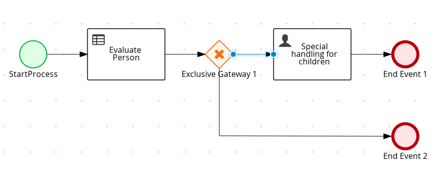
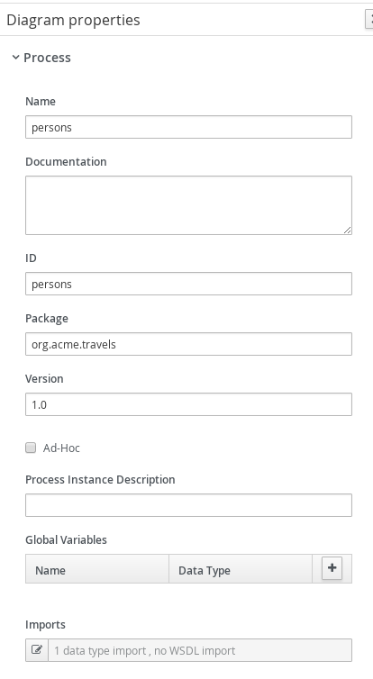
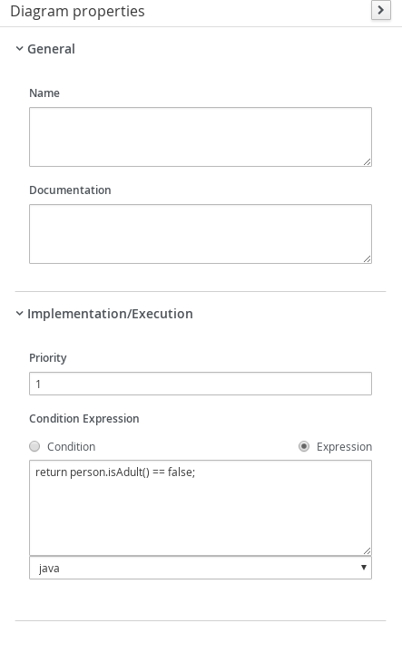

# Process with Business Rules

## Description

A quickstart project that shows the use of business rules and processes

This example shows

* make use of DRL to define rules
* make use of business rules task in the process to evaluate rules


<p align="center"></p>

* Diagram Properties (top)
<p align="center"></p>

* Diagram Properties (bottom)
<p align="center"></p>

* Evaluate Person Business Rule (top)
<p align="center"></p>

* Evaluate Person Business Rule (bottom)
<p align="center"></p>

* Evaluate Person Business Rule (Assignments)
<p align="center"></p>

* Exclusive Gateway
<p align="center"></p>

* Exclusive Gateway For Adult Connector
<p align="center"></p>

* Exclusive Gateway For Children Connector
<p align="center"></p>

* Special Handling for Children (top)
<p align="center"></p>

* Special Handling for Children (middle)
<p align="center"></p>

* Special Handling for Children (bottom)
<p align="center"></p>

* Special Handling for Children (Assignments)
<p align="center"></p>


## Build and run

### Prerequisites

You will need:
  - Java 11+ installed
  - Environment variable JAVA_HOME set accordingly
  - Maven 3.9.11+ installed

### Compile and Run in Local Dev Mode

```
mvn clean compile spring-boot:run
```


### Package and Run using uberjar

```
mvn clean package
```

To run the generated native executable, generated in `target/`, execute

```
java -jar target/process-business-rules-springboot.jar
```

### OpenAPI (Swagger) documentation
[Specification at swagger.io](https://swagger.io/docs/specification/about/)

You can take a look at the [OpenAPI definition](http://localhost:8080/v3/api-docs) - automatically generated and included in this service - to determine all available operations exposed by this service. For easy readability you can visualize the OpenAPI definition file using a UI tool like for example available [Swagger UI](https://editor.swagger.io).

In addition, various clients to interact with this service can be easily generated using this OpenAPI definition.


## Example Usage

Once the service is up and running we can invoke the REST endpoints and examine the logic.

### Submit a request

To make use of this application it is as simple as putting a sending request to `http://localhost:8080/persons`  with appropriate contents. See the following two cases:

#### Adult person

Given data:

```json
{
  "person" : {
    "name" : "john",
    "age" : 20
  }
}

```

Submit the JSON object from above:

```
curl -X POST -H 'Content-Type:application/json' -H 'Accept:application/json' -d '{"person" : {"name" : "john", "age" : 20}}' http://localhost:8080/persons
```

After the Curl command you should see a similar console log

```
{
    "id":"fd4f629d-6822-4ca2-a8a6-a74f5f81e83d",
    "person":{
        "name":"john",
        "age":20,
        "adult":true
    }
}
```

Because the person is evaluated as an adult, no outstanding tasks should be here for given person.

We can verify there is no task running for Children Handling using following command:

```
curl http://localhost:8080/usertasks/instance?user=jdoe
```
where uuid is the id returned in the previous step.

#### A Child

Given data:

```json
{
    "person" : {
        "name" : "john",
        "age" : 5
    }
}
```

Submit the JSON object from above:

```sh
curl -X POST -H 'Content-Type:application/json' -H 'Accept:application/json' -d '{"person" : {"name" : "john", "age" : 5}}' http://localhost:8080/persons
```

After the Curl command you should see a similar console log

```json
{
    "id":"c59054b9-aa1d-4771-bc5e-40f8b32d3ff5",
    "person":{
        "name":"john",
        "age":5,
        "adult":false
    }
}
```

Because the person is not evaluated as an adult, there should be outstanding tasks for given person.

To verify there is a running user task for Children

```sh
curl http://localhost:8080/usertasks/instance?user=jdoe 
```

Should return something like

```json
[{"id":"1676f775-0759-4579-9676-f5c433689c2a","userTaskId":"_D9CFCEE9-BCDF-48D0-8CB4-A55584DF0D9D",...}]
```

Then we can complete the user task and validate child with

```sh
curl -X POST "http://localhost:8080/usertasks/instance/{userTaskId}/transition?user=jdoe" -H "content-type: application/json" -d '{"transitionId": "complete","data": {"approve": true}}'
```

Where userTaskId is id returned from the previous query

Should return something similar to

```json
{
  "id": "1676f775-0759-4579-9676-f5c433689c2a",
  "userTaskId": "_D9CFCEE9-BCDF-48D0-8CB4-A55584DF0D9D",
  "status": {
    "terminate": "COMPLETED",
    "name": "Completed"
  },
  "taskName": "ChildrenHandling",
  ...
}
```
and there should be no outstanding task for the person anymore.
