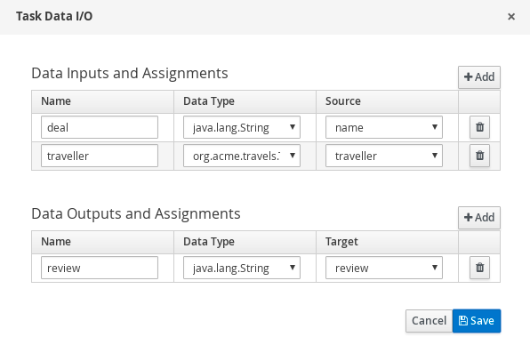
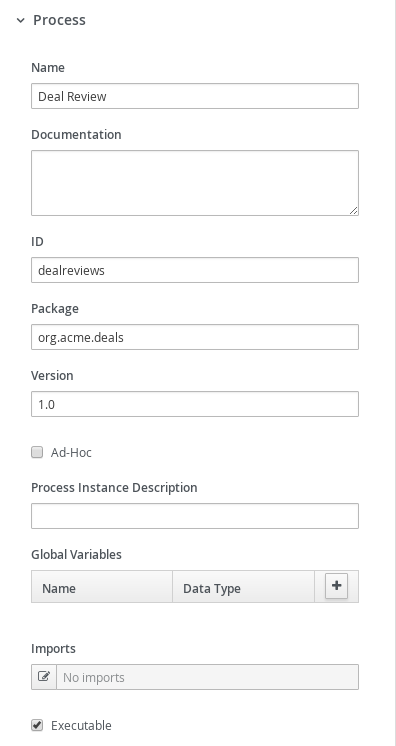
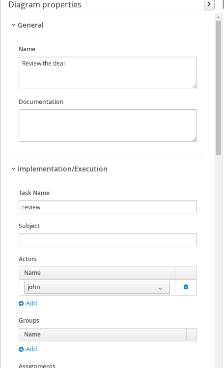
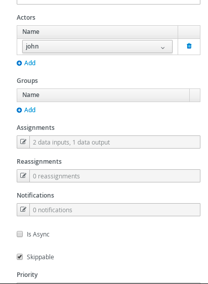
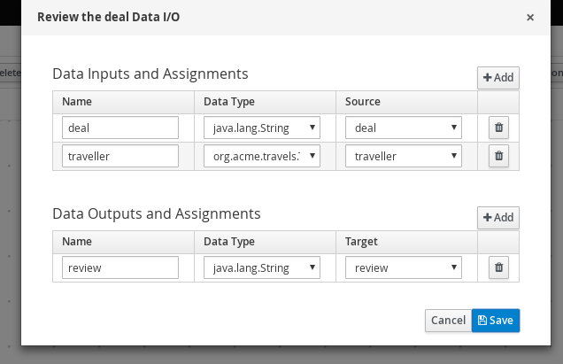
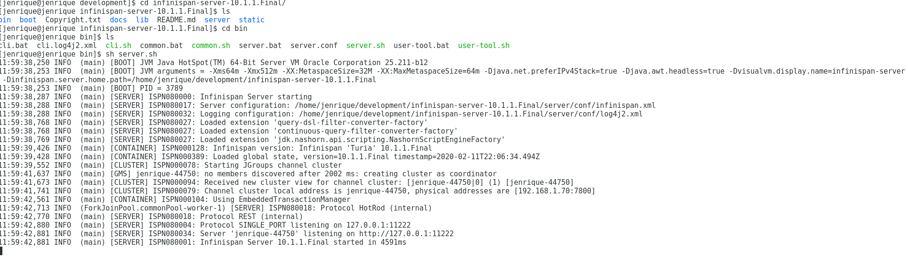

# Process with persistence powered by Infinispan

## Description

A quickstart project that processes deals for travellers. It utilizes process composition to split the work of:

* submitting a deal
* reviewing a deal

At the same time shows simplified version of an approval process that waits for a human actor to provide review.

This example shows

* exposing Submit Deal as public service
* each process instance is going to be evaluated and asks for review
* at any point in time service can be shutdown and when brought back it will keep the state of the instances

Note: The use of this example shows that the data sent to Infinispan is saved, you can shut down the application and restart it
and as long as Infinispan is running after you restart you should still see the data

It utilizes Infinispan server as the backend store.

* Process (submitDeal.bpmn)
<p align="center"></p>

* Process Properties (top)
<p align="center"></p>

* Process Properties (bottom)
<p align="center"></p>

* Call a deal
<p align="center"></p>

* Call a deal (Assignments)
<p align="center"></p>

* Print review the Deal
<p align="center"></p>

* Subprocess (reviewDeal.bpmn)
<p align="center"></p>

* Deal Review (top)
<p align="center"></p>

* Deal Review (bottom)
<p align="center"></p>

* Review deal user task	(top)
<p align="center"></p>

* Review deal user task (bottom)
<p align="center"></p>

* Review deal user task	(Assignments)
<p align="center"></p>

## Infrastructure requirements

This quickstart requires an Infinispan server to be available and by default expects it to be on default port and localhost.

You can install Infinispan server by downloading version 12.x from the [official website](https://infinispan.org/download/).

* Infinispan installed and running
<p align="center"></p>

## Build and run

### Prerequisites

You will need:
  - Java 11+ installed
  - Environment variable JAVA_HOME set accordingly
  - Maven 3.9.9+ installed

### Compile and Run in Local Dev Mode

```sh
mvn clean compile spring-boot:run
```

Kogito runtimes need to be able to safely handle concurrent requests to shared instances such as process instances, tasks, etc. This feature is optional and can be pluggable with persistence using the following property and value to the src/main/resources/application.properties file.

```
kogito.persistence.optimistic.lock=true 
```
Additionally, you can build this project with -PpersistenceWithLock  profile to run with persistence and lock on.

### Package and Run using uberjar

```sh
mvn clean package
```

To run the generated native executable, generated in `target/`, execute

```
java -jar target/process-infinispan-persistence-springboot.jar
```

### OpenAPI (Swagger) documentation
[Specification at swagger.io](https://swagger.io/docs/specification/about/)

You can take a look at the [OpenAPI definition](http://localhost:8080/v3/api-docs) - automatically generated and included in this service - to determine all available operations exposed by this service. For easy readability you can visualize the OpenAPI definition file using a UI tool like for example available [Swagger UI](https://editor.swagger.io).

In addition, various clients to interact with this service can be easily generated using this OpenAPI definition.


### Submit a deal

To make use of this application it is as simple as putting a sending request to `http://localhost:8080/deals`  with following content

```json
{
"name" : "my fancy deal",
"traveller" : {
  "firstName" : "John",
  "lastName" : "Doe",
  "email" : "jon.doe@example.com",
  "nationality" : "American",
  "address" : {
  	"street" : "main street",
  	"city" : "Boston",
  	"zipCode" : "10005",
  	"country" : "US" }
  }
}
```

Complete curl command can be found below:

```sh
curl -X POST -H 'Content-Type:application/json' -H 'Accept:application/json' -d '{"name" : "my fancy deal", "traveller" : { "firstName" : "John", "lastName" : "Doe", "email" : "jon.doe@example.com", "nationality" : "American","address" : { "street" : "main street", "city" : "Boston", "zipCode" : "10005", "country" : "US" }}}' http://localhost:8080/deals
```

this will then trigger the review user task that you can work.

### Get review task for given deal

You can display all active reviews of deals by running

```sh
curl http://localhost:8080/usertasks/instance?user=john
```

### Complete review task for given deal

Last but not least you can complete review user task by

```sh
curl -X POST -H 'Content-Type:application/json' -H 'Accept:application/json' -d '{"transitionId":"complete","data":{"review" : "very good work"}}' http://localhost:8080/usertasks/instance/{tuuid}/transition?user=john
```

where tuuid is the id of the user task you want to complete

* Review Log should look similar to

```
Review of the deal very good work for traveller Doe
```
