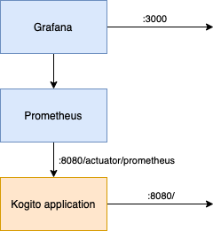

# Process + Spring Boot + Runtime metrics

## Description

This example demonstrates how to enable and consume the runtime metrics monitoring feature in Kogito with processes.

### Prerequisites

You will need:

- Java 11+ installed
- Environment variable JAVA_HOME set accordingly
- Maven 3.9.11+ installed
- Docker 19+ (only if you want to run the integration tests and/or you want to use the `docker-compose` script provided in this example).

### How to enable the feature

Import the following dependency in your `pom.xml`:

```XML

<dependency>
  <groupId>org.kie</groupId>
  <artifactId>kie-addons-springboot-monitoring-prometheus</artifactId>
</dependency>
```

### Architecture

Once you compile your Spring Boot project, a dashboard for each available process plus a global one will be generated under the
path `target/resources/dashboards/`. You can then inject those Grafana dashboards during the deployment of the Grafana instance.

The use case is summarized in the following schema:



To summarize, the kogito app will expose by default an endpoint `/actuator/prometheus` with the prometheus variables, and a prometheus instance will simply fetch
the data from there.

### Dashboards

Kogito currently exports one **operational** dashboard per process, which contains:

* Total number of created instances
* Total number of running instances
* Total number of completed instances
* Total number of instances that violated SLAs
* Average process execution time, counted as delta between the completion instant and the creation instant.

There's also a **Global** operational dashboard that contains the same graphs but with aggregated metrics for all the process types.

You can use these default dashboards, or you can personalize them and use your custom dashboards.

### Compile and Run in Local Dev Mode

It is possible to use `docker-compose` to demonstrate how to inject the generated dashboards in the volume of the Grafana container:

1. Run `mvn clean package` to build the project and generate dashboards.
2. Run `docker compose up` to start the applications.

The volumes of the Grafana container are properly set in the `docker-compose.yml` file, so that the dashboards are automatically loaded at startup.

To access the dashboards simply open http://localhost:3000/ on your browser once the containers are started.

The first time it may take a few seconds for the Grafana container to start and load everything, so if you can't see the web UI immediately, try
waiting 30 seconds.

## Example Usage

Once the service is up and running, you can use the following examples to interact with the service.

### POST /orders

Allows to create a new order with the given data:

```sh
curl -d '{"approver" : "john", "order" : {"orderNumber" : "12345", "shipped" : false}}' -H "Content-Type: application/json" -X POST http://localhost:8080/orders
```
or on windows

```sh
curl -d "{\"approver\" : \"john\", \"order\" : {\"orderNumber\" : \"12345\", \"shipped\" : false}}" -H "Content-Type: application/json" -X POST http://localhost:8080/orders
```

As response the updated order is returned.

### GET /orders

Returns list of orders currently active:

```sh
curl -X GET http://localhost:8080/orders
```

As response an array of orders is returned.

### GET /orders/{id}

Returns order with given id (if active):

```sh
curl -X GET http://localhost:8080/orders/1
```

As response a single order is returned if found, otherwise 404 Not Found is returned.

### DELETE /orders/{id}

Cancels order with given id

```sh
curl -X DELETE http://localhost:8080/orders/1
```

### GET /orderItems

Getting order items sub processes

```sh
curl -X GET http://localhost:8080/orderItems
```
Example response:
```json
[
  {
    "id":"66c11e3e-c211-4cee-9a07-848b5e861bc5",
    "order":
    {
      "orderNumber":"12345",
      "shipped":false,
      "total":0.537941914075738
    }
  }
]
```

### GET /usertasks/instance

Getting user tasks details awaiting user action

```sh
curl -X GET http://localhost:8080/usertasks/instance?user=john
```
Example response:

```json
[
  {
    "id": "bcbe9d60-4847-45f0-8069-e983f3f055e6",
    "userTaskId": "UserTask_1",
    "status": {
      "terminate": null,
      "name": "Reserved"
    },
    "taskName": "Verify order",
    ...
]
```

### POST /usertasks/instance/{taskId}/transition

Complete user task

```sh
curl -X POST "http://localhost:8080/usertasks/instance/{taskId}/transition?user=john" -H "content-type: application/json" -d '{"transitionId": "complete","data": {"approve": true}}'
```

As response the updated order is returned.

Example response:

```json
{
  "id": "bcbe9d60-4847-45f0-8069-e983f3f055e6",
  "userTaskId": "UserTask_1",
  "status": {
    "terminate": "COMPLETED",
    "name": "Completed"
  },
  "taskName": "Verify order",
  "taskDescription": null,
  "taskPriority": "1",
  "potentialUsers": [
    "john"
  ],
  "potentialGroups": [],
  "adminUsers": [],
  "adminGroups": [],
  "excludedUsers": [],
  "externalReferenceId": "eeae84c0-234d-472f-9fa0-004a2cf34cdc",
  "actualOwner": "john",
  "inputs": {
    "input1": {
      "orderNumber": "12345",
      "shipped": false,
      "total": 0.8903945184162633
    }
  },
  "outputs": {
    "approve": true
  },
  ...
}
```
