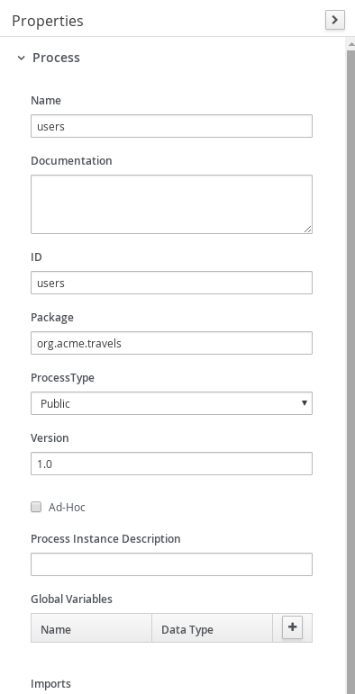
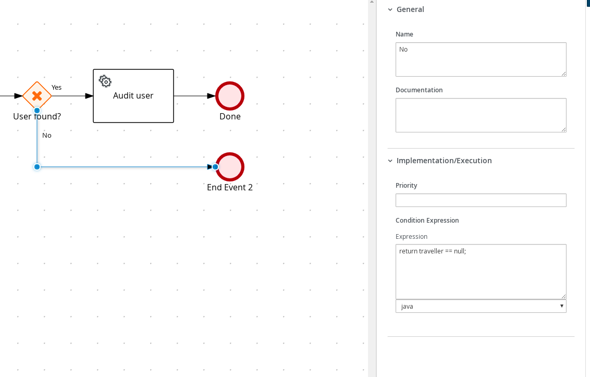

# Process Service invocation with REST call

## Description

A quickstart project that processes users in the system. It's main purpose is to to call external REST service
to load a given user by its username.

This example shows

* invoking remote REST service
* control flow based on service calls

* Diagram
<p align="center"></p>

* Diagram Properties
<p align="center"></p>

* Diagram Properties
<p align="center"></p>

* Diagram Properties
<p align="center"></p>

* Find User Service Call
<p align="center"></p>

* Find User Service Call
<p align="center"></p>

* Find User Gateway Yes
<p align="center"></p>

* Find User Gateway No
<p align="center"></p>

* Audit User Service Rest Call
<p align="center"></p>

* Audit User Service Rest Call
<p align="center"></p>

## Build and run

### Prerequisites

You will need:
  - Java 11+ installed
  - Environment variable JAVA_HOME set accordingly
  - Maven 3.8.6+ installed

### Compile and Run in Local Dev Mode

```sh
mvn clean compile spring-boot:run
```


### Package and Run using uberjar

```sh
mvn clean package
```

To run the generated native executable, generated in `target/`, execute

```sh
java -jar target/process-service-rest-call-springboot.jar
```

### OpenAPI (Swagger) documentation
[Specification at swagger.io](https://swagger.io/docs/specification/about/)

You can take a look at the [OpenAPI definition](http://localhost:8080/v3/api-docs) - automatically generated and included in this service - to determine all available operations exposed by this service. For easy readability you can visualize the OpenAPI definition file using a UI tool like for example available [Swagger UI](https://editor.swagger.io).

In addition, various clients to interact with this service can be easily generated using this OpenAPI definition.


### Submit a user name

To make use of this application it is as simple as putting a sending request to `http://localhost:8080/users`  with following content

```json
{
    "username" : "test"
}

```

Complete curl command can be found below:

```sh
curl -X POST -H 'Content-Type:application/json' -H 'Accept:application/json' -d '{"username" : "test"}' http://localhost:8080/users
```

After the above command you should see some log on Springboot sush as following

* Springboot Log
<p align="center"></p>

To test the other route possible for unknown user send request to `http://localhost:8080/users`  with following content

```json
{
    "username" : "nonexisting"
}

```


Complete curl command can be found below:

```sh
curl -X POST -H 'Content-Type:application/json' -H 'Accept:application/json' -d '{"username" : "nonexisting"}' http://localhost:8080/users
```

After the above command nothing will show on Springboot log as the user is skipped but you should see the following on terminal after curl

* Curl Log
<p align="center"></p>
