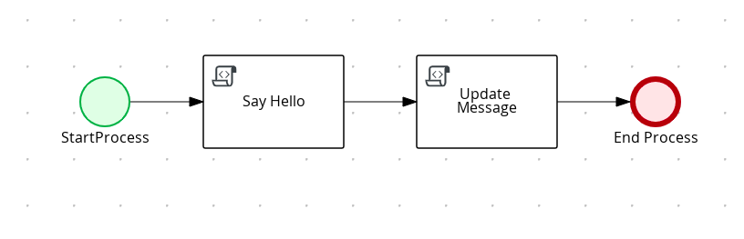
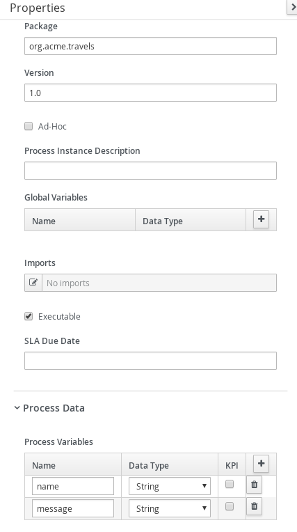
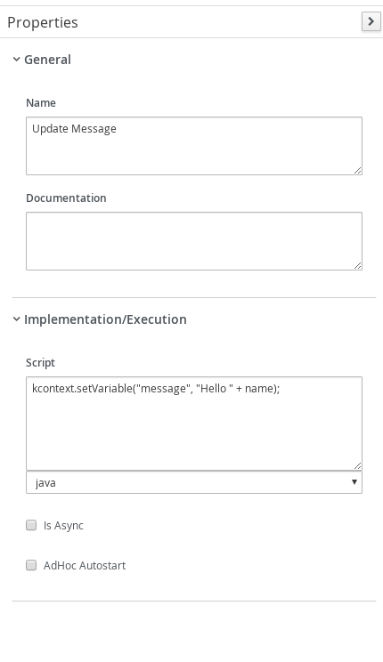

# Process script invocation

## Description

A quickstart project is the simplest hello world kind of example, it accepts input and replies with hello message.

This example shows

* invoking scripts from within process

<p align="center"></p>

* Diagram Properties (top)
<p align="center"></p>

* Diagram Properties (bottom)
<p align="center"></p>

* Hello Script Task
<p align="center"></p>

* Update Message Script Task
<p align="center"></p>


## Build and run

### Prerequisites

You will need:
  - Java 11+ installed
  - Environment variable JAVA_HOME set accordingly
  - Maven 3.8.6+ installed

### Compile and Run in Local Dev Mode

```sh
mvn clean compile spring-boot:run
```


### Package and Run using uberjar

```sh
mvn clean package
```

To run the generated native executable, generated in `target/`, execute

```sh
java -jar target/process-scripts-springboot.jar
```

### OpenAPI (Swagger) documentation
[Specification at swagger.io](https://swagger.io/docs/specification/about/)

You can take a look at the [OpenAPI definition](http://localhost:8080/v3/api-docs) - automatically generated and included in this service - to determine all available operations exposed by this service. For easy readability you can visualize the OpenAPI definition file using a UI tool like for example available [Swagger UI](https://editor.swagger.io).

In addition, various clients to interact with this service can be easily generated using this OpenAPI definition.


### Submit a request

To make use of this application it is as simple as putting a sending request to `http://localhost:8080/scripts`  with following content

```json
{
    "name" : "john"
}

```

Complete curl command can be found below:

```sh
curl -X POST -H 'Content-Type:application/json' -H 'Accept:application/json' -d '{"name" : "john"}' http://localhost:8080/scripts
```

Response should be similar to:

```json
{
    "id":"ab5239e2-f497-4684-b337-5a44440b38dd",
    "name":"john",
    "message":"Hello john"
}
```

And also in SpringBoot log you should see a log entry:

```
Hello john
```
