# Process Service invocation

## Description

A quickstart project that processes travellers in the system. It's main purpose is to illustrate local service invocation.

This example shows

* invoking local service class that is a injectable bean
* control flow based on service calls

* New Travelers Diagram
<p align="center">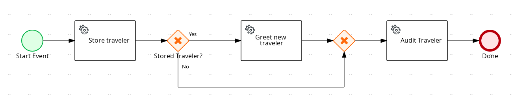</p>

* New Travelers Diagram Properties
<p align="center">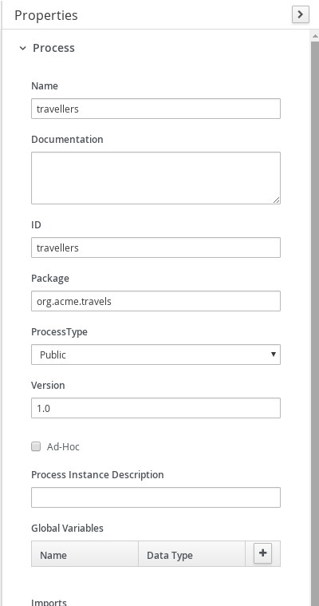</p>

* New Travelers Diagram	Properties
<p align="center"></p>

* Store Traveler Service Call
<p align="center">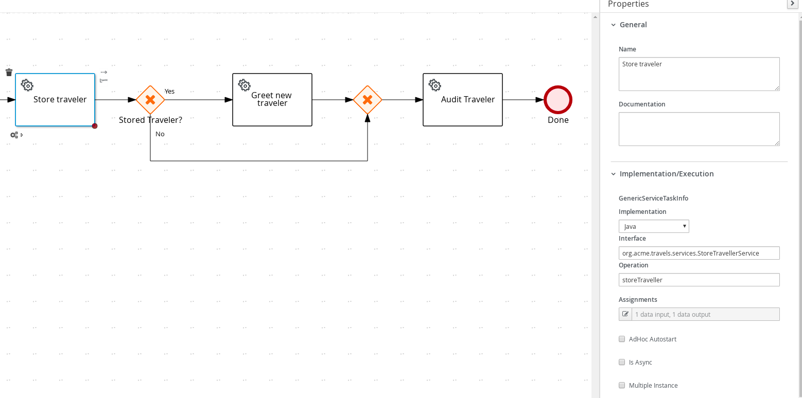</p>

* Store Traveler Service Call
<p align="center">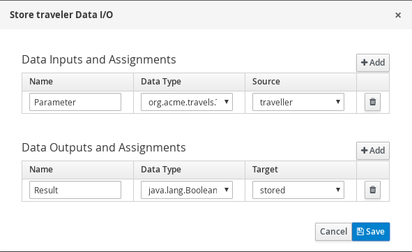</p>

* Store Traveler Service Call
<p align="center">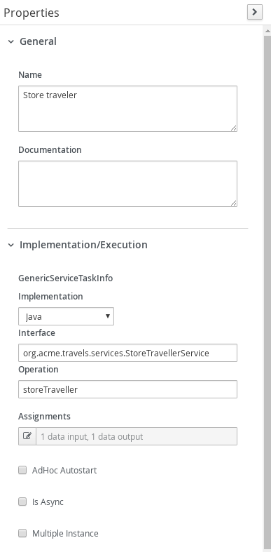</p>

* Stored Traveler Gateway Yes Connector
<p align="center">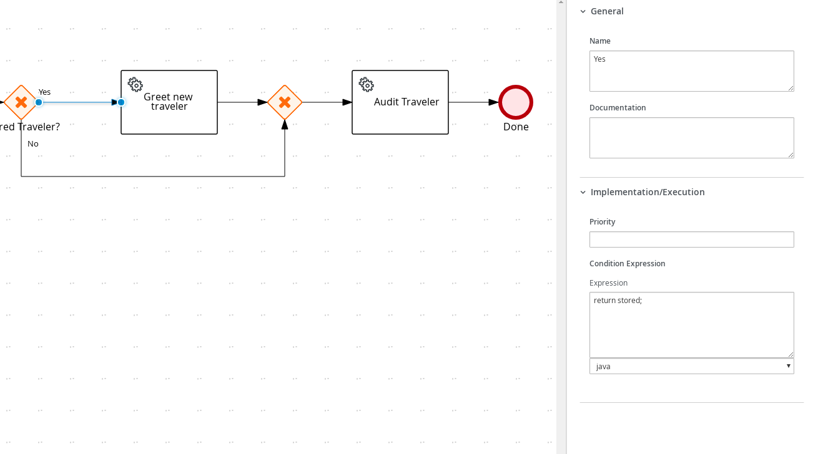</p>

* Stored Traveler Gateway No Connector
<p align="center">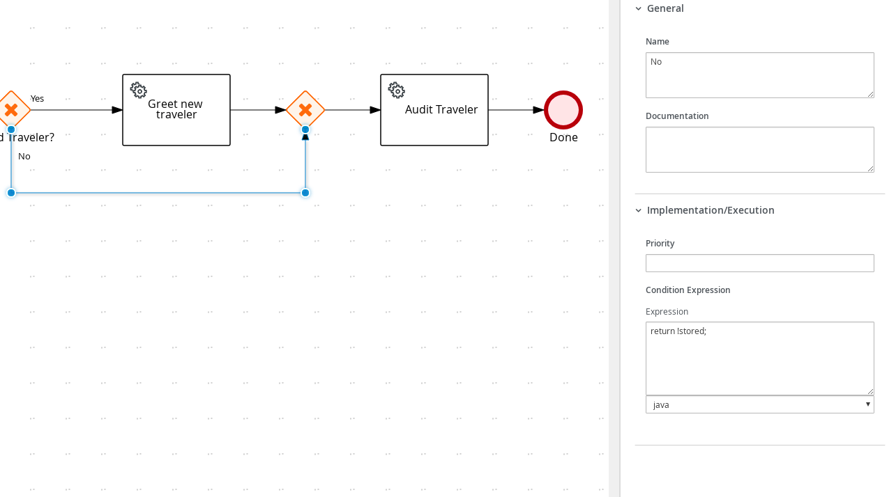</p>

* Greet New  Traveler Service Call
<p align="center">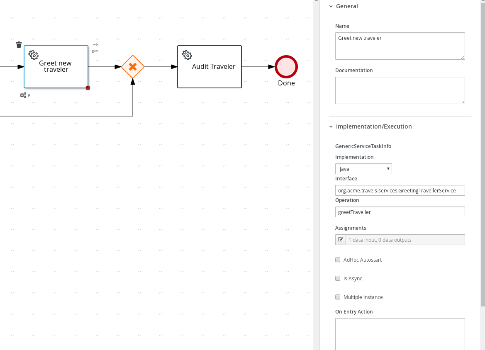</p>

* Greet New  Traveler Service Call
<p align="center">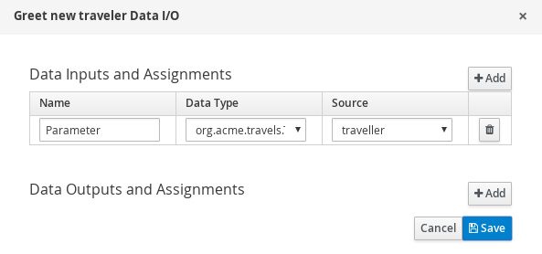</p>

* Audit Traveler Service Call
<p align="center">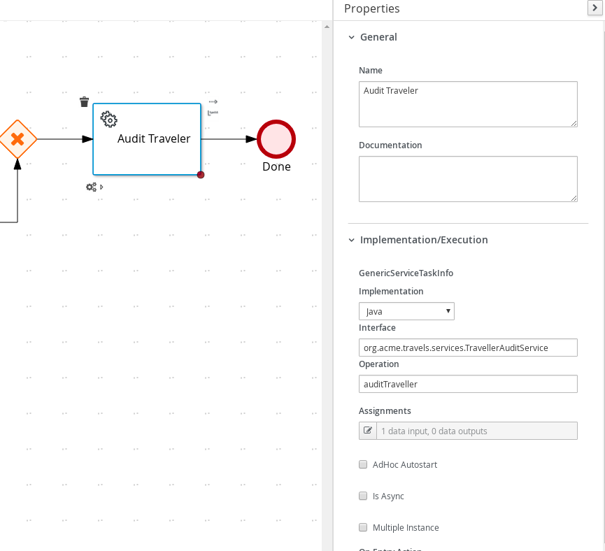</p>

* Audit Traveler Service Call
<p align="center"></p>

* Multi Params Process
<p align="center"></p>

* Multi Params Diagram Properties
<p align="center"></p>

* Multi Params Diagram Properties
<p align="center">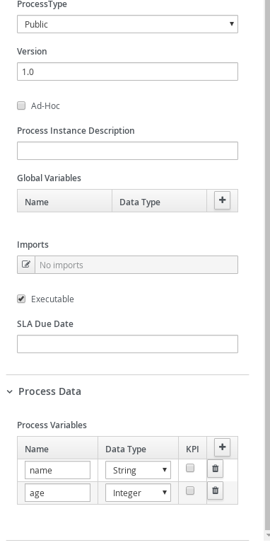</p>

* Hello Service Calls
<p align="center"></p>

* Hello Service Calls
<p align="center">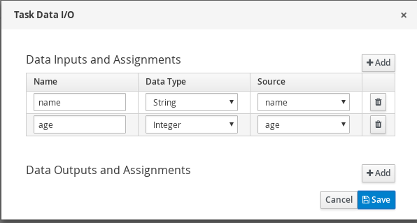</p>

## Build and run

### Prerequisites

You will need:
  - Java 11+ installed
  - Environment variable JAVA_HOME set accordingly
  - Maven 3.8.6+ installed

### Compile and Run in Local Dev Mode

```sh
mvn clean compile spring-boot:run
```


### Compile and Run using uberjar

```sh
mvn clean package
```

To run the generated native executable, generated in `target/`, execute

```sh
java -jar target/process-service-calls-springboot.jar
```

### OpenAPI (Swagger) documentation
[Specification at swagger.io](https://swagger.io/docs/specification/about/)

You can take a look at the [OpenAPI definition](http://localhost:8080/v3/api-docs) - automatically generated and included in this service - to determine all available operations exposed by this service. For easy readability you can visualize the OpenAPI definition file using a UI tool like for example available [Swagger UI](https://editor.swagger.io).

In addition, various clients to interact with this service can be easily generated using this OpenAPI definition.


### Submit a traveller

To make use of this application it is as simple as putting a sending request to `http://localhost:8080/travellers`  with following content

```json
{
"traveller" : {
  "firstName" : "John",
  "lastName" : "Doe",
  "email" : "jon.doe@example.com",
  "nationality" : "American",
  "address" : {
  	"street" : "main street",
  	"city" : "Boston",
  	"zipCode" : "10005",
  	"country" : "US" }
  }
}
```

Complete curl command can be found below:

```sh
curl -X POST -H 'Content-Type:application/json' -H 'Accept:application/json' -d '{"traveller" : { "firstName" : "John", "lastName" : "Doe", "email" : "jon.doe@example.com", "nationality" : "American","address" : { "street" : "main street", "city" : "Boston", "zipCode" : "10005", "country" : "US" }}}' http://localhost:8080/travellers
```

After the above command you should see a log similar to the following

<p align="center">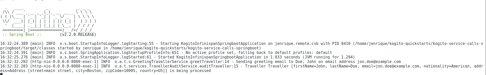</p>

### Calling a Simple Hello Service

To call Hello Service send a request to `http://localhost:8080/multiparams`  with following content

```json
{
  "name" : "John",
  "age" : 44,
}
```

Complete curl command can be found below:

```sh
curl -X POST -H 'Content-Type:application/json' -H 'Accept:application/json' -d '{"name" : "John", "age" : 44}' http://localhost:8080/multiparams
```

After the above command you should see a log similar to the following

<p align="center">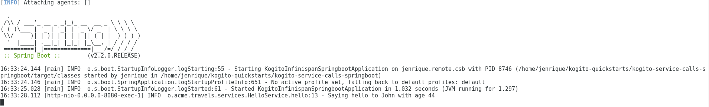</p>
