# Process timers

## Description

A quickstart project shows use of timer based activities within the process to
allow a flexible delays before continuing process execution. There are two types
of timers used in this quick start

* intermediate timer event - used as part of the regular process flow to introduce delays
* boundary timer event - used as an option to move process flow through alternative path after expiration time

This example shows

* working with timers (both intermediate and boundary)
* optionally use Job Service that allows to externalize time tracking to separate service and by that offload the runtime service


* Intermediate timer event (timers.bpmn)
<p align="center">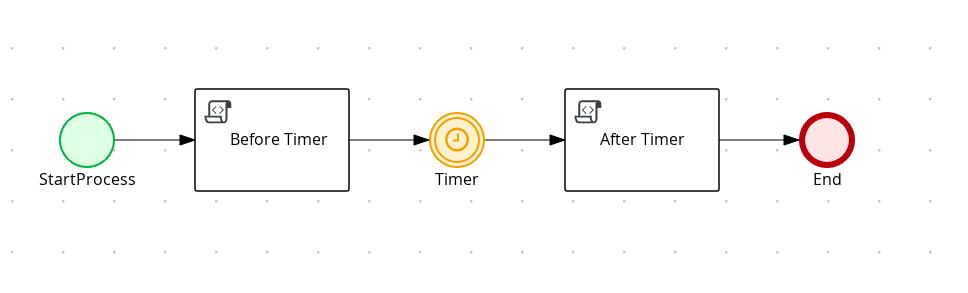</p>

* Intermediate timer Diagram Properties (top)
<p align="center">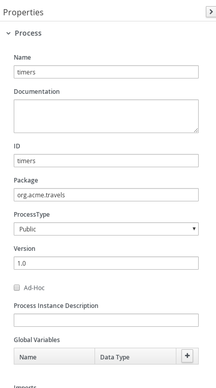</p>

* Intermediate timer Diagram Properties (bottom)
<p align="center">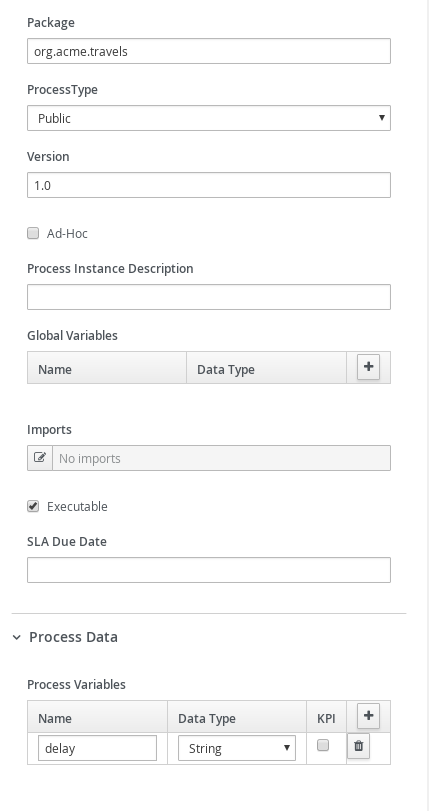</p>

* Intermediate timer Before Timer
<p align="center">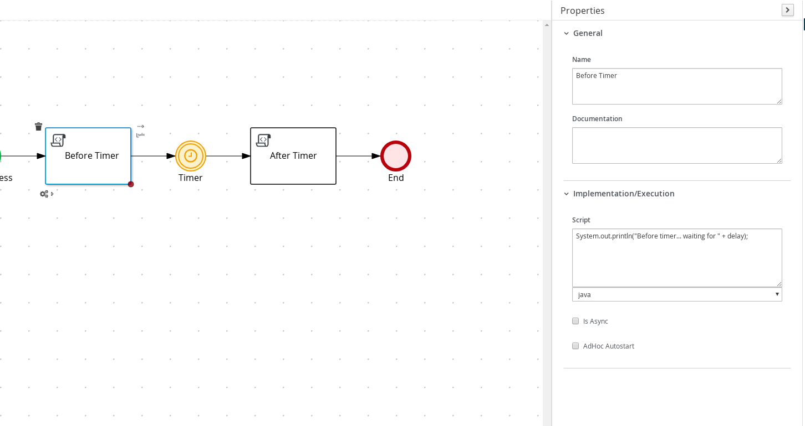</p>

* Intermediate timer Timer
<p align="center">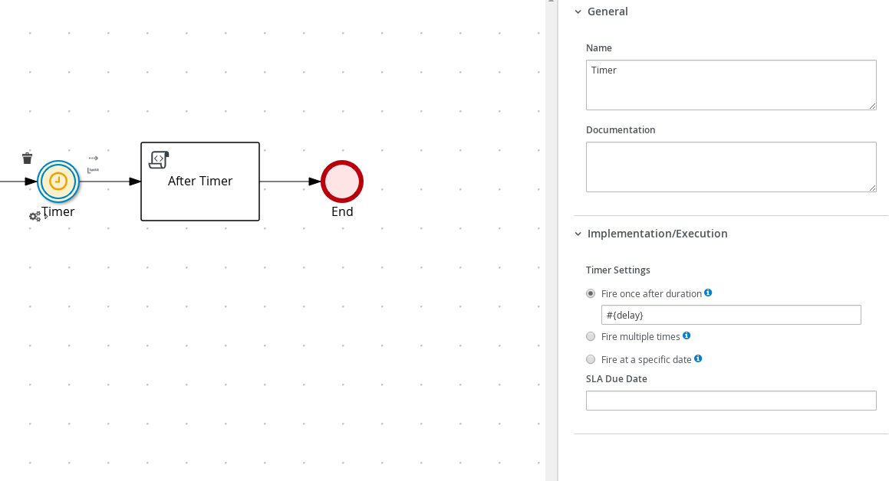</p>

* Intermediate timer After Timer
<p align="center">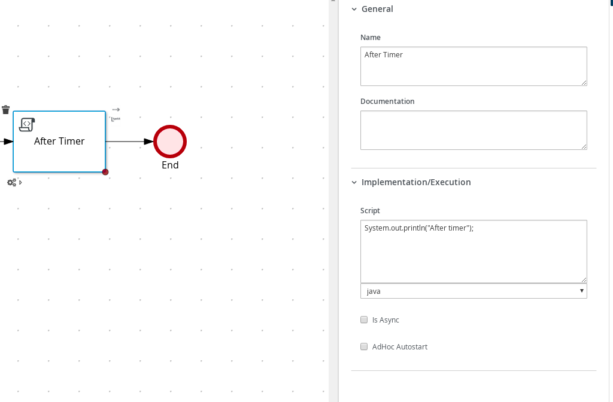</p>

* Boundary timer event (timer-on-task.bpmn)
<p align="center">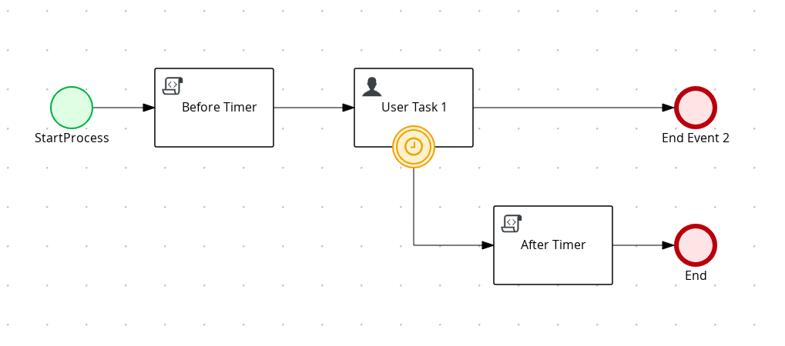</p>

* Boundary timer Diagram Properties (top)
<p align="center">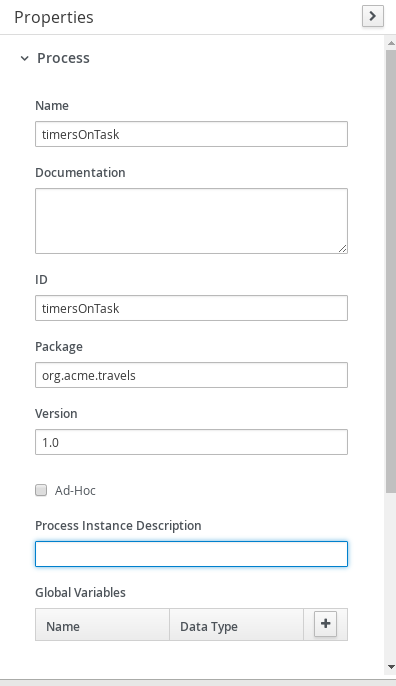</p>

* Boundary timer Diagram Properties (bottom)
<p align="center">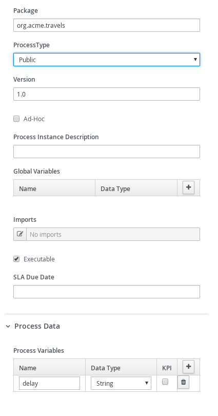</p>

* Boundary timer Before Timer
<p align="center">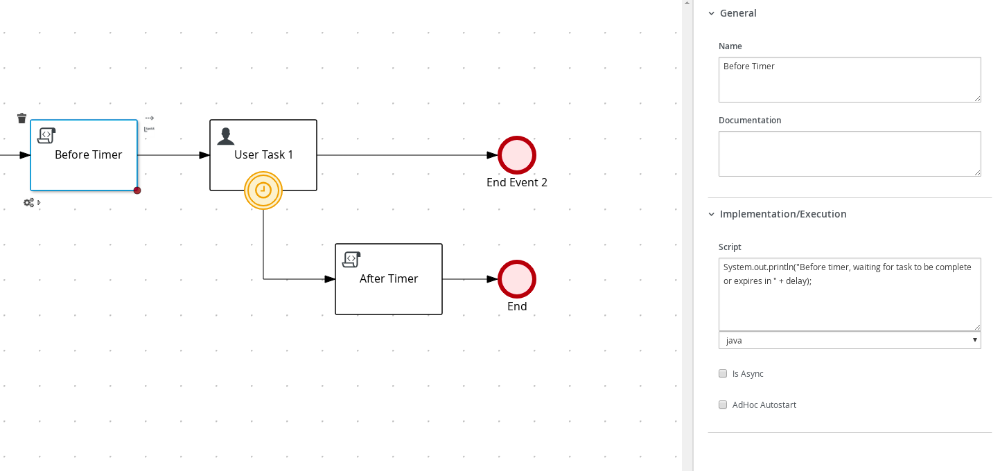</p>

* Boundary timer User Task (top)
<p align="center">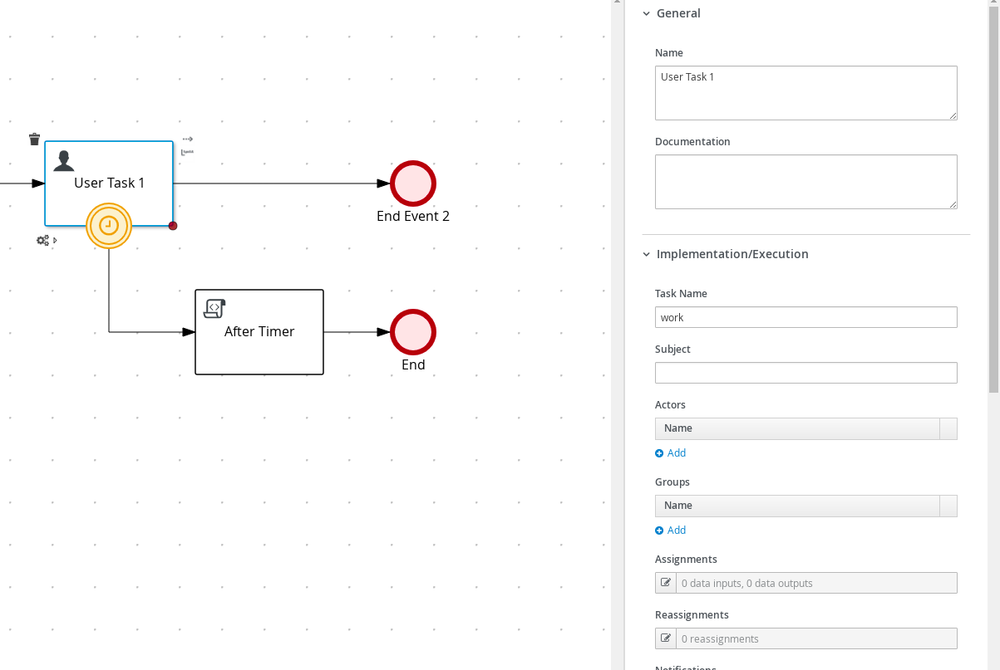</p>

* Boundary timer User Task (bottom)
<p align="center">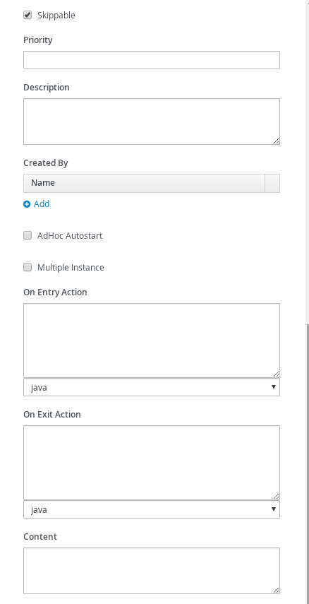</p>

* Boundary timer Timer
<p align="center">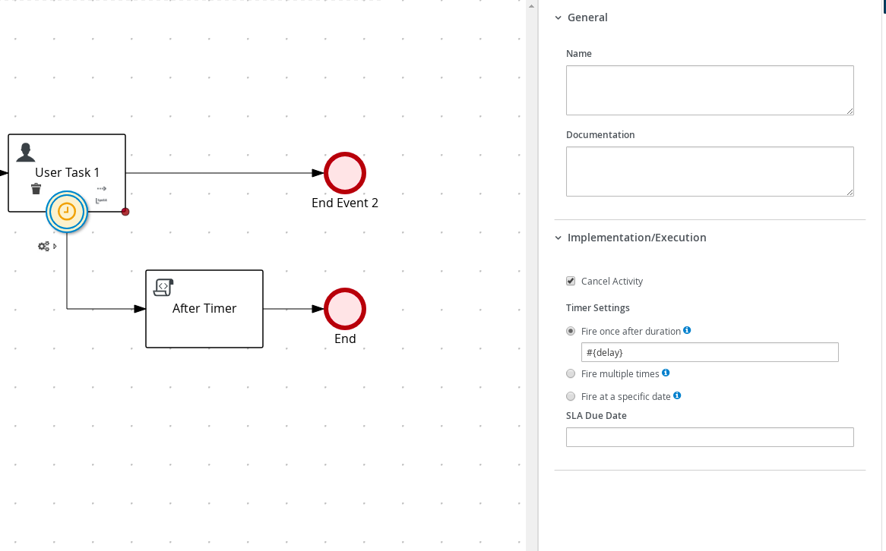</p>

* Boundary timer After Timer
<p align="center">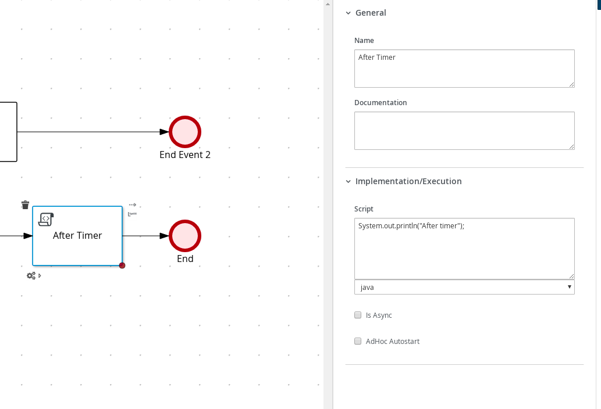</p>

* Cycle timer event (timerCycle.bpmn)
<p align="center">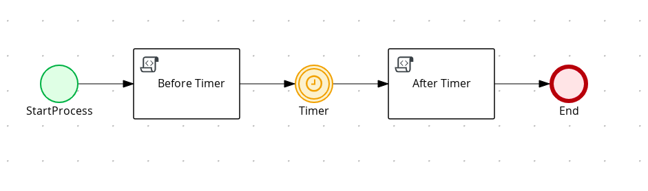</p>

* Cycle timer Diagram Properties (top)
<p align="center">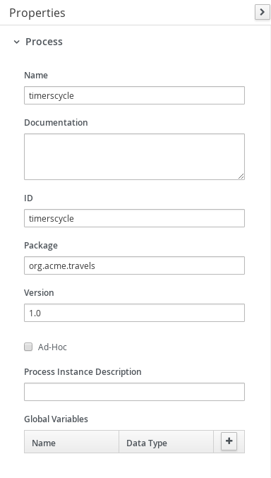</p>

* Cycle timer Diagram Properties (bottom)
<p align="center"></p>

* Cycle timer Before Timer
<p align="center">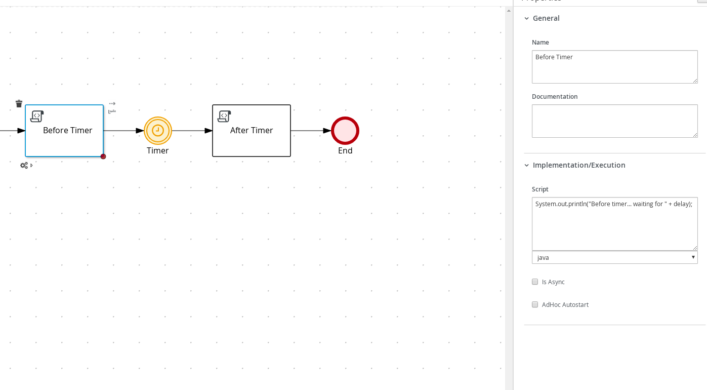</p>

* Cycle timer Timer
<p align="center">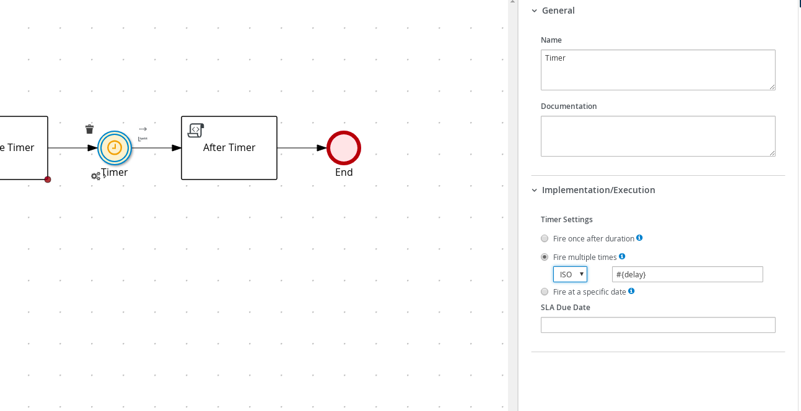</p>

* Cycle timer AfterTimer
<p align="center">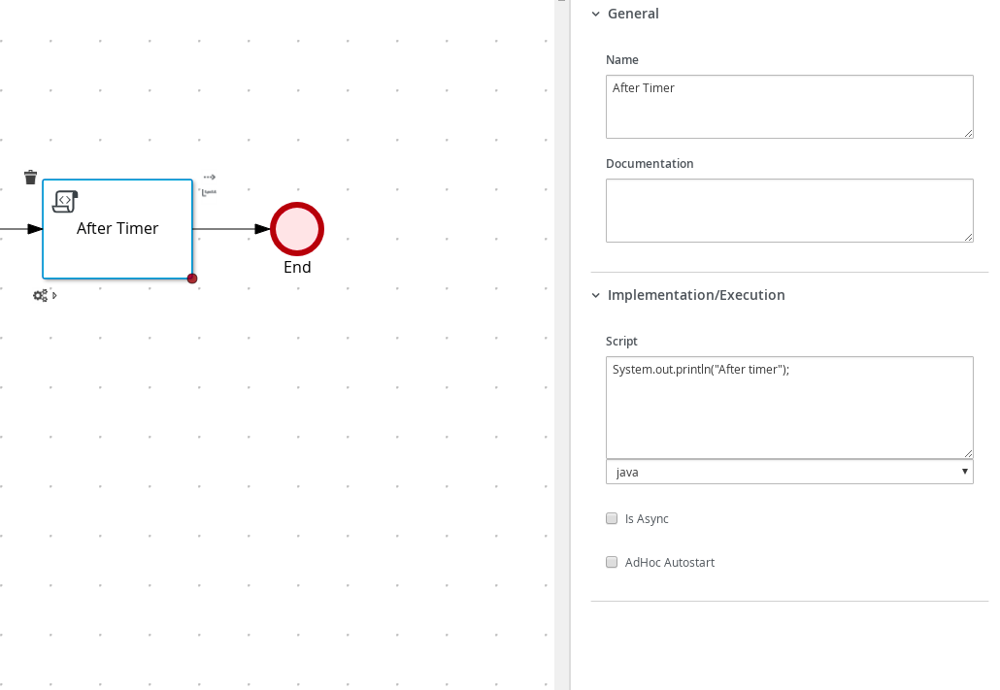</p>


Timer expression is expected to be given in ISO-8601 format e.g. PT30S - wait 30 seconds before expiring.
This needs to be given when starting process instance as delay attribute of type string.

## Build and run

### Prerequisites

You will need:
  - Java 11+ installed
  - Environment variable JAVA_HOME set accordingly
  - Maven 3.9.11+ installed

### Compile and Run in Local Dev Mode

```sh
mvn clean compile spring-boot:run
```


### Package and Run using uberjar

```sh
mvn clean package
```

To run the generated native executable, generated in `target/`, execute

```sh
java -jar target/process-timer-springboot.jar
```

### OpenAPI (Swagger) documentation
[Specification at swagger.io](https://swagger.io/docs/specification/about/)

You can take a look at the [OpenAPI definition](http://localhost:8080/v3/api-docs) - automatically generated and included in this service - to determine all available operations exposed by this service. For easy readability you can visualize the OpenAPI definition file using a UI tool like for example available [Swagger UI](https://editor.swagger.io).

In addition, various clients to interact with this service can be easily generated using this OpenAPI definition.


### Submit a request to start new timers process

To make use of this application it is as simple as putting a sending request to `http://localhost:8080/timers`  with following content

```json
{
    "delay" : "PT30S"
}

```

Complete curl command can be found below:

```sh
curl -X POST -H 'Content-Type:application/json' -H 'Accept:application/json' -d '{"delay" : "PT30S"}' http://localhost:8080/timers
```

### Show active timer instances

```sh
curl -H 'Content-Type:application/json' -H 'Accept:application/json' http://localhost:8080/timers
```

### Cancel boundary timer instance

```sh
curl -X DELETE 'http://localhost:8080/timers/{uuid}'
```

where `{uuid}` is the id of the given timer instance


### Submit a request to start new timers cycle process

To make use of this application it is as simple as putting a sending request to `http://localhost:8080/timerscycle`  with following content

```json
{
    "delay" : "R2/PT1S"
}

```

Complete curl command can be found below:

```sh
curl -X POST -H 'Content-Type:application/json' -H 'Accept:application/json' -d '{"delay" : "R2/PT1S"}' http://localhost:8080/timerscycle
```

### Show active timer instances

```sh
curl -H 'Content-Type:application/json' -H 'Accept:application/json' http://localhost:8080/timerscycle
```

### Cancel timer cycle instance

```sh
curl -X DELETE 'http://localhost:8080/timerscycle/{uuid}'
```

where `{uuid}` is the id of the given timer cycle instance


### Submit a request to start new boundary timers process

To make use of this application it is as simple as putting a sending request to `http://localhost:8080/timersOnTask`  with following content

```json
{
    "delay" : "PT30S"
}

```

Complete curl command can be found below:

```sh
curl -X POST -H 'Content-Type:application/json' -H 'Accept:application/json' -d '{"delay" : "PT30S"}' http://localhost:8080/timersOnTask
```

### Show active boundary timer instances

```sh
curl -H 'Content-Type:application/json' -H 'Accept:application/json' http://localhost:8080/timersOnTask
```

### Cancel boundary timer instance

```sh
curl -X DELETE 'http://localhost:8080/timersOnTask/{uuid}'
```

where `{uuid}` is the id of the given timer instance

After executing the above commands you should see a log similar to

* Springboot Log

```
Before timer... waiting for  PT30S
After Timer
Before timer, waiting for task to be complete or expires in PT30S
After Timer
Before timer... waiting for  R2/PT1S
After Timer
After Timer
```

## Use Kogito Job Service as external timer service

There is additional configuration needed in the `application.properties` file.

### Configure application.properties

To allow to use Job Service as timer service there is a need to specify additional properties

```
kogito.jobs-service.url=http://localhost:8085
kogito.service.url=http://localhost:8080
```

First one is used to direct the Kogito runtime to let it know where is the Kogito Job Service - it needs
to match the location of the Kogito Job Service when starting it - see below.
Second one is used by Kogito Job Service to callback when the timer expires and needs to be pointing to the service host and port

```sh
java -Dquarkus.http.port=8085 -jar jobs-service-infinispan/target/jobs-service-infinispan-{version}-runner.jar
```

* After Starting Infinispan you should see a similar Log as follows

<p align="center">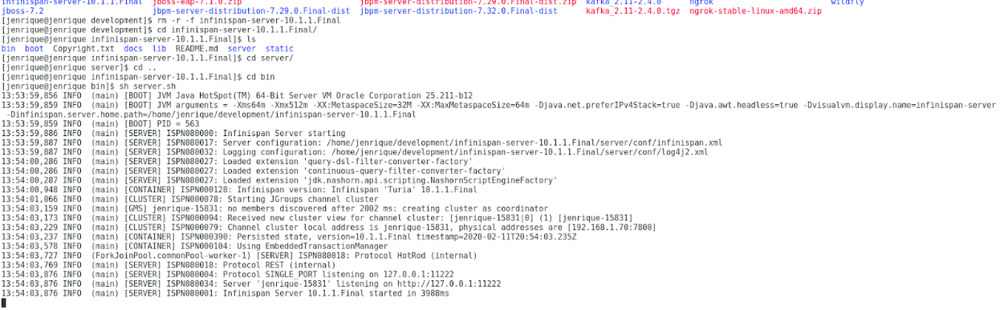</p>

If you'd like to use PostgresSQL or MongoDB as persistence, start the PostgreSQL or MongoDB server, then start job service with following command

For PostgreSQL:
```sh
java -Dquarkus.http.port=8085 -Dquarkus.datasource.username={username} -Dquarkus.datasource.password={password} -Dquarkus.datasource.reactive.url=postgresql://{host}:{port}/{db} -Dquarkus.datasource.jdbc.url=jdbc:postgresql://{host}:{port}/{db}  -jar jobs-service-postgresql/target/jobs-service-postgresql-{version}-runner.jar
```

For MongoDB:
```sh
java -Dquarkus.http.port=8085 -Dquarkus.mongodb.connection-string=mongodb://{username}:{password}@{host}:{port} -Dquarkus.mongodb.database={db} -jar jobs-service-mongodb/target/jobs-service-mongodb-{version}-runner.jar
```

In all cases replace `{version}` with actual Kogito version to be used (Job Service is available from 0.6.0)

After that you can redo the timer queries described above.

### Test your application

Generated application comes with sample test process that allows you to verify if the application is working as expected. Simply execute following command to try it out

```sh
curl -X POST -H 'Content-Type: application/json' -i 'http://example-route-on-openshift/timer'
```

Once successfully invoked you should see "Before timer" and "After timer" in the console of the running application.
